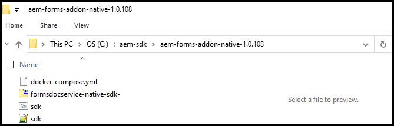

# Konfigurera lokal utvecklingsmiljö för AEM Forms {#overview}

När du konfigurerar och konfigurerar [!DNL  Adobe Experience Manager Forms] som [!DNL  Cloud Service] -miljö kan du konfigurera utvecklings-, staging- och produktionsmiljöer i molnet. Dessutom kan du konfigurera och konfigurera en lokal utvecklingsmiljö.

Du kan använda den lokala utvecklingsmiljön för att utföra följande åtgärder utan att logga in i molnutvecklingsmiljön:

* [Skapa formulär](creating-adaptive-form.md) och samhörande resurser (teman, mallar, anpassade överföringsåtgärder med mera)
* [Konvertera PDF forms till adaptiv Forms](https://experienceleague.adobe.com/docs/aem-forms-automated-conversion-service/using/convert-existing-forms-to-adaptive-forms.html)
* Bygg applikationer som ska genereras [Kundkommunikation](aem-forms-cloud-service-communications-introduction.md) on demand eller i gruppläge.

När ett adaptivt formulär eller relaterade resurser är klara för den lokala utvecklingsinstansen eller ett program att generera [Kundkommunikation] är klart kan du exportera Adaptive Form eller Customer Communications från den lokala utvecklingsmiljön till en Cloud Service-miljö för vidare testning eller gå över till produktionsmiljöer.

Du kan också utveckla och testa anpassad kod som anpassade komponenter och förifyllningstjänst i den lokala utvecklingsmiljön. När den anpassade koden har testats och är klar kan du använda Git-databasen i Cloud Servicens utvecklingsmiljö för att distribuera den anpassade koden.

Om du vill konfigurera en ny lokal utvecklingsmiljö och använda den för att utveckla aktiviteter utför du följande åtgärder i listordning:

* [Konfigurera utvecklingsverktyg](#setup-development-tools-for-AEM-projects)

* [Konfigurera lokala författarinstanser och publiceringsinstanser](#set-up-local-experience-manager-environment-for-development)

* [Lägg till Forms-arkiv i lokala utvecklingsinstanser och konfigurera användare](#add-forms-archive-configure-users)

* [Konfigurera lokal utvecklingsmiljö för mikrotjänster](#docker-microservices)

* [Konfigurera ett utvecklingsprojekt](#forms-cloud-service-local-development-environment)

* [Konfigurera lokala Dispatcher-verktyg](#setup-local-dispatcher-tools)

<!--
You can use the local development environment to create and test Adaptive Forms without connecting to the Cloud Service. [!DNL AEM Forms] provides an SDK to help test all the cloud-ready functionalities on the local development environment. When your forms and related assets are ready and tested on the local development environment, you can import these forms and related assets to an [!DNL AEM Forms] as a Cloud Service instance for publishing. 

You can also develop and test custom code like custom components and prefill service on the local development environment. When the custom code is tested and ready, you can use the Git repository of your [!DNL AEM Forms] as a Cloud Service development environment to deploy the custom code. 

>[!NOTE]
>
> Pre-pilot release does not support using an [!DNL AEM Forms] as a Cloud Service development instance to create forms. You can create forms, related assets, and custom code only on a local development environment.-->

<!--
You configure two types of development environments:

* **[!DNL AEM Forms] as a Cloud Service development environment:** Use the [[!DNL AEM Forms] as a Cloud Service](setup-forms-cloud-service.md) environment to store, manage, and publish Adaptive Forms and related assets. Do not use an [!DNL AEM Forms] as a Cloud Service environment to create Adaptive Forms and related assets <!--, form-centric workflows, a form data model, or to generate a Document of Record. -->

<!--
* **Local development environment:** You can use the local development environment to create and test Adaptive Forms without connecting to the service. Adobe provides a SDK for the local development to help test all the cloud-ready functionalities. 
Use a local development environment:
    
    * To create forms and related assets (themes, templates, custom Submit Actions, and more) and convert PDF forms to Adaptive Forms. After an Adaptive Form or related assets are ready on the local development instance, you can export the Adaptive Form and related assets from the local development environment to an [!DNL AEM Forms] as a Cloud Service development environment for publishing.  
    
    * To update configuration settings and develop and test custom code like custom components and prefill service. When the custom code is tested and ready, you can use the Git repository of your [!DNL AEM Forms] as a Cloud Service development environment to deploy the custom code.  

You can use the local development environment to create and test Adaptive Forms without connecting to the service. Adobe provides a SDK for the local development to help test all the cloud-ready functionalities. When your forms and related assets are ready and tested on the local development environment, you can import these forms and related assets to an [!DNL AEM Forms] as a Cloud Service instance for publishing. 

You can use the [development tools](https://experienceleague.adobe.com/docs/experience-manager-65/developing/devtools/dev-tools.html) to write custom code, customize or create new Adaptive Forms components, create a custom prefill service, or modify default configurations of an [!DNL AEM Forms] as a Cloud Service instance. 

-->

## Förutsättningar

Du behöver följande program för att konfigurera en lokal utvecklingsmiljö. Ladda ned dessa innan du börjar konfigurera den lokala utvecklingsmiljön:

| Programvara | Beskrivning | Hämta länkar |
|---|---|---|
| Adobe Experience Manager as a Cloud Service SDK | SDK innehåller [!DNL Adobe Experience Manager] Verktygen QuickStart och Dispatcher | Hämta senaste SDK från [Programvarudistribution](#software-distribution) |  |
| Adobe Experience Manager Forms feature archive (AEM Forms add-on) | Verktyg för att skapa, formatera och optimera adaptiva Forms och andra Adobe Experience Manager Forms-funktioner | Hämta från [Programvarudistribution](#software-distribution) |
| (Valfritt) Adobe Experience Manager Forms referensinnehåll | Verktyg för att skapa, formatera och optimera adaptiva Forms och andra Adobe Experience Manager Forms-funktioner | Hämta från [Programvarudistribution](#software-distribution) |
| (Valfritt) Adobe Experience Manager Forms Designer | Verktyg för att skapa, formatera och optimera adaptiva Forms och andra Adobe Experience Manager Forms-funktioner | Hämta från [Programvarudistribution](#software-distribution) |

### Ladda ned den senaste versionen av programvara från Software Distribution {#software-distribution}

Om du vill hämta den senaste versionen av Adobe Experience Manager as a Cloud Service SDK, Experience Manager Forms feature archive (AEM Forms-tillägg), formulärreferensresurser eller Forms Designer från [Programvarudistribution](https://experience.adobe.com/#/downloads/content/software-distribution/en/aemcloud.html):

1. Logga in på <https://experience.adobe.com/#/downloads> med din Adobe ID

   >[!NOTE]
   >
   > Din Adobe-organisation måste ha etablerats för att AEM as a Cloud Service ska kunna hämta AEM as a Cloud Service SDK.

1. Navigera till fliken **[!UICONTROL AEM as a Cloud Service]**.
1. Sortera efter publicerat datum i fallande ordning.
1. Klicka på den senaste versionen av Adobe Experience Manager as a Cloud Service SDK, Experience Manager Forms feature archive (AEM Forms add-on), formulärreferensmaterial eller Forms Designer.
1. Granska och godkänn slutanvändaravtalet. Tryck på **[!UICONTROL Download]** -knappen.

## Ställ in utvecklingsverktyg för AEM projekt {#setup-development-tools-for-AEM-projects}

Adobe Experience Manager Forms-projektet är en anpassad kodbas. Den innehåller kod, konfigurationer och innehåll som distribueras via Cloud Manager till [!DNL Adobe Experience Manager] as a Cloud Service. The [AEM Project Maven Archetype](https://github.com/adobe/aem-project-archetype) innehåller projektets baslinjestruktur.

Konfigurera följande utvecklingsverktyg som ska användas för [!DNL Adobe Experience Manager] utvecklingsprojekt:

* [Java™](https://experienceleague.adobe.com/docs/experience-manager-learn/cloud-service/local-development-environment-set-up/development-tools.html?lang=en#local-development-environment-set-up)
* [Git](https://experienceleague.adobe.com/docs/experience-manager-learn/cloud-service/local-development-environment-set-up/development-tools.html?lang=en#install-git)
* [Node.js (npm)](https://experienceleague.adobe.com/docs/experience-manager-learn/cloud-service/local-development-environment-set-up/development-tools.html?lang=en#node-js)
* [Maven](https://experienceleague.adobe.com/docs/experience-manager-learn/cloud-service/local-development-environment-set-up/development-tools.html?lang=en#install-maven)

Detaljerade anvisningar om hur du ställer in tidigare nämnda utvecklingsverktyg finns i [Konfigurera utvecklingsverktyg](https://experienceleague.adobe.com/docs/experience-manager-learn/cloud-service/local-development-environment-set-up/development-tools.html).

## Konfigurera lokal Experience Manager-miljö för utveckling

I Cloud Service SDK finns en QuickStart-fil. Den kör en lokal version av Experience Manager. Du kan köra antingen författaren eller publiceringsinstanserna lokalt.

QuickStart har en lokal utvecklingsupplevelse, men inte alla funktioner i [!DNL Adobe Experience Manager] as a Cloud Service. Så testa alltid funktionerna och koden med [!DNL Adobe Experience Manager] as a Cloud Service utvecklingsmiljö innan funktionerna flyttas till scenen eller produktionen.

Så här installerar och konfigurerar du den lokala Experience Manager-miljön:

* [Hämta och extrahera](https://experience.adobe.com/#/downloads/content/software-distribution/en/aemcloud.html) den [!DNL Adobe Experience Manager] as a Cloud Service SDK
* [Konfigurera en Author-instans](https://experienceleague.adobe.com/docs/experience-manager-learn/cloud-service/local-development-environment-set-up/aem-runtime.html?lang=en#set-up-local-aem-author-service)
* [Konfigurera en publiceringsinstans](https://experienceleague.adobe.com/docs/experience-manager-learn/cloud-service/local-development-environment-set-up/aem-runtime.html?lang=en#set-up-local-aem-publish-service)

## Lägg till Forms-arkiv i lokala Author- och Publish-instanser och konfigurera Forms-specifika användare {#add-forms-archive-configure-users}

Utför följande steg i listad ordning för att lägga till Forms-arkiv i Experience Manager-instanser och konfigurera formulärspecifika användare:

### Installera det senaste funktionsarkivet för Forms-tillägg {#add-forms-archive}

Adobe Experience Manager Forms as a Cloud Service funktionsarkiv innehåller verktyg för att skapa, formatera och optimera adaptiva Forms i den lokala utvecklingsmiljön. Installera paketet för att skapa ett adaptivt formulär och använda olika funktioner i [!DNL AEM Forms]. Så här installerar du paketet:

1. Hämta och extrahera den senaste [!DNL AEM Forms] arkiv för ditt operativsystem från [Programvarudistribution](https://experience.adobe.com/#/downloads/content/software-distribution/en/aemcloud.html).

1. Navigera till katalogen crx-quickstart/install. Om mappen inte finns skapar du den.

1. Stoppa AEM-instansen genom att placera [!DNL AEM Forms] tilläggsarkiv, `aem-forms-addon-<version>.far`, i installationsmappen och starta om instansen.

### Konfigurera användare och behörigheter {#configure-users-and-permissions}

Skapa användare som formulärutvecklare och formulärdeltagare och [lägga till dessa användare i fördefinierade formulärgrupper](https://experienceleague.adobe.com/docs/experience-manager-learn/cloud-service/accessing/aem-users-groups-and-permissions.html?lang=en#accessing) för att ge dem nödvändiga behörigheter. Tabellen nedan visar alla typer av användare och fördefinierade grupper för varje typ av formuläranvändare:

| Användartyp | AEM |
|---|---|
| Formuläradministratör / | [!DNL forms-users] (AEM Forms-användare), [!DNL template-authors], [!DNL workflow-users], [!DNL workflow-editors]och [!DNL fdm-authors] |
| Formulärutvecklare | [!DNL forms-users] (AEM Forms-användare), [!DNL template-authors], [!DNL workflow-users], [!DNL workflow-editors]och [!DNL fdm-authors] |
| Customer Experience Lead eller UX Designer | [!DNL forms-users], [!DNL template-authors] |
| AEM-administratör | [!DNL aem-administrators], [!DNL fd-administrators] |
| Slutanvändare | När en användare måste logga in för att visa och skicka ett adaptivt formulär lägger du till sådana användare i [!DNL forms-users] grupp. </br> När ingen användarautentisering krävs för att få tillgång till Adaptiv Forms ska du inte tilldela någon grupp till sådana användare. |

<!--  

## Set up a local AEM instance for development

Perform the following steps in the listed order to set up and configure your local development environment:

1. **Set up an AEM author instance:** You require an author instance to create Adaptive Forms. Download and extract the latest AEM SDK archive. Run the quick start file in author run mode to set up an author instance. For detailed instructions, see [default local instance](https://experienceleague.adobe.com/docs/experience-manager-learn/cloud-service/local-development-environment-set-up/aem-runtime.html).  

1. **Install the latest [!DNL AEM Forms] add-on feature archive:** [!DNL AEM Forms] add-on feature archive provides tools to create, style, and optimize Adaptive Forms on the local development environment. Install the package to create an Adaptive Form and use various other features of [!DNL AEM Forms]. To install the package:

    1. Download and extract the latest [!DNL AEM Forms] archive for your operating system from [Software Distribution](https://experience.adobe.com/#/downloads/content/software-distribution/en/aemcloud.html).

    1. Navigate to the crx-quickstart/install directory. If the folder does not exist, create it.

    1. Stop your Cloud ready AEM instance, place the [!DNL AEM Forms] add-on feature archive, `aem-forms-addon-<version>.far`,  in the install folder, and restart the instance.

1. **Configure users and permissions:** Create users like Form Developer and Form Practitioner a nd add these users to pre-defined forms group to provide them required permissions. The table below lists all types of users and pre-defined groups for each type of forms users:
  
    | User Type | AEM Group |
    |---|---|
    | Form Practitioner  | forms-users (AEM Forms Users), template-authors  |
    | Form Developer | forms-users (AEM Forms Users), template-authors |
    | End-User| everyone* |

    `*` When a user should log in to access or submit Adaptive Forms, add such users to the everyone group.  -->

<!--    
### Set up an AEM project for the development tasks related to local AEM 6.5.5 Forms instance

Use this project to update configurations, create overlays, develop custom Adaptive Form components, and custom code using the local development environment. To set up the project:

1. **Install and configure Maven and set up an AEM project based on Apache Maven:** Apache Maven is an open-source tool for managing software projects. It helps automate builds and provides quality project information. It is the recommended build management tool for AEM projects. For detailed instructions to set up an AEM project based on Apache Maven, see [How to Build AEM Projects using Apache Maven](https://experienceleague.adobe.com/docs/experience-manager-65/developing/devtools/ht-projects-maven.html).

1. Configure the project to use [uber-jar](https://experienceleague.adobe.com/docs/experience-manager-65/release-notes/release-notes.html?lang=en#install-aem-forms-jee-installer) version 6.5.5 or later and [[!DNL AEM Forms] Client SDK](https://repo1.maven.org/maven2/com/adobe/aemfd/aemfd-client-sdk/) version 6.0.160 or later.  

1. **Set Up an Integrated Development Environment:**  Set up an IDE of your choice for development, see [Set Up an Integrated Development Environment](https://experienceleague.adobe.com/docs/experience-manager-learn/foundation/development/set-up-a-local-aem-development-environment.html#set-up-an-integrated-development-environment) for detailed instructions.
 -->

## Ställ in lokal utvecklingsmiljö för DoR (Document of Record){#docker-microservices}

AEM Forms som Cloud Service har en dockningsbaserad SDK-miljö för enklare utveckling av Document of Record och för användning av andra mikrotjänster. Du slipper konfigurera plattformsspecifika binärfiler och anpassningar manuellt. Så här konfigurerar du miljön:

1. Installera och konfigurera Docker:

   * (För Microsoft® Windows) Installera [Docker Desktop](https://www.docker.com/products/docker-desktop). Den konfigurerar `Docker Engine` och `docker-compose` på din dator.

   * (Apple macOS) Installera [Docker Desktop för Mac](https://hub.docker.com/editions/community/docker-ce-desktop-mac). Det innehåller Docker Engine, Docker CLI-klient, Docker Compose, Docker Content Trust, Kubernetes och Credential Helper.

   * (För Linux®) Installera [Dockningsmotor](https://docs.docker.com/engine/install/#server) och [Docker Compose](https://docs.docker.com/compose/install/) på din dator.

   >[!NOTE]
   >
   > * I Apple macOS tillåtslista du mappar som innehåller lokala AEM författarinstanser.
   >
   > * Docker Desktop för Windows har stöd för två backends, Hyper-V
   > (äldre) och WSL2 (modern). Fildelning sker automatiskt
   > hanteras av Docker när WSL2 används (modern). Du måste
   > konfigurera fildelning explicit när Hyper-V används (äldre).

1. Skapa en mapp, till exempel aem-sdk, parallellt med författaren och publiceringsinstanser. Exempel: C:\aem-sdk.

1. Extrahera `aem-forms-addon-<version>.zip\aem-forms-addon-native-<version>.zip` -fil.

   

1. Skapa en miljövariabel AEM_HOME och peka på en lokal AEM Author-installation. Exempel: C:\aem\author\.

1. Öppna sdk.bat eller sdk.sh för redigering. Ställ in AEM_HOME så att den pekar på den lokala AEM författarinstallationen. Exempel: C:\aem\author\.

1. Öppna kommandotolken och navigera till `aem-forms-addon-native-<version>` mapp.

1. Kontrollera att den lokala AEM Author-instansen körs. Kör följande kommando för att starta SDK:

   * (i Microsoft® Windows) `sdk.bat start`
   * (i Linux® eller Apple macOS) `AEM_HOME=[local AEM Author installation] ./sdk.sh start`

   >[!NOTE]
   >
   > Om du har definierat miljövariabeln i sdk.sh-filen är det valfritt att ange den på kommandoraden. Alternativet att definiera systemvariabeln på kommandoraden ges för att köra kommandot utan att uppdatera gränssnittsskriptet.

   

Du kan nu använda den lokala utvecklingsmiljön för att återge arkivhandlingar. Testa genom att överföra en XDP-fil till miljön och återge den. Till exempel: <http://localhost:4502/libs/xfaforms/profiles/default.print.pdf?template=crx:///content/dam/formsanddocuments/cheque-request.xdp> konverterar XDP-filen till PDF-dokumentet.

## Konfigurera ett utvecklingsprojekt för Forms baserat på Experience Manager-arkitypen {#forms-cloud-service-local-development-environment}

Använd det här projektet för att skapa Adaptiv Forms, distribuera konfigurationsuppdateringar, överlägg, skapa anpassade adaptiva formulärkomponenter, testa och anpassa kod på lokala [!DNL Experience Manager Forms] SDK. När du har testat lokalt kan du distribuera projektet till  [!DNL Experience Manager Forms] as a Cloud Service produktion och icke-produktionsmiljöer. När du distribuerar projektet distribueras även följande AEM Forms-resurser:

| Teman | Mallar | Formulärdatamodeller |
---------|----------|---------
| Arbetsyta 3.0 | Grundläggande | Microsoft® Dynamics 365 |
| Tranquil | Tom | Salesforce |
| Urbane |   |  |
| Ultramarin |  |  |
| Beryl |  |  |

>[!NOTE]
>
> Installera AEM Archetype version 30 eller senare för att hämta och använda Microsoft® Dynamics 365 och Salesforce Form Data Models med AEM Forms as a Cloud Service.
Konfigurera AEM Archetype version 32 eller senare för att få tillgång till och använda temana Tranquil, Urbane och Ultramarine med AEM Forms as a Cloud Service.

Så här ställer du in projektet:

1. **Git-databasen för Cloud Manager på din lokala utvecklingsinstans:**  Din Cloud Manager Git-databas innehåller ett AEM. Den baseras på [AEM](https://github.com/adobe/aem-project-archetype/). Klona din Cloud Manager Git-databas med Git-kontohantering för självbetjäning från användargränssnittet i Cloud Manager för att få projektet i din lokala utvecklingsmiljö. Mer information om hur du kommer åt databasen finns i [Åtkomst till databaser](https://experienceleague.adobe.com/docs/experience-manager-cloud-manager/using/managing-code/accessing-repos.html).

<!-- 1. 
After the repository is cloned, [integrate your Git repo with Cloud Manager](https://experienceleague.adobe.com/docs/experience-manager-cloud-manager/using/managing-code/setup-cloud-manager-git-integration.html)

**Make cloned AEM project compatible with [!DNL AEM Forms] as a Cloud Service:** Remove uber-jar and other non-cloud dependencies from the pom.xml files of the project. You can refer the pom.xml files of the [sample AEM project](assets/FaaCSample.zip) for the list of required dependencies and update your AEM project accordingly. You can also refer [AEM Project Structure](https://experienceleague.adobe.com/docs/experience-manager-cloud-service/content/implementing/developing/aem-project-content-package-structure.html) to learn changes required to make an AEM project compatible with AEM as a Cloud Service.  -->

1. **Skapa en [!DNL Experience Manager Forms] som [Cloud Service] projekt:** Skapa en [!DNL Experience Manager Forms] som [Cloud Service] projekt baserat på det senaste [AEM](https://github.com/adobe/aem-project-archetype) eller senare. Med denna typ kan utvecklarna enkelt börja utveckla för [!DNL AEM Forms] as a Cloud Service. Den innehåller även några exempelteman och mallar som hjälper dig att snabbt komma igång.

   Öppna kommandotolken och kör nedanstående kommando för att skapa en [!DNL Experience Manager Forms] as a Cloud Service projekt.

   ```shell
   mvn -B org.apache.maven.plugins:maven-archetype-plugin:3.2.1:generate -D archetypeGroupId=com.adobe.aem -D archetypeArtifactId=aem-project-archetype -D archetypeVersion="41" -D appTitle=mysite -D appId=mysite -D groupId=com.mysite -D includeFormsenrollment="y" -D aemVersion="cloud"
   ```

   Ändra `appTitle`, `appId`och `groupId` i ovanstående kommando för att återspegla din miljö. Ange också ett värde för includeFormsenrollment, includeFormsCommunications och includeFormsheadless till `y` eller `n` beroende på licens och krav. IncludeFormsheadless är obligatoriskt för att skapa Adaptiv Forms baserat på kärnkomponenter.

   * Använd `includeFormsenrollment=y` om du vill inkludera Forms-specifika konfigurationer, teman, mallar, kärnkomponenter och beroenden som krävs för att skapa Adaptiv Forms. Om du använder Forms Portal anger du `includeExamples=y` alternativ. Dessutom läggs kärnkomponenterna i Forms Portal till i projektet.

   * Använd `includeFormscommunications=y` möjlighet att inkludera Forms Core-komponenter och beroenden som krävs för att inkludera funktionen för kundkommunikation.

1. Distribuera projektet till din lokala utvecklingsmiljö. Du kan använda följande kommando för att distribuera till den lokala utvecklingsmiljön

   `mvn -PautoInstallPackage clean install`

   En fullständig lista med kommandon finns på [Bygga och installera](https://experienceleague.adobe.com/docs/experience-manager-core-components/using/developing/archetype/using.html?lang=en#building-and-installing)

1. [Distribuera koden till [!DNL AEM Forms] as a Cloud Service miljö](https://experienceleague.adobe.com/docs/experience-manager-cloud-service/implementing/deploying/overview.html?lang=en#customer-releases).

## Konfigurera lokala Dispatcher-verktyg {#setup-local-dispatcher-tools}

Dispatcher är en Apache HTTP-webbservermodul som tillhandahåller ett säkerhets- och prestandalager mellan CDN- och AEM-publiceringsskiktet. Dispatcher är en viktig del av den övergripande Experience Manager-arkitekturen och bör ingå i den lokala utvecklingsmiljön.

Utför följande steg för att konfigurera lokal Dispatcher och lägg sedan till Forms-specifika regler i den:

### Konfigurera lokal Dispatcher {#setup-local-dispatcher}

The [!DNL Experience Manager] as a Cloud Service SDK innehåller den rekommenderade versionen av Dispatcher Tools, som gör det lättare att konfigurera, validera och simulera Dispatcher lokalt. Dispatcher Tools är Docker-baserade och har kommandoradsverktyg för att överföra konfigurationsfilerna för Apache HTTP Web Server och Dispatcher till ett kompatibelt format och distribuera dem till Dispatcher som körs i Docker-behållaren.

Cachelagring av Dispatcher tillåter [!DNL AEM Forms] för att förifylla Adaptiv Forms på en kund. Det förbättrar återgivningshastigheten för förfyllda formulär.

Detaljerade anvisningar om hur du konfigurerar Dispatcher finns i [Konfigurera lokala Dispatcher-verktyg](https://experienceleague.adobe.com/docs/experience-manager-learn/cloud-service/local-development-environment-set-up/dispatcher-tools.html?lang=en#local-development-environment-set-up)

### Lägg till Forms-specifika regler i Dispatcher {#forms-specific-rules-to-dispatcher}

Så här konfigurerar du Dispatcher-cachen för Experience Manager Forms as a Cloud Service:

1. Öppna AEM och gå till `\src\conf.dispatcher.d\available_farms`
1. Skapa en kopia av `default.farm` -fil. Till exempel, `forms.farm`.
1. Öppna den nyskapade `forms.farm` -fil för redigering och ersättning av följande kod:

   ```json
   #/ignoreUrlParams {
   #/0001 { /glob "*" /type "deny" }
   #/0002 { /glob "q" /type "allow" }
   #}
   ```

   med

   ```json
   /ignoreUrlParams {
   /0001 { /glob "*" /type "deny" }
   /0002 { /glob "dataRef" /type "allow" }
   }
   ```

1. Spara och stäng filen.
1. Gå till `conf.d/enabled_farms` och skapa en symbolisk länk till `forms.farm` -fil.
1. Kompilera och distribuera projektet till [!DNL AEM Forms] as a Cloud Service miljö.

### Att tänka på vid cachelagring {#considerations-about-caching}

* Dispatcher-cachning tillåter [!DNL AEM Forms] för att förifylla Adaptiv Forms på en kund. Det förbättrar återgivningshastigheten för förfyllda formulär.
* Cachelagring av funktioner för skyddat innehåll är inaktiverat som standard. Om du vill aktivera funktionen kan du följa instruktionerna i [Cachelagra skyddat innehåll](https://experienceleague.adobe.com/docs/experience-manager-dispatcher/using/configuring/permissions-cache.html?lang=en) artikel
* Dispatcher kan inte göra vissa adaptiva Forms och relaterade adaptiva Forms ogiltiga. Information om hur du löser sådana problem finns i [[!DNL AEM Forms] Cachning](troubleshooting-caching-performance.md) i felsökningsavsnittet.
* Cachelagrar lokaliserade adaptiva Forms:
   * Använd URL-format `http://host:port/content/forms/af/<afName>.<locale>.html` begära en lokaliserad version av ett adaptivt formulär i stället för `http://host:port/content/forms/af/afName.html?afAcceptLang=<locale>`
   * Alternativet Webbläsarspråk är inaktiverat som standard. Om du vill ändra språkinställningen för webbläsaren
* När du använder URL-format `http://host:port/content/forms/af/<adaptivefName>.html`, och Använd webbläsarspråk i konfigurationshanteraren är inaktiverat, används den icke-lokaliserade versionen av det adaptiva formuläret. Det icke-lokaliserade språket är det språk som används vid utvecklingen av det adaptiva formuläret. Det språk som är konfigurerat för webbläsaren (webbläsarens språkområde) beaktas inte och en icke-lokaliserad version av det anpassade formuläret används.
* När du använder URL-format `http://host:port/content/forms/af/<adaptivefName>.html`, och Använd webbläsarspråk i konfigurationshanteraren är aktiverat, kommer en lokaliserad version av det adaptiva formuläret att användas, om en sådan finns. Språket i det lokaliserade adaptiva formuläret baseras på det språk som är konfigurerat för webbläsaren (webbläsarens språkområde). Det kan leda till [cachelagra endast första instansen av ett adaptivt formulär]. Om du vill förhindra att ett problem inträffar på din instans kan du läsa [endast första instansen av ett adaptivt formulär cachelagras](troubleshooting-caching-performance.md) i felsökningsavsnittet.

Din lokala utvecklingsmiljö är klar.

## Aktivera adaptiva Forms Core-komponenter i AEM Forms as a Cloud Service och lokala utvecklingsmiljö

Genom att aktivera adaptiva Forms Core-komponenter på AEM Forms as a Cloud Service kan du börja skapa, publicera och leverera Core Components-baserade adaptiva Forms och Headless Forms med hjälp av AEM Forms Cloud Service-instanser i flera kanaler. Du behöver en adaptiv Forms Core Components-aktiverad miljö för att kunna använda Headless Adaptive Forms.

Instruktioner finns i [Aktivera adaptiva Forms Core-komponenter i AEM Forms as a Cloud Service och lokala utvecklingsmiljö](/help/forms/enable-adaptive-forms-core-components.md)


## Uppgradera din lokala utvecklingsmiljö {#upgrade-your-local-development-environment}

Om du uppgraderar SDK till en ny version måste du ersätta hela den lokala utvecklingsmiljön, vilket resulterar i att all kod, konfiguration och innehåll i de lokala databaserna går förlorat. Se till att kod, konfiguration eller innehåll som inte ska förstöras implementeras i Git på ett säkert sätt, eller exporteras från lokala Experience Manager-instanser som CRX-paket.

### Så här undviker du innehållsförluster när du uppgraderar SDK {#avoid-content-loss-when-upgrading--SDK}

Genom att uppgradera SDK skapas en helt ny instans av Author och Publish, inklusive en ny databas ([Konfigurera AEM projekt](#forms-cloud-service-local-development-environment)), vilket innebär att ändringar som gjorts i en tidigare SDK-databas går förlorade. Om du vill ha en genomförbar strategi för att hjälpa till med bestående innehåll mellan SDK-uppgraderingar kan du gå till [Så här undviker du innehållsförluster när du uppgraderar AEM SDK](https://experienceleague.adobe.com/docs/experience-manager-learn/cloud-service/local-development-environment-set-up/aem-runtime.html?lang=en#optional-local-aem-runtime-set-up-tasks)

<!--When you update any  Forms-specifc configuration, create overlays, develop custom Adaptive Form components, or develop and test any custom code in AEM project for the development tasks related to local development instance, use the AEM project cloned from the Cloud Manager Git repository to [deploy the custom code and other changes to your [!DNL AEM Forms] as a Cloud Service's production or non-production environment](https://video.tv.adobe.com/v/30191?quality=9).

## Upgrade your local development environment {#update-local-setup}

Update the local AEM setup (AEM SDK) to latest version at least monthly on, or shortly after, the last Thursday of each month, which is the release cadence for AEM as a Cloud Service "feature releases". You can download local AEM SDK from [Software Distribution](https://experience.adobe.com/#/downloads/content/software-distribution/en/aemcloud.html).

Updating the AEM SDK to a new version requires replacing the entire local development environment, resulting in a loss of all code, configuration and content in the local AEM repositories. Ensure that any code, config or content that should not be destroyed is safely committed to Git, or exported from the local AEM instance as AEM Packages.

### How to avoid content loss when upgrading the AEM SDK {#avoid-content-loss-when-upgrading--AEM-SDK}

Upgrading the AEM SDK is effectively creating a brand new AEM runtime ([Set up a local AEM instance](setup-forms-cloud-service.md)), including a new repository ([Set up AEM project](#forms-cloud-service-local-development-environment)), meaning any changes made to a prior AEM SDK's repository are lost. The following are viable strategies for aiding in persisting content between AEM SDK upgrades, and can be used discretely or in concert:

1. Create a content package dedicated to containing the sample content to aid in development and maintain it in Git. Any content that should be persisted through AEM SDK upgrades would be persisted into this package and re-deployed after upgrading the AEM SDK.
1. Use [oak-upgrade](https://jackrabbit.apache.org/oak/docs/migration.html) with the `includepaths` directive, to copy content from the prior AEM SDK repository to the new AEM SDK repository.
1. Back up any content using AEM Package Manager and content packages on the prior AEM SDK and re-install them on the new AEM SDK.

Remember, using the above approaches to maintain code between AEM SDK upgrades, indicates a development anti-pattern. Non-disposable code should originate in your Development IDE and flow into AEM SDK via deployments.

For information about troubleshooting, stopping local AEM environment, run modes, and deployment, see [Set up local AEM Runtime](https://experienceleague.adobe.com/docs/experience-manager-learn/cloud-service/local-development-environment-set-up/aem-runtime.html#local-development-environment-set-up).-->

### Säkerhetskopiera och importera Forms-specifikt innehåll till en ny SDK-miljö {#backup-and-import-Forms-specific-content-to-new-SDK-environment}

Så här säkerhetskopierar och flyttar du resurser från en befintlig SDK till en ny SDK-miljö:

* Skapa en säkerhetskopia av befintligt innehåll.

* Konfigurera en ny SDK-miljö.

* Importera säkerhetskopian till din nya SDK-miljö.

### Skapa en säkerhetskopia av befintligt innehåll {#create-backup-of-your-existing-content}

Säkerhetskopiera dina adaptiva Forms, mallar, formulärdatamodell, tema, konfigurationer och anpassad kod. Du kan utföra följande åtgärd för att skapa en säkerhetskopia:

1. [Ladda ned](import-export-forms-templates.md#manage-forms-and-related-assets) Adaptiv Forms, teman och PDF forms.
1. Exportera adaptiva formulärmallar.

1. Hämta formulärdatamodeller

1. Exportera redigerbara mallar, molnkonfigurationer och arbetsflödesmodell. Skapa en [CRX-paket](https://experienceleague.adobe.com/docs/experience-manager-cloud-service/implementing/deploying/overview.html) med följande filter:

   * /conf/ReferenceEditableTemplates
   * /conf/global/settings/cloudconfigs
   * /conf/global/settings/wcm
   * /var/workflow/models
   * /conf/global/settings/workflow
1. Exportera e-postkonfigurationer, skicka och förifyll åtgärdskod från den lokala utvecklingsmiljön. Om du vill exportera dessa inställningar och konfigurationer skapar du en kopia av följande mappar och filer i den lokala utvecklingsmiljön:

   * `[Archetype Project in Cloud Service Git]/core/src/main/java/com/<program name>/core/service`
   * `[Archetype Project in Cloud Service Git] /core/src/main/java/com/<program name>/core/servlets/FileAttachmentServlet.java`
   * `[Archetype Project in Cloud Service Git]/ui.apps/src/main/content/jcr_root/apps/<program name>/config`

### Importera säkerhetskopian till din nya SDK-miljö {#import-the-backup-to-your-new-SDK-environment}

Importera adaptiva Forms, mallar, formulärdatamodell, tema, konfigurationer och anpassad kod till din nya miljö. Du kan utföra följande åtgärd för att importera säkerhetskopior:

1. [Importera](import-export-forms-templates.md#manage-forms-and-related-assets) Adaptiv Forms, teman och PDF forms till nya SDK-miljöer.
1. Importera adaptiva formulärmallar till en ny SDK-miljö.

1. Överför formulärdatamodeller till en ny SDK-miljö.

1. Importera redigerbara mallar, molnkonfigurationer och arbetsflödesmodell. Om du vill importera alla tidigare nämnda objekt till din nya SDK-miljö importerar du det CRX-paket som innehåller dessa objekt till din nya SDK-miljö.

1. Importera e-postkonfigurationer, skicka och förifyll åtgärdskod från den lokala utvecklingsmiljön. Om du vill importera dessa inställningar och konfigurationer placerar du följande filer från ditt gamla Arketype-projekt i ditt nya Arketype-projekt:

   * `[Archetype Project in Cloud Service Git]/core/src/main/java/com/<program name>/core/service`
   * `[Archetype Project in Cloud Service Git] /core/src/main/java/com/<program name>/core/servlets/FileAttachmentServlet.java`
   * `[Archetype Project in Cloud Service Git]/ui.apps/src/main/content/jcr_root/apps/<program name>/config`

Din nya miljö innehåller nu formulär och relaterade resurser från den gamla miljön.
