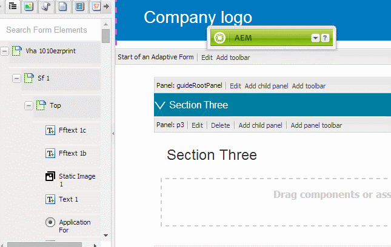

# Synkronisera adaptiv Forms med XFA-formulärmallar{#synchronizing-adaptive-forms-with-xfa-form-templates}

## Introduktion {#introduction}

Du kan skapa ett adaptivt formulär baserat på en XFA-formulärmall ( `*.XDP` fil). Tack vare detta återanvändning kan du bevara din investering i befintliga XFA-formulär. Information om hur du använder en XFA-formulärmall för att skapa ett adaptivt formulär finns i [Skapa ett anpassat formulär baserat på en mall](creating-adaptive-form.md).

Du kan återanvända fält från XDP-filen i ditt adaptiva formulär. Dessa fält kallas för binda fält. Egenskaperna för de bindade fälten (till exempel skript, etiketter och visningsformat) kopieras från XDP-filen. Du kan också välja att åsidosätta värdet för vissa av dessa egenskaper.

[!DNL AEM Forms] I finns ett sätt att hjälpa dig att synkronisera fälten i den adaptiva Forms med ändringar som senare görs i motsvarande fält i XDP-filen. I den här artikeln beskrivs hur du kan aktivera synkroniseringen.

I [!DNL AEM Forms] redigeringsmiljön kan du dra fält från ett XFA-formulär (vänster) till ett adaptivt formulär (höger)

## Förutsättningar {#prerequisites}

Om du vill använda informationen i den här artikeln bör du känna till följande områden:

* [Skapa ett adaptivt formulär](creating-adaptive-form.md)

* XFA (XML Forms Architecture)

Om du vill använda resurserna som innehåller exemplet i artikeln hämtar du exempelpaketet enligt beskrivningen i nästa avsnitt, [Exempelpaket](synchronizing-adaptive-forms-xfa.md#p-sample-package-p).

## Exempelpaket {#sample-package}

I artikeln används ett exempel som visar hur du synkroniserar det adaptiva formuläret med en uppdaterad XFA-formulärmall. Resurserna som används i exemplet finns i ett paket som kan hämtas från [Nedladdningar](synchronizing-adaptive-forms-xfa.md#p-downloads-p) i den här artikeln.

När du har överfört paketet kan du visa dessa resurser i [!DNL AEM Forms] Gränssnitt.

Installera paketet med hjälp av pakethanteraren: `https://<server>:<port>/crx/packmgr/index.jsp`

Paketet innehåller följande resurser:

1. `sample-form.xdp`: XFA-formulärmallen används som exempel

1. `sample-xfa-af`: Det adaptiva formuläret baseras på filen sample-form.xdp. Det anpassade formuläret innehåller dock inga fält. I nästa steg ska vi lägga till innehåll i det här anpassade formuläret.

### Lägg till innehåll i anpassat formulär {#add-content-to-adaptive-form-br}

1. Navigera till https://&lt;server>:&lt;port>/aem/forms.html. Ange dina autentiseringsuppgifter om du tillfrågas.
1. Öppna exemplet-af-xfa för redigering i redigeringsläge.
1. Välj fliken Datamodellobjekt i innehållsläsaren i sidlisten. Dra NumericField1 och TextField1 till det adaptiva formuläret.
1. Ändra titeln för NumericField1 från **Numeriskt fält** till **Numeriskt AF-fält.**

>[!NOTE]
>
>I föregående steg skrev vi över en egenskap för ett fält i XDP-filen. Den här egenskapen kommer därför inte att synkroniseras om motsvarande egenskap i XDP-filen ändras senare.

## Identifiera ändringar i XDP-fil {#detecting-changes-in-xdp-file}

När det sker någon förändring i en XDP-fil eller ett fragment, [!DNL AEM Forms] Gränssnittet flaggar alla adaptiva Forms som är baserade på XDP-filen eller fragmentet.

När du har uppdaterat en XDP-fil måste du överföra den igen i [!DNL AEM Forms] Gränssnitt för de ändringar som ska flaggas.

Låt oss till exempel uppdatera `sample-form.xdp` i följande steg:

1. Navigera till `https://<server>:<port>/projects.html.` Ange dina inloggningsuppgifter om du uppmanas att göra det.
1. Klicka på fliken Forms till vänster.
1. Ladda ned `sample-form.xdp` på din lokala dator. XDP-filen hämtas som `.zip` som kan extraheras med valfritt fildekomprimeringsverktyg.

1. Öppna `sample-form.xdp` och ändra titeln för fältet TextField1 från **Textfält** till **Mitt textfält**.

1. Överför `sample-form.xdp` filen tillbaka till [!DNL AEM Forms] Gränssnitt.

Om en XDP-fil uppdateras visas en ikon i redigeraren när du redigerar den adaptiva Forms-filen baserat på XDP-filen. Den här ikonen anger att det adaptiva formuläret inte är synkroniserat med XDP-filen. I följande bild ser du ikonen bredvid i sidlisten.

## Synkronisera adaptiv Forms med den senaste XDP-filen {#synchronizing-adaptive-forms-with-the-latest-xdp-file}

När ett anpassat formulär som inte är synkroniserat med XDP-filen öppnas för redigering nästa gång visas följande meddelande: **Schema/formulärmall för det anpassade formuläret har uppdaterats. `Click Here` för att basera den på den nya versionen.**

När du klickar på meddelandet synkroniseras fälten i det adaptiva formuläret med motsvarande fält i XDP-filen.

Öppna det exempel som används i den här artikeln `sample-xfa-af` i redigeringsläge. Meddelandet visas längst ned i det adaptiva formuläret.

### Egenskaperna uppdateras {#updating-the-properties}

Alla egenskaper som kopierades från XDP-filen till det adaptiva formuläret uppdateras, förutom de egenskaper som uttryckligen åsidosatts i det adaptiva formuläret (från komponentdialogrutan) av författaren. Listan över egenskaper som har uppdaterats är tillgänglig i serverloggarna.

Om du vill uppdatera egenskaperna i exemplet Adaptiv form klickar du på länken (märkt) `"Click Here"`) i meddelandet. Titeln för TextField1 ändras från **Textfält** till **Mitt textfält**.

>[!NOTE]
>
>Etiketten för det numeriska AF-fältet ändrades inte eftersom du hade åsidosatt den här egenskapen från dialogrutan för komponentegenskaper enligt beskrivningen i [Lägg till innehåll i Adaptiv Forms](synchronizing-adaptive-forms-xfa.md#p-add-content-to-adaptive-form-br-p).

### Lägga till nya fält från XDP-fil i anpassat formulär   {#adding-new-fields-from-xdp-file-to-adaptive-form-nbsp}

Alla fält som läggs till senare i den ursprungliga XDP-filen visas på fliken Formulärhierarki och du kan dra de nya fälten till det anpassade formuläret.

Du behöver inte klicka på länken i felmeddelandet för att uppdatera fälten på fliken Formulärhierarki.

### Borttagna fält i XDP-fil {#deleted-fields-in-xdp-file}

Om ett fält som tidigare kopierats till ett adaptivt formulär tas bort från en XDP-fil visas ett felmeddelande i redigeringsläget om att fältet inte finns i XDP-filen. I sådana fall kan du ta bort fältet manuellt från Adaptiv form eller rensa `bindRef` -egenskapen i komponentdialogrutan.

Följande steg visar det här användningsflödet för resurserna i exemplet som används i den här artikeln:

1. Uppdatera `sample-form.xdp` och ta bort NumericField1.
1. Överför `sample-form.xdp` i [!DNL AEM Forms] UI
1. Öppna `sample-xfa-af` Anpassat formulär för redigering. Följande felmeddelande visas: Schema/formulärmall för det anpassade formuläret har uppdaterats. `Click Here` för att basera den på den nya versionen.

1. Klicka på länken (märkt &quot; `Click Here`&quot;) i meddelandet. Ett felmeddelande visas som anger att fältet inte längre finns i XDP-filen.

Fältet som har tagits bort är också markerat med en ikon som anger ett fel i fältet.

>[!NOTE]
>
>De fält i det adaptiva formuläret som har en felaktig bindning (ogiltig) `bindRef` i redigeringsdialogrutan) betraktas också som borttagna fält. Om författaren inte åtgärdar dessa fel och publicerar det adaptiva formuläret, behandlas fältet som ett vanligt obindat adaptivt formulärfält och inkluderas i den obindade delen av XML-utdatafilen.

## Nedladdningar {#downloads}

Innehållspaket för exemplet i den här artikeln

[Hämta fil](assets/sample-xfa-af-sync-1.0.zip)
