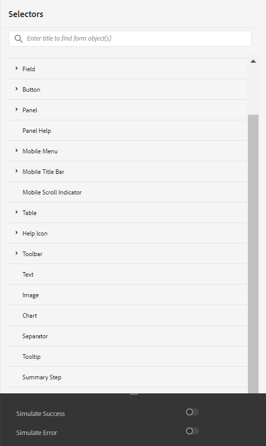
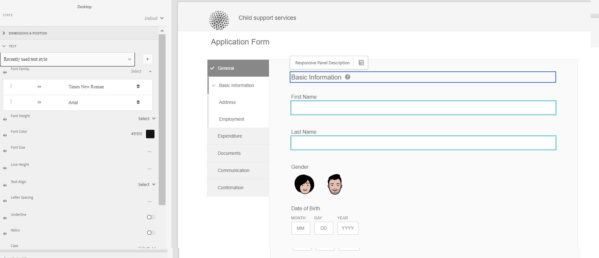

# Skapa och använda teman {#creating-and-using-themes}

Du kan skapa och använda teman för att anpassa ett anpassat formulär<!-- or an interactive communication-->. Ett tema innehåller formatinformation för komponenterna och panelerna. Format innehåller egenskaper som bakgrundsfärger, lägesfärger, genomskinlighet, justering och storlek. När du använder ett tema återspeglas det angivna formatet i motsvarande komponenter. Temat hanteras separat utan referens till ett anpassat formulär<!-- or interactive communication -->.

Du kan hämta och installera [!DNL AEM Forms] referera till innehållspaket från [Programvarudistribution](https://experience.adobe.com/#/downloads/content/software-distribution/en/aemcloud.html) portalen för att importera referensteman och mallar till din miljö.

## Skapa, hämta eller överföra ett tema {#creating-downloading-or-uploading-a-theme}

Ett tema skapas och sparas som en separat enhet, komplett med metaegenskaper som Adaptiv Forms. Det gör att du kan återanvända ett tema i flera adaptiva Forms<!-- or  and interactive communications-->. Du kan också flytta ett tema till en annan instans och återanvända det.

### Skapa ett tema {#creating-a-theme}

Så här skapar du ett tema:

1. Klicka **[!UICONTROL Adobe Experience Manager]**, klicka **[!UICONTROL Forms]** och klicka **[!UICONTROL Themes]**.

1. Klicka på på sidan Teman **[!UICONTROL Create]** > **[!UICONTROL Theme]**.
En guide för att skapa ett tema startas.

1. Ange **[!UICONTROL Name]** av temat.

1. Ange ett formulär som du vill förhandsgranska temat i **[!UICONTROL Default Preview for this Theme]** fält. Klicka **[!UICONTROL Use Default]** om du vill använda standardformuläret för att förhandsgranska temat.

1. Ange en **[!UICONTROL Configuration Container]**. Du kan välja en **[!UICONTROL Configuration Container]** som innehåller konfigurationsinformation om Adobe-teckensnitt för ditt konto. Du kan också lämna alternativet tomt för tillfället och ange informationen senare från [temaegenskaper](#metadata-of-a-theme).

1. Klicka **[!UICONTROL Create]** och sedan klicka **[!UICONTROL Edit]** för att öppna temat i temeredigeraren, eller klicka på **[!UICONTROL Done]** för att gå tillbaka till temasidan.

### Skillnad från teman i Experience Manager 6.5 Forms och tidigare versioner {#difference-in-themes}

Teman som skapats för en Cloud Service-instans:

* Har versionsnummer 2.

* lagras på `/content/dam/formsanddocuments-themes/<theme-name>/`

* Ange inte alternativ för klientbibliotek. Du kan inte ange en bibliotekskategori och sökväg för klienten.

* Har inte behörighet att skriva och uppdatera på /apps-platsen (Forms-användargruppen har inte behörighet att skriva och uppdatera på /apps-platsen).

* Innan du överför ett tema som skapats den [!DNL Experience Manager Forms] 6.5 eller tidigare versioner till en Cloud Service-instans, kontrollera att klientbibliotekets plats är inställd på `etc/clientlibs/fd/themes`. Om klientbiblioteket inte finns i `etc` mapp, uppdatera platsen manuellt till `etc/clientlibs/fd/themes`.  Du kan ändra dina [!DNL Experience Manager Forms] 6.5 eller tidigare versioner. När du har angett platsen för klientbiblioteket kan en administratör överföra teman till Cloud Servicen eller använda verktyget Innehållsöverföring för att migrera teman från 6.5 eller tidigare versioner till Cloud Servicen.

   Ändra också namnet på kategorin. Om namnet inte ändras uppstår ett fel `theme with same category name exists` kan inträffa. När du ändrar kategorinamnet påverkas inte den adaptiva Forms som använder temat.

### Hämta ett tema {#downloading-a-theme}

Du kan exportera teman som en zip-fil och använda dessa teman i andra projekt eller i Experience Manager-instanser. Så här hämtar du ett tema:

1. Klicka **[!UICONTROL Adobe Experience Manager]**, klicka **[!UICONTROL Forms]** och klicka sedan på **[!UICONTROL Themes]**.

1. På sidan Teman **[!UICONTROL Select]** ett tema och klicka på **[!UICONTROL Download]**. En dialogruta med information om temat visas.

1. Klicka på **[!UICONTROL Download]**. Temat laddas ned som en zip-fil.

>[!NOTE]
>
>Om du hämtar ett tema som har ett associerat adaptivt formulär och det associerade adaptiva formuläret är baserat på en anpassad mall, hämtar du även den anpassade mallen. När du överför det hämtade temat och Adaptiv form överför du även den relaterade anpassade mallen.

### Överföra ett tema {#uploading-a-theme}

En användare med administratörsbehörighet kan överföra ett tema som har skapats i [!DNL Experience Manager Forms] 6.5 eller tidigare versioner.

Så här överför du ett tema:

1. Klicka **[!UICONTROL Adobe Experience Manager]**, klicka **[!UICONTROL Forms]** och klicka sedan på **[!UICONTROL Themes]**.

1. Klicka på på sidan Teman **[!UICONTROL Create]** > **[!UICONTROL File Upload]**.
1. Bläddra och välj ett temapaket på datorn i filöverföringsprompten och klicka på **[!UICONTROL Upload]**.
Det överförda temat är tillgängligt på temasidan.

## Metadata för ett tema {#metadata-of-a-theme}

Lista med metaegenskaper för ett tema (finns på egenskapssidan för ett tema).

<table>
 <tbody>
  <tr>
   <th>
<strong>ID</strong>
 
 
 </th>
   <th><strong>Namn</strong></th>
   <th><strong>Kan redigeras</strong></th>
   <th><strong>Egenskapsbeskrivning</strong></th>
  </tr>
  <tr>
   <td>1.</td>
   <td>Titel</td>
   <td>Ja</td>
   <td>Visningsnamn för temat.</td>
  </tr>
  <tr>
   <td>2.</td>
   <td>Beskrivning</td>
   <td>Ja</td>
   <td>Beskrivning av temat.</td>
  </tr>
  <tr>
   <td>3.</td>
   <td>Typ</td>
   <td>Nej</td>
   <td>
    <ul>
     <li>Typ av tillgång.</li>
     <li>Värdet är alltid tema.</li>
    </ul> </td>
  </tr>
  <tr>
   <td>4.</td>
   <td>Skapad</td>
   <td>Nej</td>
   <td>Datum när temat skapades</td>
  </tr>
  <tr>
   <td>5.</td>
   <td>Författarnamn</td>
   <td>Ja</td>
   <td>Författare till temat. Beräknas när temat skapas.</td>
  </tr>
  <tr>
   <td>6.</td>
   <td>Senast ändrat den</td>
   <td>Nej</td>
   <td>Datum när temat senast ändrades.</td>
  </tr>
  <tr>
   <td>7.</td>
   <td>Status</td>
   <td>Nej</td>
   <td>Temats status (ändrad/publicerad).</td>
  </tr>
  <tr>
   <td>8.</td>
   <td>Publicera i tid</td>
   <td>Ja</td>
   <td>Det är dags att automatiskt publicera temat.</td>
  </tr>
  <tr>
   <td>9.</td>
   <td>Publicera utanför tid</td>
   <td>Ja</td>
   <td>Det är dags att automatiskt avpublicera temat.</td>
  </tr>
  <tr>
   <td>10.</td>
   <td>Taggar</td>
   <td>Ja</td>
   <td>En etikett som är kopplad till temat för identifiering och som används för att förbättra sökningen.</td>
  </tr>
  <!-- <tr>
   <td>11.</td>
   <td>References</td>
   <td>Links</td>
   <td>
    <ul>
     <li>Contains 'Referred by' section. Lists forms that use the theme.</li>
     <li>Since the theme does not refer to any other asset, there is no 'Refers' section.</li>
    </ul> </td>
  </tr>
   <tr>
   <td>12.</td>
   <td>Clientlib Location</td>
   <td>Yes</td>
   <td>
    <ul>
     <li>The user-defined repository path within '/etc' where the clientlibs corresponding to this theme are stored.</li>
     <li>Default value - '/etc/clientlibs/fd/themes' + relative path of theme asset.</li>
     <li>If the location does not exist, the folder hierarchy is auto-generated.</li>
     <li>When this value is changed, the clientlib node structure is moved to the new location entered.  <em><strong>Note:</strong> If you change default clientlib location, in the CRXDE repository assign <code>crx:replicate, rep:write, rep:glob:*, rep:itemNames:: js.txt, jcr:read </code>to <code>forms-users</code> and <code>crx:replicate</code>, <code>jcr:read </code>to <code>fd-service</code> in the new location. Also attach another ACL by adding <code>deny jcr:addChildNodes</code> for <code>forms-user</code></em></li>
    </ul> </td>
  </tr> 
  <tr>
   <td>13.</td>
   <td>Clientlib Category Name</td>
   <td>Yes</td>
   <td>
    <ul>
     <li>The user-defined clientlib category name for this theme.</li>
     <li>An error is displayed if the name is already in use by some other existing theme.</li>
     <li>Default value - computed using theme location.</li>
     <li>When this value is changed, the category name is updated on the corresponding clientlib node. Updating Clientlib Category Name in the jsp files is not required because clientlib category name is used by reference.</li>
    </ul> </td>
  </tr> -->
 </tbody>
</table>

## Om Theme Editor {#about-the-theme-editor}

Theme Editor är ett användarvänligt och användarvänligt gränssnitt för webbdesigners och utvecklare som innehåller funktioner som krävs för att specificera formatet för olika adaptiva formulär <!-- and interactive communication --> enkelt. När du skapar ett tema lagras det som en separat enhet, som formulär <!--  , interactive communications, letters, document fragments, and data dictionaries-->.

Med Theme Editor kan du anpassa stilar för de komponenter som är formaterade i ett tema. Du kan anpassa hur ett formulär <!-- or interactive communication --> ser ut på en enhet.

Temaredigeraren är uppdelad i två paneler:

* **Arbetsyta** - Visas på höger sida. Här visas ett exempel på en adaptiv form <!--  or interactive communication --> där alla formatändringar återspeglas direkt. Du kan också markera objekt direkt från arbetsytan för att leta upp format som är kopplade till dem och redigera formaten. En enhetsupplösningslinjal längst upp styr arbetsytan. Om du väljer en brytpunkt för upplösning från linjalen visas förhandsvisningen av exempelformuläret <!--  or interactive communication --> för respektive upplösning. Arbetsytan beskrivs i detalj [nedan](themes.md#using-canvas).

* **Sidebar**- Visas på vänster sida. Den har följande objekt:

   * **Väljare:** Visar den komponent som är markerad för formatering och dess egenskaper som du kan formatera. Väljaren representerar alla komponenter av en typ. Om du väljer en textrutekomponent i ett tema för formatering, alla textrutor i formuläret <!-- or interactive communication --> ärva stilen. Med väljare kan du välja en allmän komponent eller en specifik komponent för formatering. En fältkomponent är till exempel en allmän komponent och en textruta är en specifik komponent.

      **Formatera allmän komponent:**
Ett fält kan vara ett numeriskt fält, t.ex. age, eller ett textfält, t.ex. adress.
När du formaterar ett fält formateras alla fält, till exempel ålder, namn och adress.

      **Formateringsspecifik komponent**: En specifik komponent påverkar objekt i den specifika kategorin. När du formaterar den numeriska rutkomponenten i temat ärver bara det numeriska ruteobjektet formatet.

      Ett textrutefält, till exempel en längre adress och ett numeriskt rutefält som t.ex. ålder, är kortare. Du kan markera ett numeriskt rutfält, minska dess längd och använda det i formuläret. Bredden på alla numeriska rutfält minskas i formuläret.

      När du anpassar alla fältkomponenter med en viss bakgrundsfärg ärver alla fält, som ålder, namn och adress, bakgrundsfärgen. När du markerar en numerisk ruta, t.ex. ålder, och minskar bredden på den, minskas bredden på alla numeriska rutor, t.ex. ålder, antalet personer i en familj. Bredden på textrutor ändras inte.

   * **Läge:** Gör att du kan anpassa format för ett objekt i ett visst läge. Du kan till exempel ange ett objekts utseende när det är i standardläge, fokusläge, inaktiverat läge, hovring eller felläge.
   * **Egenskapskategorier:** Formategenskaper delas upp i olika kategorier. Till exempel Dimension och placering, Text, Bakgrund, Kant och Effekter. Under varje kategori anger du formatinformation. Under Bakgrund kan du till exempel ange Bakgrundsfärg och Bild och övertoning.

   * **Avancerat:** Gör att du kan lägga till anpassad CSS till ett objekt, vilket åsidosätter de egenskaper som visuella kontroller definierar om det finns en överlappning.

   * **Visa CSS**: Gör att du kan visa CSS för den markerade komponenten.
   I sidofältet finns dessutom en pil längst ned. När du klickar på pilen får du ytterligare två alternativ: **Simulera lyckade** och **Simulera fel.** Dessa alternativ, tillsammans med de alternativ som beskrivs ovan, beskrivs i detalj [nedan](themes.md#using-rail).

 **S.** Sidebar **B.** Arbetsyta

### Formatkomponenter {#styling-components}

Du kan använda ett tema i flera adaptiva Forms<!-- and interactive communications -->som importerar komponentformateringen som du har angett i temat. Du kan formatera olika komponenter som titlar, beskrivning, paneler, fält, ikoner och textrutor. Använd widgetar för att konfigurera komponentegenskaper i ett tema. Det krävs ingen tidigare kunskap om CSS eller LESS, men det önskas även om du kan skriva CSS-kod eller använda anpassade väljare i avsnittet CSS-åsidosättningar. Avsnittet CSS-åsidosättningar visas när du markerar en komponent i sidofältet.

Alternativ i sidofältet som gör att du kan markera och formatera olika komponenter.

Om du klickar på redigeringsknappen mot en komponent i sidlisten markeras komponenten på arbetsytan. Du kan också formatera komponenten med alternativen i sidlisten.

Vissa komponenter som textruta, numerisk ruta, alternativknapp och kryssruta är kategoriserade under generiska komponenter som Fält. Du kan till exempel anpassa stilen på alternativknappar. Om du vill välja alternativknappar för formatering väljer du **[!UICONTROL Field]** > **[!UICONTROL Widget]** > **[!UICONTROL Radio Button]**.

### Layout på formatpanelen {#styling-panel-layouts-br}

Teman i [!DNL AEM Forms] har stöd för formatering av element i panelernas layout i dina formulär<!-- and  interactive communications -->. Formatering av element i färdiga layouter och anpassade layouter stöds.

De färdiga panelerna är:

* Tabbar till vänster
* Tabbar överst
* Dragspel
* Responsiv
* guide
* Mobil layout

   * Panelrubriker i sidhuvudet
   * Utan panelrubriker i sidhuvudet

Väljarna varierar för olika layouter.
Skräddarsydda layouter från Theme Editor innehåller:

* Definiera komponenterna för en layout som kan formateras och CSS-väljare för att unikt identifiera dessa komponenter.
* Definiera CSS-egenskaper som kan användas på dessa komponenter.
* Definiera formaten för de här komponenterna interaktivt från användargränssnittet.

### Olika format för olika skärmstorlekar {#different-styles-for-different-screen-sizes-br}

Skrivbords- och mobillayouter kan ha något eller helt olika format. För mobila enheter har surfplattor och telefoner liknande layouter förutom komponentstorlekar.

Använd Theme Editor-brytpunkter för att definiera alternativ formatering för olika skärmstorlekar. Du kan välja en basenhet eller upplösning som du börjar bygga temat på, och formatvariationerna för andra upplösningar genereras automatiskt. Du kan ändra formateringen för alla upplösningar.

>[!NOTE]
>
>Temat skapades först med ett formulär<!-- or interactive communication-->och sedan tillämpas på olika formulär<!-- or interactive communications-->. Brytpunkterna som används när temat skapas kan skilja sig från formuläret <!-- or interactive communication --> som temat används på. CSS-mediefrågor baseras på formuläret <!-- or interactive communication --> används för att skapa teman och inte för formuläret <!-- or interactive communication --> som temat används på.

### Kontexten för formategenskaper ändras i sidofältet när objekt markeras {#styling-properties-context-changes-in-sidebar-on-selecting-objects}

När du markerar en komponent på arbetsytan visas dess formategenskaper i sidlisten. Markera objekttypen och dess läge och ange sedan dess format.

### Nyligen använda format i Theme Editor {#recently-used-styles-in-theme-editor}

Temaredigeraren cachelagrar upp till tio format som har använts på en komponent. Du kan använda de cachelagrade formaten med andra komponenter i ett tema. Nyligen använda format är tillgängliga direkt under den markerade komponenten i sidlisten som en listruta. Till att börja med är listan över senast använda format tom.

När du formaterar en komponent cachelagras formaten och visas i listrutan. I det här exemplet är textrutans etikett formaterad för att ändra teckenstorlek och färg. Du kan följa liknande steg när du väljer en bild eller ändrar färger för att formatera en komponent. Lägg märke till hur formatet cachelagras och visas i listrutan när fältetikettens format ändras.

I det här exemplet ändras formatet för fältetiketten och när du väljer Responsiv panelbeskrivning för formatet läggs en listpost till i resursbiblioteket. Posten i resursbiblioteket kan användas för att ändra formatet för responsiv panelbeskrivning.

När ett format läggs till i resursbiblioteket är det tillgängligt för andra teman och i [stilläge](inline-style-adaptive-forms.md) i formulärredigerarens användargränssnitt. På samma sätt när du använder stilläget i formulärredigeraren <!-- or interactive communication editor --> För att formatera en komponent cachelagras formatet och är tillgängligt i teman.

Med plusknappen mot resursbiblioteket kan du spara formatet med ett namn som du anger permanent. Med plusknappen sparas formatet även om du inte klickar på knappen Spara i sidlisten för att tillämpa formatet på en komponent. Den plusknapp som används för att spara ett format för senare bruk är inte tillgänglig i formatläget.

När du anger ett anpassat namn för ett format kopplas formatet till ett tema och är inte längre tillgängligt för andra teman. Så här tar du bort ett sparat format:

1. I verktygsfältet CANVAS klickar du på **[!UICONTROL Theme Options]**  > **[!UICONTROL Manage Styles]**.
1. Välj ett sparat format i dialogrutan Hantera format och klicka på **[!UICONTROL Delete]**.

   

### Förhandsgranska, spara och ignorera ändringar {#live-preview-save-and-discard-changes}

Ändringar som görs i formatet återspeglas direkt i formuläret <!-- or interactive communication --> laddas i arbetsytan. Med direktförhandsvisning kan du interaktivt definiera och se hur formateringen påverkas. När du ändrar en komponents stil visas **[!UICONTROL Done]** knappen är aktiverad i sidlisten. Om du vill behålla ändringarna använder du **[!UICONTROL Done]** -knappen.

>[!NOTE]
>
>När ett ogiltigt tecken anges i ett fält ändras fältets färggräns till rött och ett felmeddelande visas i skärmens övre vänstra hörn. Om du t.ex. anger alfabet i en textruta som accepterar numeriska tecken som indata, har inmatningsramens kantlinjefärg ändrats till röd. Du kan inte spara ett sådant tema utan att lösa det fel som visas längst ned på skärmen.

### Tema med en annan adaptiv form {#theme-with-another-adaptive-form}

När du skapar ett tema skapas det med ett formulär som levereras med Theme Editor. Du anger format för komponenter i det här formuläret. I stället för det formulär som levereras med Theme Editor kan du välja ett formulär <!-- or interactive communication --> efter eget val för att skapa en formatering och förhandsgranska resultatet.

Ersätta det aktuella formuläret eller <!-- interactive communication --> på arbetsytan i temeredigeraren:

1. På panelen TEMAREDIGERARE klickar du på **[!UICONTROL Theme Options]**  > **[!UICONTROL Configure]**.

1. Bläddra och välj ett formulär på fliken Allmänt <!-- or interactive communication --> för **[!UICONTROL Adaptive Form]** fält.

### Gör om/Ångra {#redo-undo}

Du kan ångra eller göra om oönskade ändringar som inträffar av misstag. Använd gör om-/ångra-knapparna på arbetsytan.

Knappar för att göra om/ångra visas när du formaterar en komponent i temeredigeraren.

## Använda Theme Editor {#using-the-theme-editor}

Med Theme Editor kan du redigera ett tema som du har skapat eller överfört. Navigera till **[!UICONTROL Forms & Documents]** > **[!UICONTROL Themes]** och välj ett tema och öppna det. Temat öppnas i temaredigeraren.

Som nämnts ovan har temaredigeraren två paneler: Sidofältet och arbetsytan.

Anpassa framgångsläget för komponenten för textrutewidgeten i Theme Editor. Komponenten markeras i Canvas och dess läge markeras i sidlisten. De formateringsalternativ som finns i sidofältet används för att anpassa utseendet på en komponent.

### Använda Canvas {#using-canvas}

Temat skapas antingen i det färdiga formuläret eller med ett formulär <!-- or interactive communication --> efter eget val. På arbetsytan visas förhandsgranskningen av formuläret eller <!-- interactive communication --> används för att skapa temat med anpassningar som anges i temat. Linjalen ovanför formuläret används för att bestämma layouten baserat på visningsstorleken på enheten.

I verktygsfältet Arbetsyta ser du:

* **[!UICONTROL Toggle Side Panel]** : Här kan du visa eller dölja sidofältet.
* **[!UICONTROL Theme Options]** : Tillhandahåller tre alternativ

   * Konfigurera: Tillhandahåller alternativ för att välja förhandsgranskningsformuläret <!-- or interactive communication , base clientlib, -->och Adobe Fonts.
   * Visa tema-CSS: Genererar CSS för det valda temat.
   * Hantera format: Alternativ för att hantera text- och bildformat
   * Hjälp: Kör en guidad visning av en bild i Theme Editor.

* **[!UICONTROL Emulator]** : Emulerar temats utseende för olika visningsstorlekar. En visningsstorlek behandlas som en brytpunkt i emulatorn. Du kan markera en brytpunkt och ange ett format för den. Skrivbordet och surfplattan är till exempel två brytpunkter. Du kan ange olika format för varje brytpunkt.

När du markerar en komponent på arbetsytan visas komponentens verktygsfält ovanpå. Med komponentverktygsfältet kan du välja komponenter eller växla till generiska komponenter. Du kan till exempel markera en numerisk textruta på en panel. Följande alternativ visas i komponentens verktygsfält:

* **[!UICONTROL Numeric Box Widget]**: Gör att du kan markera komponenten och anpassa dess utseende i sidofältet.
* **[!UICONTROL Field Widget]**: Gör att du kan välja den generiska komponenten för formatering. I det här exemplet markeras alla textindatakomponenter (textruta/numerisk ruta/numerisk nummerlista/datumindata) för formatering.

* : Gör att du kan välja den överordnade komponenten för formatering. Om du markerar en numerisk ruta och trycker på den här ikonen markeras fältkomponenten. Om du markerar en fältkomponent och trycker på den här ikonen markeras panelen. Om du fortsätter att trycka på den här ikonen för markering, kommer du att välja layouten för formatering.

>[!NOTE]
>
>Vilka alternativ som är tillgängliga i komponentverktygsfältet varierar beroende på vilken komponent du väljer.

### Använda sidofält {#using-rail}

Sidofältet i temeredigeraren innehåller alternativ för att anpassa format för komponenter i ett tema och använda väljare. Med väljarna kan du välja en grupp komponenter eller enskilda komponenter, och du kan söka efter väljare i sidofältet. Du kan skriva väljare för anpassade komponenter.

När du väljer en komponent på arbetsytan eller väljare i sidofältet visas alla alternativ som du kan använda för att anpassa dess format i sidlisten.
Nedan visas de alternativ som visas i sidofältet när du markerar en komponent:

* Läge
* Egenskapssida
* Simulera fel/lyckade

#### Läge {#state}

Ett läge är en indikator på användarinteraktion med en komponent. Om en användare t.ex. anger felaktiga data i en textruta ändras textrutans status till ett feltillstånd. Med temaredigeraren kan du ange format för ett visst läge.

Alternativen för att anpassa lägesformat varierar för olika komponenter.

#### Egenskapssida {#property-sheet}

<table>
 <tbody>
  <tr>
   <td><strong>Egenskap</strong></td>
   <td><strong>Använd</strong></td>
  </tr>
  <tr>
   <td>
Dimensioner och position
 </td>
   <td>
Gör att du kan formatera justering, storlek, placering och placering av komponenter i temat. 
 
Du kan välja mellan visningsinställningar, utfyllnad, marginal, bredd, höjd och Z-index.
 
Du kan också använda layoutläget för att definiera komponenternas bredd med ett enkelt dra och släpp-gränssnitt. Mer information finns i <a href="resize-using-layout-mode.md">Använd layoutläget för att ändra storlek på komponenter</a>.
 </td>
  </tr>
  <tr>
   <td>
Text
 </td>
   <td>
Här kan du anpassa textformaten i temats komponent.
 
Du vill till exempel ändra hur texten som anges i textrutan ser ut.
 
Du kan välja mellan teckensnittsfamilj, bredd, färg, storlek, radhöjd, textjustering, teckenavstånd, textindrag, understrykning, kursiv stil, textomformning, vertikal justering, baslinje och riktning. 
 </td>
  </tr>
  <tr>
   <td>
Bakgrund 
 </td>
   <td>
Gör att du kan fylla komponentens bakgrund med en bild eller en färg. 
 </td>
  </tr>
  <tr>
   <td>
Kant
 </td>
   <td>
Här kan du välja hur kanten för komponenten ska se ut. Du vill till exempel att textrutan ska ha en djup röd, tjock kant med en prickad linje. 
 
Du kan välja mellan bredd, stil, radie och färg för ramen.
 </td>
  </tr>
  <tr>
   <td>
Effekter
 </td>
   <td>
Gör att du kan lägga till specialeffekter i komponenter som opacitet, blandningsläge och skuggor. 
 </td>
  </tr>
  <tr>
   <td>
Avancerat
 </td>
   <td>
Gör att du kan lägga till:

    <ul>
     <li>Egenskaper för <code>::before</code> och <code>::after</code> pseudoelement om du vill lägga till innehåll efter eller före standardinnehållet i väljaren och formatera det.  Se <a href="https://www.w3schools.com/css/css_pseudo_elements.asp" target="_blank">CSS-pseudoelement</a>.</li>
     <li>Anpassad CSS-kod infogad till en komponent.</li>
    </ul> 
När du lägger till en anpassad CSS-kod åsidosätter den anpassningen som du lade till med alternativen i sidofältet. 
 </td>
  </tr>
 </tbody>
</table>

#### Simulera fel/lyckade {#simulate-error-success}

Alternativen Simulera fel och Slutfört finns längst ned i sidlisten. Du kan visa dem med en Visa/dölj-pil längst ned i sidlisten. Med hjälp av temaredigeraren kan du formatera olika lägen för en komponent.

Du kan till exempel lägga till ett numeriskt fält i formuläret och ange dess format i temaredigeraren. När en användare skriver ett alfanumeriskt värde i fältet vill du att bakgrundsfärgen för textrutan ska ändras. Du markerar det numeriska fältet i temat och använder lägesalternativet i sidofältet. Du väljer felläget i sidlisten och ändrar bakgrundsfärgen till röd. Om du vill förhandsgranska beteendet kan du använda alternativet Simulera fel i sidofältet. Alternativen Simulera fel och Slutfört beskrivs i detalj nedan:

* **Simulera lyckade**: Gör att du kan se hur en komponent ser ut om du anger dess format för ett lyckat tillstånd. I ett formulär kan kunderna till exempel ange lösenord. Användare kan ange lösenord enligt de riktlinjer som du anger. När en användare skriver ett lösenord enligt alla riktlinjer du anger ändras textrutan till grön. När textrutan blir grön är den klar. Du kan ange en stil för en komponent i ett lyckat tillstånd och simulera dess utseende med alternativet Simulera lyckade.

* **Simulera fel**: Gör att du kan se hur en komponent ser ut om du anger dess format för feltillstånd. I ett formulär kan kunderna till exempel ange lösenord. Användare kan ange lösenord enligt de riktlinjer som du anger. När en användare skriver ett lösenord som inte följer alla riktlinjer som du anger blir textrutan röd. När textrutan blir röd är den i feltillstånd. Du kan ange format för en komponent i feltillstånd och simulera dess utseende med alternativet Simulera fel.

### Formatera en komponent {#styling-a-component}

I ditt formulär finns det till exempel två typer av textrutor: en som bara accepterar numeriska värden och en annan som accepterar alfanumeriska värden. Du kan anpassa formateringen för textrutan som bara accepterar numeriska värden (en numerisk ruta).

Så här anpassar du formateringen för en viss komponent (en numerisk ruta i det här exemplet):

1. I temeredigeraren markerar du den numeriska rutan på arbetsytan.
1. När du markerar den numeriska rutan visas komponentens verktygsfält med tre alternativ:

   * **[!UICONTROL Numeric Box Widget]**
   * **[!UICONTROL Field Widget]**

1. Välj **[!UICONTROL Numeric Box Widget]**.
1. Sidofältets rubrik ändras till Numerisk rutwidget och visar alternativ för att anpassa dess utseende.
Använd **[!UICONTROL Dimension & Position]** i sidofältet för att anpassa komponentens storlek. Kontrollera att staten är **[!UICONTROL Default]**.

Istället för att markera **[!UICONTROL Numeric Box Widget]**, markera **[!UICONTROL Field Widget]** i komponentens verktygsfält och utför stegen ovan. När du väljer dimensioner för **[!UICONTROL Field Widget]** har alla textrutor utom den numeriska rutan samma storlek.

### Formatera fält för ett visst läge {#styling-fields-given-state}

Med komponentverktygsfältet kan du även ange komponentformat för de olika lägena. Om en komponent till exempel är inaktiverad är den i inaktiverat läge. Vanliga lägen för en komponent som du kan formatera i temaredigeraren är: Standard, Focus, Disabled, Error, Success och Hover. Du kan markera en komponent på arbetsytan och använda alternativet Läge i sidofältet för att anpassa dess utseende.

Så här anpassar du formateringen för en komponent i ett visst läge:

1. Markera en komponent på arbetsytan och välj lämpligt alternativ i komponentens verktygsfält.
I sidofältet visas alternativ för att anpassa komponentens format.
1. Välj ett läge i sidofältet. Exempel: Feltillstånd.
1. Använd alternativ som **[!UICONTROL Border, Background]** i sidlisten för att anpassa hur komponenten ser ut.
1. Använd **[!UICONTROL Simulate Error]** längst ned i sidlisten för att se hur stilen ser ut vid redigering.

När du anpassar en komponents format efter att du har angett dess läge, visas anpassningen bara för komponenten för det angivna läget. Om du till exempel anpassar komponentens format när hovringsläget är markerat. Anpassningen visas för komponenten när du flyttar pekaren över komponenten i det återgivna formuläret <!-- or interactive communication --> som du använder temat på.

Om du vill simulera beteendet för andra lägen än fel och lyckade, använder du förhandsgranskningsläget. Om du vill använda förhandsgranskningsläget klickar du på **[!UICONTROL Preview]** i sidverktygsfältet.

### Formatera layouter för mindre skärmar {#styling-layouts-for-smaller-displays}

Använd linjalen på arbetsytan för att markera brytpunkter för enheter med mindre skärmar. Klicka på emulatorn  på arbetsytan om du vill visa linjaler och brytpunkter. Med brytpunkterna kan du förhandsgranska ett formulär <!-- or interactive communication --> för visningsstorlekar som gäller olika enheter som telefoner och surfplattor. Det finns stöd för flera visningsstorlekar i Theme Editor.

Så här formaterar du komponenter för olika brytpunkter:

1. Markera en brytpunkt ovanför linjalen på arbetsytan.
En brytpunkt representerar en mobil enhet och dess visningsstorlek.
1. Använd sidlisten för att anpassa formulärformateringen <!-- or interactive communication --> -komponenter i temat för den valda visningsstorleken.
1. Se till att anpassningen sparas.

Du kan formatera formulär <!-- or interactive communication --> -komponenter för flera enheter. Formulär <!-- and interactive communication --> -komponenter för datorer och mobila enheter kan ha helt olika format.

### Använda Web Fonts i ett tema {#using-web-fonts-in-a-theme}

Du kan nu använda teckensnitt som finns i en webbtjänst i ett adaptivt formulär <!-- or interactive communication -->. Körklar, [Adobe Fonts](https://fonts.adobe.com/), Adobe webbteckensnittstjänst, finns som konfiguration. Om du vill använda Adobe Fonts skapar du ett kit, lägger till teckensnitt i det och hämtar Kit-ID:t från [Adobe Fonts](https://fonts.adobe.com/).

Så här konfigurerar du Adobe Fonts i Experience Manager:

1. Klicka på i författarinstansen **[!UICONTROL Adobe Experience Manager]**>**[!UICONTROL Tools]** >**[!UICONTROL Deployment]**>**[!UICONTROL Cloud Services]**.
1. På **[!UICONTROL Cloud Services]** sida, navigera till och öppna **[!UICONTROL Adobe Fonts]** alternativ. Öppna konfigurationsmappen och klicka på **[!UICONTROL Create]**.
1. På **[!UICONTROL Create Configuration]** anger du en rubrik för konfigurationen och klickar på **[!UICONTROL Create]**.

   Du omdirigeras till konfigurationssidan.

1. Ange ditt kit-ID i dialogrutan Redigera komponent som visas och klicka på **[!UICONTROL OK]**.

Så här konfigurerar du ett tema så att det använder Adobe Fonts-konfigurationen:

1. Öppna ett tema i temaredigeraren i författarinstansen.
1. Navigera till **[!UICONTROL Theme Options]**  > **[!UICONTROL Configure]**.
1. I **[!UICONTROL Adobe Fonts Configuration]** väljer du ett kit och klickar på **[!UICONTROL Save]**.

   Nu ser du att teckensnitten har lagts till i temats egenskap font-family.

<!-- >
### Listing and selecting fonts in theme editor {#listing-and-selecting-fonts-in-theme-editor}

You can use the theme configuration service to add more fonts to the theme editor. Perform the following steps to add fonts:

1. Log in to Experience Manager Web Console with administrative privileges. URL for the Experience Manager Web Console is `https://'[server]:[port]'/system/console/configMgr`.
1. Open **[!UICONTROL Adaptive Form Theme Configuration Service]**.

   

1. Click +, specify the name of the font, and click **Save**. The font is added and available in theme editor. -->

#### Välja teckensnitt i temaredigeraren {#selecting-fonts-in-theme-editor}

Du kan använda plusknappen (+) för att lägga till ett teckensnitt. När du lägger till ett teckensnitt visas det i sidlisten.

Förutom alternativet för temakonfiguration kan du även lägga till ditt teckensnitt från temaredigeraren. Skriv det teckensnitt du vill använda i fältet för teckensnittsfamiljen under sidofältet och tryck på returtangenten på tangentbordet.

När du väljer ett teckensnitt läggs det till i listan över teckensnittsfamiljer. Du kan använda alternativet Mask i temaredigeraren för att inaktivera eller aktivera de listade teckensnitten.

Du kan se ändringen av komponentens teckensnitt.

Fältet Teckensnittsfamilj har stöd för flera teckensnitt. När du skriver ett teckensnitt letar webbläsaren efter det och använder det på den markerade komponenten. Om webbläsaren inte kan hitta något teckensnitt söker den efter ett teckensnitt som finns bredvid det i familjen. Du kan börja med att skriva det teckensnitt du söker efter. Om du inte hittar det teckensnitt du vill använda kan du skriva ett generiskt teckensnitt i familjen och använda det.

#### Maskformat som används i temaredigeraren {#mask-styles-applied-in-theme-editor}

Du kan maskera format som används i ett tema. I temaredigerarens sidlist kan du använda om du vill inaktivera ett använt format. Om du till exempel ändrar dimensionerna för en komponent i ett formulär <!-- or interactive communication -->kan du sedan använda maskknappen till vänster om en egenskap för att inaktivera den. När du sparar ett tema behålls de valda maskningsalternativen.

I exemplet nedan visas maskerade och omaskerade format i ett tema.

## Använda ett tema i ett formulär {#applying-a-theme-to-a-form-or-interactive-communication-br}

Så här använder du ett tema i ett adaptivt formulär:

1. Öppna formuläret i redigeringsläge. Om du vill öppna ett formulär i redigeringsläge markerar du ett formulär och klickar på **[!UICONTROL Open]**.
1. Markera en komponent i redigeringsläget och klicka sedan på  > **[!UICONTROL Adaptive Form Container]** och klicka sedan på .

   Du kan redigera egenskaperna för formuläret i sidlisten.

1. Klicka på **[!UICONTROL Styling]**.
1. Välj temat från **[!UICONTROL Adaptive Form Theme]** nedrullningsbar meny och klicka **[!UICONTROL Done]** .

Du kan också definiera ett tema för ett anpassat formulär när du skapar det.

<!-- To apply a theme to an interactive communication:

1. Open your interactive communication in edit mode. To open a interactive communication in edit mode, select a form and click **Open**.
1. In the edit mode, select a component, then click  &gt;**Document Container**, and then click .

   You can edit properties of your form in the sidebar.

1. In the sidebar, under **Basic**, select your theme from the **Theme** drop-down and click **Done**  -->

### Ändra tema för ett formulär vid körning {#change-theme-of-a-form-at-runtime}

Ett tema formaterar olika komponenter i ett formulär. Du kan använda `themeOverride` för att dynamiskt ändra ett formulärs tema. En vanlig URL för ett formulär är:

`https://<server>:<port>/content/forms/af/test.html`

Du kan använda parametern themeOverride för att tillämpa ett tema på körningen.

`https://<server>:<port>/content/forms/af/test.html?themeOverride=/content/dam/formsanddocuments-themes/simpleEnrollmentTheme`

The `themeOverride` kan du ange en sökväg till ett tema. Formulärets tema ändras och formuläret uppdateras med uppdaterade format.

## Hämta specifikt utseende med teman {#specific-af-appearance}

Med [!DNL AEM Forms], tillsammans med det färdiga standardtemat för arbetsytan, finns det många andra teman. Om du vill utforma formuläret <!-- or interactive communication --> med andra teman, tillsammans med fler ändringar, kopierar du temat från temabiblioteksmappen. Klistra in de kopierade temana utanför temabiblioteksmappen och redigera det kopierade temat efter de ändringar du vill.

Så här kopierar du ett tema:

1. I redigeringsinstansen navigerar du till **[!UICONTROL Adobe Experience Manager]** > **[!UICONTROL Forms]** > **[!UICONTROL Themes]**.
1. Öppna mappen Temabibliotek.
1. I temabiblioteksmappen håller du pekaren över motsvarande färdiga tema och trycker **[!UICONTROL Copy]**.
1. Klistra in det kopierade temat utanför temabiblioteksmappen.
1. Anpassa det kopierade temat.

När du har anpassat temat kan du använda det i formuläret <!-- or interactive communication -->.

>[!NOTE]
>
>Ändra inte de teman som är tillgängliga i temabiblioteksmappen. Den här mappen innehåller systemteman. Alla ändringar du har gjort i dessa teman skrivs över när du installerar en nyare version eller snabbkorrigering av [!DNL AEM Forms].

## Inverkan på andra användningsområden för anpassade formulär {#impact-on-other-adaptive-form-use-cases}

* **Publicera/avpublicera ett formulär:** När du publicerar ett formulär publiceras även det tema som används på (om det inte redan är publicerat)
* **Importera/exportera ett formulär:** När du importerar eller exporterar ett formulär importeras eller exporteras även det tillhörande temat automatiskt.
* **Referenser till ett formulär:** Avsnittet Referenser i formulärreferenser innehåller en extra post för temat.
* **Senast ändrad i ett formulär:** Uppdaterades när det associerade temat ändras.
<!-- * **A/B Testing:** You can apply a different theme to two versions of the form in A/B testing. The information of the two themes is individually stored on the two guide containers. -->

## CSS-genereringssekvens {#css-generation-sequence}

När du väljer Visa CSS samlar temaredigeraren in all formatinformation och skapar en CSS. Den samlar in information i följande ordning:

<!-- 1. Styling defined in the theme's base client library. -->
1. Användardefinierad formatering, som anges med egenskaperna i sidofältet.
1. CSS-format som tillhandahålls med alternativet CSS-åsidosättning.

En textrutas bakgrundsfärg är till exempel blå<!-- in the base client library-->. Du ändrar den till rosa med hjälp av egenskaperna i sidlisten. När du genererar CSS ser du textrutans bakgrundsfärg som rosa. När bakgrundsfärgen har ändrats med hjälp av egenskaperna använder en annan författare alternativet CSS-åsidosättning för att ändra textrutan för bakgrundsfärgen till vit. När du genererar CSS ser du bakgrundsfärgen som vit i den genererade CSS-koden.

## Felsöka format {#debugging-styles}

När du anger format för komponenter i Theme Editor genereras en CSS. När du formaterar en allmän komponent formateras även flera komponenter som ingår i den. När du till exempel formaterar ett fält formateras även textrutan och etiketten i det. När du formaterar textrutan i fältet får den sin egen CSS. Om du vill felsöka den CSS som genererats för fältet och komponenten, innehåller Theme Editor alternativ som gör att du kan visa CSS.

Du kan se den genererade CSS-koden med följande alternativ:

* **Visa CSS** i sidlisten: När du markerar en komponent i temat kan du se alternativet VISA CSS i sidofältet. Den visar genererad CSS, inklusive CSS för `::before` och `::after` pseudoelement.
* **Visa tema-CSS** i verktygsfältet på arbetsytan: Klicka på i verktygsfältet Arbetsyta  > **[!UICONTROL View Theme CSS]**. Du kan se hela temats CSS som genererats från de egenskaper som du har definierat i Theme Editor.

## Felsökning, rekommendationer och bästa praxis {#troubleshooting-recommendations-and-best-practices}

* **Undvika resurser från ett annat tema**

   När du redigerar ett tema kan du bläddra bland och lägga till resurser (till exempel bilder) från andra teman. Du redigerar till exempel bakgrunden på en sida. Om du till exempel väljer **[!UICONTROL Page]** > **[!UICONTROL Background]** > **[!UICONTROL Add]** > **[!UICONTROL Image]** visas en dialogruta där du kan bläddra bland och lägga till bilder i andra teman.

* Du kan stöta på problem med det aktuella temat om en resurs läggs till från ett annat tema och det andra temat flyttas eller tas bort. Du bör undvika att bläddra bland och lägga till resurser från andra teman.

<!-- * **Using base clientlib, theme editor, and inline styling**

    * **Base clientlib**:

      Base client library contains styling information. To use styling information in client-side libraries in themes.

        1. Navigate to **[!UICONTROL Experience Manager]** &gt; **[!UICONTROL Forms]** &gt; **[!UICONTROL Themes]**.
        1. In the Themes page, select a theme and click **[!UICONTROL Properties]**.
        1. In the Properties page that opens, click **[!UICONTROL Advanced]**.
        1. In the Advanced tab, in the Clientlib Location field, browse, and select the client-library you want to use.
        1. Click **[!UICONTROL Save]**.

      The styling you specify in client library is imported in the theme that uses it. For example, you specify styling for text box, numeric box, and switch in the client library. When you import your client library in the theme, styling for text box, numeric box, and switch is imported. You can then style other components using theme editor. -->
    Du kan också skapa ett tema, skapa kopior av det och sedan ändra formatet som finns i de kopierade temana för liknande användningsfall.
    Se [Hämta specifikt utseende med teman](#specific-af-appearance)
    
    **Temeredigeraren:**
    
    Med Theme Editor kan du skapa teman som du kan använda för att utforma formuläret &lt;!>— eller interaktiv kommunikation —>. Du kan ange komponenternas format i ett tema, vilket ger enhetlighet i utseende och känsla i flera formulär &lt;!>— eller interaktiv kommunikation —> du utvecklar. Du bör ange formatinformation i ett tema och sedan använda temat i ett formulär.
    
    ***Textformat:**
    
    Du kan formatera komponenter med stilläget i formuläret &lt;!>— eller interaktiv kommunikation —> flerkanaligt redigeringsprogram när du arbetar med ett formulär. Om du använder formatläge för att ändra formulärkomponentens format åsidosätts den formatering som anges i temat. Om du vill ändra format för vissa komponenter i ett visst formulär läser du [Textbunden formatering av komponenter](inline-style-adaptive-forms.md).

<!-- * **Using client-side libraries**

  If you want to create client libraries to import styling information, see [Using Client-Side Libraries](https://experienceleague.adobe.com/docs/experience-manager-cloud-service/implementing/developing/clientlibs.html). After you create a client library, you can import it in your theme using the steps mentioned above. -->

* **Ändra layoutbredd för behållarpanelen**

   Du bör inte ändra bredden på behållarpanelens layout. När du anger bredden på en behållarpanel blir den statisk och anpassas inte till olika skärmar.

* **När formulärredigeraren eller temaredigeraren ska användas för att arbeta med sidhuvud och sidfot**

   Använd temaredigeraren om du vill formatera sidhuvud och sidfot med formatalternativ som teckensnittsformat, bakgrund och genomskinlighet.
Om du vill ange information som logotypbild, företagsnamn i sidhuvud och copyrightinformation i sidfoten använder du alternativen för formulärredigeraren.
