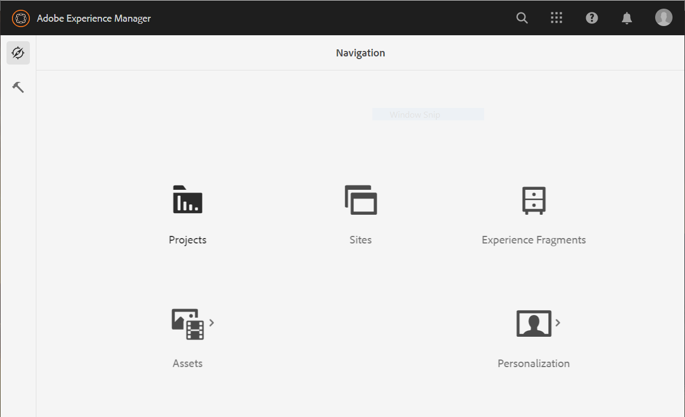
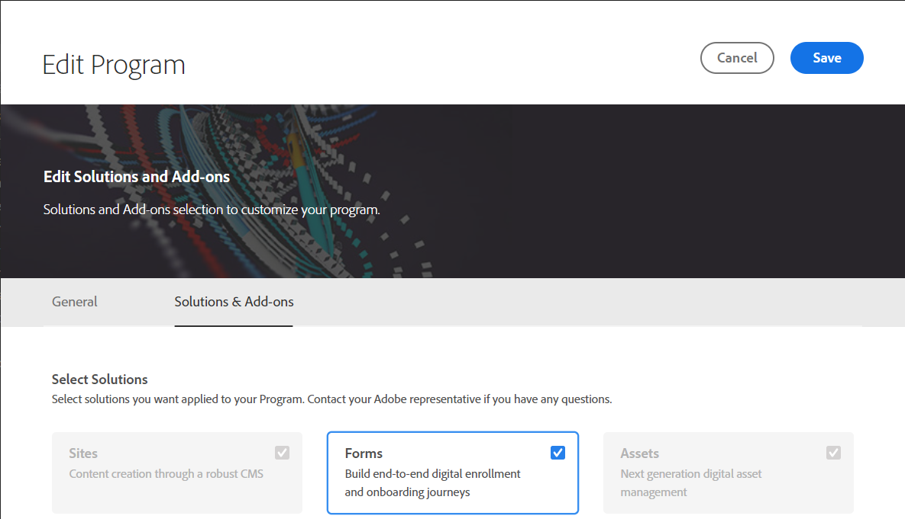

# Konfiguration {#installation-and-configuration}

Följande problem kan uppstå när du konfigurerar en Cloud Service:

## Forms-alternativet är inte tillgängligt

The **[!UICONTROL Forms]** alternativet är inte tillgängligt på **[!UICONTROL Navigation]** sida.

Aktivera **[!UICONTROL Forms]** alternativ:

1. Logga in på [Cloud Manager](https://experience.adobe.com/)
1. Leta upp programmet och klicka på  -ikon. Den öppnar sidan Redigera program för ditt program.
1. Öppna **[!UICONTROL Solutions & Add-ons]** -fliken.
1. Välj **[!UICONTROL Forms]** och klicka **[!UICONTROL Save]**.

   
1. [Skapa](https://experienceleague.adobe.com/docs/experience-manager-cloud-manager/using/how-to-use/configuring-pipeline.html?lang=en#how-to-use) och [run](https://experienceleague.adobe.com/docs/experience-manager-cloud-manager/using/how-to-use/deploying-code.html) både rörledningar för produktion och icke-produktion.

När rörledningen har byggts och driftsatts **[!UICONTROL Forms]** på **[!UICONTROL Navigation]** sida.

<!--  
## Environment creation fails {#environment-creation-fails}

Users are unable to create an [!DNL AEM Forms] as a Cloud Service environment. The environment creation fails after running for some time.

A missing profile can lead to environment creation failure. Check that the profile exists in Admin Console. If the profile does not exist, perform the following steps to create the profile:

1. Log in to [Admin Console](https://adminconsole.adobe.com/). Use Adobe ID of administrator provisioned to use Automated Forms Conversion Service to login. Do not any other ID or Federated ID to login.
1. Click the **[!UICONTROL Automated Forms Conversion Service]** option.
1. Click **[!UICONTROL New Profile]** in the Products tab.
1. Specify Name, Display Name, and Description for the profile. Click **[!UICONTROL Done]**. A profile is created.

If the profile exists and issues still persist, contact Adobe Support. -->

## Det gick inte att skapa pipeline {#build-pipeline-fails}

Användarna kan inte köra byggpipeline. Pipelinen fungerar inte när den har körts ett tag.

Du löser problemet genom att öppna Cloud Manager och välja **[!UICONTROL Update]** för din miljö och kör pipeline.
