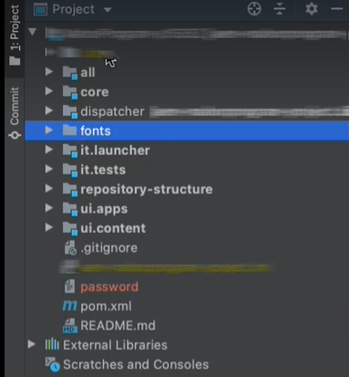

# Använda anpassade teckensnitt

**Cloud Service Communications-dokumentationen finns i betaversionen**

Du kan använda Forms as a Cloud Service Communications för att kombinera en XDP-mall, ett XDP-baserat PDF-dokument eller ett Acrobat-formulär (AcroForm) med XML-data för att generera PDF-dokument. Du kan också använda Communications för att kombinera, ordna om och förstärka PDF- och XDP-dokument och få information om PDF-dokument.

Tillsammans med tidigare nämnda åtgärder kan du använda teckensnitt som ingår i Cloud Service eller anpassade teckensnitt (typsnitt som godkänts av organisationen) för att återge de genererade PDF-dokumenten. Du kan använda utvecklingsprojektet för Cloud Service för att lägga till anpassade teckensnitt i din Cloud Service.

## PDF-dokumentens beteende

Du kan [bädda in ett teckensnitt](https://adobedocs.github.io/experience-manager-forms-cloud-service-developer-reference/references/output-sync/#tag/PrintedOutputOptions) till ett PDF-dokument. När ett teckensnitt är inbäddat visas (ser ut) PDF-dokumentet som identiskt på alla plattformar. Det använder inbäddade teckensnitt för att säkerställa ett konsekvent utseende och känsla. När ett teckensnitt inte är inbäddat beror teckensnittsåtergivningen på återgivningsinställningarna för PDF-visningsprogram som Acrobat eller Acrobat Reader. Om teckensnittet är tillgängligt på klientdatorn använder PDF det angivna teckensnittet, annars återges PDF med ett standardteckensnitt.

## Lägga till anpassade teckensnitt i Forms as a Cloud Service miljö {#custom-fonts-cloud-service}

Så här lägger du till anpassade teckensnitt i Cloud Servicen:

1. Konfigurera och öppna [lokalt utvecklingsprojekt](setup-local-development-environment.md). Du kan använda vilken IDE som helst.
1. I mappstrukturen på den översta nivån i projektet skapar du en mapp (modul) där du kan spara anpassade teckensnitt och lägga till anpassade teckensnitt i mappen. Till exempel typsnitt/src/main/resources
   

1. Öppna filen pom.xml för teckensnittsmodulen i utvecklingsprojektet.
1. Lägg till jar-plugin-program i pom-filen:

   ```xml
   <plugin>
       <groupId>org.apache.maven.plugins</groupId>
       <artifactId>maven-jar-plugin</artifactId>
       <version>3.1.2</version>
       <configuration>
           <archive>
               <manifest>
                   <addDefaultEntries/>
                   <addDefaultImplementationEntries/>
               </manifest>
           </archive>
       </configuration>
   </plugin>
   ```

1. Lägg till `<Font-Archive-Version>` manifest entry the .pom file and set value of version to 1:

   ```xml
   <plugin>
       <groupId>org.apache.maven.plugins</groupId>
       <artifactId>maven-jar-plugin</artifactId>
       <version>3.1.2</version>
       <configuration>
           <archive>
               <manifest>
                   <addDefaultEntries/>
                   <addDefaultImplementationEntries/>
               </manifest>
               <manifestEntries>
                   <Font-Archive-Version>1</Font-Archive-Version>
                   <Font-Archive-Contents>/</Font-Archive-Contents>
               </manifestEntries> 
           </archive>
       </configuration>
   </plugin>
   ```

1. Lägg till teckensnittsmappen i `<modules>` som visas i pom-filen. Till exempel:

   ```xml
   <modules>
       <module>all</module>
       <module>core</module>
       <module>ui.frontend</module>
       <module>ui.apps</module>
       <module>ui.apps.structure</module>
       <module>ui.config</module>
       <module>ui.content</module>
       <module>it.tests</module>
       <module>dispatcher</module>
       <module>dispatcher.ams</module>
       <module>dispatcher.cloud</module>
       <module>ui.tests</module>
       <module>fonts</module>
   </modules>
   ```

   Mappen Fonts innehåller alla anpassade teckensnitt.

1. Checka in den uppdaterade koden och [köra pipelinen](/help/implementing/cloud-manager/deploy-code.md) för att distribuera teckensnitten i Cloud Servicen.

1. (Valfritt) Öppna kommandotolken, navigera till den lokala projektmappen och kör kommandot nedan. Teckensnitten paketeras i en .jar-fil tillsammans med relevant information. Du kan använda .jar-filen för att lägga till anpassade teckensnitt i en lokal utvecklingsmiljö i Forms Cloud Service.

   ```shell
   mvn clean install
   ```

## Lägga till anpassade teckensnitt i den lokala Forms Cloud Service-utvecklingsmiljön {#custom-fonts-cloud-service-sdk}

1. Starta den lokala utvecklingsmiljön.
1. Navigera till `<aem install directory>/crx-quickstart/install` mapp.
1. Placera `<jar file contaning custom fonts and relevant deployment code>.jar` till installationsmappen. Om du inte har .jar-filen följer du anvisningarna i [Lägga till anpassade teckensnitt i Forms as a Cloud Service miljö](#custom-fonts-cloud-service) för att generera filen.
1. Kör [Dörrbaserad SDK-miljö](setup-local-development-environment.md#docker-microservices)


   >[!NOTE]
   >
   >När du distribuerar en uppdaterad .jar-fil med anpassade teckensnitt till den lokala utvecklingsmiljön startar du om den dockningsbaserade SDK-miljön.
