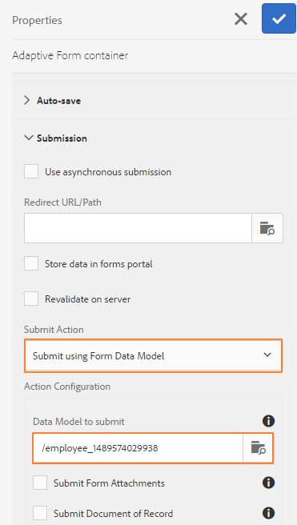

# Använd formulärdatamodell {#use-form-data-model}

[!DNL Experience Manager Forms] dataintegrering gör att du kan använda olika backend-datakällor för att skapa en formulärdatamodell som du kan använda som schema i olika adaptiva Forms <!--and interactive communications--> arbetsflöden. Det kräver att du konfigurerar datakällor och skapar formulärdatamodell baserat på datamodellsobjekt och tjänster som är tillgängliga i datakällor. Mer information finns i följande:

* [[!DNL Experience Manager Forms] Dataintegrering](data-integration.md)
* [Konfigurera datakällor](configure-data-sources.md)
* [Skapa formulärdatamodell](create-form-data-models.md)
* [Arbeta med formulärdatamodell](work-with-form-data-model.md)

En formulärdatamodell är ett tillägg till JSON-schema som du kan använda för att:

* [Skapa adaptiva Forms och fragment](#create-af)

   <!--* [Create interactive communications and building blocks like text, list, and condition fragments](#create-ic)-->
* [Förhandsgranska med exempeldata](#preview-ic)
* [använder datamodelltjänst för formulär](#prefill)
* [Skriv data i anpassat formulär tillbaka till datakällor](#write-af)
* [Anropa tjänster med hjälp av regler för adaptiva formulär](#invoke-services)

## Skapa adaptiva Forms och fragment {#create-af}

Du kan skapa [Adaptiv Forms](creating-adaptive-form.md) och adaptiva formulärfragment <!-- [Adaptive Form Fragments](adaptive-form-fragments.md) --> baserat på en formulärdatamodell. Så här använder du en formulärdatamodell när du skapar ett adaptivt formulär eller adaptivt formulärfragment:

1. På fliken Formulärmodell på skärmen Lägg till egenskaper väljer du **[!UICONTROL Form Data Model]** i **[!UICONTROL Select From]** nedrullningsbar lista.

   

1. Tryck för att expandera **[!UICONTROL Select Form Data Model]**. Alla tillgängliga formulärdatamodeller visas.

   Välj en från datamodell.

   

1. (**Endast adaptiva formulärfragment**) Du kan skapa ett adaptivt formulärfragment baserat på endast ett datamodellsobjekt i en formulärdatamodell. Expandera **[!UICONTROL Form Data Model Definitions]** nedrullningsbar meny. Den visar alla datamodellsobjekt i den angivna formulärdatamodellen. Markera ett datamodellsobjekt i listan.

   

   När det adaptiva formuläret eller adaptiva formulärfragment som baseras på en formulärdatamodell har skapats visas formulärdatamodellsobjekten i **[!UICONTROL Data Sources]** i Content Browser i Adaptive Form Editor.

   >[!NOTE]
   >
   >För ett adaptivt formulärfragment visas endast datamodellsobjektet som valts vid redigeringen och tillhörande datamodellsobjekt på fliken Datakällor.

   

   Du kan dra och släppa datamodellsobjekt till det adaptiva formuläret eller fragmentet för att lägga till formulärfält. De tillagda formulärfälten behåller metadataegenskaperna och bindningen med datamodellens objektegenskaper. Bindningen ser till att fältvärdena uppdateras i motsvarande datakällor när formuläret skickas och förifylls när formuläret återges.

<!-- ## Create interactive communications {#create-ic}

You can create an interactive communication based on a Form Data Model that you can use to prefill interactive communication with data from configured data sources. In addition, the building blocks of an interactive communication, such as text, list, and condition document fragments can be based on a form data model.

You can choose a Form Data Model when creating an interactive communication or a document fragment. The following image shows the General tab of the Create Interactive Communication dialog.

General tab of Create Interactive Communication dialog

For more information, see:

[Create an interactive communication](create-interactive-communication.md)

[Text in Interactive Communications](texts-interactive-communications.md)

[Conditions in Interactive Communications](conditions-interactive-communications.md)

[List fragments](lists.md) -->

## Förhandsgranska med exempeldata {#preview-ic}

Med formulärdatamodellsredigeraren kan du generera och redigera exempeldata för datamodellsobjekt i formulärdatamodellen. Du kan använda dessa data för att förhandsgranska och testa <!--interactive communications and--> Adaptiv Forms. Du måste generera exempeldata innan du förhandsgranskar enligt beskrivningen i [Arbeta med formulärdatamodell](work-with-form-data-model.md#sample).

<!--To preview an interactive communication with sample Form Data Model data:

1. On [!DNL  Experience Manager] author instance, navigate to **[!UICONTROL Forms > Forms & Documents]**.
1. Select an interactive communication and tap **[!UICONTROL Preview]** in the toolbar to select **[!UICONTROL Web Channel]**, **[!UICONTROL Print Channel]**, or **[!UICONTROL Both Channels]** to preview the interactive communication.
1. In the Preview [*channel*] dialog, ensure that **[!UICONTROL Test Data of Form Data Model]** is selected and tap **[!UICONTROL Preview]**.

The interactive communication opens with prefilled sample data.

-->

Om du vill förhandsgranska ett adaptivt formulär med exempeldata öppnar du det adaptiva formuläret i redigeringsläge och trycker på **[!UICONTROL Preview]**.

## Förifyll med tjänsten Formulärdatamodell {#prefill}

[!DNL Experience Manager Forms] har en färdig förifyllningstjänst för formulärdatamodell som du kan aktivera för Adaptiv Forms <!--and interactive communications--> baserat på formulärdatamodell. förifyllningstjänsten frågar efter datakällor för datamodellobjekt i det adaptiva formuläret <!--and interactive communication--> och fyller i data i förväg när formuläret eller kommunikationen återges.

Om du vill aktivera förifyllningstjänsten för formulärdatamodellen för ett adaptivt formulär öppnar du egenskaperna för den adaptiva formulärbehållaren och väljer **[!UICONTROL Form Data Model Prefill service]** från **[!UICONTROL Prefill Service]** nedrullningsbar meny i dragspelsfliken Grundläggande. Spara sedan egenskaperna.

<!--To configure Form Data Model prefill service in an interactive communication, you can select Form Data Model Prefill Service in the Prefill Service drop-down while creating it or later by modifying the properties.

Edit Properties dialog for an interactive communication-->

## Skriv data i anpassat formulär till datakällor {#write-af}

När en användare skickar ett formulär baserat på en formulärdatamodell kan du konfigurera formuläret så att det skriver skickade data för ett datamodellsobjekt till sina datakällor. För att uppnå detta [!DNL Experience Manager Forms] tillhandahålla [Skicka åtgärd för formulärdatamodell](configuring-submit-actions.md), finns endast i körklart läge för Adaptive Forms baserat på en formulärdatamodell. Den skriver skickade data för ett datamodellsobjekt i sin datakälla.

Om du vill konfigurera åtgärden Skicka formulärdatamodell öppnar du egenskaper för adaptiv formulärbehållare och väljer **[!UICONTROL Submit using Form Data Model]** från listrutan Skicka åtgärd under dragspelsfliken. Bläddra och välj sedan ett datamodellsobjekt på **[!UICONTROL Name of the data model object to submit]** nedrullningsbar meny. Spara egenskaperna.

När formuläret skickas skrivs data för det konfigurerade datamodellobjektet till respektive datakälla.

<!---->

Du kan också skicka formulärbilagor till en datakälla med hjälp av objektegenskapen för binär datamodell. Gör följande för att skicka bilagor till en JDBC-datakälla:

1. Lägg till ett datamodellsobjekt som innehåller en binär egenskap i formulärdatamodellen.
1. Dra och släpp **[!UICONTROL File Attachment]** från komponentwebbläsaren till det adaptiva formuläret.
1. Tryck för att markera den tillagda komponenten och tryck på  för att öppna egenskapsgranskaren för komponenten.
1. I fältet Bindningsreferens trycker du på  och navigera till den binära egenskap som du lade till i formulärdatamodellen. Konfigurera andra egenskaper efter behov.

   Tryck  för att spara egenskaperna. Bilagefältet är nu bundet till den binära egenskapen för formulärdatamodellen.

1. Aktivera i delen Skicka i egenskaperna för den adaptiva formulärbehållaren **[!UICONTROL Submit Form Attachments]**. Den bifogade filen i fältet för binära egenskaper skickas till datakällan när formuläret skickas.

## Anropa tjänster i Adaptive Forms med regler {#invoke-services}

I ett adaptivt formulär baserat på en formulärdatamodell kan du [skapa regler](rule-editor.md) för att anropa tjänster som konfigurerats i formulärdatamodellen. The **[!UICONTROL Invoke Services]** -åtgärden i en regel listar alla tillgängliga tjänster i formulärdatamodellen och gör att du kan välja in- och utdatafält för tjänsten. Du kan också använda **[!UICONTROL Set Value]** regeltyp som anropar en formulärdatamodelltjänst och ställer in värdet för ett fält på utdata som returneras av tjänsten.

I följande regel anropas till exempel en get-tjänst som tar Employee Id som indata och de returnerade värdena fylls i i motsvarande fält för beroende ID, efternamn, förnamn och kön i formuläret.

Dessutom kan du använda `guidelib.dataIntegrationUtils.executeOperation` API för att skriva ett JavaScript i kodredigeraren för regelredigeraren. <!-- For API details, see [API to invoke Form Data Model service](invoke-form-data-model-services.md).-->
