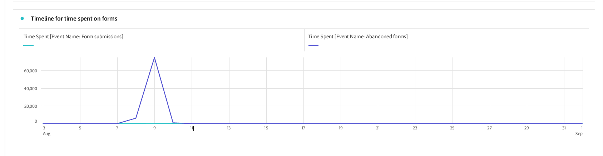

# Visa och förstå analysrapporter för adaptiva Forms {#viewing-and-understanding-aem-forms-analytics-reports}

I det snabbt föränderliga landskapet med digital analys är det av största vikt att vi fortsätter att engagera oss i globala trender för att fatta välgrundade beslut och optimera digitala upplevelser. Adaptive Forms integreras smidigt med Adobe Analytics för att hämta in och spåra prestandamått för era publicerade formulär och dokument. Syftet med att analysera dessa värden är att fatta databaserade beslut med hjälp av statistik och analyser för att förbättra formulärens användbarhet och effektivitet.

Genom att samla in och spåra nyckeltal för prestandaindikatorer kan företag identifiera områden med förbättringar, optimera användarupplevelser och i slutänden få bättre resultat för att skapa exceptionella kundupplevelser.

## Konfigurera Adobe Analytics till Adaptiv Forms {#setup-adobe-analytics-to-aem-forms}

För AEM Forms Analytics-rapporten integrerar du först Adobe Analytics till AEM Forms via Experience Cloud Setup Automation. Experience Cloud Setup Automation i Adaptive Forms kräver en Adobe Analytics-licens, Data Collection (tidigare Adobe Launch) för att hantera spårningsskript och integrering med Experience Platform Launch API för smidig datainsamling och generering av insikter. Besök [Aktivera Adobe Analytics för ett adaptivt formulär med Experience Cloud Setup Automation](/help/forms/forms-experience-cloud-setup-automation.md) om du vill ha fullständig installationsinformation.

## Visa rapporten Adaptiv Forms Adobe Analytics {#view-adobe-analytics-report}

1. Gå till på din AEM **[!UICONTROL Forms]** >> **[!UICONTROL Forms and Document]**.
1. Markera formuläret så ser du att Adobe Analytics är integrerat, som det visas till vänster, med Forms som har aktiverats för Adobe Analytics.

   

1. Klicka **Adobe Analytics** för att visa rapporten och analysera prestandadata.

## Analysrapport om adaptiva Forms {#understanding-aem-forms-analytics-reports}

Adobe Analytics har ett omfattande utbud av adaptiva Forms-prestandamätningar som ger värdefull information om formuläranvändning. Dessa mått är:

### **Hur fungerar Adaptive Forms?** {#how-your-adaptive-form-is-performing}

Här finns mätvärden för formuläråtergivning, formulärinskickning, valideringsfel och unika besökare, som gör att du kan bedöma hur användbara och effektiva dina formulär är:

* **Formuläråtergivningar**: Formuläråtergivningar visar hur många gånger formuläret har återgetts eller öppnats.

* **Formulärinlämning**: Inskickade formulär anger hur många gånger de anpassningsbara formulären har fyllts i och skickats in av användarna.

* **Valideringsfel**: Valideringsfel visar det totala antalet valideringsrelaterade fel som inträffade i formulärfälten.

* **Unika besökare**: Unika besökare representerar det antal gånger som formuläret återges av en besökare. Mer information om unika besökare finns på [Unika besökare, besök och kundbeteende](https://experienceleague.adobe.com/docs/analytics/components/metrics/visits.html).

  

### **Besökare i formulären** {#visitors-to-your-forms}

Det hjälper er att få värdefulla insikter om besökaraktiviteten i era formulär:

* **Besök och inskickat material**: Här beskrivs hur ofta du besöker formulär i ett datumintervall och hur många formulär du skickar in. Mer information finns på den här klickningen [Besök](https://experienceleague.adobe.com/docs/analytics/components/metrics/visits.html).
* **Unika besökare och deras totala besök**: Det skiljer mellan nya och returnerade användare. En besökare kan till exempel komma till din webbplats varje dag i en månad, men de räknas ändå som en unik besökare. Besök [Unika besökare](https://experienceleague.adobe.com/docs/analytics/components/metrics/unique-visitors.html) för detaljerad information.

  

### **Enhetstyp** {#device-type}

Enhetstypen hjälper dig att identifiera vilken typ av enhet som används för att komma åt dina formulär. Den kategoriserar enhetstypen som Mobilenhetstyp. I det här fallet är det till exempel Mobilenhetstyp: Annan och Mobilenhetstyp: Mobiltelefon. De olika typerna av mobila enheter är bland annat mobiltelefon, surfplatta, mediespelare och spelkonsol.

### **Geografisk fördelning** {#geographical-breakdown}

Här visas den plats där du har åtkomst till Forms. Här finns regionspecifik information om formuläranvändare. Du kan till exempel se att en regionspecifik information om en formuläranvändare är Indien, vilket visas i bilden.

### **De viktigaste trafikkällorna och de populära formulären** {#top-sources-of-traffic-and-popular-forms}

Detta hjälper dig att identifiera den primära källan eller länken till den plats där formulären refereras. I den angivna bilden nedan visas till exempel sökinstanser för dina adaptiva formulär där 18,9 % är **Typat/bokmärkt**, 70,49 % baserat på **Sökmotorer** och 24 % kommer från **Andra webbplatser**. Du kan definiera dimensionsobjekt baserat på dina behov. Dessutom kan ni ta reda på vilka som är de mest besökta eller populära formulären.

### **Användaraktivitet i de vanligaste formulären** {#user-activity-on-top-forms}

En heltäckande bild av användarengagemanget med fältbesök, formuläråtergivningar, valideringsfel, övergivna formulär och inskickade formulär ger insikter om de formulär som är mest aktiva. I bilden nedan ser du att ansökningsformuläret är det mest aktiva baserat på formulärhändelsestatistik.

### **Tidslinje för den tid som läggs på formulär** {#timeline-for-time-spent-on-forms}

Det är den tid användarna lägger på era formulär över tiden, vilket hjälper er att identifiera engagemangsmönster.

### **Områden där besökare behöver hjälp med att fylla i formuläret** {#areas-requiring-assistance}

Mätvärden som hjälpvyer, valideringsfel och fältbesök visar var användarna behöver hjälp eller hur vi kan spåra fel i fält. I bilden nedan ser du till exempel att i ett formulär med fält som **Fullständigt namn**, **Telefonnummer**, **GörB**. The **Fullständigt namn** har 12 besök, av 12 besök har 8 besök valideringsfel och 1 klickad på hjälpikon för att få hjälp med det här fältet. Du kan se mätdata för andra formulärfält.

### **Det sista formulärfältet som besökarna visade innan de övergav formuläret** {#last-form-field-that-visitors-viewed}

Det hjälper dig att analysera formulärfälten där användarna har tillbringat tid innan du överger formuläret. I bilden nedan finns till exempel två övergivna formulär kvar i fältet **Fullständigt namn**, 2 kvar i fältet **Telefonnummer** och 1 kvar i fältet **Textindata**.

