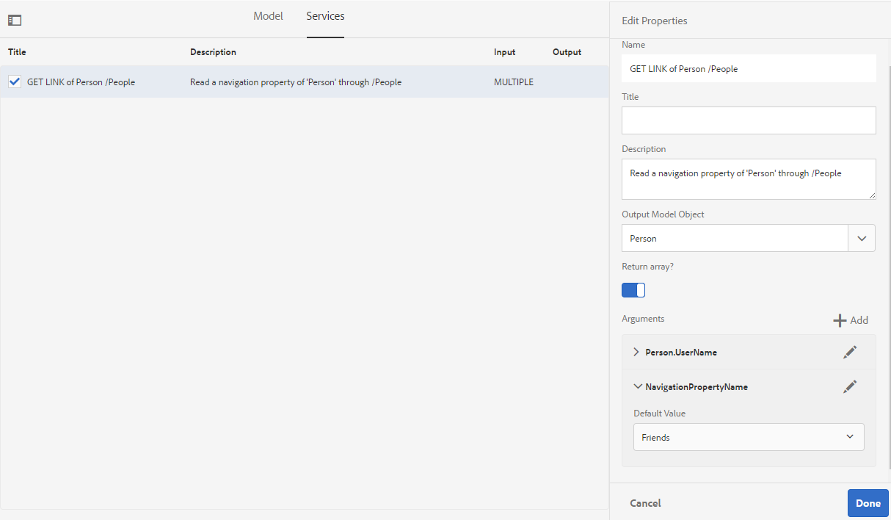

# Arbeta med FDM (Form Data Model) {#work-with-form-data-model}

| Version | Artikellänk |
| -------- | ---------------------------- |
| AEM 6.5 | [Klicka här](https://experienceleague.adobe.com/docs/experience-manager-65/forms/form-data-model/work-with-form-data-model.html?lang=sv-SE) |
| AEM as a Cloud Service | Den här artikeln |


Redigeraren för formulärdatamodell (FDM) har ett intuitivt användargränssnitt och verktyg för redigering och konfigurering av en formulärdatamodell (FDM). Med redigeraren kan du lägga till och konfigurera datamodellsobjekt, egenskaper och tjänster från associerade datakällor i formulärdatamodellen (FDM). Dessutom kan du skapa datamodellsobjekt och -egenskaper utan datakällor och binda dem till respektive datamodellsobjekt och egenskaper senare. Du kan också generera och redigera exempeldata för datamodellsobjektsegenskaper som du kan använda för att förifylla adaptiva Forms <!--and interactive communications--> vid förhandsgranskning. Du kan testa datamodellsobjekt och tjänster som konfigurerats i en formulärdatamodell (FDM) för att se till att den är korrekt integrerad med datakällor.

Om du inte har använt Forms dataintegrering tidigare och inte har konfigurerat någon datakälla eller skapat en formulärdatamodell (FDM), se följande avsnitt:

* [[!DNL Experience Manager Forms] dataintegrering](data-integration.md)
* [Konfigurera datakällor](configure-data-sources.md)
* [Skapa formulärdatamodell (FDM)](create-form-data-models.md)

Läs vidare om du vill ha mer information om olika åtgärder och konfigurationer som du kan utföra med formulärdatamodellredigeraren.

>[!NOTE]
>
>Du måste vara medlem i båda grupperna **fdm-author** och **forms-user** för att kunna skapa och arbeta med formulärdatamodell (FDM). Kontakta [!DNL Experience Manager]-administratören om du vill bli medlem i grupperna.

## Lägga till datamodellsobjekt och -tjänster {#add-data-model-objects-and-services}

Om du har skapat en formulärdatamodell (FDM) med datakällor kan du använda redigeraren för formulärdatamodellen för att lägga till datamodellsobjekt och -tjänster, konfigurera deras egenskaper, skapa associationer mellan datamodellsobjekt och testa formulärdatamodellen (FDM) och -tjänsterna.

Du kan lägga till datamodellsobjekt och -tjänster från tillgängliga datakällor i formulärdatamodellen (FDM). När nya datamodellsobjekt visas på fliken Modell visas tillagda tjänster på fliken Tjänster.

Så här lägger du till datamodellsobjekt och -tjänster:

1. Logga in på [!DNL Experience Manager]-författarinstansen, navigera till **[!UICONTROL Forms > Data Integrations]** och öppna den formulärdatamodell där du vill lägga till datamodellsobjekt.
1. Expandera datakällor i rutan Datakällor för att visa tillgängliga datamodellsobjekt och tjänster.
1. Markera datamodellsobjekt och -tjänster som du vill lägga till i formulärdatamodellen (FDM) och välj **[!UICONTROL Add Selected]**.

   

   Markerade datamodellsobjekt och datatjänster

   Fliken **[!UICONTROL Model]** visar en grafisk representation av alla datamodellsobjekt och deras egenskaper som har lagts till i formulärdatamodellen (FDM). Varje datamodellobjekt representeras av en ruta i formulärdatamodellen (FDM).

   

   Fliken **[!UICONTROL Model]** visar nya datamodellsobjekt

   >[!NOTE]
   >
   >Du kan hålla kvar och dra runt datamodellsobjektrutor för att ordna dem i innehållsområdet. Alla datamodellsobjekt som läggs till i formulärdatamodellen (FDM) är nedtonade i rutan Datakällor.

   Fliken **[!UICONTROL Services]** visar tillagda tjänster.

   

   Fliken **[!UICONTROL Services]** visar datamodelltjänster

   >[!NOTE]
   >
   >Förutom datamodellsobjekt och -tjänster innehåller OData-tjänstens metadatadokument navigeringsegenskaper som definierar associationen mellan två datamodellsobjekt. Mer information finns i [Arbeta med navigeringsegenskaper för OData-tjänster](#work-with-navigation-properties-of-odata-services).

1. Välj **[!UICONTROL Save]** om du vill spara formulärmodellobjektet.

   >[!NOTE]
   >
   >Du kan anropa tjänster som du har konfigurerat på fliken Tjänster i en formulärdatamodell (FDM) med hjälp av reglerna för adaptiva formulär. De konfigurerade tjänsterna är tillgängliga i åtgärden Anropa tjänster i regelredigeraren Mer information om hur du använder dessa tjänster i regler för adaptiva formulär finns i Anropa tjänster och Ange värdet för regler i [regelredigeraren](rule-editor.md).

## Skapa datamodellsobjekt och underordnade egenskaper {#create-data-model-objects-and-child-properties}

### Skapa datamodellsobjekt {#create-data-model-objects}

Du kan lägga till datamodellsobjekt från konfigurerade datakällor, men du kan även skapa datamodellsobjekt eller -enheter utan datakällor. Det är särskilt användbart om du inte har konfigurerat datakällor i formulärdatamodellen (FDM).

Så här skapar du ett datamodellsobjekt utan datakällor:

1. Logga in på [!DNL Experience Manager]-författarinstansen, navigera till **[!UICONTROL Forms > Data Integrations]** och öppna den formulärdatamodell (FDM) i vilken du vill skapa ett datamodellsobjekt eller en datamodell.
1. Välj **[!UICONTROL Create Entity]**.
1. I dialogrutan [!UICONTROL Create data Model] anger du ett namn för datamodellobjektet och väljer **[!UICONTROL Add]**. Ett datamodellsobjekt läggs till i formulärdatamodellen (FDM). Det nya datamodellsobjektet är inte bundet till en datakälla och har inga egenskaper som visas i följande bild.

   

Därefter kan du lägga till underordnade egenskaper i obundna datamodellsobjekt.

### Lägg till underordnade egenskaper {#child-properties}

Med formulärdatamodellsredigeraren kan du skapa underordnade egenskaper i ett datamodellsobjekt. Egenskapen när den skapas är inte bunden till någon egenskap i en datakälla. Du kan senare binda den underordnade egenskapen med en annan egenskap i det innehållande datamodellobjektet.

Så här skapar du en underordnad egenskap:

1. Markera ett datamodellsobjekt i en formulärdatamodell och välj **[!UICONTROL Create Child Property]**.
1. I dialogrutan **[!UICONTROL Create Child Property]** anger du ett namn och en datatyp för egenskapen i fälten **[!UICONTROL Name]** respektive **[!UICONTROL Type]**. Du kan också ange en titel och en beskrivning för egenskapen.
1. Aktivera beräknad om egenskapen är en beräknad egenskap. Värdet för en beräknad egenskap utvärderas baserat på en regel eller ett uttryck. Mer information finns i [Redigera egenskaper](#properties).
1. Om datamodellobjektet är bundet till en datakälla, binds den tillagda underordnade egenskapen automatiskt till egenskapen för det överordnade datamodellobjektet med samma namn och datatyp.

   Om du vill binda en underordnad egenskap manuellt med en datamodellsobjektegenskap väljer du bläddringsikonen bredvid fältet **[!UICONTROL Bind Reference]**. I dialogrutan **[!UICONTROL Select Object]** visas alla egenskaper från det överordnade datamodellobjektet. Välj en egenskap som du vill binda med och markera kryssruteikonen. Du kan bara välja en egenskap av samma datatyp som den underordnade egenskapen.

1. Välj **[!UICONTROL Done]** för att spara den underordnade egenskapen och välj **[!UICONTROL Save]** för att spara formulärdatamodellen (FDM). Egenskapen child läggs nu till i datamodellsobjektet.

När du har skapat datamodellsobjekt och -egenskaper kan du fortsätta att skapa Adaptiv Forms <!--and interactive communications--> baserat på formulärdatamodellen (FDM). När du har datakällor tillgängliga och konfigurerade kan du senare binda formulärdatamodellen (FDM) till datakällor. Bindningen uppdateras automatiskt i associerad adaptiv Forms <!--and interactive communications-->. Mer information om hur du skapar adaptiv Forms <!--and interactive communications--> med hjälp av formulärdatamodell (FDM) finns i [Använd formulärdatamodell](using-form-data-model.md).

### Binda datamodellsobjekt och egenskaper {#bind-data-model-objects-and-properties}

När datakällorna som du vill integrera med formulärdatamodellen (FDM) är tillgängliga kan du lägga till dem i formulärdatamodellen (FDM) enligt beskrivningen i [Uppdatera datakällor](create-form-data-models.md#update). Gör sedan följande för att binda obundna datamodellsobjekt och egenskaper:

1. Välj den obundna datakälla som du vill binda till en datakälla i formulärdatamodellen.
1. Välj **[!UICONTROL Edit Properties]**.
1. I rutan **[!UICONTROL Edit Properties]** väljer du bläddringsikonen bredvid fältet **[!UICONTROL Binding]**. Den öppnar dialogrutan **[!UICONTROL Select Object]** med en lista över datakällor som lagts till i formulärdatamodellen (FDM).

   

1. Expandera trädet för datakällor och markera ett datamodellsobjekt som du vill binda med, och markera kryssruteikonen.
1. Välj **[!UICONTROL Done]** för att spara egenskaperna och välj sedan **[!UICONTROL Save]** för att spara formulärdatamodellen. Datamodellobjektet är nu bundet till en datakälla. Observera att datamodellobjektet inte längre är markerat som Obundet.

   

## Konfigurera tjänster {#configure-services}

Så här konfigurerar du läs- och skrivtjänster för att läsa och skriva data för ett datamodellsobjekt:

1. Markera kryssrutan högst upp i ett datamodellsobjekt för att markera det och välj **[!UICONTROL Edit Properties]**.

   

   Redigera egenskaper för att konfigurera läs- och skrivtjänster för ett datamodellsobjekt

   Dialogrutan [!UICONTROL Edit Properties] öppnas.

   

   Dialogrutan Redigera egenskaper

   >[!NOTE]
   >
   >Förutom datamodellsobjekt och -tjänster innehåller OData-tjänstens metadatadokument navigeringsegenskaper som definierar associationen mellan två datamodellsobjekt. När du lägger till en OData-tjänstdatakälla i en formulärdatamodell (FDM) finns det en tjänst tillgänglig i formulärdatamodellen (FDM) för alla navigeringsegenskaper i ett datamodellsobjekt. Du kan använda den här tjänsten för att läsa navigeringsegenskaperna för motsvarande datamodellsobjekt.
   >
   >
   >Mer information om hur du använder tjänsten finns i [Arbeta med navigeringsegenskaper för OData-tjänster](#work-with-navigation-properties-of-odata-services).

1. Växla **[!UICONTROL Top Level Object]** för att ange om datamodellobjektet är ett modellobjekt på den översta nivån.

   Datamodellsobjekt som konfigurerats i en formulärdatamodell (FDM) är tillgängliga för användning på fliken Datamodellsobjekt i innehållsläsaren för ett anpassat formulär baserat på formulärdatamodellen (FDM). När du lägger till en association mellan två datamodellsobjekt kapslas datamodellsobjektet som du associerar med under datamodellsobjektet på fliken **[!UICONTROL Data Model Objects]**. Om den kapslade datamodellen är ett objekt på den översta nivån visas den också separat på fliken **[!UICONTROL Data Model Objects]**. Därför ser du två poster i den, en inuti och en utanför den kapslade hierarkin, vilket kan förvirra formulärförfattarna. Om du vill att det associerade datamodellsobjektet bara ska visas i den kapslade hierarkin inaktiverar du egenskapen Objekt på översta nivån.

1. Välj Läs- och skrivtjänster för de markerade datamodellsobjekten. Argumenten för tjänsterna visas.

   

   Läs- och skrivtjänster har konfigurerats för personaldatakälla

1. Välj  som lästjänstargument om du vill [binda argumentet till ett användarprofilattribut, begärandeattribut eller litteralvärde](#bindargument) och ange bindningsvärdet.
1. Välj **[!UICONTROL Done]** om du vill spara argumentet, **[!UICONTROL Done]** om du vill spara egenskaperna och sedan **[!UICONTROL Save]** om du vill spara formulärdatamodellen (FDM).

### Bind Läs tjänsteargument {#bindargument}

Bind lästjänstargumentet till ett användarprofilattribut, begärandeattribut eller litteralvärde baserat på ett bindningsvärde. Värdet skickas till tjänsten som ett argument för att hämta information som är associerad med det angivna värdet från datakällan.

#### Litteralt värde {#literal-value}

Välj **[!UICONTROL Literal]** i listrutan **[!UICONTROL Binding To]** och ange ett värde i fältet **[!UICONTROL Binding Value]**. Information som är associerad med värdet hämtas från datakällan. Använd det här alternativet om du vill hämta information som är kopplad till ett statiskt värde.

I det här exemplet hämtas informationen som är associerad med **436765678** som värde för argumentet `mobilenum` från datakällan. Den associerade informationen om du skickar värdet för ett mobilnummerargument kan innehålla egenskaper som kundnamn, kundadress och ort.


#### Attribut för användarprofil {#user-profile-attribute}

Välj **[!UICONTROL User Profile Attribute]** i listrutan **[!UICONTROL Binding To]** och ange attributnamnet i fältet **[!UICONTROL Binding Value]**. Information om användaren som är inloggad på instansen [!DNL Experience Manager] hämtas från datakällan baserat på attributnamnet.

Attributnamnet som anges i fältet **[!UICONTROL Binding Value]** måste innehålla den fullständiga bindningssökvägen till användarens attributnamn. Öppna följande URL för att komma åt användarinformationen på CRXDE:

`https://[server-name]:[port]/crx/de/index.jsp#/home/users/`


I det här exemplet anger du `profile.empid` i fältet **[!UICONTROL Binding Value]** för användaren `grios`.


Argumentet `id` tar värdet för attributet `empid` för användarprofilen och skickar det som ett argument till lästjänsten. Den läser och returnerar värden för associerade egenskaper från medarbetardatamodellobjektet för `empid` som är associerad med den inloggade användaren.

#### Begär attribut {#request-attribute}

Använd attributet request för att hämta associerade egenskaper från datakällan.

1. Välj **[!UICONTROL Request Attribute]** i listrutan **[!UICONTROL Binding To]** och ange attributnamnet i fältet **[!UICONTROL Binding Value]**.

1. Skapa en [övertäckning](https://experienceleague.adobe.com/docs/experience-manager-cloud-service/implementing/developing/full-stack/overlays.html?lang=sv-SE#developing) för head.jsp. Om du vill skapa övertäckningen öppnar du CRX DE och kopierar filen `https://<server-name>:<port number>/crx/de/index.jsp#/libs/fd/af/components/page2/afStaticTemplatePage/head.jsp` till `https://<server-name>:<port number>/crx/de/index.jsp#/apps/fd/af/components/page2/afStaticTemplatePage/head.jsp`

   >[!NOTE]
   >
   > * Om du använder en statisk mall ska du täcka över head.jsp på:
   >   `/libs/fd/af/components/page2/afStaticTemplatePage/head.jsp`
   > * Om du använder en redigerbar mall ska du täcka över den eftermalledpage.jsp som:
   >   `/libs/fd/af/components/page2/aftemplatedpage/aftemplatedpage.jsp`

1. Ange [!DNL paramMap] för attributet request. Ta till exempel med följande kod i .jsp-filen i mappen apps:

   ```javascript
   <%Map paraMap = new HashMap();
    paraMap.put("<request_attribute>",request.getParameter("<request_attribute>"));
    request.setAttribute("paramMap",paraMap);
   ```

   Använd till exempel följande kod för att hämta värdet för petid från datakällan:


   ```javascript
   <%Map paraMap = new HashMap();
   paraMap.put("petId",request.getParameter("petId"));
   request.setAttribute("paramMap",paraMap);%>
   ```

Informationen hämtas från datakällan baserat på attributnamnet som anges i begäran.

Om du till exempel anger attributet som `petid=100` i begäran hämtas egenskaper som är kopplade till attributvärdet från datakällan.

## Lägg till associationer {#add-associations}

Vanligtvis finns det kopplingar mellan datamodellsobjekt i en datakälla. Associationen kan vara en-till-en eller en-till-många. Det kan till exempel finnas flera beroenden som är kopplade till en medarbetare. Den kallas en-till-många-association och avbildas av `1:n` på linjen som ansluter associerade datamodellsobjekt. Om en association returnerar ett unikt medarbetarnamn för ett givet medarbetar-ID kallas den en-till-en-association.

När du lägger till associerade datamodellobjekt i en datakälla i en formulärdatamodell (FDM) behålls deras associationer och visas som kopplade med pilrader. Du kan lägga till associationer mellan datamodellsobjekt över olika datakällor i en formulärdatamodell (FDM).

>[!NOTE]
>
>Fördefinierade associationer i en JDBC-datakälla sparas inte i formulärdatamodellen (FDM). Du måste skapa dem manuellt.

Så här lägger du till en association:

1. Markera kryssrutan högst upp i ett datamodellsobjekt för att markera det och välj **[!UICONTROL Add Association]**. Dialogrutan Lägg till association öppnas.

   

   >[!NOTE]
   >
   >Förutom datamodellsobjekt och -tjänster innehåller OData-tjänstens metadatadokument navigeringsegenskaper som definierar associationen mellan två datamodellsobjekt. Du kan använda de här navigeringsegenskaperna när du lägger till associationer i formulärdatamodellen (FDM). Mer information finns i [Arbeta med navigeringsegenskaper för OData-tjänster](#work-with-navigation-properties-of-odata-services).

   Dialogrutan [!UICONTROL Add Association] öppnas.

   

   Dialogrutan Lägg till association

1. I rutan Lägg till association:

   * Ange en titel för associationen.
   * Välj associationstypen: **[!UICONTROL One to One]** eller **[!UICONTROL One to Many]**.
   * Markera datamodellsobjektet som du vill associera med.
   * Markera lästjänsten för att läsa data från det markerade modellobjektet. Lästjänstargumentet visas. Redigera om du vill ändra argumentet, om det behövs, och binda det till egenskapen för datamodellobjektet som ska associeras.

   I följande exempel är standardargumentet för läsningstjänsten för datamodellobjektet Dependents `dependentid`.

   

   Standardargumentet för tjänsten för läsning av beroenden är beroendestyrt

   Argumentet måste dock vara en vanlig egenskap mellan det associerade datamodellobjektet, som i det här exemplet är `Employeeid`. Argumentet `Employeeid` måste därför bindas till egenskapen `id` för datamodellobjektet Employee för att hämta associerade beroendedetaljer från datamodellobjektet Dependents.

   

   Uppdaterat argument och bindning

   Välj **[!UICONTROL Done]** om du vill spara argumentet.

1. Välj **[!UICONTROL Done]** för att spara associationen och sedan **[!UICONTROL Save]** för att spara formulärdatamodellen (FDM).
1. Upprepa stegen för att skapa fler associationer efter behov.

>[!NOTE]
>
>Den tillagda kopplingen visas i datamodellens objektruta med den angivna titeln och en linje som förbinder de associerade datamodellsobjekten.
>
>Du kan redigera en association genom att markera kryssrutan mot den och välja **[!UICONTROL Edit Association]**.


## Redigera egenskaper {#properties}

Du kan redigera egenskaper för datamodellsobjekt, deras egenskaper och tjänster som lagts till i formulärdatamodellen (FDM).

Så här redigerar du egenskaper:

1. Markera kryssrutan bredvid ett datamodellsobjekt, en egenskap eller en tjänst i formulärdatamodellen (FDM).
1. Välj **[!UICONTROL Edit Properties]**. **[!UICONTROL Edit Properties]**-rutan för det valda modellobjektet, egenskapen eller tjänsten öppnas.

   * **[!UICONTROL Data model object]**: Ange läs- och skrivtjänster och redigeringsargument.
   * **[!UICONTROL Property]**: Ange typ, undertyp och format för egenskapen. Du kan också ange om den valda egenskapen är primärnyckeln för datamodellobjektet.
   * **[!UICONTROL Service]**: Ange tjänstens indatamodell, utdatatyp och argument. För en Get-tjänst kan du ange om den förväntas returnera en array.

     

   Dialogrutan Redigera egenskaper för en get-tjänst

1. Välj **[!UICONTROL Done]** om du vill spara egenskaper och sedan **[!UICONTROL Save]** om du vill spara formulärdatamodellen (FDM).

### Skapa beräknade egenskaper {#computed}

En beräknad egenskap är den vars värde beräknas baserat på en regel eller ett uttryck. Med hjälp av en regel kan du ange värdet för en beräknad egenskap till en litteral sträng, ett tal, resultatet av ett matematiskt uttryck eller värdet för en annan egenskap i formulärdatamodellen (FDM).

Du kan till exempel skapa en beräknad egenskap, **FullName**, vars värde är ett resultat av sammanfogning av de befintliga egenskaperna **FirstName** och **LastName**. Så här gör du:

1. Skapa en ny egenskap med namnet `FullName` vars datatyp är String.
1. Aktivera **[!UICONTROL Computed]** och välj **[!UICONTROL Done]** för att skapa egenskapen.

   

   Den beräknade egenskapen FullName skapas. Lägg märke till ikonen bredvid egenskapen för att avbilda en beräknad egenskap.

   

1. Markera egenskapen FullName och välj **[!UICONTROL Edit Rule]**. Ett regelredigeringsfönster öppnas.
1. Välj **[!UICONTROL Create]** i regelredigeringsfönstret. Ett **[!UICONTROL Set Value]**-regelfönster öppnas.

   Välj **[!UICONTROL Mathematical Expression]** i listrutan Välj alternativ. Andra tillgängliga alternativ är **[!UICONTROL Form Data Model Object]** och **[!UICONTROL String]**.

1. I det matematiska uttrycket väljer du **[!UICONTROL FirstName]** och **[!UICONTROL LastName]** i första respektive andra objektet. Välj **[!UICONTROL plus]** som operator.

   Välj **[!UICONTROL Done]** och välj sedan **[!UICONTROL Close]** för att stänga regelredigeringsfönstret. Regeln ser ut ungefär så här.

   

1. Välj **[!UICONTROL Save]** i formulärdatamodellen (FDM). Den beräknade egenskapen är konfigurerad.

## Arbeta med navigeringsegenskaper för OData-tjänster {#work-with-navigation-properties-of-odata-services}

I OData-tjänster används navigeringsegenskaper för att definiera associationer mellan två datamodellsobjekt. Dessa egenskaper definieras för en entitetstyp eller en komplex typ. I följande utdrag från metadatafilen för exempeltjänsterna [TripPin](https://www.odata.org/blog/trippin-new-odata-v4-sample-service/) OData innehåller personentiteten tre navigeringsegenskaper - Vänner, Bästa vän och Resor.

Mer information om navigeringsegenskaper finns i [OData-dokumentation](https://docs.oasis-open.org/odata/odata/v4.0/errata03/os/complete/part3-csdl/odata-v4.0-errata03-os-part3-csdl-complete.html#_Toc453752536).

```xml
<edmx:Edmx xmlns:edmx="https://docs.oasis-open.org/odata/ns/edmx" Version="4.0">
<script/>
<edmx:DataServices>
<Schema xmlns="https://docs.oasis-open.org/odata/ns/edm" Namespace="Microsoft.OData.Service.Sample.TrippinInMemory.Models">
<EntityType Name="Person">
<Key>
<PropertyRef Name="UserName"/>
</Key>
<Property Name="UserName" Type="Edm.String" Nullable="false"/>
<Property Name="FirstName" Type="Edm.String" Nullable="false"/>
<Property Name="LastName" Type="Edm.String"/>
<Property Name="MiddleName" Type="Edm.String"/>
<Property Name="Gender" Type="Microsoft.OData.Service.Sample.TrippinInMemory.Models.PersonGender" Nullable="false"/>
<Property Name="Age" Type="Edm.Int64"/>
<Property Name="Emails" Type="Collection(Edm.String)"/>
<Property Name="AddressInfo" Type="Collection(Microsoft.OData.Service.Sample.TrippinInMemory.Models.Location)"/>
<Property Name="HomeAddress" Type="Microsoft.OData.Service.Sample.TrippinInMemory.Models.Location"/>
<Property Name="FavoriteFeature" Type="Microsoft.OData.Service.Sample.TrippinInMemory.Models.Feature" Nullable="false"/>
<Property Name="Features" Type="Collection(Microsoft.OData.Service.Sample.TrippinInMemory.Models.Feature)" Nullable="false"/>
<NavigationProperty Name="Friends" Type="Collection(Microsoft.OData.Service.Sample.TrippinInMemory.Models.Person)"/>
<NavigationProperty Name="BestFriend" Type="Microsoft.OData.Service.Sample.TrippinInMemory.Models.Person"/>
<NavigationProperty Name="Trips" Type="Collection(Microsoft.OData.Service.Sample.TrippinInMemory.Models.Trip)"/>
</EntityType>
```

När du konfigurerar en OData-tjänst i en formulärdatamodell (FDM) blir alla navigeringsegenskaper i en enhetsbehållare tillgängliga via en tjänst i FDM (Form Data Model). I det här exemplet på TripPin OData-tjänsten kan de tre navigeringsegenskaperna i entitetsbehållaren `Person` läsas med hjälp av en `GET LINK`-tjänst i formulärdatamodellen (FDM).

Nedan beskrivs tjänsten `GET LINK of Person /People` i formulärdatamodellen (FDM), som är en kombinerad tjänst för de tre navigeringsegenskaperna i entiteten `Person` i TripPin OData-tjänsten.


När du har lagt till tjänsten `GET LINK` på fliken Tjänster i FDM (Form Data Model) kan du redigera egenskaperna för att välja utdatamodellsobjektet och navigeringsegenskapen som ska användas i tjänsten. I följande `GET LINK of Person /People`-tjänst i följande exempel används Trip som utdatamodell och navigeringsegenskapen som Trips.


>[!NOTE]
>
>Vilka värden som är tillgängliga i fältet **[!UICONTROL Default Value]** i argumentet **NavigationPropertyName** beror på läget för växlingsknappen **[!UICONTROL Return array?]** . När den är aktiverad visas navigeringsegenskaper av samlingstyp.

I det här exemplet kan du även välja utdatamodellsobjektet som Person och navigeringsegenskapsargument som Friends eller BestFriend (beroende på om **[!UICONTROL Return array?]** är aktiverat eller inaktiverat).



På samma sätt kan du välja en `GET LINK`-tjänst och konfigurera dess navigeringsegenskaper när du lägger till associationer i formulärdatamodellen (FDM). Om du vill kunna välja en navigeringsegenskap måste du se till att **[!UICONTROL Binding To field]** är inställd på **[!UICONTROL Literal]**.


## Generera och redigera exempeldata {#sample}

Med formulärdatamodellens redigerare (FDM) kan du generera exempeldata för alla objektegenskaper för datamodell, inklusive beräknade egenskaper, i en formulärdatamodell (FDM). Det är en uppsättning slumpmässiga värden som överensstämmer med den datatyp som konfigurerats för varje egenskap. Du kan också redigera och spara data, som behålls även om du genererar om exempeldata.

Så här genererar och redigerar du exempeldata:

1. Öppna en formulärdatamodell (FDM) och välj **[!UICONTROL Edit Sample Data]**. Den genererar och visar exempeldata i fönstret Redigera exempeldata.

   

1. I fönstret **[!UICONTROL Edit Sample Data]** redigerar du data efter behov och väljer **[!UICONTROL Save]**.

<!--Next, you can use the sample data to prefill and test interactive communications based on the form data model. For more information, see [Use form data model](using-form-data-model.md).-->

## Testa datamodellsobjekt och -tjänster {#test-data-model-objects-and-services}

Din formulärdatamodell (FDM) är konfigurerad, men innan den används kanske du vill testa om de konfigurerade datamodellsobjekten och -tjänsterna fungerar som förväntat. Så här testar du datamodellsobjekt och -tjänster:

1. Markera ett datamodellsobjekt eller en tjänst i formulärdatamodellen (FDM) och välj **[!UICONTROL Test Model Object]** respektive **[!UICONTROL Test Service]**.

   Fönstret Testa formulärdatamodell öppnas.

   

1. I fönstret [!UICONTROL Test Form Data Model] väljer du datamodellsobjektet eller datatjänsten som ska testas från indatapanelen.

1. Ange ett argumentvärde i testkoden och välj **[!UICONTROL Test]**. Ett lyckat test returnerar utdata i utdatapanelen.

   

På samma sätt kan du testa andra datamodellsobjekt och -tjänster i formulärdatamodellen (FDM).

## Automatisk validering av indata {#automated-validation-of-input-data}

Formulärdatamodellen (FDM) validerar data som tas emot som indata när DermisBridge API anropas (baserat på de valideringskriterier som finns i formulärdatamodellen). Valideringen baseras på flagguppsättningen `ValidationOptions` i frågeobjektet som används för att anropa API:t.

Flaggan kan anges med något av följande värden:

* **FULL**: FDM utför valideringen baserat på alla begränsningar
* **AV**: Ingen validering
* **GRUNDLÄGGANDE**: FDM utför valideringen baserat på begränsningarna&quot;required&quot; och&quot;nullable&quot;

Om inget värde anges för `ValidationOptions`flaggan utförs **BASIC**-validering av indata.

Följande är ett exempel på hur du ställer in verifieringsflaggan på **FULL**:

```java
operationOptions.setValidationOptions(ValidationOptions.FULL);
```

>[!NOTE]
>
>Värdet som du anger för ett attribut i indata måste matcha datatypen som är definierad för attributet i metadatadokumentet.\
>Om värdet inte överensstämmer med den datatyp som definierats för attributet, visar API:t DermisBridge ett undantag oavsett värdet för flaggan `ValidationOptions`. Om loggnivån är inställd på Felsökning loggas ett fel i filen **error.log**.

Formulärdatamodellen (FDM) validerar indata baserat på en lista med datatypsbegränsningar. Listan med begränsningar för indata kan variera beroende på datakällan.

I följande tabell visas begränsningarna för indata baserat på datakällan:

<table>
 <tbody> 
  <tr> 
   <td>Begränsningar</td> 
   <td>Beskrivning</td> 
   <td>Indatakälla</td> 
  </tr> 
  <tr> 
   <td>obligatoriskt</td> 
   <td>Om true måste parametern inkluderas i indata.</td> 
   <td>Swagger, WSDL och databas</td> 
  </tr> 
  <tr> 
   <td>nullbar</td> 
   <td>Om true kan värdet för parametern anges till Null i indata.</td> 
   <td>WSDL, Odata och databas</td> 
  </tr> 
  <tr> 
   <td>maximum</td> 
   <td>Anger den övre gränsen för numeriska värden. Det högsta värdet som anges som den övre gränsen kan även tilldelas parametern i indata.</td> 
   <td>Swagger och WSDL</td> 
  </tr> 
  <tr> 
   <td>minimum</td> 
   <td>Anger den nedre gränsen för numeriska värden. Det minsta värdet som anges som den nedre gränsen kan även tilldelas parametern i indata.</td> 
   <td>Swagger och WSDL</td> 
  </tr> 
  <tr> 
   <td>exclusiveMaximum</td> 
   <td>Anger den övre gränsen för numeriska värden. Det högsta värdet som anges som den övre gränsen får inte tilldelas parametern i indata.</td> 
   <td>Swagger och WSDL</td> 
  </tr> 
  <tr> 
   <td>exclusiveMinimum</td> 
   <td>Anger den nedre gränsen för numeriska värden. Det minsta värdet som anges som den nedre gränsen får inte tilldelas parametern i indata.</td> 
   <td>Swagger och WSDL</td> 
  </tr> 
  <tr> 
   <td>minLength</td> 
   <td>Anger den nedre gränsen för antalet tecken som ingår i en sträng. Det minsta värdet som anges som den nedre gränsen kan även tilldelas parametern i indata.</td> 
   <td>Swagger och WSDL</td> 
  </tr> 
  <tr> 
   <td>maxLength</td> 
   <td>Anger den övre gränsen för antalet tecken som ingår i en sträng. Det högsta värdet som anges som den övre gränsen kan även tilldelas parametern i indata.</td> 
   <td>Swagger, WSDL, Odata och databas</td> 
  </tr> 
  <tr> 
   <td>mönster</td> 
   <td>Anger en fast teckensekvens. Indatasträngen valideras bara om tecknen överensstämmer med det angivna mönstret.</td> 
   <td>Swagger</td> 
  </tr> 
  <tr> 
   <td>minItems</td> 
   <td>Anger det minsta antalet objekt i en array. Det minsta värdet som anges som den nedre gränsen kan även tilldelas parametern i indata.</td> 
   <td>Swagger och WSDL</td> 
  </tr> 
  <tr> 
   <td>maxItems</td> 
   <td>Anger maximalt antal objekt i en array. Det högsta värdet som anges som den övre gränsen kan även tilldelas parametern i indata.</td> 
   <td>Swagger och WSDL</td> 
  </tr> 
  <tr> 
   <td>uniqueItems</td> 
   <td>Om true måste alla element i arrayen vara unika i indatadata.</td> 
   <td>Swagger</td> 
  </tr> 
  <tr> 
   <td>enum (sträng)<br /> <br /> </td> 
   <td>Begränsar värdet för en parameter i indata till en fast uppsättning strängvärden. Det måste vara en array med minst ett element, där varje element är unikt.</td> 
   <td>Swagger, WSDL och Odata</td> 
  </tr> 
  <tr> 
   <td>enum (number)<br /> <br /> </td> 
   <td>Begränsar värdet för en parameter i indata till en fast uppsättning numeriska värden. Det måste vara en array med minst ett element, där varje element är unikt.</td> 
   <td>WSDL</td> 
  </tr> 
 </tbody> 
</table>

I det här exemplet valideras indata baserat på maximala, minimala och obligatoriska begränsningar som definieras i Swagger-filen. Indata uppfyller bara valideringskriterierna om Order Id finns och dess värde är mellan 1 och 10.

```json
   parameters: [
   {
   name: "orderId",
   in: "path",
   description: "ID of pet that must be fetched",
   required: true,
   type: "integer",
   maximum: 10,
   minimum: 1,
   format: "int64"
   }
   ]
```

Ett undantag visas om indata inte uppfyller valideringskriterierna. Om loggnivån är inställd på **Felsök** loggas ett fel i filen **error.log** . Exempel:

```verilog
21.01.2019 17:26:37.411 *ERROR* com.adobe.aem.dermis.core.validation.JsonSchemaValidator {"errorCode":"AEM-FDM-001-044","errorMessage":"Input validations failed during operation execution.","violations":{"/orderId":["numeric instance is greater than the required maximum (maximum: 10, found: 16)"]}}
```

## Nästa steg {#next-steps}

Du har en fungerande formulärdatamodell (FDM) som nu är klar att användas i arbetsflödena för adaptiv Forms <!--and interactive communications-->. Mer information finns i [Använd formulärdatamodell (FDM)](using-form-data-model.md).
