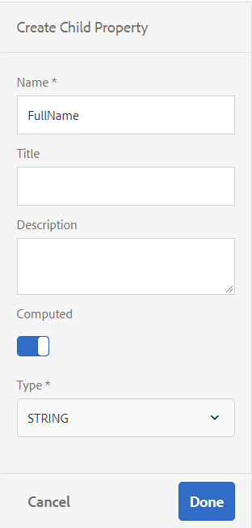

# Arbeta med formulärdatamodell {#work-with-form-data-model}

| Version | Artikellänk |
| -------- | ---------------------------- |
| AEM 6.5 | [Klicka här](https://experienceleague.adobe.com/docs/experience-manager-65/forms/form-data-model/work-with-form-data-model.html) |
| AEM as a Cloud Service | Den här artikeln |


Formulärdatamodellredigeraren har ett intuitivt användargränssnitt och verktyg för att redigera och konfigurera en formulärdatamodell. Med redigeraren kan du lägga till och konfigurera datamodellsobjekt, egenskaper och tjänster från associerade datakällor i formulärdatamodellen. Dessutom kan du skapa datamodellsobjekt och -egenskaper utan datakällor och binda dem till respektive datamodellsobjekt och egenskaper senare. Du kan också generera och redigera exempeldata för datamodellsobjektegenskaper som du kan använda för att fylla i adaptiv Forms <!--and interactive communications--> vid förhandsgranskning. Du kan testa datamodellsobjekt och tjänster som konfigurerats i en formulärdatamodell för att se till att den är korrekt integrerad med datakällor.

Om du inte har använt dataintegrering med Forms tidigare och inte har konfigurerat någon datakälla eller skapat en formulärdatamodell kan du läsa följande avsnitt:

* [[!DNL Experience Manager Forms] Dataintegrering](data-integration.md)
* [Konfigurera datakällor](configure-data-sources.md)
* [Skapa formulärdatamodell](create-form-data-models.md)

Läs vidare om du vill ha mer information om olika åtgärder och konfigurationer som du kan utföra med formulärdatamodellredigeraren.

>[!NOTE]
>
>Du måste vara medlem i båda **fdm-author** och **formuläranvändare** grupper för att kunna skapa och arbeta med formulärdatamodell. Kontakta [!DNL Experience Manager] administratör för att bli medlem i grupperna.

## Lägga till datamodellsobjekt och -tjänster {#add-data-model-objects-and-services}

Om du har skapat en formulärdatamodell med datakällor kan du använda redigeraren för formulärdatamodellen för att lägga till datamodellsobjekt och -tjänster, konfigurera deras egenskaper, skapa associationer mellan datamodellsobjekt och testa formulärdatamodellen och -tjänsterna.

Du kan lägga till datamodellsobjekt och datatjänster från tillgängliga datakällor i formulärdatamodellen. När nya datamodellsobjekt visas på fliken Modell visas tillagda tjänster på fliken Tjänster.

Så här lägger du till datamodellsobjekt och -tjänster:

1. Logga in på [!DNL Experience Manager] författarinstans, navigera till **[!UICONTROL Forms > Data Integrations]** och öppna den formulärdatamodell i vilken du vill lägga till datamodellsobjekt.
1. Expandera datakällor i rutan Datakällor för att visa tillgängliga datamodellsobjekt och tjänster.
1. Markera datamodellsobjekt och tjänster som du vill lägga till i formulärdatamodellen och välj **[!UICONTROL Add Selected]**.

   

   Markerade datamodellsobjekt och datatjänster

   The **[!UICONTROL Model]** I visas en grafisk representation av alla datamodellsobjekt och deras egenskaper som har lagts till i formulärdatamodellen. Varje datamodellobjekt representeras av en ruta i formulärdatamodellen.

   

   **[!UICONTROL Model]** flik visar tillagda datamodellsobjekt

   >[!NOTE]
   >
   >Du kan hålla kvar och dra runt datamodellsobjektrutor för att ordna dem i innehållsområdet. Alla datamodellsobjekt som läggs till i formulärdatamodellen är nedtonade i rutan Datakällor.

   The **[!UICONTROL Services]** -flikar visar tillagda tjänster.

   

   **[!UICONTROL Services]** flik visar datamodelltjänster

   >[!NOTE]
   >
   >Förutom datamodellsobjekt och -tjänster innehåller OData-tjänstens metadatadokument navigeringsegenskaper som definierar associationen mellan två datamodellsobjekt. Mer information finns i [Arbeta med navigeringsegenskaper för OData-tjänster](#work-with-navigation-properties-of-odata-services).

1. Välj **[!UICONTROL Save]** för att spara formulärmodellobjektet.

   >[!NOTE]
   >
   >Du kan anropa tjänster som du har konfigurerat på fliken Tjänster i en formulärdatamodell med hjälp av reglerna för adaptiva formulär. De konfigurerade tjänsterna är tillgängliga i åtgärden Anropa tjänster i regelredigeraren Mer information om hur du använder dessa tjänster i regler för adaptiva formulär finns i Anropa tjänster och Ange värdet för regler i [regelredigerare](rule-editor.md).

## Skapa datamodellsobjekt och underordnade egenskaper {#create-data-model-objects-and-child-properties}

### Skapa datamodellsobjekt {#create-data-model-objects}

Du kan lägga till datamodellsobjekt från konfigurerade datakällor, men du kan även skapa datamodellsobjekt eller -enheter utan datakällor. Det är särskilt användbart om du inte har konfigurerat datakällor i formulärdatamodellen.

Så här skapar du ett datamodellsobjekt utan datakällor:

1. Logga in på [!DNL Experience Manager] författarinstans, navigera till **[!UICONTROL Forms > Data Integrations]** och öppna den formulärdatamodell i vilken du vill skapa ett datamodellsobjekt eller en datamodell.
1. Välj **[!UICONTROL Create Entity]**.
1. I [!UICONTROL Create data Model] anger du ett namn för datamodellobjektet och väljer **[!UICONTROL Add]**. Ett datamodellsobjekt läggs till i formulärdatamodellen. Det nya datamodellsobjektet är inte bundet till en datakälla och har inga egenskaper som visas i följande bild.

   

Därefter kan du lägga till underordnade egenskaper i obundna datamodellsobjekt.

### Lägg till underordnade egenskaper {#child-properties}

Med formulärdatamodellsredigeraren kan du skapa underordnade egenskaper i ett datamodellsobjekt. Egenskapen när den skapas är inte bunden till någon egenskap i en datakälla. Du kan senare binda den underordnade egenskapen med en annan egenskap i det innehållande datamodellobjektet.

Så här skapar du en underordnad egenskap:

1. Markera ett datamodellsobjekt i en formulärdatamodell och välj **[!UICONTROL Create Child Property]**.
1. I **[!UICONTROL Create Child Property]** anger du ett namn och en datatyp för egenskapen i dialogrutan **[!UICONTROL Name]** och **[!UICONTROL Type]** fält. Du kan också ange en titel och en beskrivning för egenskapen.
1. Aktivera beräknad om egenskapen är en beräknad egenskap. Värdet för en beräknad egenskap utvärderas baserat på en regel eller ett uttryck. Mer information finns i [Redigera egenskaper](#properties).
1. Om datamodellobjektet är bundet till en datakälla, binds den tillagda underordnade egenskapen automatiskt till egenskapen för det överordnade datamodellobjektet med samma namn och datatyp.

   Om du vill binda en underordnad egenskap manuellt med en datamodellsobjektegenskap väljer du bläddringsikonen bredvid **[!UICONTROL Bind Reference]** fält. The **[!UICONTROL Select Object]** visas alla egenskaper från det överordnade datamodellobjektet. Välj en egenskap som du vill binda med och markera kryssruteikonen. Du kan bara välja en egenskap av samma datatyp som den underordnade egenskapen.

1. Välj **[!UICONTROL Done]** för att spara den underordnade egenskapen och markera **[!UICONTROL Save]** för att spara formulärdatamodellen.. Egenskapen child läggs nu till i datamodellsobjektet.

När du har skapat datamodellsobjekt och -egenskaper kan du fortsätta skapa Adaptiv Forms <!--and interactive communications--> baserat på formulärdatamodellen. När du har datakällor tillgängliga och konfigurerade kan du senare binda formulärdatamodellen till datakällor. Bindningen uppdateras automatiskt i tillhörande adaptiva Forms <!--and interactive communications-->. Mer information om hur du skapar Adaptive Forms <!--and interactive communications--> använda formulärdatamodell, se [Använd formulärdatamodell](using-form-data-model.md).

### Binda datamodellsobjekt och egenskaper {#bind-data-model-objects-and-properties}

När datakällorna som du vill integrera med formulärdatamodellen är tillgängliga kan du lägga till dem i formulärdatamodellen enligt beskrivningen i [Uppdatera datakällor](create-form-data-models.md#update). Gör sedan följande för att binda obundna datamodellsobjekt och egenskaper:

1. Välj den obundna datakälla som du vill binda till en datakälla i formulärdatamodellen.
1. Välj **[!UICONTROL Edit Properties]**.
1. I **[!UICONTROL Edit Properties]** markerar du bläddringsikonen bredvid **[!UICONTROL Binding]** fält. Den öppnar **[!UICONTROL Select Object]** som visar datakällor som lagts till i formulärdatamodellen.

   

1. Expandera trädet för datakällor och markera ett datamodellsobjekt som du vill binda med, och markera kryssruteikonen.
1. Välj **[!UICONTROL Done]** för att spara egenskaperna och sedan välja **[!UICONTROL Save]** för att spara formulärdatamodellen. Datamodellobjektet är nu bundet till en datakälla. Observera att datamodellobjektet inte längre är markerat som Obundet.

   

## Konfigurera tjänster {#configure-services}

Så här konfigurerar du läs- och skrivtjänster för att läsa och skriva data för ett datamodellsobjekt:

1. Markera kryssrutan högst upp i ett datamodellsobjekt för att markera det och markera det **[!UICONTROL Edit Properties]**.

   

   Redigera egenskaper för att konfigurera läs- och skrivtjänster för ett datamodellsobjekt

   The [!UICONTROL Edit Properties] öppnas.

   

   Dialogrutan Redigera egenskaper

   >[!NOTE]
   >
   >Förutom datamodellsobjekt och -tjänster innehåller OData-tjänstens metadatadokument navigeringsegenskaper som definierar associationen mellan två datamodellsobjekt. När du lägger till en OData-tjänstdatakälla i en formulärdatamodell finns det en tjänst tillgänglig i formulärdatamodellen för alla navigeringsegenskaper i ett datamodellsobjekt. Du kan använda den här tjänsten för att läsa navigeringsegenskaperna för motsvarande datamodellsobjekt.
   >
   >
   >Mer information om hur du använder tjänsten finns i [Arbeta med navigeringsegenskaper för OData-tjänster](#work-with-navigation-properties-of-odata-services).

1. Växla **[!UICONTROL Top Level Object]** för att ange om datamodellobjektet är ett modellobjekt på den översta nivån.

   Datamodellsobjekt som konfigurerats i en formulärdatamodell är tillgängliga för användning på fliken Datamodellsobjekt i innehållsläsaren för ett adaptivt formulär baserat på formulärdatamodellen. När du lägger till en association mellan två datamodellsobjekt kapslas datamodellobjektet som du associerar med under datamodellsobjektet som du associerar från i **[!UICONTROL Data Model Objects]** -fliken. Om den kapslade datamodellen är ett objekt på den översta nivån visas den också separat i **[!UICONTROL Data Model Objects]** -fliken. Därför ser du två poster i den, en inuti och en utanför den kapslade hierarkin, vilket kan förvirra formulärförfattarna. Om du vill att det associerade datamodellsobjektet bara ska visas i den kapslade hierarkin inaktiverar du egenskapen Objekt på översta nivån.

1. Välj Läs- och skrivtjänster för de markerade datamodellsobjekten. Argumenten för tjänsterna visas.

   

   Läs- och skrivtjänster har konfigurerats för personaldatakälla

1. Välj  för lästjänstargumentet till [binda argumentet till ett användarprofilattribut, begärandeattribut eller litteralvärde](#bindargument) och ange bindningsvärdet.
1. Välj **[!UICONTROL Done]** för att spara argumentet, **[!UICONTROL Done]** för att spara egenskaperna och sedan **[!UICONTROL Save]** för att spara formulärdatamodellen.

### Bind Läs tjänsteargument {#bindargument}

Bind lästjänstargumentet till ett användarprofilattribut, begärandeattribut eller litteralvärde baserat på ett bindningsvärde. Värdet skickas till tjänsten som ett argument för att hämta information som är associerad med det angivna värdet från datakällan.

#### Litteralt värde {#literal-value}

Välj **[!UICONTROL Literal]** från **[!UICONTROL Binding To]** och ange ett värde i listrutan **[!UICONTROL Binding Value]** fält. Information som är associerad med värdet hämtas från datakällan. Använd det här alternativet om du vill hämta information som är kopplad till ett statiskt värde.

I det här exemplet är informationen som är kopplad till **4367655678**, som värdet för `mobilenum` -argument hämtas från datakällan. Den associerade informationen om du skickar värdet för ett mobilnummerargument kan innehålla egenskaper som kundnamn, kundadress och ort.


#### Attribut för användarprofil {#user-profile-attribute}

Välj **[!UICONTROL User Profile Attribute]** från **[!UICONTROL Binding To]** nedrullningsbar meny och ange attributnamnet i **[!UICONTROL Binding Value]** fält. Information om användaren som är inloggad på [!DNL Experience Manager] -instansen hämtas från datakällan baserat på attributnamnet.

Attributnamnet som anges i **[!UICONTROL Binding Value]** fältet måste innehålla den fullständiga bindningssökvägen till användarens attributnamn. Öppna följande URL för att komma åt användarinformationen på CRXDE:

`https://[server-name]:[port]/crx/de/index.jsp#/home/users/`


I det här exemplet anger du `profile.empid` i **[!UICONTROL Binding Value]** fält för `grios` användare.


The `id` argumentet har värdet för `empid` användarprofilens attribut och skicka det som ett argument till tjänsten Read. Den läser och returnerar värden för associerade egenskaper från medarbetardatamodellobjektet för `empid` associeras med den inloggade användaren.

#### Begär attribut {#request-attribute}

Använd attributet request för att hämta associerade egenskaper från datakällan.

1. Välj **[!UICONTROL Request Attribute]** från **[!UICONTROL Binding To]** nedrullningsbar meny och ange attributnamnet i **[!UICONTROL Binding Value]** fält.

1. Skapa en [övertäckning](https://experienceleague.adobe.com/docs/experience-manager-cloud-service/implementing/developing/full-stack/overlays.html?lang=en#developing) for the head.jsp. Skapa övertäckningen genom att öppna CRX DE och kopiera `https://<server-name>:<port number>/crx/de/index.jsp#/libs/fd/af/components/page2/afStaticTemplatePage/head.jsp` fil till `https://<server-name>:<port number>/crx/de/index.jsp#/apps/fd/af/components/page2/afStaticTemplatePage/head.jsp`

   >[!NOTE]
   >
   > * Om du använder en statisk mall ska du täcka över head.jsp på:
   >   `/libs/fd/af/components/page2/afStaticTemplatePage/head.jsp`
   > * Om du använder en redigerbar mall ska du täcka över den eftermalledpage.jsp som:
   >   `/libs/fd/af/components/page2/aftemplatedpage/aftemplatedpage.jsp`

1. Ange [!DNL paramMap] för attributet request. Ta till exempel med följande kod i .jsp-filen i mappen apps:

   ```javascript
   <%Map paraMap = new HashMap();
    paraMap.put("<request_attribute>",request.getParameter("<request_attribute>"));
    request.setAttribute("paramMap",paraMap);
   ```

   Använd till exempel följande kod för att hämta värdet för petid från datakällan:


   ```javascript
   <%Map paraMap = new HashMap();
   paraMap.put("petId",request.getParameter("petId"));
   request.setAttribute("paramMap",paraMap);%>
   ```

Informationen hämtas från datakällan baserat på attributnamnet som anges i begäran.

Ange till exempel attribut som `petid=100` i begäran hämtar egenskaper som är associerade med attributvärdet från datakällan.

## Lägg till associationer {#add-associations}

Vanligtvis finns det kopplingar mellan datamodellsobjekt i en datakälla. Associationen kan vara en-till-en eller en-till-många. Det kan till exempel finnas flera beroenden som är kopplade till en medarbetare. Det kallas en-till-många-association och framställs av `1:n` på den linje som förbinder associerade datamodellsobjekt. Om en association returnerar ett unikt medarbetarnamn för ett givet medarbetar-ID kallas den en-till-en-association.

När du lägger till associerade datamodellobjekt i en datakälla i en formulärdatamodell behålls deras associationer och visas som kopplade med pilrader. Du kan lägga till associationer mellan datamodellsobjekt över olika datakällor i en formulärdatamodell.

>[!NOTE]
>
>Fördefinierade associationer i en JDBC-datakälla sparas inte i formulärdatamodellen. Du måste skapa dem manuellt.

Så här lägger du till en association:

1. Markera kryssrutan högst upp i ett datamodellsobjekt för att markera det och markera det **[!UICONTROL Add Association]**. Dialogrutan Lägg till association öppnas.

   

   >[!NOTE]
   >
   >Förutom datamodellsobjekt och -tjänster innehåller OData-tjänstens metadatadokument navigeringsegenskaper som definierar associationen mellan två datamodellsobjekt. Du kan använda de här navigeringsegenskaperna när du lägger till associationer i formulärdatamodellen. Mer information finns i [Arbeta med navigeringsegenskaper för OData-tjänster](#work-with-navigation-properties-of-odata-services).

   The [!UICONTROL Add Association] öppnas.

   

   Dialogrutan Lägg till association

1. I rutan Lägg till association:

   * Ange en titel för associationen.
   * Välj associationstyp — **[!UICONTROL One to One]** eller **[!UICONTROL One to Many]**.
   * Markera datamodellsobjektet som du vill associera med.
   * Markera lästjänsten för att läsa data från det markerade modellobjektet. Lästjänstargumentet visas. Redigera om du vill ändra argumentet, om det behövs, och binda det till egenskapen för datamodellobjektet som ska associeras.

   I följande exempel är standardargumentet för läsningstjänsten för datamodellobjektet Beroende `dependentid`.

   

   Standardargumentet för tjänsten för läsning av beroenden är beroendestyrt

   Argumentet måste dock vara en vanlig egenskap mellan det associerade datamodellobjektet, vilket i det här exemplet är `Employeeid`. Därför är `Employeeid` argument måste vara bundna till `id` egenskapen för Employee-datamodellobjektet för att hämta associerade beroendedetaljer från datamodellobjektet Dependents.

   

   Uppdaterat argument och bindning

   Välj **[!UICONTROL Done]** för att spara argumentet.

1. Välj **[!UICONTROL Done]** för att spara associationen och sedan **[!UICONTROL Save]** för att spara formulärdatamodellen.
1. Upprepa stegen för att skapa fler associationer efter behov.

>[!NOTE]
>
>Den tillagda kopplingen visas i datamodellens objektruta med den angivna titeln och en linje som förbinder de associerade datamodellsobjekten.
>
>Du kan redigera en association genom att markera kryssrutan för den och markera **[!UICONTROL Edit Association]**.


## Redigera egenskaper {#properties}

Du kan redigera egenskaper för datamodellsobjekt, deras egenskaper och tjänster som lagts till i formulärdatamodellen.

Så här redigerar du egenskaper:

1. Markera kryssrutan bredvid ett datamodellsobjekt, en egenskap eller en tjänst i formulärdatamodellen.
1. Välj **[!UICONTROL Edit Properties]**. The **[!UICONTROL Edit Properties]** för det valda modellobjektet, egenskapen eller tjänsten öppnas.

   * **[!UICONTROL Data model object]**: Ange läs- och skrivtjänster och redigeringsargument.
   * **[!UICONTROL Property]**: Ange typ, undertyp och format för egenskapen. Du kan också ange om den valda egenskapen är primärnyckeln för datamodellobjektet.
   * **[!UICONTROL Service]**: Ange tjänstens indatamodell, utdatatyp och argument. För en Get-tjänst kan du ange om den förväntas returnera en array.

     

   Dialogrutan Redigera egenskaper för en get-tjänst

1. Välj **[!UICONTROL Done]** för att spara egenskaper och sedan **[!UICONTROL Save]** för att spara formulärdatamodellen.

### Skapa beräknade egenskaper {#computed}

En beräknad egenskap är den vars värde beräknas baserat på en regel eller ett uttryck. Med hjälp av en regel kan du ange värdet för en beräknad egenskap till en litteral sträng, ett tal, resultatet av ett matematiskt uttryck eller värdet för en annan egenskap i formulärdatamodellen.

Du kan till exempel skapa en beräknad egenskap **FullName** vars värde är ett resultat av sammanfogning av den befintliga **FirstName** och **LastName** egenskaper. Så här gör du:

1. Skapa en ny egenskap med namnet `FullName` vars datatyp är String.
1. Aktivera **[!UICONTROL Computed]** och markera **[!UICONTROL Done]** för att skapa egenskapen.

   

   Den beräknade egenskapen FullName skapas. Lägg märke till ikonen bredvid egenskapen för att avbilda en beräknad egenskap.

   

1. Välj egenskapen FullName och välj **[!UICONTROL Edit Rule]**. Ett regelredigeringsfönster öppnas.
1. I regelredigeringsfönstret väljer du **[!UICONTROL Create]**. A **[!UICONTROL Set Value]** regelfönstret öppnas.

   Välj i listrutan Välj alternativ **[!UICONTROL Mathematical Expression]**. Andra tillgängliga alternativ är **[!UICONTROL Form Data Model Object]** och **[!UICONTROL String]**.

1. I det matematiska uttrycket väljer du **[!UICONTROL FirstName]** och **[!UICONTROL LastName]** i första och andra objektet. Välj **[!UICONTROL plus]** som -operatorn.

   Välj **[!UICONTROL Done]** och sedan **[!UICONTROL Close]** för att stänga regelredigeringsfönstret. Regeln ser ut ungefär så här.

   

1. Välj **[!UICONTROL Save]**. Den beräknade egenskapen är konfigurerad.

## Arbeta med navigeringsegenskaper för OData-tjänster {#work-with-navigation-properties-of-odata-services}

I OData-tjänster används navigeringsegenskaper för att definiera associationer mellan två datamodellsobjekt. Dessa egenskaper definieras för en entitetstyp eller en komplex typ. I följande utdrag från metadatafilen för exemplet [TripPin](https://www.odata.org/blog/trippin-new-odata-v4-sample-service/) Exempeltjänster för OData, personenheten innehåller tre navigeringsegenskaper - Vänner, BestFriend och Resor.

Mer information om navigeringsegenskaper finns i [OData-dokumentation](https://docs.oasis-open.org/odata/odata/v4.0/errata03/os/complete/part3-csdl/odata-v4.0-errata03-os-part3-csdl-complete.html#_Toc453752536).

```xml
<edmx:Edmx xmlns:edmx="https://docs.oasis-open.org/odata/ns/edmx" Version="4.0">
<script/>
<edmx:DataServices>
<Schema xmlns="https://docs.oasis-open.org/odata/ns/edm" Namespace="Microsoft.OData.Service.Sample.TrippinInMemory.Models">
<EntityType Name="Person">
<Key>
<PropertyRef Name="UserName"/>
</Key>
<Property Name="UserName" Type="Edm.String" Nullable="false"/>
<Property Name="FirstName" Type="Edm.String" Nullable="false"/>
<Property Name="LastName" Type="Edm.String"/>
<Property Name="MiddleName" Type="Edm.String"/>
<Property Name="Gender" Type="Microsoft.OData.Service.Sample.TrippinInMemory.Models.PersonGender" Nullable="false"/>
<Property Name="Age" Type="Edm.Int64"/>
<Property Name="Emails" Type="Collection(Edm.String)"/>
<Property Name="AddressInfo" Type="Collection(Microsoft.OData.Service.Sample.TrippinInMemory.Models.Location)"/>
<Property Name="HomeAddress" Type="Microsoft.OData.Service.Sample.TrippinInMemory.Models.Location"/>
<Property Name="FavoriteFeature" Type="Microsoft.OData.Service.Sample.TrippinInMemory.Models.Feature" Nullable="false"/>
<Property Name="Features" Type="Collection(Microsoft.OData.Service.Sample.TrippinInMemory.Models.Feature)" Nullable="false"/>
<NavigationProperty Name="Friends" Type="Collection(Microsoft.OData.Service.Sample.TrippinInMemory.Models.Person)"/>
<NavigationProperty Name="BestFriend" Type="Microsoft.OData.Service.Sample.TrippinInMemory.Models.Person"/>
<NavigationProperty Name="Trips" Type="Collection(Microsoft.OData.Service.Sample.TrippinInMemory.Models.Trip)"/>
</EntityType>
```

När du konfigurerar en OData-tjänst i en formulärdatamodell blir alla navigeringsegenskaper i en entitetsbehållare tillgängliga via en tjänst i formulärdatamodellen. I det här exemplet på tjänsten TripPin OData finns tre navigeringsegenskaper i `Person` enhetsbehållaren kan läsas med en `GET LINK` i formulärdatamodellen.

Följande visar `GET LINK of Person /People` i formulärdatamodellen, som är en kombinerad tjänst för de tre navigeringsegenskaperna i `Person` enhet för TripPin OData-tjänsten.


När du har lagt till `GET LINK` på fliken Tjänster i formulärdatamodellen kan du redigera egenskaperna för att välja utdatamodellsobjektet och navigeringsegenskapen som ska användas i tjänsten. Till exempel följande `GET LINK of Person /People` i följande exempel används Trip som utdatamodell och navigeringsegenskapen som Trips.


>[!NOTE]
>
>De värden som är tillgängliga i **[!UICONTROL Default Value]** fält för **NavigationPropertyName** -argumentet beror på läget för **[!UICONTROL Return array?]** växlingsknapp. När den är aktiverad visas navigeringsegenskaper av samlingstyp.

I det här exemplet kan du även välja utdatamodellsobjektet som Person och navigeringsegenskapsargument som Friends eller BestFriend (beroende på om **[!UICONTROL Return array?]** är aktiverat eller inaktiverat).


På samma sätt kan du välja en `GET LINK` och konfigurera navigeringsegenskaperna när du lägger till associationer i formulärdatamodellen. För att kunna välja en navigeringsegenskap måste du dock se till att **[!UICONTROL Binding To field]** är inställd på **[!UICONTROL Literal]**.


## Generera och redigera exempeldata {#sample}

Med formulärdatamodellsredigeraren kan du generera exempeldata för alla datamodellsobjektsegenskaper, inklusive beräknade egenskaper, i en formulärdatamodell. Det är en uppsättning slumpmässiga värden som överensstämmer med den datatyp som konfigurerats för varje egenskap. Du kan också redigera och spara data, som behålls även om du genererar om exempeldata.

Så här genererar och redigerar du exempeldata:

1. Öppna en formulärdatamodell och välj **[!UICONTROL Edit Sample Data]**. Den genererar och visar exempeldata i fönstret Redigera exempeldata.

   

1. I **[!UICONTROL Edit Sample Data]** fönster, redigera data efter behov och markera **[!UICONTROL Save]**.

<!--Next, you can use the sample data to prefill and test interactive communications based on the form data model. For more information, see [Use form data model](using-form-data-model.md).-->

## Testa datamodellsobjekt och -tjänster {#test-data-model-objects-and-services}

Din formulärdatamodell är konfigurerad, men innan den används kanske du vill testa om de konfigurerade datamodellsobjekten och -tjänsterna fungerar som förväntat. Så här testar du datamodellsobjekt och -tjänster:

1. Markera ett datamodellsobjekt eller en tjänst i formulärdatamodellen och välj **[!UICONTROL Test Model Object]** eller **[!UICONTROL Test Service]**, respektive

   Fönstret Testa formulärdatamodell öppnas.

   

1. I [!UICONTROL Test Form Data Model] markerar du datamodellobjektet eller datatjänsten som ska testas i indatapanelen.

1. Ange ett argumentvärde i testkoden och välj **[!UICONTROL Test]**. Ett lyckat test returnerar utdata i utdatapanelen.

   

På samma sätt kan du testa andra datamodellsobjekt och -tjänster i formulärdatamodellen.

## Automatisk validering av indata {#automated-validation-of-input-data}

Formulärdatamodellen validerar data som tas emot som indata när DermisBridge API anropas (baserat på de valideringskriterier som finns i formulärdatamodellen). Valideringen baseras på `ValidationOptions` flaggan som angetts i frågeobjektet som används för att anropa API:t.

Flaggan kan anges med något av följande värden:

* **HELT**: FDM utför valideringen baserat på alla begränsningar
* **AV**: Ingen validering
* **GRUNDLÄGGANDE**: FDM utför valideringen baserat på begränsningarna required och null

Om inget värde har angetts för `ValidationOptions`flagga, **GRUNDLÄGGANDE** validering utförs på indata.

Följande är ett exempel på hur du ställer in valideringsflaggan på **HELT**:

```java
operationOptions.setValidationOptions(ValidationOptions.FULL);
```

>[!NOTE]
>
>Värdet som du anger för ett attribut i indata måste matcha datatypen som är definierad för attributet i metadatadokumentet.\
>Om värdet inte överensstämmer med den datatyp som är definierad för attributet visar DermisBridge-API:t ett undantag oavsett värdet på `ValidationOptions` flagga. Om loggnivån är inställd på Felsökning loggas ett fel på **error.log** -fil.

Formulärdatamodellen validerar indata baserat på en lista över datatypsbegränsningar. Listan med begränsningar för indata kan variera beroende på datakällan.

I följande tabell visas begränsningarna för indata baserat på datakällan:

<table>
 <tbody> 
  <tr> 
   <td>Begränsningar</td> 
   <td>Beskrivning</td> 
   <td>Indatakälla</td> 
  </tr> 
  <tr> 
   <td>obligatoriskt</td> 
   <td>Om true måste parametern inkluderas i indata.</td> 
   <td>Swagger, WSDL och databas</td> 
  </tr> 
  <tr> 
   <td>nullbar</td> 
   <td>Om true kan värdet för parametern anges till Null i indata.</td> 
   <td>WSDL, Odata och databas</td> 
  </tr> 
  <tr> 
   <td>maximum</td> 
   <td>Anger den övre gränsen för numeriska värden. Det högsta värdet som anges som den övre gränsen kan även tilldelas parametern i indata.</td> 
   <td>Swagger och WSDL</td> 
  </tr> 
  <tr> 
   <td>minimum</td> 
   <td>Anger den nedre gränsen för numeriska värden. Det minsta värdet som anges som den nedre gränsen kan även tilldelas parametern i indata.</td> 
   <td>Swagger och WSDL</td> 
  </tr> 
  <tr> 
   <td>exclusiveMaximum</td> 
   <td>Anger den övre gränsen för numeriska värden. Det högsta värdet som anges som den övre gränsen får inte tilldelas parametern i indata.</td> 
   <td>Swagger och WSDL</td> 
  </tr> 
  <tr> 
   <td>exclusiveMinimum</td> 
   <td>Anger den nedre gränsen för numeriska värden. Det minsta värdet som anges som den nedre gränsen får inte tilldelas parametern i indata.</td> 
   <td>Swagger och WSDL</td> 
  </tr> 
  <tr> 
   <td>minLength</td> 
   <td>Anger den nedre gränsen för antalet tecken som ingår i en sträng. Det minsta värdet som anges som den nedre gränsen kan även tilldelas parametern i indata.</td> 
   <td>Swagger och WSDL</td> 
  </tr> 
  <tr> 
   <td>maxLength</td> 
   <td>Anger den övre gränsen för antalet tecken som ingår i en sträng. Det högsta värdet som anges som den övre gränsen kan även tilldelas parametern i indata.</td> 
   <td>Swagger, WSDL, Odata och databas</td> 
  </tr> 
  <tr> 
   <td>mönster</td> 
   <td>Anger en fast teckensekvens. Indatasträngen valideras bara om tecknen överensstämmer med det angivna mönstret.</td> 
   <td>Swagger</td> 
  </tr> 
  <tr> 
   <td>minItems</td> 
   <td>Anger det minsta antalet objekt i en array. Det minsta värdet som anges som den nedre gränsen kan även tilldelas parametern i indata.</td> 
   <td>Swagger och WSDL</td> 
  </tr> 
  <tr> 
   <td>maxItems</td> 
   <td>Anger maximalt antal objekt i en array. Det högsta värdet som anges som den övre gränsen kan även tilldelas parametern i indata.</td> 
   <td>Swagger och WSDL</td> 
  </tr> 
  <tr> 
   <td>uniqueItems</td> 
   <td>Om true måste alla element i arrayen vara unika i indatadata.</td> 
   <td>Swagger</td> 
  </tr> 
  <tr> 
   <td>enum (sträng)<br /> <br /> </td> 
   <td>Begränsar värdet för en parameter i indata till en fast uppsättning strängvärden. Det måste vara en array med minst ett element, där varje element är unikt.</td> 
   <td>Swagger, WSDL och Odata</td> 
  </tr> 
  <tr> 
   <td>enum (tal)<br /> <br /> </td> 
   <td>Begränsar värdet för en parameter i indata till en fast uppsättning numeriska värden. Det måste vara en array med minst ett element, där varje element är unikt.</td> 
   <td>WSDL</td> 
  </tr> 
 </tbody> 
</table>

I det här exemplet valideras indata baserat på maximala, minimala och obligatoriska begränsningar som definieras i Swagger-filen. Indata uppfyller bara valideringskriterierna om Order Id finns och dess värde är mellan 1 och 10.

```json
   parameters: [
   {
   name: "orderId",
   in: "path",
   description: "ID of pet that must be fetched",
   required: true,
   type: "integer",
   maximum: 10,
   minimum: 1,
   format: "int64"
   }
   ]
```

Ett undantag visas om indata inte uppfyller valideringskriterierna. Om loggnivån är inställd på **Felsök**, loggas ett fel på **error.log** -fil. Exempel:

```verilog
21.01.2019 17:26:37.411 *ERROR* com.adobe.aem.dermis.core.validation.JsonSchemaValidator {"errorCode":"AEM-FDM-001-044","errorMessage":"Input validations failed during operation execution.","violations":{"/orderId":["numeric instance is greater than the required maximum (maximum: 10, found: 16)"]}}
```

## Nästa steg {#next-steps}

Du har en fungerande formulärdatamodell som nu kan användas i Adaptiv Forms <!--and interactive communications--> arbetsflöden. Mer information finns i [Använd formulärdatamodell](using-form-data-model.md).
