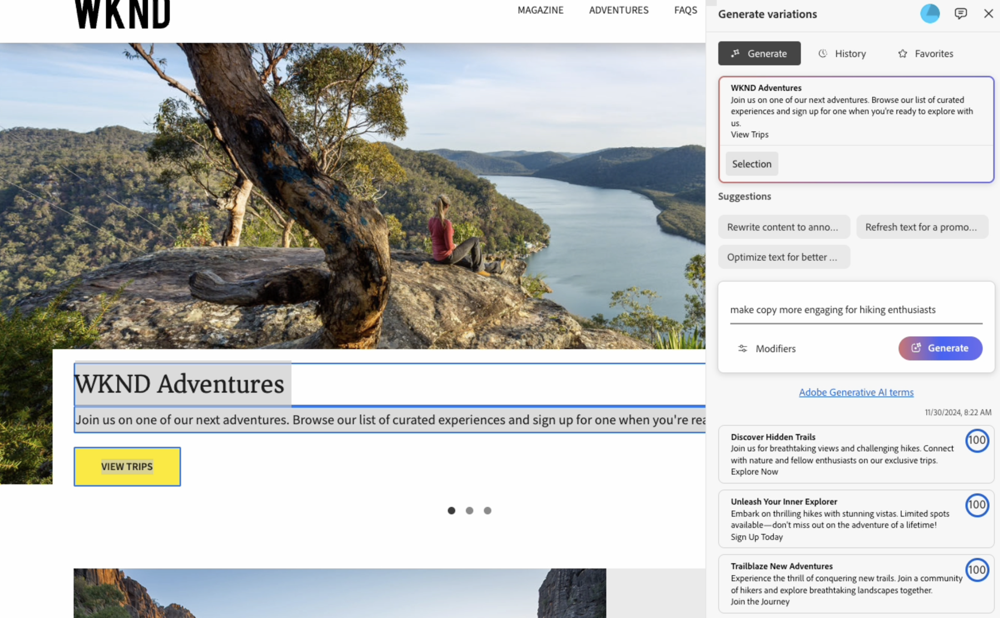

# Generera variationer - integrerat i AEM Editors {#generate-variations-integrated-in-aem-editors}

Om du vill ha ett sätt att optimera de digitala kanalerna och snabba upp innehållsskapandet kan du använda Generate Variations som är integrerat i AEM Editor.

Generate Variations använder generativ Artificial Intelligence (AI) för att skapa innehållsvariationer baserat på dina indata. När du har skapat varianter kan du använda innehållet på webbplatsen och även mäta hur de fungerar med funktionen [Experimentation](https://www.aem.live/docs/experimentation) i [Edge Delivery Services](/help/edge/overview.md).

Detta snabbar upp innehållets hastighet genom att snabbt skapa varumärkesinnehåll på några minuter. Detta hjälper i sin tur till att förbättra konverteringen med nya kopieringsvarianter.

Du kan [komma åt Generera variationer](#access-generate-variations) från följande redigerare ([när de har konfigurerats](#access-generate-variations)):

* [inom Sidekick för AEM Edge Delivery Services, för dokumentbaserad framtagning](#access-aem-sidekick)
* [i Universal Editor](#access-aem-universal-editor)
* [i Content Fragments Editor](#access-aem-content-fragment-editor)

>[!IMPORTANT]
>
>Den här sidan använder dokumentbaserad redigering som bas för exempel, men principerna gäller för de andra redigerarna.

>[!NOTE]
>
>För att kunna använda Generate Variations måste du se till att [åtkomstkraven](#access-prerequisites) uppfylls.

>[!NOTE]
>
>Vi rekommenderar att du använder den här versionen, eftersom den fristående versionen av [Generate Variations fortfarande kan användas direkt](/help/generative-ai/generate-variations.md), men kommer att bli inaktuell i framtiden.

Då kan du:

* [Markera det innehåll du vill arbeta med](#select-the-content) - från befintliga block i ditt innehåll
   * Det markerade blocket styr vad som visas och tillgängliga åtgärder
* [Beskriv de ändringar du vill göra](#describe-the-changes-you-want)
* [Generera varianter av ditt innehåll](#generate-copy) och [utför sedan ytterligare åtgärder om du vill](#take-further-action-on-a-variation)
* [Markera och använda en variation](#use-a-generated-variation)
* Granska din [historik](#history)
* Visa dina [favoriter](#favorites)

## Juridisk information och bruksanvisning {#legal-usage-note}

<!--
Generative AI and Generate Variations for AEM are powerful tools – but **you** are responsible for use of the output.

Your inputs to the service should be tied to a context. This context can be your branding materials, website content, data, schemas for such data, templates, or other trusted documents.

You must evaluate the accuracy of any output as appropriate to your use case.

Before using Generate Variations you are recommended to read the [Adobe Experience Cloud Generative AI User Guidelines](https://www.adobe.com/legal/licenses-terms/adobe-dx-gen-ai-user-guidelines.html).
-->

[Användning av Generera variationer](#generative-action-usage) är kopplad till användningen av generativa åtgärder.

>[!NOTE]
>
>Se [Säkerhetsfaktablad för information om hur du genererar variationer i AEM](https://www.adobe.com/content/dam/cc/en/trust-center/ungated/whitepapers/experience-cloud/aem-sites-generate-variations-security-fact-sheet.pdf).

## Ökning {#overview}

När du öppnar Generera variationer som är integrerade i en redigerare ser du tillägget som en flytande panel med tre flikar.



* Redigeraren:
   * Då visas innehållsflödet i redigeraren.
   * Här kan du välja ett innehållsblock som ska användas i **Generera variationer**.
* **Generera variationer**:
   * Är en flytande panel med tre flikar som du kan flytta efter behov
   * [Generera](#get-started-with-generate-variations):
      * Visar det [innehåll du har markerat](#select-the-content).
      * Visar **förslag** om ändringar.
      * Gör att du kan [beskriva de ändringar du vill](#describe-the-changes-you-want).
      * Gör att du kan [generera](#generate-copy) nya varianter.
      * Visar de genererade variationerna. <!--, together with their [brand score](#the-brand-score).-->
      * [Vidta fler åtgärder för en variation](#take-further-action-on-a-variation).
      * [Använd en genererad variant](#use-a-generated-variation).
   * [Historik](#history):
      * Visar din senaste generationshistorik.
   * [Favoriter](#favorites):
      * Visar resultat från tidigare generationer som du har flaggat som Favoriter.
   * **Adobe Generative AI terms**: Länkar till [Adobe Experience Cloud Generative AI User Guidelines](https://www.adobe.com/legal/licenses-terms/adobe-dx-gen-ai-user-guidelines.html).

## Kom igång med Generera variationer {#get-started-with-generate-variations}

Gränssnittet vägleder dig genom processen att generera innehåll. När gränssnittet har öppnats är det första steget att markera det innehållsblock som du vill använda.

### Markera innehållet {#select-the-content}

I redigerarens huvudinnehållsflöde markerar du det innehåll som du vill generera variationer för. Detta **urval** visas på fliken **Generera**.

### Beskriv de ändringar du vill göra {#describe-the-changes-you-want}

Om du vill generera variationer av innehållet måste du beskriva de ändringar du vill ha. Du kan antingen välja något av **förslagen** eller ange en egen beskrivning.

Du kan också ange **Modifierare** för att ge mer kontext:

* **Referera till en webbsida**
Ange en URL för mer kontext.
* **Överför innehållsöversikt**
Uppdatera en `.docx` -fil som innehåller information om innehållet (10 MB eller mindre).

### Generera kopia {#generate-copy}

När du har beskrivit de ändringar du vill ha väljer du **Generera** för att visa svar från generativ AI.


<!--
### The Brand Score {#the-brand-score}

The brand score shows you how on-brand the generated variation is.
-->

### Vidarebefordra en variation {#take-further-action-on-a-variation}

När du markerar en enskild variation kan du använda följande åtgärder:

* **Redigera**
   * Du kan redigera texten i den genererade variationen.

      * Dina uppdateringar kan förhandsgranskas på webbsidan.

   * Spara ändringarna för senare bruk.
* **Favorit**
   * Flagga den här varianten för framtida referens.
   * När den har flaggats visas den under fliken [Favoriter](#favorites).
* **AI Rationale**
   * För ytterligare genomskinlighet ger detta en kort beskrivning av varför generativ AI genererade den aktuella variationen.

### Använd en genererad variant {#use-a-generated-variation}

Om du vill använda innehåll som genererats med generativ AI måste du först välja och **exportera till CSV**.

När du har exporterat kan du använda innehållet någon annanstans, till exempel när du redigerar innehåll för webbplatsen. Du kan också köra ett [experiment](https://www.aem.live/docs/experimentation).

>[!NOTE]
>
>När Generate Variations (Generera variationer) används antingen i [AEM Universal Editor](#access-aem-universal-editor) eller [AEM Content Fragment Editor](#access-aem-content-fragment-editor) sparas det innehåll som har genererats automatiskt i AEM.

## Historik {#history}

På den här fliken visas din tidigare aktivitet när du har valt **Generera**. en **historikpost** har lagts till.

Om du senare markerar samma innehåll i huvudflödet och öppnar fliken **Historik** så visas alla genererade variationer för det blocket.

## Favoriter {#favorites}

När du har granskat innehållet kan du spara de valda varianterna som favoriter.

När de har sparats visas de under **Favoriter**. Favoriter bevaras (tills du **inte gillar** dem eller rensar webbläsarens cache).

* Du kan **redigera**, **inte använda favoriter** eller visa **AI Rationale** för en post.
* När du har valt en variant kan du även **Exportera till CSV**.

## Generativ åtgärdsanvändning {#generative-action-usage}

Användningshanteringen beror på vilken åtgärd som vidtas:

* Generera variationer

  En generation av en kopieringsvariant motsvarar en generativ åtgärd. Som kund har ni ett visst antal generativa åtgärder som följer med er AEM-licens. När basberättigandet har förbrukats kan du köpa ytterligare åtgärder.

  >[!NOTE]
  >
  >Se [Adobe Experience Manager: Cloud Service | Produktbeskrivning](https://helpx.adobe.com/legal/product-descriptions/aem-cloud-service.html) för mer information om basberättiganden och kontakta din kontogrupp om du vill köpa mer generativa åtgärder.

## Få åtkomst till Generera variationer {#access-generate-variations}

När du har uppfyllt kraven kan du få tillgång till Generera variationer från AEM as a Cloud Service eller Sidekick från Edge Delivery Services.

### Åtkomstkrav {#access-prerequisites}

Om du vill använda Generera variationer måste du se till att villkoren är uppfyllda:

* [Tillgång till Experience Manager as a Cloud Service med Edge Delivery Services](#access-to-aemaacs-with-edge-delivery-services)

#### Tillgång till Experience Manager as a Cloud Service med Edge Delivery Services{#access-to-aemaacs-with-edge-delivery-services}

Användare som behöver ha tillgång till Generate Variations måste ha rätt till en Experience Manager as a Cloud Service-miljö med Edge Delivery Services.

>[!NOTE]
>
>Om ditt avtal för AEM Sites as a Cloud Service inte innehåller Edge Delivery Services måste du teckna ett nytt kontrakt för att få åtkomst.
>
>Kontakta er kontogrupp för att diskutera hur ni kan gå över till AEM Sites as a Cloud Service med Edge Delivery Services.

Om du vill ge vissa användare åtkomst tilldelar du deras användarkonto till respektive produktprofil. Mer information finns i [Tilldela AEM produktprofiler](/help/journey-onboarding/assign-profiles-cloud-manager.md).

### Åtkomst från AEM Sidekick för dokumentbaserad redigering {#access-aem-sidekick}

Åtkomst från AEM Sidekick används för [dokumentbaserad redigering](/help/edge/wysiwyg-authoring/authoring.md).

En del konfiguration krävs innan du kan komma åt Generera variationer från Sidekick (i Edge Delivery Services).

>[!NOTE]
>
>Läs dokumentet [Installera AEM Sidekick](https://www.aem.live/docs/sidekick-extension) om du vill veta hur du installerar och konfigurerar Sidekick.

Om du vill använda Generera variationer i Sidekick (i Edge Delivery Services) inkluderar du följande konfigurationer i dina Edge Delivery Services-projekt.

1. Aktivera appen i:

   * `tools/sidekick/config.json`

   Detta måste sammanfogas med din befintliga konfiguration och sedan distribueras.

   Till exempel:

   ```prompt
   {
     "plugins": [
       {
         "id": "aem-genai-variations",
         "titleI18n": {
           "en": "Generate with AI"
         },
         "environments": [
           "preview"
         ],
         "includePaths": [
           "**.docx**"
         ],
         "event": "aem-genai-variations-sidekick"
       }
     ]
   }
   ```

1. Skapa:

   * `/tools/sidekick/aem-genai-variations.js`

   Du måste skapa den här filen med följande innehåll:

   ```prompt
   (function () {
     let isAEMGenAIVariationsAppLoaded = false;
     function loadAEMGenAIVariationsApp() {
       const script = document.createElement('script');
       script.src = 'https://experience.adobe.com/solutions/aem-sites-genai-aem-genai-variations-mfe/static-assets/resources/sidekick/client.js?source=plugin';
       script.onload = function () {
         isAEMGenAIVariationsAppLoaded = true;
       };
       script.onerror = function () {
         console.error('Error loading AEMGenAIVariationsApp.');
       };
       document.head.appendChild(script);
     }
   
     function handlePluginButtonClick() {
       if (!isAEMGenAIVariationsAppLoaded) {
         loadAEMGenAIVariationsApp();
       }
     }
   
     // The code snippet for the Sidekick V1 extension, https://chromewebstore.google.com/detail/aem-sidekick/ccfggkjabjahcjoljmgmklhpaccedipo?hl=en
     const sidekick = document.querySelector('helix-sidekick');
     if (sidekick) {
       // sidekick already loaded
       sidekick.addEventListener('custom:aem-genai-variations-sidekick', handlePluginButtonClick);
     } else {
       // wait for sidekick to be loaded
       document.addEventListener('sidekick-ready', () => {
         document.querySelector('helix-sidekick')
           .addEventListener('custom:aem-genai-variations-sidekick', handlePluginButtonClick);
       }, { once: true });
     }
   
     // The code snippet for the Sidekick V2 extension, https://chromewebstore.google.com/detail/aem-sidekick/igkmdomcgoebiipaifhmpfjhbjccggml?hl=en
     const sidekickV2 = document.querySelector('aem-sidekick');
     if (sidekickV2) {
       // sidekick already loaded
       sidekickV2.addEventListener('custom:aem-genai-variations-sidekick', handlePluginButtonClick);
     } else {
       // wait for sidekick to be loaded
       document.addEventListener('sidekick-ready', () => {
         document.querySelector('aem-sidekick')
           .addEventListener('custom:aem-genai-variations-sidekick', handlePluginButtonClick);
       }, { once: true });
     }
   }());
   ```

1. Uppdatering:

   * `/scripts/scripts.js`

   Detta måste uppdateras för att inkludera följande programsats i funktionen `loadLazy()`:

   ```prompt
     import('../tools/sidekick/aem-genai-variations.js');
   ```

   Detta garanterar att `/tools/sidekick/aem-genai-variations.js` läses in som en del av den lat inläsningsprocessen.

   

1. Du kan då behöva kontrollera att användarna har [åtkomst till Experience Manager as a Cloud Service med Edge Delivery Services](#access-to-aemaacs-with-edge-delivery-services).

1. Du kan sedan komma åt funktionen genom att välja **Generera med AI** i verktygsfältet i Sidekick:

   

### Åtkomst från AEM Universal Editor {#access-aem-universal-editor}

Åtkomst från [AEM Universal Editor](/help/sites-cloud/authoring/universal-editor/authoring.md) har implementerats som ett tillägg.

* Mer information om hur du får åtkomst till Generera variationer från den universella redigeraren finns i dokumentet [Skapa innehåll med den universella redigeraren.](/help/sites-cloud/authoring/universal-editor/authoring.md#generate-variations)
* Mer information om hur du aktiverar tillägget finns i dokumentet [Extension Manager i AEM Experience Manager.](https://developer.adobe.com/uix/docs/extension-manager/)

### Åtkomst från AEM Content Fragment Editor {#access-aem-content-fragment-editor}

Åtkomst från [AEM Content Fragment Editor](/help/sites-cloud/administering/content-fragments/authoring.md#generate-variations-ai) har implementerats som ett tillägg. Mer information finns i [Extension Manager i AEM Experience Manager](https://developer.adobe.com/uix/docs/extension-manager/).

## Ytterligare information {#further-information}

Du kan även läsa mer om:

* [GenAI Generera variationer på GitHub](https://github.com/adobe/aem-genai-assistant#setting-up-aem-genai-assistant)
* [Edge Delivery Services Experimentation](https://www.aem.live/docs/experimentation)
* [Generativ AI i Experience Cloud-produkter](https://experienceleague.adobe.com/en/docs/core-services/interface/features/generative-ai)

   * [Generativ AI i Experience Cloud-produkter - Adobe Experience Manager](https://experienceleague.adobe.com/en/docs/core-services/interface/features/generative-ai#aem)

* [Generera startsida för variationer på Experience Cloud](https://experience.adobe.com/solutions/aem-sites-genai-aem-genai-variations-mfe/static-assets/resources/ga.html)

* [Generativ i AEM as a Cloud Service](/help/generative-ai/generative-ai-in-aem.md)

## Versionshistorik {#release-history}

Information om aktuella och tidigare versioner finns i [Versionsinformation för Generera variationer](/help/generative-ai/release-notes-generate-variations.md)
