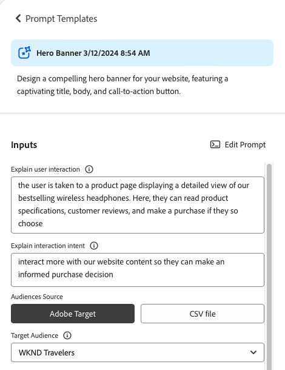
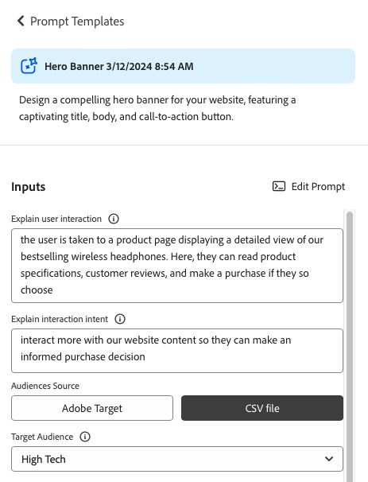

# Generera variationer {#generate-variations}

Om du letar efter ett sätt att optimera de digitala kanalerna och snabba upp innehållsskapandet kan du använda Generera variationer. Generate Variations (Generate Variations) använder generativ artificiell intelligens (AI) för att skapa innehållsvariationer baserat på uppmaningar. Dessa uppmaningar tillhandahålls antingen av Adobe eller skapas, och hanteras av användare. När du har skapat variationerna kan du använda innehållet på webbplatsen och även mäta hur de fungerar med [Experimentation](https://www.aem.live/docs/experimentation) funktionaliteten i [Edge Delivery Services](/help/edge/overview.md).

Du kan [få åtkomst till Generera variationer](#access-generate-variations) från:

* [inom Adobe Experience Manager (AEM) as a Cloud Service](#access-aemaacs)
* [SIDEKICK i AEM EDGE DELIVERY SERVICES](#access-aem-sidekick)
* [i Content Fragments Editor](/help/sites-cloud/administering/content-fragments/authoring.md#generate-variations-ai)

>[!NOTE]
>
>Om du vill använda Generera variationer måste du alltid se till att [åtkomstkrav](#access-prerequisites) är uppfyllda.

Då kan du:

* [Kom igång](#get-started) med en promptmall som Adobe har skapat för ett visst användningsfall.
* Du kan [redigera en befintlig fråga](#edit-the-prompt)
* eller [skapa och använda egna uppmaningar](#create-prompt):
   * [Spara dina uppmaningar](#save-prompt) för framtida bruk
   * [Få åtkomst till och använd delade uppmaningar](#select-prompt) från hela organisationen
* Definiera [publik](#audiences) segment som ska användas i prompten när [skapa personaliserat målgruppsspecifikt innehåll](#generate-copy).
* Förhandsgranska utdata tillsammans med prompten, innan du gör ändringar och finjusterar resultatet om det behövs.
* Använd [Adobe Express för att generera bilder](#generate-image) baserat på kopieringsvarianterna, vilket innebär att Firefly har de generativa AI-funktionerna.
* Välj innehåll som du vill använda på webbplatsen eller i ett experiment.

## Juridisk information och bruksanvisning {#legal-usage-note}

Generativ AI och Generate Variations för AEM är kraftfulla verktyg - men **dig** är ansvariga för att använda utdata.

Dina indata till tjänsten bör vara kopplade till ett sammanhang. Det här sammanhanget kan vara ert varumärkeskommunikationsmaterial, webbplatsinnehåll, data, scheman för sådana data, mallar eller andra tillförlitliga dokument.

Du måste utvärdera exaktheten hos alla utdata som passar ditt användningssätt.

Innan du använder Generera variationer måste du godkänna [Adobe Generative AI User Guidelines](https://www.adobe.com/legal/licenses-terms/adobe-dx-gen-ai-user-guidelines.html).

[Användning av Generera variationer](#generative-action-usage) är knutet till konsumtion av generativa åtgärder.

## Ökning {#overview}

När du öppnar Generera variationer (och expanderar den vänstra panelen) ser du:


* Höger panel
   * Detta beror på den markering du gör i den vänstra navigeringen.
   * Som standard **Frågemallar** visas.
* Vänster navigering
   * Till vänster om **Generera variationer**, finns det ett alternativ (macha-menyn) för att expandera eller dölja den vänstra navigeringspanelen.
   * **Frågemallar**:
      * Visar länkar till de olika uppmaningarna. Dessa kan innehålla uppmaningar:
         * Tillhandahålls av Adobe för att hjälpa dig att generera innehåll. Flaggas med ikonen Adobe.
         * Skapad av dig själv.
         * Skapat i din IMS-organisation; flaggat med en ikon som visar flera huvuden.
      * Innehåller [Ny fråga](#create-prompt) för att skapa en egen fråga.
      * Du kan **Ta bort** uppmaningar som du själv eller din IMS-organisation har skapat. Detta görs med den meny som öppnas med ellipsen på rätt kort.
   * [Favoriter](#favorites): Visar resultat från tidigare generationer som du har flaggat som Favoriter.
   * [Senaste](#recents): Tillhandahåller länkar till uppmaningar och deras indata som du nyligen har använt.
   * **Hjälp och frågor**: Länkar till dokumentation, inklusive vanliga frågor och svar.
   * **Användarriktlinjer**: Länkar till de rättsliga riktlinjerna.

## Kom igång {#get-started}

Gränssnittet vägleder dig genom processen att generera innehåll. När du har öppnat gränssnittet är det första steget att välja den fråga du vill använda.

### Välj fråga {#select-prompt}

På huvudpanelen kan du välja:

* en promptmall från Adobe för att börja generera innehåll,
* den [Ny fråga](#create-prompt) för att skapa en egen uppmaning,
* en mall som du har skapat endast för din användning,
* en mall som du, eller någon i organisationen, har skapat.

Så här differentierar du:

* De meddelanden som visas i Adobe är flaggade med ikonen Adobe
* Fråga som är tillgängliga i hela IMS-organisationen markeras med en huvudikon.
* Dina privata uppmaningar flaggas inte specifikt.


### Ange indata {#provide-inputs}

Varje uppmaning kräver att du anger viss information så att den kan hämta rätt innehåll tillbaka från generativ AI.

Inmatningsfälten vägleder dig genom vilken information som behövs. För att underlätta har vissa fält standardvärden som du kan använda, eller ändra efter behov, och beskrivningar som förklarar kraven.

Det finns flera inmatningsfält som är gemensamma för flera uppmaningar (vissa fält är inte alltid tillgängliga):

* **Antal**/**Antal**
   * Du kan välja hur många innehållsvariationer du vill skapa i en generation.
   * Beroende på uppmaningen kan det här ha en av flera olika etiketter, till exempel Antal variationer, Antal Ideas med flera.
* **Målgruppskälla**/**Målgrupp**
   * Hjälper till att generera personaliserat innehåll till en viss målgrupp.
   * Adobe tillhandahåller standardmålgrupper, eller du kan ange ytterligare målgrupper, se [Målgrupper](#audiences).
* **Ytterligare sammanhang**
   * Infoga relevant innehåll som hjälper generativ AI att skapa bättre respons baserat på indata. Om du till exempel skapar en webbanderoll för en viss sida eller produkt kanske du vill inkludera information om sidan/produkten.
* **Temperatur**
Används för att ändra temperaturen på Adobe Generative AI:
   * En högre temperatur skiljer sig från mängden och leder till större variation, slumpmässighet och kreativitet.
   * En lägre temperatur är mer deterministisk och håller sig närmare det som är i frågan.
   * Som standard är temperaturen 1. Du kan experimentera med olika temperaturer om de genererade resultaten inte passar dig.
* **Redigera fråga**
   * Den underliggande [fråga kan redigeras](#edit-the-prompt) för att förfina de genererade resultaten.

### Generera kopia {#generate-copy}

När du har fyllt i inmatningsfälten och/eller ändrat uppmaningen kan du generera innehåll och granska svaren.

Välj **Generera** för att se svar som genererats av generativ AI. De genererade innehållsvarianterna visas under uppmaningen som genererade dem.


>[!NOTE]
>
>De flesta Adobe-promptmallar innehåller en **AI Rationale** i variationssvaret. Detta ger transparens om varför generativ AI genererade den aktuella variationen.

När du markerar en enskild variation är följande åtgärder tillgängliga:

* **Favorit**
   * Flagga som **Favorit** för framtida bruk (visas i [Favoriter](#favorites)).
* Tummen upp/Tummen ned
   * Använd upp- och nedindikeringar för att meddela Adobe om kvaliteten på svaren.
* **Kopiera**
   * Kopiera till Urklipp för användning vid redigering av innehåll på webbplatsen eller i en [Experimentera](https://www.aem.live/docs/experimentation).
* **Ta bort**

Om du behöver förfina indata eller uppmaningar kan du göra justeringar och välja **Generera** igen för att få en uppsättning nya svar. Den nya uppmaningen och svaret visas under den inledande uppmaningen och svaret. Du kan rulla uppåt och nedåt för att visa olika uppsättningar innehåll.

Ovanför varje variantuppsättning finns uppmaningen som skapade dem, tillsammans med en **Återanvänd** alternativ. Om du någon gång behöver köra en fråga igen med dess indata väljer du **Återanvänd** för att läsa in dem igen **Indata**.

### Generera bild {#generate-image}

När du har genererat textvariationer kan du generera bilder i Adobe Express med hjälp av Firefly generativa AI-funktioner.

>[!NOTE]
>
>**Generera bild** är bara tillgängligt om du har ett tillstånd för Adobe Express som en del av din IMS-organisation och åtkomst som beviljas dig i Admin Console.

Välj en variant följt av **Generera bild** för att öppna direkt **Text till bild** in [Adobe Express](https://www.adobe.com/express/). Frågorna fylls i automatiskt baserat på ditt val av variant och bilderna genereras automatiskt enligt uppmaningen.


Du kan göra ytterligare ändringar:

* [skriva en egen uppmaning i Adobe Expressen](https://helpx.adobe.com/firefly/using/tips-and-tricks.html) genom att beskriva vad du vill se,
* justera **Text till bild** alternativ,
* sedan **Uppdatera** genererade bilder.

Du kan också använda **Utforska mer** för fler möjligheter.

När du är klar markerar du den önskade bilden och **Spara** för att stänga Adobe Expressen. Bilden returneras och sparas med variationen.


Här kan du visa åtgärdsobjekt för:

* **Kopiera**: [kopiera bilden till Urklipp för användning någon annanstans](#use-content)
* **Redigera**: öppna Adobe Express så att du kan göra ändringar i bilden
* **Ladda ned**: hämta bilden till din lokala dator
* **Ta bort**: ta bort bilden från variationen

>[!NOTE]
>
>[](https://helpx.adobe.com/creative-cloud/help/content-credentials.html) bevaras inte när de används i dokumentbaserad redigering.

### Använd innehåll {#use-content}

Om du vill använda innehåll som genererats med generativ AI måste du kopiera innehållet till Urklipp för användning någon annanstans.

Detta görs med kopieringsikonerna:

* För text: Använd kopieringsikonen som visas på varianelen
* För bilden: när du håller muspekaren över bilden visas kopieringsikonen

När du har kopierat till Urklipp kan du klistra in informationen för användning när du redigerar innehåll för webbplatsen. Du kan också köra en [experimentera](https://www.aem.live/docs/experimentation).

## Favoriter {#favorites}

När du har granskat innehållet kan du spara de valda varianterna som favoriter.

När de har sparats visas de under **Favoriter** i den vänstra navigeringen. Favoriter bevaras (tills du **Ta bort** eller rensa webbläsarens cacheminne).

* Favoriter och varianter kan kopieras/klistras in i Urklipp för användning i webbplatsinnehållet.
* Favoriter kan vara **Borttagen**.

## Senaste {#recents}

I det här avsnittet finns länkar till din senaste aktivitet. A **Senaste** posten läggs till efter att du har valt **Generera**. Den har samma namn som uppmaningen och en tidsstämpel. Om du väljer en länk läses uppmaningen in, inmatningsfälten fylls i och de genererade variationerna visas.

## Redigera frågan {#edit-the-prompt}

Den underliggande frågan kan redigeras. Du kanske vill göra det här:

* Om de resultat du får behöver förfinas ytterligare
* Du vill ändra och [spara uppmaningen](#save-prompt) för framtida bruk

Välj **Redigera fråga**:


Då öppnas promptredigeraren där du kan göra dina ändringar:


### Lägg till frågeindata {#add-prompt-inputs}

När du skapar eller redigerar en fråga kanske du vill lägga till inmatningsfält. Indatafält fungerar som variabler i prompten och ger flexibilitet att använda samma prompt i olika scenarier. De gör att användare kan definiera specifika element i uppmaningen, utan att behöva skriva hela uppmaningen.

* Ett fält definieras med dubbla klamrar `{{ }}` omsluter ett platshållarnamn.
Till exempel: `{{tone_of_voice}}`.

  >[!NOTE]
  >
  >Blanksteg är inte tillåtna mellan dubbla klammerparenteser.

* Den definieras också under `METADATA`, med följande parametrar:
   * `label`
   * `description`
   * `default`
   * `type`

#### Exempel: Lägg till nytt textfält - Tone of Voice {#example-add-new-text-field-tone-of-voice}

Lägga till ett nytt textfält med namnet **Ton av röst** använder du följande syntax i din uppmaning:

```prompt
{{@tone_of_voice, 
  label="Tone of voice",
  description="Indicate the desired tone of voice",
  default="optimistic, smart, engaging, human, and creative",
  type=text
}}
```


<!--
#### Example: Add new dropdown field - Page Type {#example-add-new-dropdown-field-page-type}

To create an input field Page Type providing a dropdown selection:

1. Create a spreadsheet named `pagetype.xls` in the top-level directory of your folder structure.
1. Edit the spreadsheet:

   1. Create two columns: **Key** and **Value**.
   1. In the **Key** column, enter labels that will appear in the dropdown.
   1. In the **Value** column, describe the key value so the generative AI has context.

1. In your prompt, refer to the title of the spreadsheet along with the appropriate type. 

   ```prompt
   {{@page_type, 
     label="Page Type",
     description="Describes the type of page",
     spreadsheet=pagetype
   }}
   ```
-->

## Skapa en fråga {#create-prompt}

När du väljer **Ny fråga** från **Frågemallar**, en ny panel där du kan ange en ny fråga. Du kan sedan ange dessa tillsammans med **Temperatur**, till **Generera** innehåll.

Se [Spara fråga](#save-prompt) om du vill ha information om hur du sparar frågan för framtida behov.

Se [Lägga till uppmaningsindata](#add-prompt-inputs) om du vill ha mer information om hur du lägger till egna kommandon.

Om du vill bevara formateringen i både användargränssnittet och när du kopierar och klistrar in den i det dokumentbaserade redigeringsflödet ska du inkludera följande i meddelandet:

<!-- CHECK - are the double-quotes needed? -->

* `"Format the response as an array of valid, iterable RFC8259 compliant JSON"`

I följande bild visas fördelarna med att göra det:

* i det första exemplet `Title` och `Description` kombineras
* i det andra exemplet formateras de separat: detta har gjorts genom att JSON-begäran har tagits med i uppmaningen.


## Spara fråga {#save-prompt}

När du har redigerat eller skapat uppmaningar kanske du vill spara dem för framtida bruk, antingen för din IMS-organisation eller för dig själv. Den sparade uppmaningen visas som en **Fråga mall** kort.

När du har redigerat uppmaningen visas **Spara** finns längst ned i avsnittet Indata, till vänster om **Generera**.

När du väljer det här alternativet visas **Spara fråga** öppnas:


1. Lägg till en unik **Uppmaningsnamn**. Används för att identifiera uppmaningen inom **Frågemallar**.
   1. Ett nytt och unikt namn skapar en ny promptmall.
   1. Ett befintligt namn skriver över den uppmaningen. Ett meddelande visas.
1. Du kan också lägga till en beskrivning.
1. Aktivera eller inaktivera alternativet **Delas i hela organisationen**, beroende på om uppmaningen ska vara privat eller tillgänglig i hela IMS-organisationen. Den här statusen visas i [resulterande kort som visas i Frågemallar](#select-prompt).
1. **Spara** uppmaningen, eller **Avbryt** åtgärden.

>[!NOTE]
>
>Du informeras (varnas) om du skriver över/uppdaterar en befintlig fråga.

>[!NOTE]
>
>Från **Frågemallar** du kan ta bort uppmaningar (med den meny som du kommer åt med ellipsen) som du själv eller i din IMS-organisation har skapat.

## Målgrupper {#audiences}

För att generera personaliserat innehåll måste den generativa AI ha en förståelse för publiken. Adobe har ett antal standardmålgrupper, eller så kan du lägga till en egen.

När du lägger till en målgrupp bör du beskriva målgruppen på det naturliga språket. Till exempel:

* för att skapa en målgrupp:
   * `Student`
* kan du säga:
   * `The audience consists of students, typically individuals who are pursuing education at various academic levels, such as primary, secondary, or tertiary education. They are engaged in learning and acquiring knowledge in diverse subjects, seeking academic growth, and preparing for future careers or personal development.`

Två målgruppskällor stöds:

* [Adobe Target](#audience-adobe-target)
* [CSV-fil](#audience-csv-file)


### Målgrupp - Adobe Target {#audience-adobe-target}

Markera en **Adobe Target** i manuset gör det möjligt att personalisera innehållsgenereringen för den målgruppen.

>[!NOTE]
>
>IMS-organisationen måste ha tillgång till Adobe Target för att kunna använda det här alternativet.

1. Välj **Adobe Target**.
1. Välj sedan önskad **Målgrupp**, från den lista som finns.

   >[!NOTE]
   >
   >Så här använder du **Adobe Target** målgrupp som beskrivningsfältet måste fyllas i. Annars visas målgruppen i listrutan som otillgänglig. Om du vill lägga till en beskrivning går du till Mål och [lägga till en publikbeskrivning](https://experienceleague.adobe.com/en/docs/target-learn/tutorials/audiences/create-audiences).

   

#### Lägg till Adobe Target Audience {#add-adobe-target-audience}

Se [Skapa målgrupper](https://experienceleague.adobe.com/en/docs/target-learn/tutorials/audiences/create-audiences) för att skapa en publik i Adobe Target.

### Målgrupp - CSV-fil {#audience-csv-file}

Markera en **CSV-fil** i prompten kan man skräddarsy innehållet efter de valda **Målgrupp**.

Adobe har ett antal målgrupper att använda.

1. Välj **CSV-fil**.
1. Välj sedan önskad **Målgrupp**, från den lista som finns.

   

#### Lägg till målgrupps-CSV-fil {#add-audience-csv-file}

Du kan lägga till en CSV-fil från olika plattformar (till exempel Google Drive, Dropbox, Sharepoint) som kan ange en URL till filen när den blir tillgänglig för allmänheten.

>[!NOTE]
>
>På de plattformar du delar *måste* har möjlighet att göra filen tillgänglig för allmänheten.

Så här lägger du till en målgrupp från en fil på Google Drive:

1. Skapa en kalkylbladsfil med två kolumner i Google Drive:
   1. Den första kolumnen visas i listrutan.
   1. Den andra kolumnen blir målgruppsbeskrivningen.
1. Publicera filen:
   1. File -> Share -> publish to web -> CSV
1. Kopiera URL-adressen till den publicerade filen.
1. Gå till Generera variationer.
1. Öppna Frågeredigeraren.
1. Sök **Adobe Target** i metadata och ersätt URL:en.

   >[!NOTE]
   >
   >Kontrollera att citattecknen (&quot;) finns på båda sidorna av URL:en.

   Till exempel:

   

## Generativ åtgärdsanvändning {#generative-action-usage}

Användningshanteringen beror på vilken åtgärd som vidtas:

* Generera variationer

  En generation av en kopieringsvariant motsvarar en generativ åtgärd. Som kund har ni ett visst antal generativa åtgärder som följer med er AEM licens. När basberättigandet har förbrukats kan du köpa ytterligare åtgärder.

  >[!NOTE]
  >
  >Se [Adobe Experience Manager: Cloud Service | Produktbeskrivning](https://helpx.adobe.com/legal/product-descriptions/aem-cloud-service.html) om du vill ha mer information om basberättiganden och kontakta ditt kontoteam om du vill köpa mer generativa åtgärder.

* Adobe Express

  Bildgenereringsanvändningen hanteras via Adobe Expresser och [kreativa krediter](https://helpx.adobe.com/firefly/using/generative-credits-faq.html).

## Få åtkomst till Generera variationer {#access-generate-variations}

När du har uppfyllt kraven kan du få åtkomst till Generera variationer från AEM as a Cloud Service eller Sidekick i Edge Delivery Servicens.

### Åtkomstkrav {#access-prerequisites}

Om du vill använda Generera variationer måste du se till att villkoren är uppfyllda:

* [Åtkomst till Experience Manager as a Cloud Service med Edge Delivery Services](#access-to-aemaacs-with-edge-delivery-services)

#### Åtkomst till Experience Manager as a Cloud Service med Edge Delivery Services{#access-to-aemaacs-with-edge-delivery-services}

Användare som behöver åtkomst till Generate Variations måste ha rätt till en as a Cloud Service miljö för Experience Manager med Edge Delivery Services.

>[!NOTE]
>
>Om ditt avtal för AEM Sites as a Cloud Service inte innehåller några Edge Delivery Services måste du signera ett nytt kontrakt för att få åtkomst.
>
>Kontakta er kontogrupp för att diskutera hur ni kan gå över till AEM Sites as a Cloud Service med Edge Delivery Services.

Om du vill ge vissa användare åtkomst tilldelar du deras användarkonto till respektive produktprofil. Se [Tilldela AEM produktprofiler för mer information](/help/journey-onboarding/assign-profiles-cloud-manager.md).

### Åtkomst från AEM as a Cloud Service {#access-aemaacs}

Generera variationer kan nås via [Navigeringspanel](/help/sites-cloud/authoring/basic-handling.md#navigation-panel) av AEM as a Cloud Service:


### Åtkomst från AEM Sidekick {#access-aem-sidekick}

En del konfiguration krävs innan du kan komma åt Generera variationer från Sidekick (i Edge Delivery Services).

1. Se dokumentet [Installera AEM Sidekick](https://www.aem.live/docs/sidekick-extension) för hur du installerar och konfigurerar Sidekick.

1. Om du vill använda Generera variationer i Sidekick (av Edge Delivery Services) inkluderar du följande konfiguration i dina Edge Delivery Services under:

   * `tools/sidekick/config.json`

   Detta måste sammanfogas med din befintliga konfiguration och sedan distribueras.

   Till exempel:

   ```prompt
   {
     // ...
     "plugins": [
       // ...
       {
         "id": "generate-variations",
         "title": "Generate Variations",
         "url": "https://experience.adobe.com/aem/generate-variations",
         "passConfig": true,
         "environments": ["preview","live", "edit"],
         "includePaths": ["**.docx**"]
       }
       // ...
     ]
   }
   ```

1. Du kan då behöva se till att användarna har [Åtkomst till Experience Manager as a Cloud Service med Edge Delivery Services](#access-to-aemaacs-with-edge-delivery-services).

1. Du kan sedan komma åt funktionen genom att välja **Generera variationer** från verktygsfältet i Sidekick:

   

## Ytterligare information {#further-information}

Du kan även läsa mer om:

* [GenAI Generate Variations on GitHub](https://github.com/adobe/aem-genai-assistant#setting-up-aem-genai-assistant)
* [Experimentera med Edge Delivery Services](https://www.aem.live/docs/experimentation)

## Vanliga frågor {#faqs}

### Formaterade utdata {#formatted-outpu}

**Det genererade svaret ger mig inte de formaterade utdata jag behöver. Hur ändrar jag formatet? ex: Jag behöver en titel och en undertitel, men svaret är bara titel**

1. Öppna den faktiska uppmaningen i redigeringsläge.
1. Gå till krav.
1. Du hittar krav som talar om utdata.
   1. Exempel:&quot;Texten måste bestå av tre delar, en titel, en brödtext och en knappetikett.&quot; eller &quot;Formatera svaret som en giltig JSON-array med objekt med attributen &quot;Title&quot;, &quot;Body&quot; och &quot;ButtonLabel&quot;.
1. Anpassa kraven efter dina behov.

   >[!NOTE]
   >
   >Skapa ett krav om du har begränsningar för antalet ord/tecken för den nya utdatafilen.

   Exempel: &quot;Titeltexten får inte innehålla fler än 10 ord eller 50 tecken, inklusive blanksteg.&quot;
1. Spara frågan för framtida bruk.

### Svarets längd {#length-of-response}

**Det genererade svaret är för långt eller för kort. Hur ändrar jag längden?**

1. Öppna den faktiska uppmaningen i redigeringsläge.
1. Gå till krav.
1. För varje utdatafil finns det en gräns för antal ord/tecken.
   1. Exempel: &quot;Titeltexten får inte innehålla fler än 10 ord eller 50 tecken, inklusive blanksteg.&quot;
1. Anpassa kraven efter dina behov.
1. Spara frågan för framtida bruk.

### Förbättra svaren {#improve-responses}

**Svaren jag får är inte precis vad jag letar efter. Vad kan jag göra för att förbättra dem?**

1. Prova att ändra Temperatur under Avancerade inställningar.
   1. En högre temperatur skiljer sig från mängden och leder till större variation, slumpmässighet och kreativitet.
   1. En lägre temperatur är mera deterministisk och följer det som är i prompten.
1. Öppna den faktiska uppmaningen i redigeringsläge och granska uppmaningen. Var särskilt uppmärksam på kravavsnittet som beskriver tonen på rösten och andra viktiga kriterier.

### Kommentarer i en prompt {#comments-in-prompt}

**Hur kan jag använda kommentarer i en dialogruta?**

Kommentarer i en prompt används för att inkludera anteckningar, förklaringar eller instruktioner som inte ska ingå i själva resultatet. Kommentarerna är inkapslade i en viss syntax: de börjar och slutar med dubbla klammerparenteser och börjar med en hash (till exempel `{{# Comment Here }}`). Kommentarerna gör det lättare att klargöra frågestrukturen eller avsikten utan att det genererade svaret påverkas.

### Söka efter en delad fråga {#find-a-shared-prompt}

**Vad kan jag göra om jag inte kan hitta en promptmall som någon har delat?**

I den här situationen finns det olika detaljer att kontrollera:

1. Använd URL:en för din miljö.
Till exempel https://experience.adobe.com/#/aem/generate-variations
1. Kontrollera att den valda IMS-organisationen är korrekt.
1. Bekräfta att frågan sparades som delad.

### Anpassade uppmaningar i v2.0.0 {#custom-prompts-v200}

**I v.2.0.0 har mina egna uppmaningar försvunnit - vad kan jag göra?**

Om du går över till version 2.0.0 bryts de anpassade promptmallarna så att de inte är tillgängliga.

Så här hämtar du dem:

1. Gå till promptmallsmappen i Sharepoint.
1. Kopiera uppmaningen.
1. Öppna programmet Generera variationer.
1. Välj Nytt frågekort.
1. Klistra in uppmaningen.
1. Kontrollera att uppmaningen fungerar.
1. Spara frågan.

## Versionshistorik {#release-history}

Mer information om aktuella och tidigare versioner finns i [Versionsinformation för Generera variationer](/help/generative-ai/release-notes-generate-variations.md)
