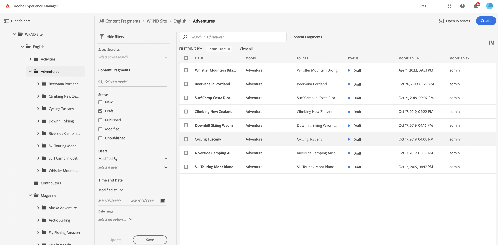
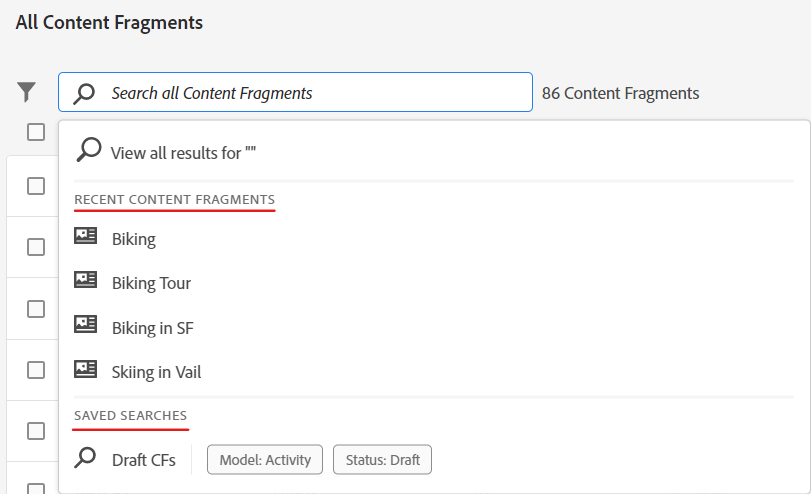

# Konsol för innehållsfragment  {#content-fragment-console}

Lär dig hur konsolen Innehållsfragment optimerar åtkomsten till dina innehållsfragment så att du kan skapa, söka efter och hantera dem genom att vidta administratörsåtgärder som publicera, avpublicera, kopiera.

>[!NOTE]
>
>Konsolen Innehållsfragment är avsedd för hantering, sökning och skapande av innehållsfragment. Den har optimerats för användning i ett Headless-sammanhang.
>
>Den här konsolen visar bara innehållsfragment. Den visar inte andra resurstyper, t.ex. bilder och videoklipp.

>[!NOTE]
>
>Du kan få åtkomst till dina innehållsfragment via:
>
>* den här konsolen för innehållsfragment
>* Resurskonsolen - se [Hantera innehållsfragment](/help/assets/content-fragments/content-fragments-managing.md)

Konsolen för innehållsfragment kan nås direkt från den översta nivån i Global Navigation:

Markera **Innehållsfragment** öppnar konsolen på en ny flik.

Här ser du att det finns tre huvudområden:

* Det övre verktygsfältet
   * Tillhandahåller AEM
   * Visar även din IMS-organisation
* Den vänstra panelen
   * Här kan du dölja, eller visa, mappträdet
   * Du kan välja en viss gren av trädet
* Panelen main/right - härifrån kan du:
   * Se listan med alla innehållsfragment i den markerade grenen i trädet
      * Platsen anges av vägbeskrivningarna. dessa kan också användas för att ändra platsen
      * Innehållsfragment från den markerade mappen och alla underordnade mappar visas
         * Olika informationsområden om ett innehållsfragment innehåller länkar. kan dessa öppna rätt fragment i redigeraren
      * Du kan välja en kolumnrubrik för att sortera tabellen efter den kolumnen; välj igen för att växla mellan stigande och fallande
   * **[Skapa](#creating-new-content-fragment)** ett nytt innehållsfragment
   * [Filter](#filtering-fragments) innehållsfragment enligt ett urval predikatmallar och spara filtret för framtida bruk
   * [Sök](#searching-fragments) innehållsfragment
   * Anpassa tabellvyn så att markerade informationskolumner visas
   * Använd **Öppna i resurser** om du vill öppna den aktuella platsen direkt i **Resurser** konsol.

      >[!NOTE]
      >
      >The **Resurser** konsolen används för att komma åt resurser, som bilder, videor osv.  Konsolen kan nås:
      >
      >* med **Öppna i resurser** link (in the Content Fragments console)
      >* direkt från den globala navigeringsrutan

Om du väljer ett visst fragment öppnas ett verktygsfält som fokuserar på de åtgärder som är tillgängliga för det fragmentet. Du kan också markera flera fragment. Markeringen av funktionsmakron justeras därefter.

## Skapa ett nytt innehållsfragment {#creating-new-content-fragment}

Markera **Skapa** öppnar komprimeringen **Nytt innehållsfragment** dialog:

## Filtrera fragment {#filtering-fragments}

På panelen Filter finns:

* ett urval av predikat som kan markeras och kombineras
* möjlighet att **Spara** din konfiguration
* alternativet att hämta ett sparat sökfilter för återanvändning

## Söka efter fragment {#searching-fragments}

I sökrutan går det att söka i heltext. Ange dina söktermer i sökrutan:

Ger de valda resultaten:

I sökrutan kan du även snabbt komma åt **Senaste innehållsfragment** och **Sparade sökningar**:

