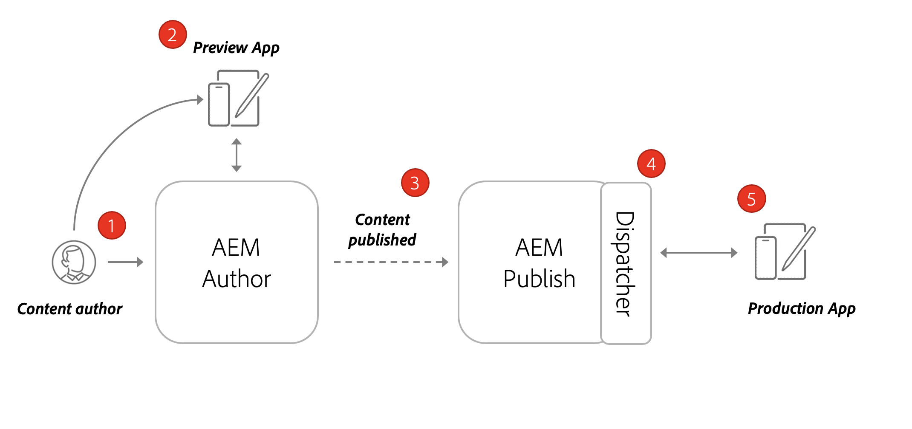

# Arkitektur AEM Headless

En typisk AEM består av en författartjänst, en Publish-tjänst och en förhandsgranskningstjänst (tillval).

* **Författartjänsten** är den plats där interna användare skapar, hanterar och förhandsgranskar innehåll.

* **Publish-tjänsten** betraktas som Live-miljön och är vanligtvis den slutanvändare som interagerar med. Innehåll som har redigerats och godkänts av författartjänsten distribueras till Publish. Det vanligaste distributionsmönstret med AEM headless-program är att ha produktionsversionen av programmet ansluten till en AEM Publish-tjänst.

* **Förhandsgranskningstjänsten** är funktionellt densamma som **Publish-tjänsten**. Den är dock bara tillgänglig för interna användare. Detta gör det idealiskt för godkännare att granska kommande innehållsändringar innan de görs tillgängliga för slutanvändare.

* **Dispatcher** är en statisk webbserver som utökas med AEM. Den har cachningsfunktioner och ett annat säkerhetsskikt. **Dispatcher** placeras framför **Publish**- och **förhandsgranskningstjänsterna**.

I ett AEM as a Cloud Service-program kan du ha flera miljöer: Dev, Stage och Prod. Varje miljö skulle ha sina egna unika tjänster för **Författare**, **Publish** och **Förhandsgranskning**. Mer information finns i [Hantera miljöer](/help/implementing/cloud-manager/manage-environments.md).

## Skapa Publish-modell

Det vanligaste distributionsmönstret med AEM headless-program är att ha produktionsversionen av programmet ansluten till en AEM Publish-tjänst.

Diagrammet ovan visar detta vanliga distributionsmönster.

1. En **innehållsförfattare** använder tjänsten AEM författare för att skapa, redigera och hantera innehåll.
1. **Innehållsförfattaren** och andra interna användare kan förhandsgranska innehållet direkt i författartjänsten. Du kan konfigurera en förhandsgranskningsversion av programmet som ansluter till författartjänsten.
1. När innehållet har godkänts kan det publiceras till den AEM Publish-tjänsten.
1. **Dispatcher** är ett lager framför **Publish**-tjänsten som kan cachelagra vissa begäranden och tillhandahålla ett säkerhetslager.
1. Slutanvändarna interagerar med programmets produktionsversion. Produktionsprogrammet ansluter till Publish-tjänsten via Dispatcher och använder GraphQL API:er för att begära och använda innehåll.

## Förhandsgranska Publish-distribution för författare

Ett annat alternativ för headless-distributioner är att inkludera en **AEM Preview**-tjänst. Med det här arbetssättet kan innehåll publiceras först till tjänsten **Preview** och en förhandsvisningsversion av det headless-programmet kan ansluta till det. Fördelen med det här arbetssättet är att tjänsten **Preview** kan konfigureras med samma autentiseringskrav och behörigheter som tjänsten **Publish** vilket gör det enklare att simulera produktionsupplevelsen.

1. En **innehållsförfattare** använder tjänsten AEM författare för att skapa, redigera och hantera innehåll.
1. Innehållet publiceras först till AEM.
1. Du kan konfigurera en förhandsgranskningsversion av programmet som ansluter till förhandsgranskningstjänsten.
1. När innehållet har granskats och godkänts kan det publiceras till AEM Publish-tjänst.
1. Slutanvändarna interagerar med programmets produktionsversion. Produktionsprogrammet ansluter till Publish-tjänsten via Dispatcher och använder GraphQL API:er för att begära och använda innehåll.
