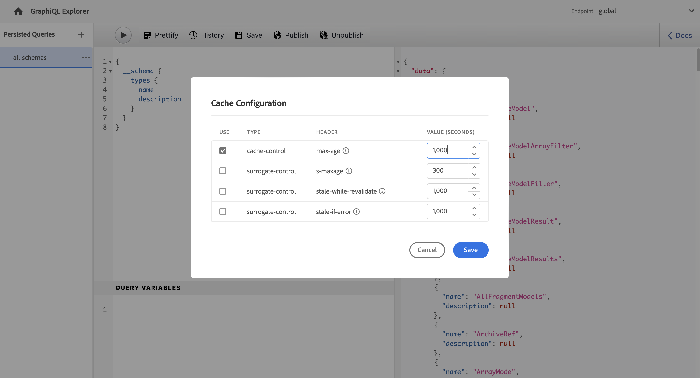
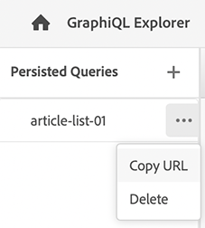

# Använda GraphiQL IDE {#graphiql-ide}

En implementering av standarden [GraphiQL](https://graphql.org/learn/serving-over-http/#graphiql) IDE finns för användning med GraphQL API för Adobe Experience Manager (AEM) as a Cloud Service.

>[!NOTE]
>
>GraphiQL ingår i alla miljöer med AEM (men är bara tillgängligt/synligt när du konfigurerar slutpunkterna).
>
>I tidigare versioner behövdes ett paket för att installera GraphiQL IDE. Om du har installerat den kan den nu tas bort.

>[!NOTE]
>Du måste ha [konfigurerade dina slutpunkter](/help/headless/graphql-api/graphql-endpoint.md) i [konfigurationsläsare](/help/sites-cloud/administering/content-fragments/content-fragments-configuration-browser.md) innan du använder GraphiQL IDE.

The **GraphiQL** kan du testa och felsöka GraphQL-frågor genom att aktivera:
* välj **Slutpunkt** lämplig för platskonfigurationen som du vill använda för dina frågor
* direkt mata in nya frågor
* skapa och få tillgång till **[Beständiga frågor](/help/headless/graphql-api/persisted-queries.md)**
* köra dina frågor för att omedelbart se resultatet
* hantera **Frågevariabler**
* spara och hantera **Beständiga frågor**
* publicera eller avpublicera, **Beständiga frågor** (till exempel till/från `dev-publish`)
* se **Historik** av dina tidigare frågor
* använder **Dokumentationsutforskaren** få tillgång till dokumentationen, hjälper dig att lära dig vilka metoder som finns tillgängliga.

Du kan öppna frågeredigeraren från:

* **verktyg** -> **Allmänt** -> **GraphQL Query Editor**
* direkt, till exempel `http://localhost:4502/aem/graphiql.html`

Du kan använda GraphiQL på datorn så att frågor kan begäras av klientprogrammet med hjälp av GET-förfrågningar och för publiceringsfrågor. För produktionsanvändning kan man sedan [flytta frågor till produktionsmiljön](/help/headless/graphql-api/persisted-queries.md#transfer-persisted-query-production). Till att börja med måste produktionsförfattaren validera nyskrivet innehåll med frågorna och till sist publicera produktionen för direktkonsumtion.

## Markera slutpunkten {#selecting-endpoint}

Som ett första steg måste du välja **[Slutpunkt](/help/headless/graphql-api/graphql-endpoint.md)** som du vill använda för frågorna. Slutpunkten passar den platskonfiguration som du vill använda för dina frågor.

Det här är tillgängligt i listrutan högst upp till höger.

## Skapa och behålla en ny fråga {#creating-new-query}

Du kan ange den nya frågan i redigeraren, som finns i den vänstra panelen, direkt under GraphiQL-logotypen.

>[!NOTE]
>
>Om du redan har markerat en beständig fråga och vill visa den på redigeringspanelen väljer du `+` (bredvid **Beständiga frågor**) för att tömma redigeraren som är klar för den nya frågan.

Börja skriva - redigeraren:

* använder muspekaren för att visa ytterligare information om element
* innehåller funktioner som syntaxmarkering, automatisk komplettering och automatisk föreslå

>[!NOTE]
>
>GraphQL-frågor börjar oftast med en `{` tecken.
>
>Rader som börjar med en `#` ignoreras.

Använd **Spara som** för att behålla den nya frågan.

## Uppdaterar din beständiga fråga {#updating-persisted-query}

Välj frågan som du vill uppdatera i listan i dialogrutan **Beständiga frågor** panel (längst till vänster).

Frågan visas på redigeringspanelen. Gör de ändringar du behöver och använd sedan **Spara** för att implementera uppdateringar av den beständiga frågan.

## Köra frågor {#running-queries}

Du kan köra en ny fråga direkt eller läsa in och köra en beständig fråga. Om du vill läsa in en beständig fråga väljer du den i listan. Frågan visas i redigeringspanelen.

I båda fallen är frågan som visas på redigeringspanelen den fråga som kommer att köras när du antingen:

* klicka/tryck på **Kör fråga** icon
* använda tangentbordskombinationen `Control-Enter`

## Frågevariabler {#query-variables}

<!-- more details needed here? -->

Med GraphiQL IDE kan du också hantera [Frågevariabler](/help/headless/graphql-api/content-fragments.md#graphql-variables).

Till exempel:

## Hantera cache för dina beständiga frågor {#managing-cache}

[Beständiga frågor](/help/headless/graphql-api/persisted-queries.md) rekommenderas eftersom de kan cachelagras på dispatcher- och CDN-lagren, vilket i slutänden förbättrar prestanda för det begärande klientprogrammet. Som standard blir cacheminnet för innehållsleveransnätverket (CDN) ogiltigt baserat på en TTL-standardinställning (Time To Live).

Med GraphQL kan du konfigurera HTTP-cache-rubrikerna för att styra de här parametrarna för din individuella beständiga fråga.

1. The **Sidhuvuden** är tillgängligt via de tre lodräta prickarna till höger om det beständiga frågenamnet (längst till vänster):

   

1. Om du väljer det här alternativet öppnas **Cachekonfiguration** dialog:

   

1. Välj lämplig parameter och justera sedan värdet efter behov:

   * **cachekontroll** - **max-age**
Cacheminnen kan lagra det här innehållet under ett visst antal sekunder. Vanligtvis är det webbläsar-TTL (Time To Live).
   * **surrogatkontroll** - **s-maxage**
Samma som max-age men gäller specifikt för proxy-cacheminnen.
   * **surrogatkontroll** - **inaktuell-while-revalidate**
Cacheminnen kan fortsätta att leverera ett cachelagrat svar efter att det blivit inaktuellt i upp till det angivna antalet sekunder.
   * **surrogatkontroll** - **stale-if-error**
Cacheminnen kan fortsätta att fungera som cachelagrat svar i händelse av ett fel eller ett ursprungsfel i upp till det angivna antalet sekunder.

1. Välj **Spara** för att behålla ändringarna.

## Publicera beständiga frågor {#publishing-persisted-queries}

När du har valt din beständiga fråga i listan (den vänstra panelen) kan du använda **Publicera** och **Avpublicera** åtgärder. Detta aktiverar dem till din publiceringsmiljö (till exempel `dev-publish`) för enkel åtkomst av dina program vid testning.

>[!NOTE]
>
>Definitionen av den beständiga frågans cache `Time To Live` {&quot;cache-control&quot;:&quot;parameter&quot;:value} har standardvärdet 2 timmar (7 200 sekunder).

## Kopiera URL för direktåtkomst till frågan {#copy-url}

The **Kopiera URL** kan du simulera en fråga genom att kopiera den URL som används för att få direkt åtkomst till den beständiga frågan och se resultatet. Detta kan sedan användas för testning. till exempel genom att gå till i en webbläsare:

<!--
  >[!NOTE]
  >
  >The URL will need [encoding before using programmatically](/help/headless/graphql-api/persisted-queries.md#encoding-query-url).
  >
  >The target environment might need adjusting, depending on your requirements.
-->

Till exempel:

`http://localhost:4502/graphql/execute.json/global/article-list-01`

Genom att använda den här URL:en i en webbläsare kan du bekräfta resultatet:

The **Kopiera URL** är tillgängligt via de tre lodräta prickarna till höger om det beständiga frågenamnet (längst till vänster):

## Tar bort beständiga frågor {#deleting-persisted-queries}

The **Ta bort** Du kan även använda det här alternativet via de tre lodräta prickarna till höger om det beständiga frågenamnet (längst till vänster).

<!-- what happens if you try to delete something that is still published? -->

## Installera den beständiga frågan i produktionen {#installing-persisted-query-production}

När du har utvecklat och testat din beständiga fråga med GraphiQL är det sista målet att [överföra den till produktionsmiljön](/help/headless/graphql-api/persisted-queries.md#transfer-persisted-query-production) som kan användas i dina program.

## Kortkommandon {#keyboard-shortcuts}

Det finns ett urval av kortkommandon som ger direktåtkomst till åtgärdsikoner i den integrerade utvecklingsmiljön:

* Pretify Query:  `Shift-Control-P`
* Kopplingsfråga:  `Shift-Control-M`
* Kör fråga:  `Control-Enter`
* Komplettera automatiskt:  `Control-Space`

>[!NOTE]
>
>På vissa tangentbord på `Control` tangenten är märkt som `Ctrl`.
