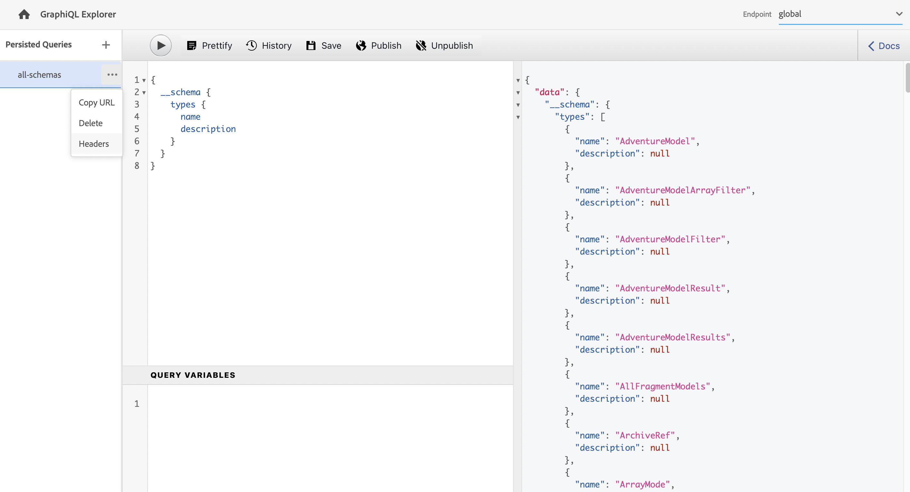

# Använda GraphiQL IDE {#graphiql-ide}

En implementering av standardmiljön [GraphiQL](https://graphql.org/learn/serving-over-http/#graphiql) är tillgänglig för användning med GraphQL API för Adobe Experience Manager (AEM) as a Cloud Service.

>[!NOTE]
>
>GraphiQL ingår i alla miljöer med AEM (men är bara tillgängligt/synligt när du konfigurerar slutpunkterna).
>
>I tidigare versioner behövdes ett paket för att installera GraphiQL IDE. Om du har installerat den kan den nu tas bort.

>[!NOTE]
>Du måste ha [konfigurerat dina slutpunkter](/help/headless/graphql-api/graphql-endpoint.md) i [konfigurationsläsaren](/help/sites-cloud/administering/content-fragments/setup.md#enable-content-fragment-functionality-configuration-browser) innan du kan använda GraphiQL IDE.

Med verktyget **GraphiQL** kan du testa och felsöka dina GraphQL-frågor genom att aktivera:
* välj den **slutpunkt** som passar den platskonfiguration som du vill använda för dina frågor
* direkt mata in nya frågor
* skapa och få åtkomst till **[beständiga frågor](/help/headless/graphql-api/persisted-queries.md)**
* köra dina frågor för att omedelbart se resultatet
* hantera **frågevariabler**
* spara och hantera **beständiga frågor**
* publicera, eller avpublicera, **beständiga frågor** till antingen din **Publish**- eller **förhandsgranskningstjänst** , till exempel till/från `dev-publish`
* visa **historiken** för dina tidigare frågor
* använd **Dokumentationsutforskaren** för att få tillgång till dokumentationen och för att lära dig mer och förstå vilka metoder som är tillgängliga.

Du kan öppna frågeredigeraren från:

* **Verktyg** > **Allmänt** > **GraphQL Query Editor**
* direkt, till exempel `http://localhost:4502/aem/graphiql.html`

Du kan använda GraphiQL på datorn så att frågor kan begäras av klientprogrammet med hjälp av GET-förfrågningar och för publiceringsfrågor. För produktionsanvändning kan du sedan [flytta dina frågor till din produktionsmiljö](/help/headless/graphql-api/persisted-queries.md#transfer-persisted-query-production). Till att börja med måste produktionsförfattaren validera nyskrivet innehåll med frågorna och till sist publicera produktionen för direktkonsumtion.

## Markera slutpunkten {#selecting-endpoint}

Som ett första steg måste du välja den **[slutpunkt](/help/headless/graphql-api/graphql-endpoint.md)** som du vill använda för frågorna. Slutpunkten passar den platskonfiguration som du vill använda för dina frågor.

Det här är tillgängligt i listrutan högst upp till höger.

## Skapa och behålla en ny fråga {#creating-new-query}

Du kan ange den nya frågan i redigeraren, som finns i den vänstra panelen, direkt under GraphiQL-logotypen.

>[!NOTE]
>
>Om du redan har markerat en beständig fråga och visar den i redigeringspanelen väljer du `+` (bredvid **Beständiga frågor**) för att tömma redigeraren som är klar för den nya frågan.

Börja skriva - redigeraren:

* använder muspekaren för att visa ytterligare information om element
* innehåller funktioner som syntaxmarkering, automatisk komplettering och automatisk föreslå

>[!NOTE]
>
>GraphQL-frågor inleds vanligtvis med ett `{`-tecken.
>
>Rader som börjar med `#` ignoreras.

Använd **Spara som** om du vill behålla den nya frågan.

## Uppdaterar din beständiga fråga {#updating-persisted-query}

Markera frågan som du vill uppdatera i listan på panelen **Beständiga frågor** (längst till vänster).

Frågan visas på redigeringspanelen. Gör de ändringar du behöver och använd sedan **Spara** för att genomföra uppdateringarna i den beständiga frågan.

## Köra frågor {#running-queries}

Du kan köra en ny fråga direkt eller läsa in och köra en beständig fråga. Om du vill läsa in en beständig fråga väljer du den i listan. Frågan visas i redigeringspanelen.

I båda fallen är frågan som visas på redigeringspanelen den fråga som körs när du antingen:

* välj på ikonen **Kör fråga**
* använd tangentbordskombinationen `Control-Enter`

## Frågevariabler {#query-variables}

Med GraphiQL IDE kan du också hantera dina [frågevariabler](/help/headless/graphql-api/content-fragments.md#graphql-variables).

Till exempel:

## Hantera cache för dina beständiga frågor {#managing-cache}

[Beständiga frågor](/help/headless/graphql-api/persisted-queries.md) rekommenderas eftersom de kan cachas i skikten dispatcher och CDN, vilket i slutänden förbättrar prestanda för det begärande klientprogrammet. Som standard blir cacheminnet för innehållsleveransnätverket (CDN) ogiltigt baserat på en TTL-standardinställning (Time To Live).

>[!NOTE]
>
>Se [Cachelagra dina beständiga frågor](/help/headless/graphql-api/persisted-queries.md#caching-persisted-queries).

>[!NOTE]
>
>Anpassade omskrivningsregler på Dispatcher kan åsidosätta standardvärden från AEM publicering.
>
>Om du skickar TTL-baserade headers för cachekontroll från dispatchern, baserat på ett matchningsmönster för plats, kan du vid behov utelämna `/graphql/execute.json/*` från matchningarna.

Med GraphQL kan du konfigurera HTTP-cache-rubrikerna för att styra de här parametrarna för din enskilda beständiga fråga.

1. Alternativet **Sidhuvuden** är tillgängligt via de tre lodräta prickarna till höger om det beständiga frågenamnet (längst till vänster):

   

1. Om du väljer det här alternativet öppnas dialogrutan **Cachekonfiguration**:

   

1. Välj lämplig parameter och justera sedan värdet efter behov:

   * **cache-control** - **max-age**
Cacheminnen kan lagra det här innehållet under ett visst antal sekunder. Vanligtvis är det webbläsar-TTL (Time To Live).
   * **surrogate-control** - **s-maxage**
Samma som max-age men gäller specifikt för proxy-cacheminnen.
   * **surrogate-control** - **stale-while-revalidate**
Cacheminnen kan fortsätta att leverera ett cachelagrat svar efter att det blivit inaktuellt i upp till det angivna antalet sekunder.
   * **surrogate-control** - **stale-if-error**
Cacheminnen kan fortsätta att fungera som cachelagrat svar i händelse av ett fel eller ett ursprungsfel i upp till det angivna antalet sekunder.

1. Välj **Spara** om du vill behålla ändringarna.

## Publicera och förhandsgranska beständiga frågor {#publishing-previewing-persisted-queries}

När du har valt din beständiga fråga i listan (den vänstra panelen) kan du använda åtgärden **Publish**.

Detta aktiverar frågan till den miljö du väljer. Du kan antingen välja din **Publish** -miljö (till exempel `dev-publish`) eller din **förhandsvisningsmiljö** så att dina program enkelt kan komma åt dem när du testar.

>[!NOTE]
>
>Definitionen av den beständiga frågans cache `Time To Live` {&quot;cache-control&quot;:&quot;parameter&quot;:value} har standardvärdet 2 timmar (7 200 sekunder).

## Avpublicerar beständiga frågor {#unpublishing-persisted-queries}

Som vid publicering kan du använda åtgärden **Avpublicera** när du har valt din beständiga fråga i listan (den vänstra panelen).

Detta inaktiverar frågan från den miljö du väljer, antingen din **Publish** -miljö eller din **förhandsvisningsmiljö** .

>[!NOTE]
>
>Du bör också se till att du har gjort nödvändiga ändringar i klientprogrammet för att undvika potentiella problem.

## Kopiera URL för direktåtkomst till frågan {#copy-url}

Med alternativet **Kopiera URL** kan du simulera en fråga genom att kopiera den URL som används för att få direkt åtkomst till den beständiga frågan och se resultatet. Detta kan sedan användas för testning, t.ex. genom att gå till i en webbläsare:

<!--
  >[!NOTE]
  >
  >The URL needs [encoding before using programmatically](/help/headless/graphql-api/persisted-queries.md#encoding-query-url).
  >
  >The target environment might need adjusting, depending on your requirements.
-->

Till exempel:

`http://localhost:4502/graphql/execute.json/global/article-list-01`

Genom att använda den här URL:en i en webbläsare kan du bekräfta resultatet:

Alternativet **Kopiera URL** är tillgängligt via de tre lodräta prickarna till höger om det beständiga frågenamnet (längst till vänster):

## Tar bort beständiga frågor {#deleting-persisted-queries}

Alternativet **Ta bort** är även tillgängligt via de tre lodräta prickarna till höger om det beständiga frågenamnet (längst till vänster).

<!-- what happens if you try to delete something that is still published? -->

## Installera den beständiga frågan i produktionen {#installing-persisted-query-production}

När du har utvecklat och testat din beständiga fråga med GraphiQL är det slutliga målet att [överföra den till din produktionsmiljö](/help/headless/graphql-api/persisted-queries.md#transfer-persisted-query-production) för användning i dina program.

## Kortkommandon {#keyboard-shortcuts}

Det finns ett urval av kortkommandon som ger direktåtkomst till åtgärdsikoner i den integrerade utvecklingsmiljön:

* Pretify-fråga: `Shift-Control-P`
* Kopplingsfråga: `Shift-Control-M`
* Kör fråga: `Control-Enter`
* Komplettera automatiskt: `Control-Space`

>[!NOTE]
>
>På vissa tangentbord är tangenten `Control` märkt som `Ctrl`.
