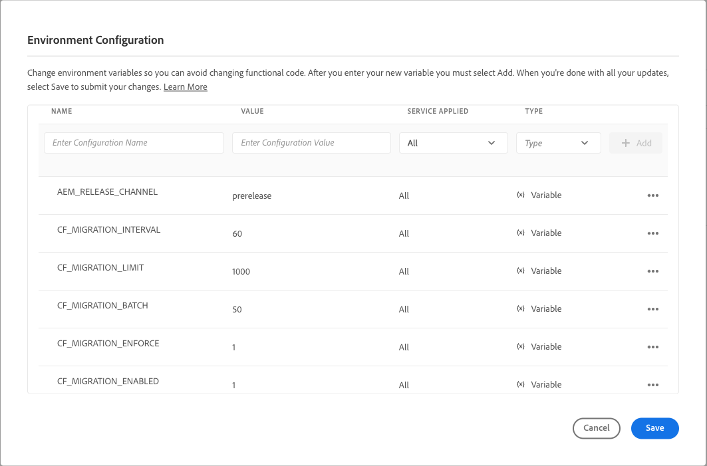

# Uppdatera dina innehållsfragment för optimerad GraphQL-filtrering {#updating-content-fragments-for-optimized-graphql-filtering}

För att optimera prestanda för dina GraphQL-filter måste du köra en procedur för att uppdatera dina innehållsfragment.

>[!NOTE]
>
>När du har uppdaterat dina innehållsfragment kan du följa rekommendationerna för [Optimera GraphQL-frågor](/help/headless/graphql-api/graphql-optimization.md).


## Förutsättningar {#prerequisites}

Det finns krav för den här uppgiften:

1. Se till att du har minst 2023.1.0-utgåvan av AEM as a Cloud Service.

1. Se till att användaren som utför uppgiften har de behörigheter som krävs:

   * minst `Deployment Manager` en roll i Cloud Manager krävs.

## Uppdatera dina innehållsfragment {#updating-content-fragments}

Så här kör du proceduren:

1. Aktivera uppdateringen genom att ange följande variabler för instansen med användargränssnittet i Cloud Manager:

   

   De tillgängliga variablerna är:

   <table style="table-layout:auto">
    <tbody>
     <tr>
      <th> </th>
      <th>Namn</th>
      <th>Värde</th>
      <th>Standardvärde</th>
      <th>Tjänst</th>
      <th>Används</th>
      <th>Typ</th>
      <th>Anteckningar</th>
     </tr>

   <tr>
      <td>1</td>
      <td>"CF_MIGRATION_ENABLED" </td>
      <td>`1` </td>
      <td>`0` </td>
      <td>Alla </td>
      <td> </td>
      <td>Variabel </td>
      <td>Enables(!=0) eller inaktiverar(0) som utlöser migreringsjobb för innehållsfragment. </td>
     </tr>
     <tr>
      <td>2</td>
      <td>`CF_MIGRATION_ENFORCE` </td>
      <td>`1` </td>
      <td>`0` </td>
      <td>Alla </td>
      <td> </td>
      <td>Variabel </td>
      <td>Tvinga (!=0) ommigrering av innehållsfragment.<br>Om flaggan anges till 0 utförs en stegvis migrering av CF:er. Detta innebär, om jobbet avslutas av någon anledning, att nästa körning av jobbet startar migreringen från den punkt där det avslutades. Observera att den allra första migreringen rekommenderas (value=1). </td>
     </tr>
     <tr>
      <td>3</td>
      <td>"CF_MIGRATION_BATCH" </td>
      <td>`50` </td>
      <td>`50` </td>
      <td>Alla </td>
      <td> </td>
      <td>Variabel </td>
      <td>Storlek på gruppen för att spara antal innehållsfragment efter migrering.<br>Detta gäller hur många CF:er som sparas i databasen i en batch och kan användas för att optimera antalet skrivningar i databasen. </td>
     </tr>
     <tr>
      <td>4</td>
      <td>"CF_MIGRATION_LIMIT" </td>
      <td>`1000` </td>
      <td>`1000` </td>
      <td>Alla </td>
      <td> </td>
      <td>Variabel </td>
      <td>Maximalt antal innehållsfragment som ska bearbetas samtidigt.<br>Se även anmärkningarna för "CF_MIGRATION_INTERVAL". </td>
     </tr>
     <tr>
      <td>5</td>
      <td>"CF_MIGRATION_INTERVAL" </td>
      <td>`60` </td>
      <td>`600` </td>
      <td>Alla </td>
      <td> </td>
      <td>Variabel </td>
      <td>Intervall (sekunder) för bearbetning av återstående innehållsfragment upp till nästa gräns<br>Det här intervallet betraktas också som en väntetid innan jobbet startas samt en fördröjning mellan bearbetningen av varje efterföljande CF_MIGRATION_LIMIT-antal CF:er.<br>(*)</td>
     </tr>
    </tbody>
   </table>

   >[!NOTE]
   >
   >(*)
   >
   >Värdet för `CF_MIGRATION_INTERVAL` kan också hjälpa till att beräkna den totala körningstiden för migreringsjobbet.
   >
   >Till exempel:
   >
   >* Totalt antal innehållsfragment = 20 000
   >* CF_MIGRATION_LIMIT = 1000
   >* CF_MIGRATION_INTERNAL = 60 (Sec)
   >* Ungefärlig tid krävs för att slutföra migreringen = 60 + (20 000/1 000 * 60) = 1 260 sek = 21 minuter
   >  De ytterligare&quot;60&quot; sekunder som läggs till i början beror på den initiala fördröjningen när jobbet startas.
   >
   >Du bör också vara medveten om att detta bara är *minimum* den tid som krävs för att slutföra jobbet, men inte I/O-tiden. Den faktiska tiden kan vara betydligt längre än denna uppskattning.

1. Övervaka uppdateringens förlopp och slutförande.

   För att göra detta ska du övervaka loggarna på författaren och publicera med golden från:

   * `com.adobe.cq.dam.cfm.impl.upgrade.UpgradeJob`

      * Författarloggar. till exempel:

        ```shell
        23.01.2023 13:13:45.926 *INFO* [sling-threadpool-09cbdb47-4d99-4c4c-b6d5-781b635ee21b-(apache-sling-job-thread-pool)-1-Content Fragment Upgrade Job Queue Config(cfm/upgrader)] com.adobe.cq.dam.cfm.impl.upgrade.UpgradeJob This instance<dd9ffdc1-0c28-4d04-9a96-5d4d223e457e> is the leader, will schedule the upgrade schedule job.
        ...
        23.01.2023 13:13:45.941 *INFO* [sling-threadpool-09cbdb47-4d99-4c4c-b6d5-781b635ee21b-(apache-sling-job-thread-pool)-1-Content Fragment Upgrade Job Queue Config(cfm/upgrader)] com.adobe.cq.dam.cfm.impl.upgrade.UpgradeJob Scheduling content fragments upgrade from version 0 to 1, slingJobId: 2023/1/23/13/13/50e1a575-4cd7-497b-adf0-62cb5768eedb_0, enforce: true, limit: 1000, batch: 50, interval: 60s
        
        23.01.2023 13:20:40.960 *INFO* [sling-threadpool-09cbdb47-4d99-4c4c-b6d5-781b635ee21b-(apache-sling-job-thread-pool)-1-Content Fragment Upgrade Job Queue Config(cfm/upgrader)] com.adobe.cq.dam.cfm.impl.upgrade.UpgradeJob Finished content fragments upgrade in 6m, slingJobId: 2023/1/23/13/13/50e1a575-4cd7-497b-adf0-62cb5768eedb_0, status: MaintenanceJobStatus{jobState=SUCCEEDED, statusMessage='Upgrade to version '1' succeeded.', errors=[], successCount=3781, failedCount=0, skippedCount=0}
        ```

      * Golden-publish logs; till exempel:

        ```shell
        23.01.2023 12:35:05.150 *INFO* [sling-threadpool-8abcc1bb-cdcb-46d4-8565-942ad8a73209-(apache-sling-job-thread-pool)-1-Content Fragment Upgrade Job Queue Config(cfm/upgrader)] com.adobe.cq.dam.cfm.impl.upgrade.UpgradeJob This instance<ad1b399e-77be-408e-bc3f-57097498fddb> is the leader, will schedule the upgrade schedule job.
        
        23.01.2023 12:35:05.161 *INFO* [sling-threadpool-8abcc1bb-cdcb-46d4-8565-942ad8a73209-(apache-sling-job-thread-pool)-1-Content Fragment Upgrade Job Queue Config(cfm/upgrader)] com.adobe.cq.dam.cfm.impl.upgrade.UpgradeJob Scheduling content fragments upgrade from version 0 to 1, slingJobId: 2023/1/23/12/34/ad1b399e-77be-408e-bc3f-57097498fddb_0, enforce: true, limit: 1000, batch: 50, interval: 60s
        ...
        23.01.2023 12:40:45.180 *INFO* [sling-threadpool-8abcc1bb-cdcb-46d4-8565-942ad8a73209-(apache-sling-job-thread-pool)-1-Content Fragment Upgrade Job Queue Config(cfm/upgrader)] com.adobe.cq.dam.cfm.impl.upgrade.UpgradeJob Finished content fragments upgrade in 5m, slingJobId: 2023/1/23/12/34/ad1b399e-77be-408e-bc3f-57097498fddb_0, status: MaintenanceJobStatus{jobState=SUCCEEDED, statusMessage='Upgrade to version '1' succeeded.', errors=[], successCount=3781, failedCount=0, skippedCount=0}
        ```

   Kunder som har aktiverat åtkomst till miljöloggar med Splunk kan använda exempelfrågan nedan för att övervaka uppgraderingsprocessen. Mer information om att aktivera Splunk-loggning finns i [Felsöka produktion och scen](/help/implementing/developing/introduction/logging.md#debugging-production-and-stage) sida.

   ```splunk
   index=<indexName> sourcetype=aemerror aem_envId=<environmentId> msg="*com.adobe.cq.dam.cfm.impl.upgrade.UpgradeJob Finished*" 
   (aem_tier=golden-publish OR aem_tier=author) | table _time aem_tier pod_name msg | sort -_time desc
   ```

   Var:

   * `environmentId` - en kundmiljöidentifierare, till exempel `e1234`
   * `indexName` - ett kundindexnamn, samla in `aemerror` händelser

   Exempelutdata:

   <table style="table-layout:auto">
     <thead>
       <tr>
       <th>tid</th>
       <th>aem_tier</th>
       <th>pod_name</th>
       <th>msg</th>
       </tr>
     </thead> 
     <tbody>
       <tr>
         <td>2023-04-21 06:00:35.723</td>
         <td>författare</td>
         <td>cm-p1234-e1234-aem-author-76d6dc4b79-8lsb5</td>
         <td>[sling-threadpool-bb5da4dd-6b05-4230-93ea-1d5cd242e24f-(apache-sling-job-thread-pool)-1-Content Fragment Upgrade Job Queue Config(cfm/upsekretessen)] com.adobe.cq.dam.cfm.impl .upgrade.UpgradeJob Avslutade uppgradering av innehållsfragment på 391 m, slingJobId: 2023/4/20/23/16/db7963df-e267-489b-b69a-5930b0dadb37_0, status: MaintenanceJobStatus{jobState=SUCCEEDED, statusMessage='Uppgradering till version '1' lyckades.', errors=[], successCount=36756, failedCount=0, SkippedCount=0}</td>
       </tr>
       <tr>
         <td>2023-04-21 06:05:48.207</td>
         <td>gyllene-publicering</td>
         <td>cm-p1234-e1234-aem-golden-publish-64487c9c5-lvkv2</td>
         <td>[sling-threadpool-284b9a9a-8454-461e-9bdb-44866c6ddfb1-(apache-sling-job-thread-pool)-1-Content Fragment Upgrade Job Queue Config(cfm/upsekretessing)] com.adobe.cq.dam.cfm.cfm.m.cfm.fm.cfm.m.m.cfm.m.fm.fm.fm.fm.fm.fm.fm.fm.fm.fm.fm.fm.fm.fm.fm.a impl.upgrade.UpgradeJob Avslutade uppgradering av innehållsfragment 211 m, slingJobId: 2023/4/20/23/15/66c1690a-cdb7-4e66-bc52-90f3394ddfc_0, status: MaintenanceJobStatus{jobState=SUCCEEDED, statusMessage='Uppgradering till version '1' lyckades.', errors=[], successCount=19557, failedCount=0, SkippedCount=0}</td>
       </tr>
     </tbody>
   <table>

1. Inaktivera uppdateringsproceduren.

   >[!IMPORTANT]
   >
   >Det här steget krävs för att slutföra uppgraderingen.

   När uppdateringsproceduren har körts återställer du molnmiljövariabeln `CF_MIGRATION_ENABLED` till &#39;0&#39;, för att utlösa återvinning av alla poder.

   <table style="table-layout:auto">
    <tbody>
     <tr>
      <th> </th>
      <th>Namn</th>
      <th>Värde</th>
      <th>Standardvärde</th>
      <th>Tjänst</th>
      <th>Används</th>
      <th>Typ</th>
      <th>Anteckningar</th>
     </tr>
     <tr>
      <td></td>
      <td>"CF_MIGRATION_ENABLED" </td>
      <td>`0` </td>
      <td>`0` </td>
      <td>Alla </td>
      <td> </td>
      <td>Variabel </td>
      <td>Inaktiverar(0) (eller Enables(!)=0)) utlöser migreringsjobb för innehållsfragment. </td>
     </tr>
    </tbody>
   </table>

   >[!NOTE]
   >
   >Detta är särskilt viktigt för publiceringsnivån, eftersom innehållsuppdateringen endast görs vid publicering i guld och när poder återvinns, är alla normala publiceringsrutor baserade på publiceringen i golden.

1. Verifiera att uppdateringsproceduren har slutförts.

   Du kan verifiera att uppdateringen har slutförts med hjälp av databaswebbläsaren i Cloud Managers utvecklarkonsol för att kontrollera data för innehållsfragment.

   * Innan den första fullständiga migreringen `cfGlobalVersion` egenskapen finns inte.
Därför finns den här egenskapen på JCR-noden `/content/dam` med värdet `1`, bekräftar att migreringen har slutförts.

   * Du kan även kontrollera följande egenskaper för de enskilda innehållsfragmenten:

      * `_strucVersion` ska ha värdet `1`
      * `indexedData` struktur måste finnas

     >[!NOTE]
     >
     >Proceduren uppdaterar innehållsfragment för författare och publiceringsinstanser.
     >
     >Vi rekommenderar därför att du utför verifieringen via webbläsaren i databasen för *minst* en författare *och* en publiceringsinstans.

## Begränsningar {#limitations}

Observera följande begränsningar:

* Optimering av prestanda för GraphQL-filter är endast möjligt efter en fullständig uppdatering av alla dina innehållsfragment (vilket indikeras av närvaron av `cfGlobalVersion` egenskap för JCR-noden `/content/dam`)

* Om innehållsfragment importeras från ett innehållspaket (med `crx/de`) när uppdateringsproceduren har körts kommer dessa innehållsfragment inte att beaktas i GraphQL-frågeresultat förrän uppdateringsproceduren körs igen.
