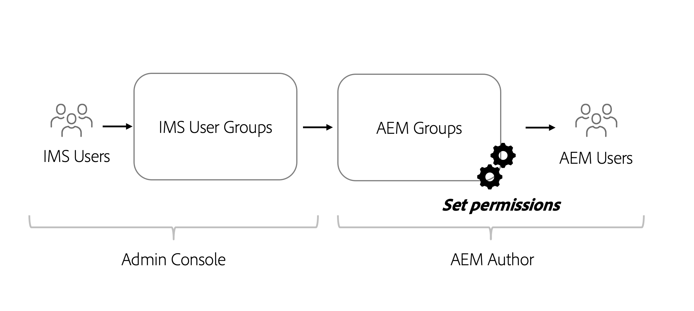

# Behörighetsaspekter för headless-innehåll

Med en headless-implementering finns det flera säkerhets- och behörighetsområden som bör hanteras. Tillstånd och personer kan i stort sett övervägas baserat på den AEM miljön **Upphovsman** eller **Publicera**. Varje miljö innehåller olika personligheter och med olika behov.

## Överväganden om författartjänst

I författartjänsten kan interna användare skapa, hantera och publicera innehåll. Behörigheterna kretsar kring de olika personer som hanterar innehåll.

### Hantera behörigheter på gruppnivå

Som en god praxis bör behörigheter anges för grupper i AEM. Dessa grupper kallas även lokala grupper och kan hanteras i AEM redigeringsmiljö.

Det enklaste sättet att hantera gruppmedlemskap är att använda Adobe Identity Management System-grupper (IMS) och tilldela [IMS-grupper till lokala AEM](https://experienceleague.adobe.com/docs/experience-manager-cloud-service/content/security/ims-support.html?lang=en#managing-permissions-in-aem).

På en hög nivå är processen:

1. Lägg till IMS-användare i en ny eller befintlig IMS-användargrupp med [Admin Console](https://adminconsole.adobe.com/)
1. IMS-grupper synkroniseras med AEM när användare loggar in.
1. Tilldela IMS-grupper till AEM.
1. Ange behörigheter AEM grupper.
1. När användare loggar in på AEM och autentiseras via IMS, ärver de behörigheterna för den AEM gruppen.

>[!TIP]
>
> En detaljerad videogenomgång av hur du hanterar IMS och AEM användare och grupper finns [här](https://experienceleague.adobe.com/docs/experience-manager-learn/cloud-service/accessing/overview.html).

Att hantera **grupper** i AEM, navigera till **verktyg** > **Säkerhet** > **Grupper**.

Om du vill hantera behörigheter för grupper i AEM går du till **verktyg** > **Säkerhet** > **Behörigheter**.

### DAM-användare

&quot;DAM&quot; står i det här sammanhanget för Digital Asset Management. The **DAM-användare** är en grupp i AEM som kan användas för&quot;vardagliga&quot; användare som hanterar digitala resurser och innehållsfragment. Den här gruppen ger behörigheter till **visa**, **lägg till**, **uppdatera**, **delete** och **publicera** Innehållsfragment och alla andra filer i AEM Assets.

Om IMS används för gruppmedlemskap lägger du till lämpliga IMS-grupper som medlemmar i **DAM-användare** grupp. Medlemmar i IMS-gruppen ärver behörigheterna för DAM-användargruppen när de loggar in i AEM.

#### Anpassa användargruppen för DAM

Det är bäst att inte ändra behörigheter för en grupp utanför rutan direkt. I stället kan du även skapa en eller flera egna grupper som är utformade efter **DAM-användare** gruppbehörigheter och begränsa åtkomsten ytterligare till olika **mappar** inom AEM Assets.

För mer detaljerad behörighet använder du **Behörigheter** konsol i AEM och uppdatera sökvägen från `/content/dam` till en mer specifik sökväg, det vill säga `/content/dam/mycontentfragments`.

Det kan vara önskvärt att ge den här gruppen användarbehörigheter för att skapa och redigera innehållsfragment, men inte för att ta bort. Om du vill granska och tilldela behörigheter för redigering, men inte ta bort, se [Innehållsfragment - Ta bort överväganden](/help/sites-cloud/administering/content-fragments/delete-considerations.md).

### Modellredigerare

Möjlighet att ändra **Modeller för innehållsfragment** ska lämnas till administratörer eller en **liten grupp** av användare med förhöjd behörighet. Att ändra innehållsfragmentmodellen har många effekter längre fram i kedjan.

>[!CAUTION]
>
>Ändringar av modeller för innehållsfragment ändrar det underliggande GraphQL-API som headless-program är beroende av.

Om du vill skapa en grupp som hanterar modeller för innehållsfragment men inte fullständig administratörsåtkomst, kan du skapa en grupp med följande åtkomstkontrollposter:

| Bana | Behörighet | Behörighet |
|-----| -------------| ---------|
| `/conf` | **tillåt** | `jcr:read` |
| `/conf/<config-name>/settings/dam/cfm` | **tillåt** | `rep:write`, `crx:replicate` |

## Publicera tjänstbehörigheter

Publiceringstjänsten betraktas som&quot;live&quot;-miljö och är vanligtvis det GraphQL API-användare interagerar med. Innehåll som har redigerats och godkänts av författartjänsten publiceras till publiceringstjänsten. Det headless-programmet använder sedan det godkända innehållet från publiceringstjänsten via GraphQL API:er.

Som standard är innehåll som visas via AEM Publish-tjänstens GraphQL-slutpunkter tillgängliga för alla, inklusive oautentiserade användare.

### Innehållsbehörigheter

Innehåll som exponeras via GraphQL API:er kan begränsas med [Stängda användargrupper](https://experienceleague.adobe.com/docs/experience-manager-learn/assets/advanced/closed-user-groups.html) ange för resursmappar, som anger vilka AEM användargrupper (och deras medlemmar) som kan komma åt innehållet i resursmapparna.

Assets CUGs jobbar med:

* Först nekas all åtkomst till mappen och undermapparna
* Ge sedan läsåtkomst till mappen och undermapparna för alla AEM användargrupper som är listade i CUG-listan

CUG-grupper kan konfigureras för resursmappar som innehåller innehåll som exponeras via GraphQL API:er. Åtkomsten till resursmappar vid publicering AEM ska styras via användargrupper i stället för direkt från användaren. Skapa (eller återanvänd) en AEM användargrupp som ger åtkomst till resursmappar som innehåller innehåll som exponeras av GraphQL API:er.

#### Välj autentiseringsschema{#publish-permissions-users}

The [AEM Headless SDK](https://github.com/adobe/aem-headless-client-js#create-aemheadless-client) har stöd för två typer av autentisering:

* [Tokenbaserad autentisering](/help/implementing/developing/introduction/generating-access-tokens-for-server-side-apis.md) med inloggningsuppgifter bundna till ett enda tekniskt konto.
* Grundläggande autentisering med AEM användare.

### Få åtkomst till GraphQL API

HTTP-begäranden som ger [lämpliga autentiseringsuppgifter](https://github.com/adobe/aem-headless-client-js#create-aemheadless-client) till AEM Publish-tjänstens GraphQL API-slutpunkter innehåller innehåll som inloggningsuppgifterna har behörighet att läsa och anonymt tillgängligt innehåll. Andra användare av GraphQL API kan inte läsa innehållet i de CUG-skyddade mapparna.
