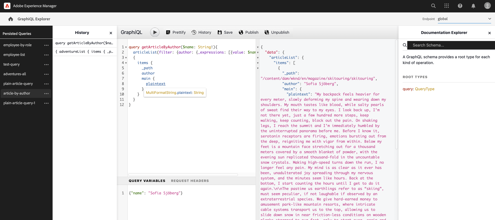

# Skapa en API-begäran - Headless-konfiguration {#accessing-delivering-content-fragments}

Lär dig hur du använder GraphQL API för headless-leverans av Content Fragment-innehåll och AEM Assets REST API för att hantera innehållsfragment.

## Vad är GraphQL och Assets REST API:er? {#what-are-the-apis}

[Nu när du har skapat några innehållsfragment,](create-content-fragment.md) kan du använda AEM-API:er för att leverera dem utan problem.

* [GraphQL API](/help/headless/graphql-api/content-fragments.md) I kan du skapa begäranden om åtkomst till och leverans av innehållsfragment. API:t erbjuder den mest robusta uppsättningen funktioner för att fråga efter och konsumera innehåll i innehållsfragment.
   * Om du vill använda det här [slutpunkter måste definieras och aktiveras i AEM](/help/headless/graphql-api/graphql-endpoint.md)och, om det behövs, [GraphiQL-gränssnittet är installerat](/help/headless/graphql-api/graphiql-ide.md).
* [Resursens REST API](/help/assets/content-fragments/assets-api-content-fragments.md) I kan du skapa och ändra innehållsfragment (och andra resurser).

Resten av guiden fokuserar på GraphQL-åtkomst och leverans av innehållsfragment.

## Aktivera GraphQL-slutpunkt

Innan GraphQL API:er kan användas måste en GraphQL-slutpunkt skapas.

1. Navigera till **verktyg**, **Resurser** väljer **GraphQL**.
1. Välj **Skapa**.
1. The **Skapa ny GraphQL-slutpunkt** öppnas. Här kan du ange:
   * **Namn**: Slutpunktens namn. du kan skriva vilken text som helst.
   * **Använd GraphQL-schema från**: Använd listrutan för att välja önskad konfiguration.
1. Bekräfta med **Skapa**.
1. I konsolen finns en **Bana** kommer nu att visas baserat på den konfiguration som skapades tidigare. Det här är sökvägen som används för att köra GraphQL-frågor.

   ```
   /content/cq:graphql/<configuration-name>/endpoint
   ```

Mer information om aktivering [GraphQL-slutpunkter finns här](/help/headless/graphql-api/graphql-endpoint.md).

## Fråga innehåll med GraphQL med GraphiQL

Informationsarkitekterna måste utforma frågor för sina kanalslutpunkter för att kunna leverera innehåll. Dessa frågor behöver i allmänhet bara övervägas en gång per slutpunkt och modell. I den här guiden behöver vi bara skapa en.

GraphiQL är en IDE som kan installeras i en AEM. Följ stegen på [Använda GraphiQL IDE](/help/headless/graphql-api/graphiql-ide.md) för installation i AEM.

1. Logga in AEM as a Cloud Service och gå till GraphiQL-gränssnittet:
   * Till exempel: `https://<host>:<port>/aem/graphiql.html`.

1. GraphiQL IDE är en webbläsarredigerare för GraphQL. Du kan använda den för att skapa frågor för att hämta innehållsfragment och leverera dem i headlessläge som JSON.
   * I den nedrullningsbara listrutan högst upp till höger kan du välja slutpunkten.
   * I en panel längst till vänster visas de beständiga frågorna (om de är tillgängliga)
   * På panelen i mitten till vänster kan du skapa din fråga.
   * Resultaten visas på panelen i det mittersta högra hörnet.
   * Frågeredigeraren har funktioner för kodkomplettering och snabbtangenter för att enkelt köra frågan.

   

1. Anta att modellen vi skapade anropades `person` med fält `firstName`, `lastName`och `position`kan vi skapa en enkel fråga för att hämta innehållet i vårt innehållsfragment.

   ```text
   query 
   {
     personList {
       items {
         _path
         firstName
         lastName
         position
       }
     }
   }
   ```

1. Skriv frågan i den vänstra panelen.
   

1. Klicka på **Kör fråga** eller använder `Ctrl-Enter` snabbtangenten och resultatet visas som JSON i den högra panelen.
   

1. Klicka på **Dokument** på sidans övre högra hörn för att visa sammanhangsberoende dokumentation som hjälper dig att skapa frågor som anpassar sig till dina egna modeller.
   

GraphQL möjliggör strukturerade frågor som inte bara kan ha specifika datauppsättningar eller enskilda dataobjekt som mål, utan också kan leverera specifika element i objekten, kapslade resultat, har stöd för frågevariabler och mycket annat.

GraphQL kan undvika både iterativa API-begäranden och överleverans, och i stället möjliggör massleverans av exakt det som behövs för återgivning som svar på en enda API-fråga. Den resulterande JSON kan användas för att leverera data till andra webbplatser eller appar.

## Nästa steg {#next-steps}

Så ja! Ni har nu en grundläggande förståelse för innehållshantering utan problem i AEM. Det finns förstås många fler resurser där du kan fördjupa dig i en heltäckande bild av de funktioner som finns.

* **[Innehållsfragment](/help/assets/content-fragments/content-fragments.md)** - Mer information om hur du skapar och hanterar innehållsfragment
* **[Stöd för innehållsfragment i AEM Assets HTTP API](/help/assets/content-fragments/assets-api-content-fragments.md)** - Mer information om hur du får åtkomst till AEM direkt via HTTP API, via CRUD-åtgärder (Create, Read, Update, Delete)
* **[GraphQL API](/help/headless/graphql-api/content-fragments.md)** - Mer information om hur du levererar innehållsfragment utan problem
