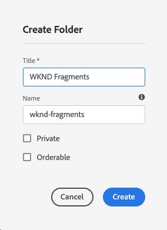

# Skapa en resursmapp - Headless-konfiguration {#creating-an-assets-folder}

Använd AEM Content Fragment Models för att definiera strukturen för Content Fragments, som är grunden för ditt headless-innehåll. Innehållsfragment lagras sedan i resursmappar.

## Vad är en resursmapp? {#what-is-an-assets-folder}

[Nu när du har skapat modeller för innehållsfragment](create-content-model.md) som definierar den struktur du vill ha för framtida innehållsfragment, är du antagligen glad att kunna skapa några fragment.

Du måste dock först skapa en resursmapp där du lagrar dem.

Resursmappar används för [ordna traditionellt innehåll](/help/assets/manage-digital-assets.md) som bilder och videor, tillsammans med innehållsfragment.

## Så här skapar du en resursmapp {#how-to-create-an-assets-folder}

En administratör behöver bara skapa mappar då och då för att ordna innehållet när det skapas. I den här guiden behöver vi bara skapa en mapp.

1. Logga in AEM as a Cloud Service och välj **Navigering -> Resurser -> Filer**.
1. Tryck eller klicka **Skapa -> Mapp**.
1. Ange en **Titel** och **Namn** för din mapp.
   * The **Titel** ska vara beskrivande.
   * The **Namn** blir nodnamnet i databasen.
      * Den genereras automatiskt baserat på titeln och justeras enligt [AEM namnkonventioner](/help/implementing/developing/introduction/naming-conventions.md).
      * Den kan vid behov justeras.

   
1. Markera mappen som du nyss skapade genom att hålla muspekaren nedtryckt och trycka på bockmarkeringen. Välj sedan **Egenskaper** i verktygsfältet (eller använd `p` [kortkommando](/help/sites-cloud/authoring/getting-started/keyboard-shortcuts.md)).
1. I **Egenskaper** väljer du **Cloud Services** -fliken.
1. För **Molnkonfiguration** Välj [som du skapade tidigare.](create-configuration.md)
   
1. Tryck eller klicka **Spara och stäng**.
1. Tryck eller klicka **OK** i bekräftelsefönstret.

   

Du kan skapa ytterligare undermappar i den mapp du just skapade. Undermapparna ärver **Molnkonfiguration** för den överordnade mappen. Detta kan dock åsidosättas om du vill använda modeller från en annan konfiguration.

Om du använder en lokaliserad platsstruktur kan du [skapa en språkrot](/help/assets/translate-assets.md) nedanför den nya mappen.

## Nästa steg {#next-steps}

Nu när du har skapat en mapp för dina innehållsfragment kan du gå vidare till den fjärde delen av guiden Komma igång och [skapa innehållsfragment](create-content-fragment.md).

>[!TIP]
>
>Fullständig information om hur du hanterar innehållsfragment finns i [Dokumentation för innehållsfragment](/help/sites-cloud/administering/content-fragments/content-fragments.md)
