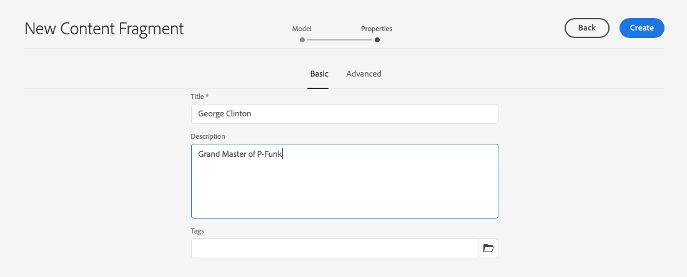
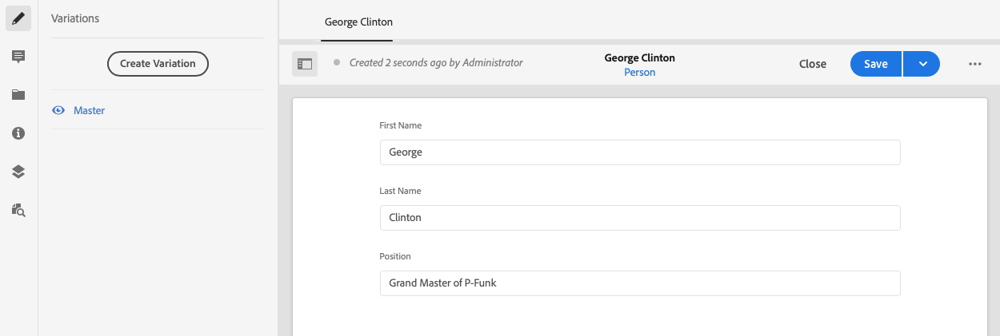

# Skapa innehållsfragment - Headless-inställningar {#creating-content-fragments}

Lär dig använda AEM innehållsfragment för att utforma, skapa, strukturera och använda sidoberoende innehåll för rubrikfri leverans.

## Vad är innehållsfragment? {#what-are-content-fragments}

[Nu när du har skapat en resursmapp](create-assets-folder.md) där du kan lagra dina innehållsfragment kan du nu skapa fragmenten!

Med Content Fragments kan du utforma, skapa, strukturera och publicera sidoberoende innehåll. Med dem kan du förbereda innehåll som är klart för användning på flera platser och i flera kanaler.

Innehållsfragment innehåller strukturerat innehåll och kan levereras i JSON-format.

## Så här skapar du ett innehållsfragment {#how-to-create-a-content-fragment}

Innehållsförfattare skapar valfritt antal innehållsfragment som representerar det innehåll de skapar. Detta kommer att vara deras huvuduppgift i AEM. I den här guiden behöver vi bara skapa en.

1. Logga in AEM as a Cloud Service och välj **Navigering -> Resurser**.
1. Tryck eller klicka på [mapp som du skapade tidigare.](create-assets-folder.md)
1. Tryck eller klicka **Skapa -> Innehållsfragment**.
1. Skapandet av ett innehållsfragment presenteras som en guide i två steg. Välj först vilken modell som du vill använda för att skapa ditt innehållsfragment och tryck eller klicka på **Nästa**.
   * Vilka modeller som är tillgängliga beror på [**Molnkonfiguration** du har definierat för resursmappen](create-assets-folder.md) där du skapar innehållsfragmentet.
   * Om du får meddelandet `We could not find any models`kontrollerar du konfigurationen för din resursmapp.

   
1. Ange en **Titel**, **Beskrivning** och **Taggar** vid behov och tryck eller klicka **Skapa**.

   
1. Tryck eller klicka **Öppna** i bekräftelsefönstret.

   
1. Ange information om innehållsfragmentet i Content Fragment Editor.

   
1. Tryck eller klicka **Spara** eller  **Spara och stäng**.

Innehållsfragment kan referera till andra innehållsfragment, vilket möjliggör en kapslad innehållsstruktur om det behövs.

Innehållsfragment kan också referera till andra resurser i AEM. [Dessa resurser måste lagras i AEM](/help/assets/manage-digital-assets.md) innan du skapar ett referensinnehållsfragment.

## Nästa steg {#next-steps}

Nu när du har skapat ett innehållsfragment kan du gå vidare till den sista delen av guiden Komma igång och [skapa API-förfrågningar för åtkomst och leverans av innehållsfragment.](create-api-request.md)

>[!TIP]
>
>Fullständig information om hur du hanterar innehållsfragment finns i [Dokumentation för innehållsfragment](/help/assets/content-fragments/content-fragments.md)
