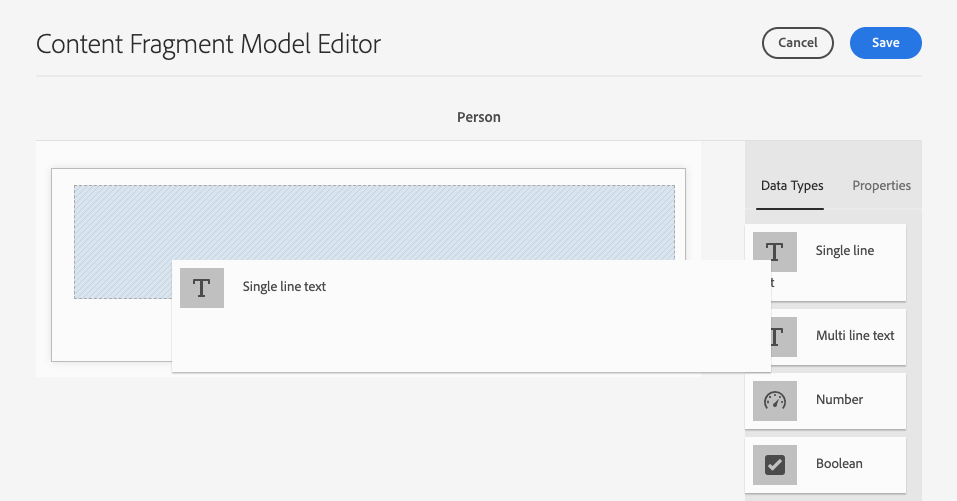

# Skapa modeller för innehållsfragment - Headless-konfiguration {#creating-content-fragment-models}

Definiera strukturen för det innehåll du skapar och använd AEM headless-funktioner med hjälp av Content Fragment-modeller.

## Vad är Content Fragment Models? {#what-are-content-fragment-models}

[Nu när du har skapat en konfiguration](create-configuration.md) du kan använda den för att skapa modeller för innehållsfragment.

Modeller för innehållsfragment definierar strukturen för data och innehåll som du skapar och hanterar i AEM. De fungerar som en sorts ställningar för ert innehåll. När du väljer att skapa innehåll väljer författarna bland de modeller för innehållsfragment som du definierar, som vägleder dem när de skapar innehåll.

## Så här skapar du en innehållsfragmentmodell {#how-to-create-a-content-fragment-model}

En informationsarkitekt skulle utföra dessa uppgifter endast sporadiskt när nya modeller behövs. I den här guiden behöver vi bara skapa en modell.

1. Logga in AEM as a Cloud Service och välj **verktyg**, **Allmänt**, **Modeller för innehållsfragment**.
1. Tryck eller klicka på mappen som skapades när du skapade konfigurationen.

   
1. Tryck eller klicka **Skapa**.
1. Ange en **Modelltitel**, **Taggar** och **Beskrivning**. Du kan också markera/avmarkera **Aktivera modell** för att kontrollera om modellen aktiveras omedelbart när den skapas.

   
1. I bekräftelsefönstret: tryck eller klicka **Öppna** för att konfigurera modellen.

   
1. Använda **Modellredigerare för innehållsfragment**, bygg din Content Fragment Model genom att dra och släppa fält från **Datatyper** kolumn.

   

1. När du har placerat ett fält måste du konfigurera dess egenskaper. Redigeraren växlar automatiskt till **Egenskaper** -fliken för det tillagda fältet där du kan ange de obligatoriska fälten.

   

1. När du är klar med att skapa modellen trycker du eller klickar **Spara**.

1. Läget för den nyskapade modellen beror på om du har valt **Aktivera modell** när du skapar modellen:
   * vald - den nya modellen kommer redan att **Aktiverad**
   * inte valt - den nya modellen skapas i **Utkast** läge

1. Om modellen inte redan är aktiverad måste den **Aktiverad** för att använda den.
   1. Välj den modell du just skapade och tryck eller klicka sedan på **Aktivera**.

      
   1. Bekräfta aktivering av modellen genom att trycka eller klicka **Aktivera** i bekräftelsedialogrutan.

      
1. Modellen är nu aktiverad och klar att användas.

   

The **Modellredigerare för innehållsfragment** har stöd för många olika datatyper, till exempel enkla textfält, resursreferenser, referenser till andra modeller och JSON-data.

Du kan skapa flera modeller. Modeller kan referera till andra innehållsfragment. Använd [konfigurationer](create-configuration.md) för att ordna dina modeller.

## Nästa steg {#next-steps}

Nu när du har definierat strukturen för dina innehållsfragment genom att skapa modeller kan du gå vidare till den tredje delen av guiden Komma igång och [skapa mappar där du lagrar fragmenten själva.](create-assets-folder.md)

>[!TIP]
>
>Fullständig information om modeller för innehållsfragment finns i [Dokumentation för Content Fragment Models](/help/assets/content-fragments/content-fragments-models.md)
