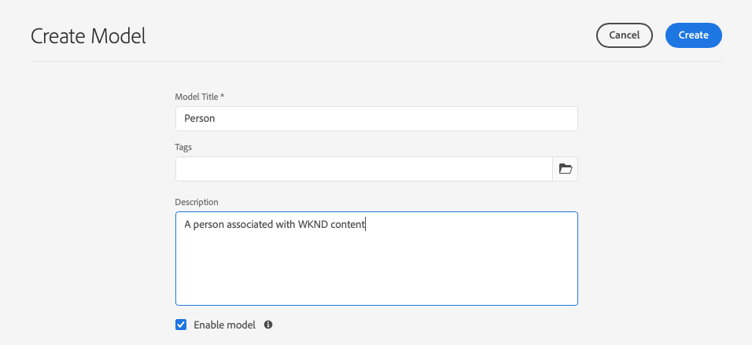
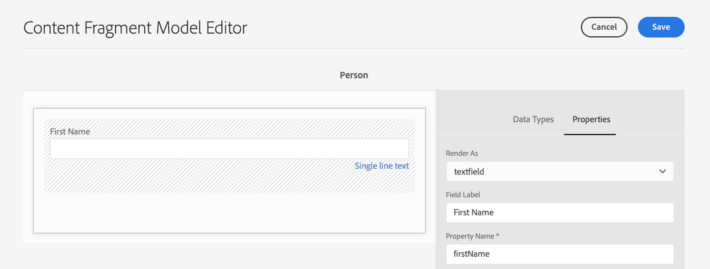
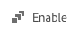

# Skapa modeller för innehållsfragment - Headless-konfiguration {#creating-content-fragment-models}

Definiera strukturen för det innehåll du ska skapa och tjäna med AEM headless-funktioner genom att använda Content Fragment Models.

## Vad är Content Fragment Models? {#what-are-content-fragment-models}

[Nu när du har skapat en konfiguration](create-configuration.md) kan du använda den för att skapa modeller för innehållsfragment.

Modeller för innehållsfragment definierar strukturen för data och innehåll som du skapar och hanterar i AEM. De fungerar som en sorts ställningar för ert innehåll. När du väljer att skapa innehåll väljer författarna bland de modeller för innehållsfragment som du definierar, som vägleder dem när de skapar innehåll.

## Så här skapar du en innehållsfragmentmodell {#how-to-create-a-content-fragment-model}

En informationsarkitekt skulle utföra dessa uppgifter endast sporadiskt när nya modeller behövs. I den här guiden behöver vi bara skapa en modell.

1. Logga in på AEM as a Cloud Service och välj **Verktyg**, **Allmänt**, **Content Fragment Models** på huvudmenyn.
1. Välj den mapp som skapades när du skapade konfigurationen.

   
1. Välj **Skapa**.
1. Ange en **modelltitel**, **taggar** och **beskrivning**. Du kan också markera/avmarkera **Aktivera modell** för att kontrollera om modellen aktiveras omedelbart när den skapas.

   
1. I bekräftelsefönstret väljer du **Öppna** för att konfigurera modellen.

   
1. Använd **Modellredigeraren för innehållsfragment** och skapa innehållsfragmentmodellen genom att dra och släppa fält från kolumnen **Datatyper**.

   

1. När du har placerat ett fält måste du konfigurera dess egenskaper. Redigeraren växlar automatiskt till fliken **Egenskaper** för det tillagda fältet där du kan ange de obligatoriska fälten.

   

1. Välj **Spara** när du är klar med att skapa modellen.

1. Den skapade modellens läge beror på om du valde **Aktivera modell** när du skapade modellen:
   * vald - den nya modellen kommer redan att vara **Aktiverad**
   * inte markerad - den nya modellen skapas i läget **Utkast**

1. Om modellen inte redan är aktiverad måste den vara **Enabled** för att kunna använda den.
   1. Markera modellen som du skapade och välj sedan **Aktivera**.

      
   1. Bekräfta aktiveringen av modellen genom att trycka på eller klicka på **Aktivera** i bekräftelsedialogrutan.

      
1. Modellen är nu aktiverad och klar att användas.

   

**Modellredigeraren för innehållsfragment** stöder många olika datatyper, till exempel enkla textfält, resursreferenser, referenser till andra modeller och JSON-data.

Du kan skapa flera modeller. Modeller kan referera till andra innehållsfragment. Använd [konfigurationer](create-configuration.md) för att ordna dina modeller.

## Nästa steg {#next-steps}

Nu när du har definierat strukturerna för dina innehållsfragment genom att skapa modeller kan du gå vidare till den tredje delen av guiden Komma igång och [skapa mappar där du själva sparar fragmenten](create-assets-folder.md).

>[!TIP]
>
>Fullständig information om modeller för innehållsfragment finns i [dokumentationen för modeller för innehållsfragment](/help/sites-cloud/administering/content-fragments/managing-content-fragment-models.md).
