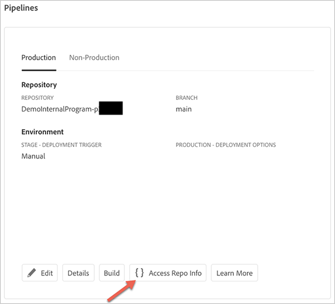

# Åtkomst till databaser {#accessing-repos}

Du kan komma åt och hantera din Git-databas med hjälp av Git-kontohantering för självbetjäning från användargränssnittet i Cloud Manager.

## Använda kontohantering för självbetjäningsdatabaser {#self-service-repos}

Använd knappen **Åtkomst till repo-information** som är tillgänglig från användargränssnittet i Cloud Manager, som är mest framträdande på pipeline-kortet.

1. Gå till **Pipelines**-kortet från sidan **Programöversikt**.

1. Du kommer att visa alternativet **Åtkomst till repo-information** för att komma åt och hantera din Git-databas.

   

   Om du dessutom väljer pipelinefliken **Icke-produktion** visas även alternativet **Åtkomst till repo-information**.

   

   >[!NOTE]
   >Alternativet **Åtkomst till repo-information** är synligt för användare i rollen Utvecklare eller Distributionshanterare. Om du klickar på den här knappen öppnas en dialogruta där användaren kan hitta URL:en till sin Git-databas för Cloud Manager tillsammans med användarnamn och lösenord.

   

   Viktigt att tänka på när du hanterar ditt Git i Cloud Manager är:

   * **URL**: Databas-URL
   * **Användarnamn**: Användarnamnet
   * **Lösenord**: Värdet som visas när användaren klickar på knappen **Generera lösenord**.

      >[!NOTE]
      >En användare kan checka ut en kopia av sin kod och göra ändringar i den lokala koddatabasen. När det är klart kan användaren spara sina kodändringar i fjärrkoddatabasen i Cloud Manager.
