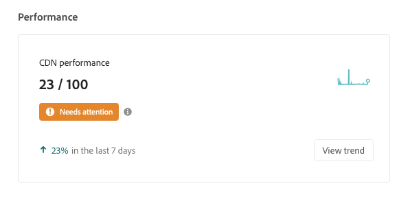

# Kontrollpanel för CDN-prestanda {#cdn-performance}

Förstå hur Cloud Manager utvärderar prestanda för leveransnätverk (CDN) och vad du kan lära dig från kontrollpanelen.

## Ökning {#overview}

Alla program i Cloud Manager har en kontrollpanel för CDN-prestanda. Den här kontrollpanelen ger en övergripande poäng för CDN-prestanda tillsammans med trender, varningar och förslag på förbättringar efter behov.



## Åtkomst till kontrollpanelen {#accessing}

CDN-kontrollpanelen finns på översiktssidan för alla program.

1. Logga in i Cloud Manager på [my.cloudmanager.adobe.com](https://my.cloudmanager.adobe.com/) och välja lämplig organisation.

1. På **[Mina program](/help/implementing/cloud-manager/getting-access-to-aem-in-cloud/editing-programs.md#my-programs)** trycker eller klickar du på det program vars CDN-kontrollpanel du vill visa.

   

1. På **Programöversikt** sidan med ditt program, bläddra nedåt under **Miljö** och **Pipelines** kort för att se **Prestanda** kort.

   

## Använda kontrollpanelen {#using}

Kontrollpanelen ger en övergripande poäng för CDN-prestanda tillsammans med trender, varningar och förslag på förbättringar efter behov.


Om du vill ha mer information om CDN-prestanda och förslag på hur du kan förbättra den trycker du eller klickar **Visa trend**.


Tryck eller klicka **Visa** nedanför diagrammet för att ändra tidsrymden.

Om du vill ha förslag på hur du kan förbättra CDN-prestanda väljer du **Recommendations** -fliken.


Tryck eller klicka på markören bredvid en rekommendation i listan för att visa information om vilka åtgärder som ska vidtas för att förbättra och orsaken till problemet.

## Träffdefinition i cache {#cache-hit}

Träffgraden i cacheminnet är ett mått på hur många innehållsbegäranden som ett cacheminne kan fylla, jämfört med hur många begäranden det tar emot. Ju högre frekvens en cache-träff har, desto bättre prestanda blir ett CDN.

>[!TIP]
>
>Adobe rekommenderar att användare siktar på en cacheträffkvot på 99 %.

```text
Cache Hit Ratio = Cache Hits / (Hits + Misses + Passes + Other)
```

* **Träff** - Data begärs från cacheminnet och hittas.
* **Fröken** - Data begärs från cacheminnet och kan inte hittas.
* **Godkänd** - Data begärs från cacheminnet och är inställda på att inte cachelagra dessa data i något fall.
* **Övriga** - Alla dataförfrågningar från cacheminnet som inte matchar något annat fall.

Cachelagringsstatistik uppdateras var 24:e timme.

>[!TIP]
>
>Mer information om hur Cloud Manager och CDN interagerar med Dispatcher finns i dokumentet [Cachelagring i AEM as a Cloud Service.](/help/implementing/dispatcher/caching.md)
