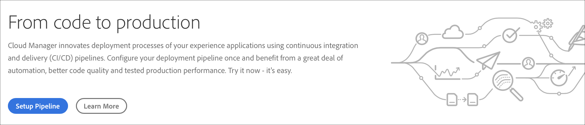
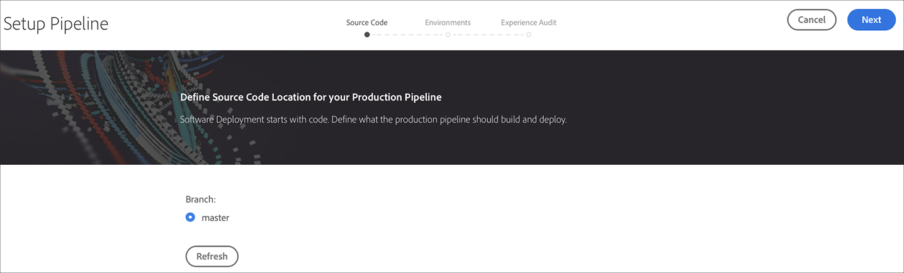
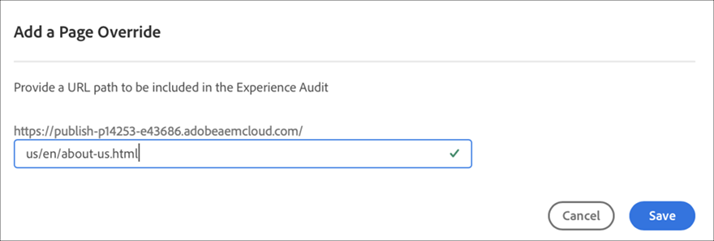
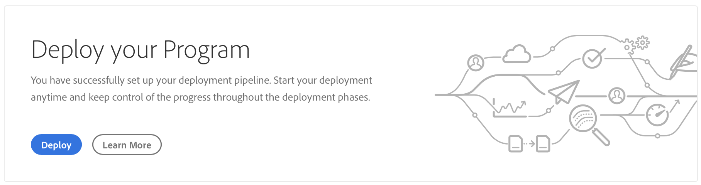

# Konfigurera CI-CD-pipeline {#configure-ci-cd-pipeline}

I Cloud Manager finns det två typer av pipeline:

* **Produktionspipeline**:

   En produktionspipeline kan bara läggas till när en produktions- och scenmiljöuppsättning har skapats.

   Mer information finns i [Konfigurera produktionspipeline](configure-pipeline.md#setting-up-the-pipeline).

* **Icke-produktionsförlopp**:

   En icke-produktionsförlopp kan läggas till från sidan **Översikt** i användargränssnittet för Cloud Manager.

   Mer information finns i [Icke-produktion och Endast kodkvalitet i pipeline](configure-pipeline.md#non-production-pipelines).

>[!NOTE]
>Om du vill konfigurera din pipeline måste du:
> * Definiera den utlösare som ska starta pipelinen.
> * Definiera parametrarna som styr produktionsdistributionen.
> * konfigurera prestandatestparametrarna.

## Konfigurerar produktionspipeline {#setting-up-production-pipeline}

Distributionshanteraren ansvarar för att ställa in produktionspipelinen.

>[!NOTE]
>Det går inte att konfigurera en produktionspipeline förrän ett program har skapats, Git-databasen har minst en gren och en Production- och Stage-miljöuppsättning har skapats.

Innan du börjar distribuera koden måste du konfigurera dina pipeline-inställningar från [!UICONTROL Cloud Manager].

>[!NOTE]
>
>Du kan ändra pipeline-inställningarna efter den första konfigurationen.

## Konfigurera förloppsinställningarna från [!UICONTROL Cloud Manager] {#configuring-the-pipeline-settings-from-cloud-manager}

När du har konfigurerat ditt program och har minst en miljö med användargränssnittet [!UICONTROL Cloud Manager] är du redo att konfigurera din distributionskanal.

Följ de här stegen för att konfigurera beteendet och inställningarna för din pipeline:

1. Klicka på **Konfigurera pipeline** för att konfigurera och konfigurera din pipeline.

   

1. Skärmen **Setup Pipeline** visas. Markera grenen och klicka på **Nästa**.

   

1. Konfigurera distributionsalternativen.

   

   Du kan definiera utlösaren för att starta pipelinen:

   * **Manuell**  - använd gränssnittet för att starta pipelinen manuellt.
   * **På Git Changes**  - startar CI/CD-flödet när implementeringar läggs till i den konfigurerade Git-grenen. Även om du väljer det här alternativet kan du alltid starta pipelinen manuellt.

   Under pipeline-konfigurationen eller -redigeringen kan Deployment Manager välja att definiera pipeline-beteendet när ett viktigt fel påträffas i någon av kvalitetsportarna.

   Detta är användbart för kunder som vill ha mer automatiserade processer. De tillgängliga alternativen är:

   * **Fråga varje gång**  - Det här är standardinställningen och kräver manuell åtgärd vid viktiga fel.
   * **Misslyckas omedelbart** - Om du väljer detta avbryts pipelinen varje gång ett viktigt fel inträffar. Detta emulerar i princip en användare som manuellt avvisar varje fel.
   * **Fortsätt omedelbart** - Om du väljer det här alternativet fortsätter pipeline automatiskt när ett viktigt fel inträffar. Detta emulerar i princip en användare som manuellt godkänner varje fel.

1. Produktionens pipeline-inställningar innehåller en tredje flik med namnet **Experience Audit**. Det här alternativet innehåller en tabell för de URL-sökvägar som alltid ska inkluderas i Experience Audit.

   >[!NOTE]
   >Du måste klicka på **Lägg till ny sida** för att definiera en egen anpassad länk.

   

   Klicka på **Lägg till ny sida** för att ange en URL-sökväg som ska inkluderas i Experience Audit.

   Om du till exempel vill inkludera `https://wknd.site/us/en/about-us.html` i Experience Audit (Upplevelsegranskning) anger du sökvägen `us/en/about-us.html` i det här fältet och klickar på **Save**.

   

   Den URL som visas i tabellen är:

   `https://publish-p14253-e43686.adobeaemcloud.com/us/en/about-us.html`

   

   Högst 25 rader kan inkluderas. Om användaren inte har skickat in några sidor i det här avsnittet, kommer webbplatsens hemsida som standard att inkluderas i Experience Audit.

   Mer information finns i [Understanding Experience Audit Results](/help/implementing/cloud-manager/experience-audit-testing.md).

   >[!NOTE]
   > De konfigurerade sidorna skickas till tjänsten och utvärderas utifrån prestanda, tillgänglighet, SEO (Search Engine Optimization), bästa praxis och PWA (Progressive Web App)-tester.

1. Klicka på **Spara** på skärmen **Redigera pipeline**. Sidan **Översikt** visar nu **Distribuera ditt program**-kort. Klicka på **Distribuera** för att distribuera programmet.

   

## Icke-produktion och endast kodkvalitet, rör {#non-production-pipelines}

Förutom den huvudsakliga rörledningen som distribueras till stadium och produktion kan kunderna lägga upp ytterligare rörledningar, som kallas **icke-produktionsförlopp**. Dessa pipelines kör alltid stegen för bygg- och kodkvalitet. De kan också distribuera till Adobes miljö för hanterade tjänster.

På startskärmen visas dessa rörledningar i ett nytt kort:

1. Gå till panelen **Icke-produktionspipelines** från startskärmen i Cloud Manager.

   

1. Klicka på knappen **Lägg till** för att ange namnet på pipelinen, typen av pipeline och Git-grenen.

   Dessutom kan du konfigurera utlösare för distribution och Beteende för viktigt fel i alternativen för pipeline.

   

1. Klicka på **Spara** så visas pipeline på hemskärmen med tre åtgärder, som visas nedan:

   

   * **Redigera**  - tillåter redigering av pipeline-inställningarna
   * **Build** - navigerar till körningssidan, från vilken pipelinen kan köras
   * **Hantera Git**  - ger användaren tillgång till den information som krävs för att få åtkomst till Git-databasen i Cloud Manager

## Nästa steg {#the-next-steps}

När du har konfigurerat pipeline måste du distribuera koden.

Mer information finns i [Distribuera koden](deploy-code.md).
