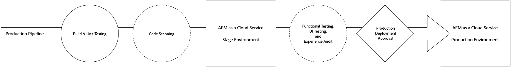
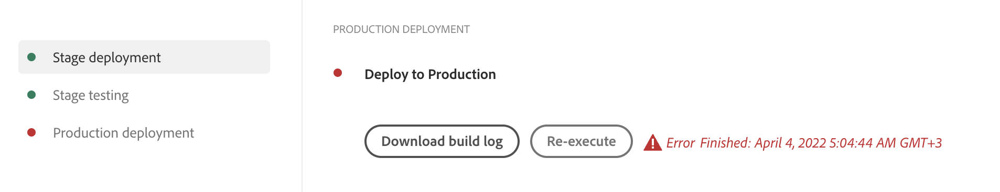

# Distribuera koden {#deploy-your-code}

Lär dig hur du distribuerar koden till Production med Cloud Manager-pipelines AEM as a Cloud Service.



Distribuera kod sömlöst till scenen och sedan till produktionen via en produktionsprocess. Körningen av produktionspipeline är uppdelad i två logiska faser.

1. Distribution till scenmiljö
   * Koden byggs och distribueras till scenmiljön för automatisk funktionstestning, UI-testning, upplevelsegranskning och UAT (User accept testing).
1. Distribution till produktionsmiljö
   * När bygget har validerats på scenen och godkänts för att befordras till produktion distribueras samma bygge-artefakt till produktionsmiljön.

_Det är bara pipeline-typen Full Stack Code som har stöd för kodskanning, funktionstestning, gränssnittstestning och upplevelsegranskning._

## Distribuera din kod med Cloud Manager på AEM as a Cloud Service {#deploying-code-with-cloud-manager}

När du har [har konfigurerat produktionsförloppet](/help/implementing/cloud-manager/configuring-pipelines/configuring-production-pipelines.md) som databas-, miljö- och testmiljö är du redo att driftsätta koden.

1. Logga in i Cloud Manager på [my.cloudmanager.adobe.com](https://my.cloudmanager.adobe.com/) och välja lämplig organisation.

1. Klicka på det program som du vill distribuera kod för.

1. Klicka **Distribuera** från uppmaning till åtgärd på **Ökning** för att starta distributionsprocessen.

   

1. The **Körning av pipeline** visas. Klicka **Bygge** för att starta processen.

   

Byggprocessen distribuerar koden i tre faser.

1. [Scendistribution](#stage-deployment)
1. [Scentestning](#stage-testing)
1. [Produktionsdistribution](#production-deployment)

>[!TIP]
>
>Du kan granska stegen från olika distributionsprocesser genom att visa loggar eller granska resultaten för att se testvillkoren.

## Scendistributionsfas {#stage-deployment}

The **Scendistribution** fas. omfattar de här stegen.

* **Validering**  - Detta steg säkerställer att pipeline är konfigurerad att använda de tillgängliga resurserna. Du kan till exempel testa att den konfigurerade grenen finns och att miljöerna är tillgängliga.
* **Build &amp; Unit Testing** - Det här steget kör en innesluten byggprocess.
   * Se [Information om byggmiljö](/help/implementing/cloud-manager/getting-access-to-aem-in-cloud/build-environment-details.md) för mer information om byggmiljön.
* **Kodskanning** - I det här steget utvärderas kvaliteten på programkoden.
   * Se [Testning av kodkvalitet](/help/implementing/cloud-manager/code-quality-testing.md) om du vill ha mer information om testprocessen.
* **Skapa bilder** - Den här processen gör att du kan omvandla innehåll och dispatcherpaket som skapats av byggsteget till Docker-bilder och Kubernetes-konfigurationer.
* **Distribuera till scenen** - Bilden distribueras till testmiljön som förberedelse för [Scenens testfas.](#stage-testing)


## Scentestfas {#stage-testing}

The **Stage testing** dessa steg.

* **Funktionstestning av produkten** - Molnhanterarens pipeline kör tester som körs mot scenmiljön.
   * Se [Funktionstestning av produkten](/help/implementing/cloud-manager/functional-testing.md#product-functional-testing) för mer information.

* **Anpassad funktionstestning** - Det här steget i pipeline körs alltid och kan inte hoppas över. Om inget test-JAR produceras av bygget godkänns testet som standard.
   * Se [Anpassad funktionstestning](/help/implementing/cloud-manager/functional-testing.md#custom-functional-testing) för mer information.

* **Anpassade gränssnittstestningar** - Det här steget är en valfri funktion som automatiskt kör gränssnittstester som skapats för anpassade program.
   * Användargränssnittstester är självstudiebaserade tester som paketeras i en Docker-bild för att möjliggöra ett brett val av språk och ramverk (t.ex. Java och Maven, Node och WebDriver.io eller andra ramverk och tekniker som bygger på Selenium).
   * Se [Anpassade gränssnittstestningar](/help/implementing/cloud-manager/functional-testing.md#custom-ui-testing) för mer information.

* **Experience Audit** - Det här steget i pipeline körs alltid och kan inte hoppas över. När en produktionsprocess körs inkluderas ett steg för upplevelsegranskning efter anpassad funktionstestning som kör kontrollerna.
   * De konfigurerade sidorna skickas till tjänsten och utvärderas.
   * Resultaten är informativa och visar poängen och förändringen mellan aktuella och tidigare poäng.
   * Den här insikten är värdefull för att avgöra om det finns en regression som introduceras i den aktuella distributionen.
   * Se [Upplevelsegranskningsresultat](/help/implementing/cloud-manager/experience-audit-testing.md) för mer information.


## Produktionsdistributionsfas {#deployment-production}

Processen för att distribuera till produktionstopologier skiljer sig något för att minimera påverkan för besökare på en AEM.

Produktionsinstallationer följer i allmänhet samma steg som tidigare, men på ett rullande sätt.

1. Distribuera AEM som ska författas.
1. Koppla loss dispatcher1 från belastningsutjämnaren.
1. Distribuera AEM paket till publish1 och dispatcherpaketet till dispatcher1, flush dispatcher cache.
1. Placera dispatcher1 i belastningsutjämnaren igen.
1. När dispatcher1 är tillbaka i tjänst frigör du dispatcher2 från belastningsutjämnaren.
1. Distribuera AEM paket till publish2 och dispatcherpaketet till dispatcher2, flush dispatcher cache.
1. Placera dispatcher2 i belastningsutjämnaren igen.

Den här processen fortsätter tills distributionen har nått alla utgivare och utgivare i topologin.


## Timeout {#timeouts}

Följande steg gör timeout om du väntar på användarfeedback:

| Steg | Timeout |
|--- |--- |
| Testning av kodkvalitet | 14 dagar |
| Säkerhetstestning | 14 dagar |
| Prestandatestning | 14 dagar |
| Ansökan om godkännande | 14 dagar |
| Schemalägg produktionsdistribution | 14 dagar |
| Stöd för CSE | 14 dagar |

## Distributionsprocess {#deployment-process}

Alla driftsättningar av Cloud Service följer en rullande process för att säkerställa noll driftavbrott. Se [Hur rullande distributioner fungerar](/help/implementing/deploying/overview.md#how-rolling-deployments-work) om du vill veta mer.

>[!NOTE]
>
>Dispatcher-cachen rensas bort för varje distribution. Den värms upp senare innan de nya publiceringsnoderna accepterar trafik.

## Köra om en produktionsdistribution {#reexecute-deployment}

I sällsynta fall kan produktionsdistributionsstegen misslyckas av tillfälliga orsaker. I sådana fall stöds omkörning av produktionsdistributionssteget så länge produktionsdistributionssteget har slutförts, oavsett typ av slutförande (t.ex. avbruten eller misslyckad). Omkörning skapar en ny körning med samma pipeline som består av tre steg.

1. Valideringssteget - Detta är i stort sett samma validering som sker under en normal pipeline-körning.
1. Byggsteget - I samband med en omkörning kopieras artefakter och ingen ny byggprocess utförs.
1. Produktionsdistributionssteget - Detta använder samma konfiguration och alternativ som produktionsdistributionssteget i en normal pipeline-körning.

I sådana fall där ett återgenomförande är möjligt visas statussidan för produktionsflödet på sidan med **Kör igen** alternativ bredvid det vanliga **Hämta bygglogg** alternativ.



>[!NOTE]
>
>I en omkörning markeras byggsteget i användargränssnittet för att reflektera att det är kopieringsartefakter och inte återskapande.

### Begränsningar {#limitations}

* Det går bara att köra produktionsdistributionssteget på nytt för den senaste körningen.
* Omkörning är inte tillgängligt för push-uppdateringskörningar.
   * Om den senaste körningen är en push-uppdateringskörning går det inte att utföra om.
* Om den senaste körningen misslyckades någon gång före produktionsdistributionssteget går det inte att utföra om.

### Kör API igen {#reexecute-API}

Förutom att vara tillgänglig i användargränssnittet kan du använda [Cloud Manager API](https://developer.adobe.com/experience-cloud/cloud-manager/reference/api/#tag/Pipeline-Execution) för att utlösa omkörningar samt identifiera körningar som utlöstes som omkörningar.

#### Utlösa en omkörning {#reexecute-deployment-api}

Gör en PUT-begäran till HAL Link om du vill utlösa en omkörning `https://ns.adobe.com/adobecloud/rel/pipeline/reExecute` i produktionsdistributionssteget.

* Om den här länken finns kan körningen startas om från det steget.
* Om den inte finns kan inte körningen startas om från det steget.

Den här länken är bara tillgänglig för produktionsdistributionssteget.

```JavaScript
 {
  "_links": {
    "https://ns.adobe.com/adobecloud/rel/pipeline/logs": {
      "href": "/api/program/4/pipeline/1/execution/953671/phase/1575676/step/2983530/logs",
      "templated": false
    },
    "https://ns.adobe.com/adobecloud/rel/pipeline/reExecute": {
      "href": "/api/program/4/pipeline/1/execution?stepId=2983530",
      "templated": false
    },
    "https://ns.adobe.com/adobecloud/rel/pipeline/metrics": {
      "href": "/api/program/4/pipeline/1/execution/953671/phase/1575676/step/2983530/metrics",
      "templated": false
    },
    "self": {
      "href": "/api/program/4/pipeline/1/execution/953671/phase/1575676/step/2983530",
      "templated": false
    }
  },
  "id": "6187842",
  "stepId": "2983530",
  "phaseId": "1575676",
  "action": "deploy",
  "environment": "weretail-global-b75-prod",
  "environmentType": "prod",
  "environmentId": "59254",
  "startedAt": "2022-01-20T14:47:41.247+0000",
  "finishedAt": "2022-01-20T15:06:19.885+0000",
  "updatedAt": "2022-01-20T15:06:20.803+0000",
  "details": {
  },
  "status": "FINISHED"
```

Syntaxen för HAL-länkens href-värde är bara ett exempel. Det faktiska värdet ska alltid läsas från HAL-länken och inte genereras.

Om du skickar en PUT-begäran till den här slutpunkten får du ett svar från 2010 om det lyckas, och svarstexten är representationen av den nya körningen. Det liknar att starta en vanlig körning via API:t.

#### Identifiera en körning som utförts på nytt {#identify-reexecution}

Körda körningar kan identifieras av värdet `RE_EXECUTE` i `trigger` fält.
