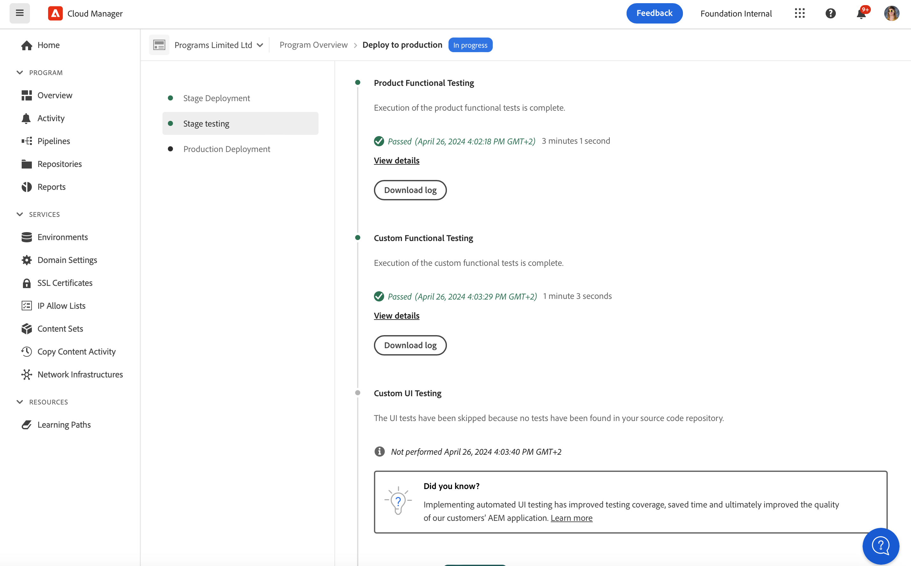

# Driftsätta kod {#deploy-your-code}

## Distribuera kod med Cloud Manager i AEM som en Cloud Service {#deploying-code-with-cloud-manager}

När du har konfigurerat produktionspipelinen (databas, miljö och testmiljö) är du redo att distribuera koden.

1. Klicka på **Distribuera** i Cloud Manager för att starta distributionsprocessen.

   

1. Skärmen **Pipeline Execution** visas.

   Klicka på **Skapa** för att starta processen.

   

1. Den fullständiga byggprocessen distribuerar koden.

   Följande steg ingår i byggprocessen:

   1. Scendistribution
   1. Scentestning
   1. Produktionsdistribution

   >[!NOTE]
   >
   >Dessutom kan du granska stegen från olika distributionsprocesser genom att visa loggar eller granska resultaten för att se testvillkoren.

   Följande steg ingår i **mellanlagringsdistributionen**:

   * Validering: Detta steg säkerställer att pipeline är konfigurerad att använda de tillgängliga resurserna, till exempel att den konfigurerade grenen finns, och att miljöerna är tillgängliga.
   * Build &amp; Unit Testing: Det här steget kör en innesluten byggprocess. Mer information om byggmiljön finns i [Information om byggmiljö](/help/onboarding/getting-access-to-aem-in-cloud/build-environment-details.md).
   * Kodsökning: I det här steget utvärderas kvaliteten på programkoden. Mer information om testprocessen finns i [Kodkvalitetstestning](/help/implementing/cloud-manager/code-quality-testing.md).
   * Skapa bilder: I det här steget finns en loggfil från processen som används för att skapa bilder. Den här processen gör att innehålls- och dispatcherpaketen som skapas i byggsteget omvandlas till Docker-bilder och Kubernetes-konfiguration.
   * Distribuera till scenen

      
   Följande steg ingår i **mellanlagringstestningen**:

   * **Funktionstestning**: Körningar av pipeline för Cloud Manager stöder körning av tester som körs mot scenmiljön.
Mer information finns i [Funktionstestning av produkten](/help/implementing/cloud-manager/functional-testing.md#product-functional-testing).

   * **Anpassad funktionstestning**: Det här steget i pipeline finns alltid och kan inte hoppas över. Om JAR-test inte skapas av bygget godkänns testet som standard.\
      Mer information finns i [Anpassad funktionstestning](/help/implementing/cloud-manager/functional-testing.md#custom-functional-testing).

   * **Testning** av anpassat användargränssnitt: Det här steget är en valfri funktion som gör att våra kunder kan skapa och automatiskt köra gränssnittstester för sina program. Användargränssnittstester är självstudiebaserade tester som paketeras i en Docker-bild för att möjliggöra ett brett val av språk och ramverk (t.ex. Java och Maven, Node och WebDriver.io eller andra ramverk och tekniker som bygger på Selenium).
Mer information finns i [Anpassad gränssnittstestning](https://experienceleague.adobe.com/docs/experience-manager-cloud-service/implementing/using-cloud-manager/test-results/functional-testing.html?lang=en#custom-ui-testing).

   * **Experience Audit**: Det här steget i pipeline finns alltid och kan inte hoppas över. När en produktionsprocess körs inkluderas ett steg för upplevelsegranskning efter anpassad funktionstestning som kör kontrollerna. De konfigurerade sidorna skickas till tjänsten och utvärderas. Resultaten är informativa och gör att användaren kan se poängen och ändringen mellan den aktuella och den tidigare poängen. Den här insikten är värdefull för att avgöra om det finns en regression som kommer att introduceras i den aktuella distributionen.
Mer information finns i [Understanding Experience Audit results](/help/implementing/cloud-manager/experience-audit-testing.md).

      

## Distributionsprocess {#deployment-process}

Alla driftsättningar av Cloud Service följer en rullande process för att säkerställa noll driftavbrott. Mer information finns i [How Rolling Deployments Work](https://experienceleague.adobe.com/docs/experience-manager-cloud-service/implementing/deploying/overview.html#how-rolling-deployments-work).

### Distribution till produktionsfas {#deployment-production-phase}

Processen för att distribuera till produktionstopologier skiljer sig något för att minimera påverkan för AEM webbplatsbesökare.

Produktionsinstallationer följer i allmänhet samma steg som ovan, men på ett rullande sätt:

1. Distribuera AEM som ska författas.
1. Koppla loss dispatcher1 från belastningsutjämnaren.
1. Distribuera AEM paket till publish1 och dispatcherpaketet till dispatcher1, flush dispatcher cache.
1. Placera dispatcher1 i belastningsutjämnaren igen.
1. När dispatcher1 är tillbaka i tjänst frigör du dispatcher2 från belastningsutjämnaren.
1. Distribuera AEM paket till publish2 och dispatcherpaketet till dispatcher2, flush dispatcher cache.
1. Placera dispatcher2 i belastningsutjämnaren igen.
Den här processen fortsätter tills distributionen har nått alla utgivare och utgivare i topologin.
