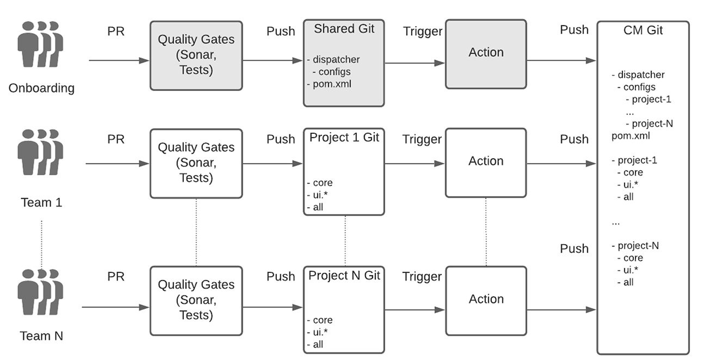
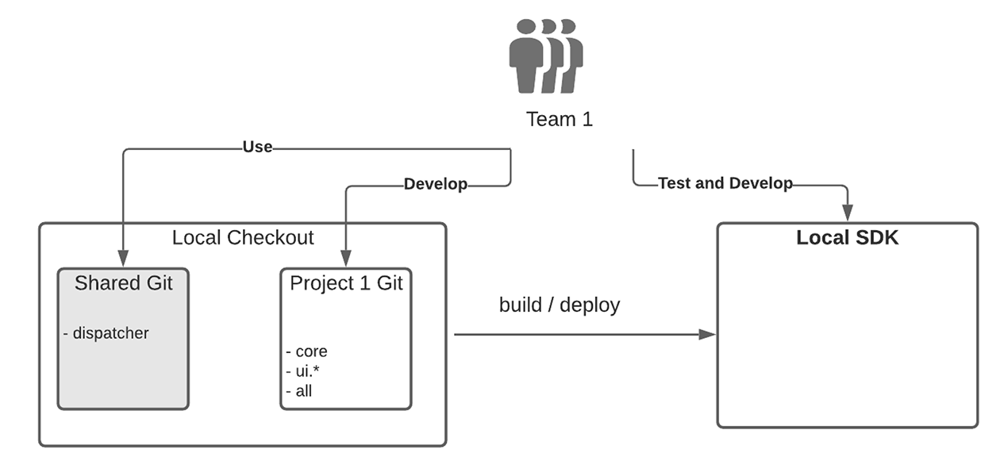

# Konfiguration av företagsgruppsutveckling för AEM som en Cloud Service {#enterprise-setup}

## Introduktion {#introduction}

AEM som Cloud Service är ett molnbaserat erbjudande som ger AEM som en tjänst utformat för att ge 10 eller fler år av företagsprogramvara till företagsteam med specifika krav. Även om den AEM in i molnbaserade miljöer, med nya värden som alltid är på, alltid aktuella, alltid säkra och alltid i stor skala, behåller den det viktigaste mervärdet som AEM erbjuder våra kunder som en anpassningsbar plattform och gör det möjligt för företagsgrupper att integrera i sina utvecklings- och leveransprocedurer.

För att stödja våra kunder med installation av företagsutveckling kan AEM som Cloud Service helt och hållet integreras med Cloud Manager och dess specialbyggda rådgivande CI/CD-ledningar, som är utrustade med bästa praxis och inlärningar från flera års erfarenhet av utveckling och driftsättning i företagsklass, vilket garanterar grundlig testning och högsta kodkvalitet för att leverera enastående upplevelser.

## Cloud Managers support i Enterprise Team Development Setup {#cloud-manager}

För att säkerställa snabb introduktion för kunderna har Cloud Manager allt som behövs för att komma igång med att utveckla upplevelser direkt, inklusive en Git-databas för att lagra anpassningar som sedan byggs, verifieras och driftsätts av Cloud Manager.
Med hjälp av Cloud Manager kan utvecklingsteam arbeta för att implementera ändringar ofta utan att vara beroende av Adobe-personal.

Det finns tre miljötyper i Cloud Manager:

* Utveckling
* Scen
* Produktion

Kod kan distribueras till utvecklingsmiljöer med hjälp av ett icke-produktionsflöde. För scenen och produktionen, som alltid hänger ihop och därmed säkerställer validering före produktionsdistributionen som bästa praxis, använder en produktionspipeline kvalitetsportar för att validera programkoden och konfigurationsändringarna.

Produktionspipelinen distribuerar koden och konfigurationen till staging-miljön först, testar programmet och distribuerar slutligen till produktionen.
En Cloud Service-SDK som alltid uppdateras med den senaste Cloud Servicen kan användas för lokal utveckling direkt med utvecklarens lokala maskinvara. Detta möjliggör snabb utveckling med mycket låg vändningstid. Det innebär att utvecklare kan vara kvar i sin hemtama lokala miljö och välja bland en mängd olika utvecklingsverktyg och gå över till utvecklingsmiljöer eller produktion när de vill.

Cloud Manager har stöd för flexibla konfigurationer för flera team som kan anpassas efter ett företags behov. Detta gäller både Cloud Service och AMS. För att säkerställa stabil driftsättning med flera team och undvika att ett team påverkar produktionen för alla team validerar och testar Cloud Managers pipeline alltid koden från alla team tillsammans.

## Real World Example {#real-world-example}

Varje företag har olika behov, inklusive olika arbetsflöden för teamkonfiguration, processer och utveckling. Konfigurationen som beskrivs nedan används av Adobe för flera projekt som levererar upplevelser utöver AEM som en Cloud Service.

Adobe Creative Cloud-programmen, till exempel Adobe Photoshop och Adobe Illustrator, innehåller t.ex. självstudiekurser, exempel och guider som är tillgängliga för slutanvändarna. Det här innehållet används av klientprogrammen med AEM som Cloud Service på *headless*-sätt, genom att göra API-anrop till AEM Cloud-publiceringsnivån för att hämta det strukturerade innehållet som JSON-strömmar, och genom att utnyttja den AEM Cloud Servicens CDN för att leverera både strukturerat och ostrukturerat innehåll med optimala prestanda.

De team som deltar i projektet följer den process som beskrivs nedan.

>[!NOTE]
>Mer information om konfigurationen finns i [Arbeta med Git-databaser med flera källor](https://experienceleague.adobe.com/docs/experience-manager-cloud-manager/using/managing-code/working-with-multiple-source-git-repos.html#managing-code).

Varje team använder sitt eget utvecklingsarbetsflöde och har ett separat Git-arkiv. En extra delad Git-databas används för att komma igång med projekt. Den här Git-databasen innehåller rotstrukturen för Cloud Managers Git-databas, inklusive konfigurationen för delad dispatcher. För att ett nytt projekt ska kunna introduceras måste det finnas en lista i projektfilen för reaktorn Maven i roten av den delade Git-databasen. För dispatcherkonfigurationen skapas en ny konfigurationsfil i dispatcherprojektet. Den här filen inkluderas sedan av huvuddispatcherkonfigurationen. Varje team ansvarar för sin egen dispatcherkonfigurationsfil. Ändringar i den delade Git-databasen är ovanliga och behövs vanligtvis bara när ett nytt projekt har påbörjats. Det huvudsakliga arbetet utförs av varje projektteam inom deras egna Git-arkiv.

Git-databasen för varje team har konfigurerats med AEM Maven-arkitypen och följer därför de bästa sätten att konfigurera AEM projekt. Det enda undantaget är hantering av dispatcherkonfigurationen som görs i den delade Git-databasen enligt ovan.
Varje team använder ett förenklat Git-arbetsflöde med två + N-grenar, enligt Git-flödesmodellen:

* En statisk versionsgren innehåller produktionskoden

* En utvecklingsgren innehåller den senaste utvecklingen

* För varje funktion skapas en ny gren

Utvecklingen görs i en funktionsgren när funktionen matas in i utvecklingsgrenen. Slutförda och validerade funktioner väljs från utvecklingsgrenen och sammanfogas i den stabila grenen. Alla ändringar görs via Pull Requests (PR). Varje PR valideras automatiskt av kvalitetsportar. Sonar används för kvalitetskontroll av koden och en uppsättning testsviter körs för att säkerställa att den nya koden inte inför någon regression.

Konfigurationen i Cloud Manager Git-databasen har två grenar:

* En *stabil releasegren* som innehåller produktionskoden från alla team
* En *utvecklingsgren* som innehåller utvecklingskoden från alla team

Varje push till ett teams Git-databas i antingen utvecklingen eller den stabila grenen utlöser en [github-åtgärd](https://experienceleague.adobe.com/docs/experience-manager-cloud-manager/using/managing-code/working-with-multiple-source-git-repos.html?lang=en#managing-code). Alla projekt följer samma inställningar för den stabila grenen: En push-överföring av den stabila grenen i ett projekt överförs automatiskt till den stabila grenen i Cloud Managers Git-databas. Produktionspipeline i Cloud Manager är konfigurerad för att aktiveras av en push till den stabila grenen. Produktionspipeline körs därför av varje team som går över till en stabil gren och produktionsdistributionen uppdateras om alla kvalitetsportar godkänns.

Överföringar till utvecklingsgrenen hanteras annorlunda. Även om en push-överföring till en utvecklargren i ett teams Git-databas utlöser en github-åtgärd och koden automatiskt överförs till utvecklingsgrenen i Cloud Managers Git-databas, aktiveras inte den icke-produktionsflödet automatiskt av kodöverföringen. Den aktiveras av ett anrop till API:t för Cloud Manager.
I produktionsflödet kontrolleras koden för alla team via de angivna kvalitetspunkterna. När koden har distribuerats till scenen utförs testerna och granskningarna för att säkerställa att allt fungerar som det ska. När alla portar har passerats förs ändringarna vidare till produktionen utan avbrott eller driftavbrott.
För lokal utveckling används SDK för Cloud Service. Med SDK kan en lokal författare, publicerare och dispatcher konfigureras. Detta möjliggör offlineutveckling och snabb handläggningstid. Ibland används bara författare för utveckling, men om du snabbt ställer in dispatcher och publicerar kan du testa allt lokalt innan du går in i Git-databasen. Medlemmar i varje team checkar vanligtvis ut koden från den delade Git-instansen samt sin egen projektkod. Du behöver inte checka ut andra projekt eftersom de är fristående.

Denna verkliga konfiguration kan användas som en plan och sedan anpassas efter ett företags behov. Git-konceptet för flexibel förgrening och sammanslagning möjliggör variationer av arbetsflödena ovan, anpassade efter alla teamets behov. AEM som Cloud Service har stöd för alla dessa variationer utan att offra kärnvärdet i den rådgivande Cloud Manager-pipeline.

### Överväganden för en konfiguration för flera team {#considerations}

Ovannämnda plan för en konfiguration för flera team gör det möjligt att skala över ett större antal team. Med Cloud Managers Git-databas och produktionsflödet körs alltid den fullständiga produktionskoden genom alla kvalitetsportar, vilket behandlar den som en enda distributionsenhet. På så sätt kan produktionssystemet alltid vara igång *utan avbrott eller driftavbrott.*
Utan ett sådant system finns det däremot en risk att en uppdatering från ett team kan leda till produktionsstabilitetsproblem. Dessutom krävs samordning och planerad driftstopp för att lansera uppdateringar. Med ett ökande antal team kommer samordningen att bli mycket mer komplex och snabbt bli ohanterlig.
Om ett problem upptäcks i kvalitetsportarna påverkas inte produktionen, och problemet kan upptäckas och åtgärdas utan att Adobe personal behöver gå in i programmet. Utan Cloud Service och utan att alltid testa hela distributionen kan partiella distributioner orsaka avbrott som kräver en begäran om återställning eller till och med en fullständig återställning från en säkerhetskopia. Den partiella testningen kan också leda till andra problem som sedan måste åtgärdas efter det att behovet av samordning och stöd från Adobe personal åter har kommit att kräva.

För varje konfiguration av flera team är det avgörande att definiera en styrningsmodell och en uppsättning standarder som alla team måste följa. Du kan använda utkast som utgångspunkt.