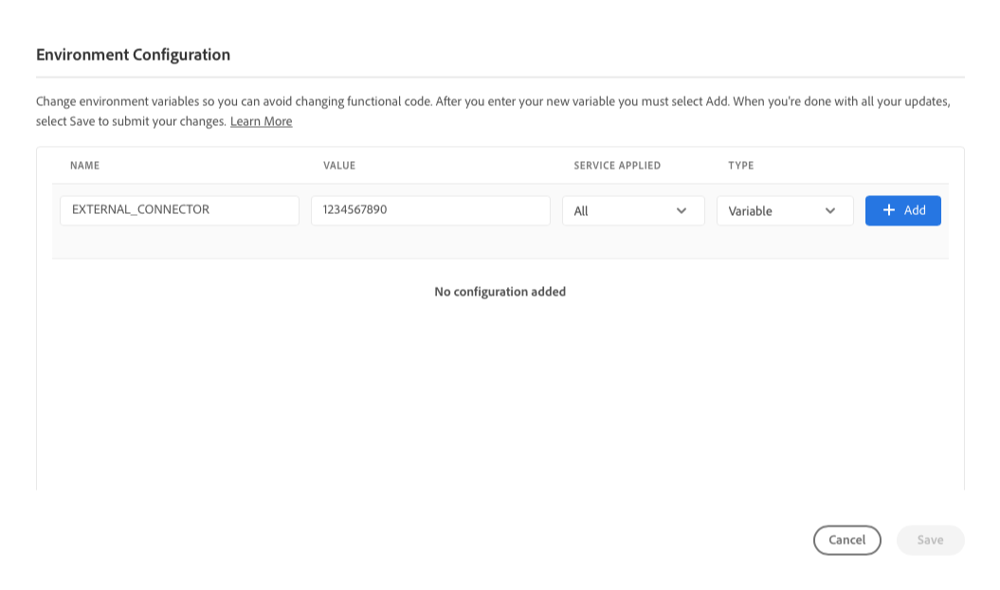
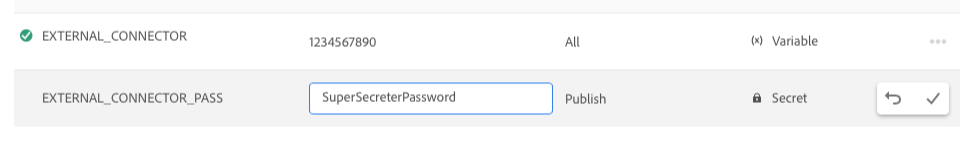

# Miljövariabler för Cloud Manager {#environment-variables}

Standardmiljövariabler kan konfigureras och hanteras via Cloud Manager. De tillhandahålls körtidsmiljön och kan användas i OSGi-konfigurationer. Miljövariabler kan vara antingen miljöspecifika värden eller miljöhemligheter, baserat på vad som ändras.

## Översikt {#overview}

Miljövariabler ger en mängd fördelar för användare av AEM as a Cloud Service:

* De gör att beteendet i koden och programmet kan variera beroende på sammanhang och miljö. De kan till exempel användas för att aktivera olika konfigurationer för utvecklingsmiljön jämfört med produktions- eller scenmiljöerna för att undvika kostsamma misstag.
* De behöver bara konfigureras och konfigureras en gång och kan uppdateras och tas bort vid behov.
* Deras värden kan uppdateras när som helst och börja gälla omedelbart utan att kodändringar eller -distributioner behövs.
* De kan skilja kod från konfiguration och ta bort behovet av att inkludera känslig information i versionskontrollen.
* De förbättrar säkerheten i det AEM as a Cloud Service programmet eftersom de finns utanför koden.

Exempel på vanliga användningsområden för miljövariabler är:

* Ansluta AEM med olika externa slutpunkter
* Använda en referens när du lagrar lösenord i stället för direkt i kodbasen
* När det finns flera utvecklingsmiljöer i ett program och en del konfigurationer skiljer sig från en miljö till nästa

## Lägga till miljövariabler {#add-variables}

>[!NOTE]
>
>Du måste vara medlem i [**Distributionshanteraren** roll](/help/onboarding/cloud-manager-introduction.md#role-based-premissions) för att lägga till eller ändra miljövariabler.

1. Logga in på Adobe Cloud Manager på [my.cloudmanager.adobe.com](https://my.cloudmanager.adobe.com/).
1. Cloud Manager visar de olika tillgängliga programmen. Välj den du vill hantera.
1. Välj **Miljö** för det valda programmet väljer du sedan den miljö som du vill skapa en miljövariabel för i den vänstra navigeringspanelen.
1. I detalj om miljön väljer du **Konfiguration** välj **Lägg till** för att öppna **Miljökonfiguration** -dialogrutan.
   * Om du lägger till en miljövariabel för första gången visas ett **Lägg till konfiguration** i mitten av sidan. Du kan använda den här knappen eller **Lägg till** för att öppna **Miljökonfiguration** -dialogrutan.

   

1. Ange variabelinformationen.
   * **Namn**
   * **Värde**
   * **Tjänsten används** - Definierar för vilken tjänst (Författare/Publicera/Förhandsgranska) variabeln gäller eller om den gäller för alla tjänster
   * **Typ** - Definierar om variabeln är normal eller hemlig

   

1. När du har angett den nya variabeln måste du välja **Lägg till** i den sista kolumnen i raden som innehåller den nya variabeln.
   * Du kan ange flera variabler samtidigt genom att ange en ny rad och välja **Lägg till**.

   

1. Välj **Spara** för att behålla variablerna.

En indikator med status **Uppdaterar** visas högst upp i tabellen och bredvid den nyligen tillagda variabeln för att ange att miljön uppdateras med konfigurationen. När du är klar visas den nya systemvariabeln i tabellen.

>[!TIP]
>
>Om du vill lägga till flera variabler rekommenderar vi att du lägger till den första variabeln och sedan använder **Lägg till** i **Miljökonfiguration** om du vill lägga till ytterligare variabler. På så sätt kan du lägga till dem med en uppdatering i miljön.

## Uppdaterar miljövariabler {#update-variables}

När du har skapat miljövariabler kan du uppdatera dem med **Lägg till/uppdatera** knappen för att starta **Miljökonfiguration** -dialogrutan.

1. Logga in på Adobe Cloud Manager på [my.cloudmanager.adobe.com](https://my.cloudmanager.adobe.com/).
1. Cloud Manager visar de olika tillgängliga programmen. Välj den du vill hantera.
1. Välj **Miljö** för det valda programmet väljer du sedan den miljö som du vill skapa en miljövariabel för i den vänstra navigeringspanelen.
1. I detalj om miljön väljer du **Konfiguration** välj **Lägg till/uppdatera** längst upp till höger för att öppna **Miljökonfiguration** -dialogrutan.

   

1. Använd ellipsknappen i den sista kolumnen i raden i variabeln som du vill ändra och markera **Redigera** eller **Ta bort**.

   

1. Redigera systemvariabeln efter behov.
   * När du redigerar ändras ellipsknappen till alternativ för att återgå till det ursprungliga värdet eller bekräfta ändringen.
   * När du redigerar hemligheter kan värdena bara uppdateras, inte visas.

   

1. När du har gjort alla nödvändiga konfigurationsändringar väljer du **Spara**.

[Som när du lägger till variabler,](#add-variables) en indikator med status **Uppdaterar** visas högst upp i tabellen och bredvid de nyligen uppdaterade variablerna för att ange att miljön uppdateras med konfigurationen. När du är klar visas de uppdaterade miljövariablerna i tabellen.

>[!TIP]
>
>Om du vill uppdatera flera variabler bör du använda **Miljökonfiguration** om du vill uppdatera alla nödvändiga variabler samtidigt innan du trycker eller klickar **Spara**. På så sätt kan du lägga till dem med en uppdatering i miljön.

## Använda miljövariabler {#using}

Miljövariabler kan göra `pom.xml` konfigurationer säkrare och flexiblare. Lösenord behöver till exempel inte vara hårdkodade och konfigurationen kan anpassas baserat på värdena i miljövariablerna.

Du får åtkomst till miljövariabler och hemligheter via XML enligt följande.

* `${env.VARIABLE_NAME}`

Se dokumentet [Konfigurera projekt](/help/implementing/cloud-manager/getting-access-to-aem-in-cloud/setting-up-project.md#password-protected-maven-repository-support-password-protected-maven-repositories) som ett exempel på hur du använder båda variabeltyperna i en `pom.xml` -fil.

Se [officiell dokumentation för Maven](https://maven.apache.org/settings.html#quick-overview) för mer information.

## Miljövariabel tillgänglighet {#availability}

Miljövariabler kan användas på flera ställen.

### Skapa, förhandsgranska och publicera {#author-preview-publish}

Både vanliga miljövariabler och hemligheter kan användas i redigerings-, förhandsgransknings- och publiceringsmiljöer.

### Dispatcher {#dispatcher}

Endast vanliga miljövariabler kan användas med [avsändaren.](https://experienceleague.adobe.com/docs/experience-manager-dispatcher/using/dispatcher.html) Hemligheter kan inte användas.

Miljövariabler kan dock inte användas i `IfDefine` direktiv.

>[!TIP]
>
>Du bör validera din användning av miljövariabler med [avsändare lokalt](https://experienceleague.adobe.com/docs/experience-manager-learn/cloud-service/local-development-environment-set-up/dispatcher-tools.html) före distribution.

### OSGi-konfigurationer {#osgi}

Både vanliga miljövariabler och hemligheter kan användas i [OSGi-konfigurationer.](/help/implementing/deploying/configuring-osgi.md)

### Rörledningsvariabler {#pipeline}

Förutom miljövariabler finns det även variabler för pipeline som exponeras under byggfasen. [Läs mer om pipeline-variabler här.](/help/implementing/cloud-manager/getting-access-to-aem-in-cloud/build-environment-details.md#pipeline-variables)
