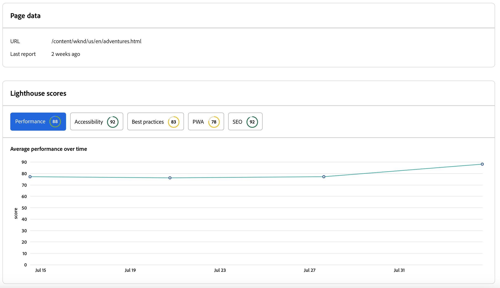

# Kontrollpanelen för Experience Audit {#experience-audit-dashboard}

Läs om hur Experience Audit validerar er distributionsprocess och ser till att de ändringar som driftsätts uppfyller grundläggande standarder för prestanda, tillgänglighet, bästa praxis och SEO via ett tydligt och informativt gränssnitt.

>[!NOTE]
>
>Den här funktionen är bara tillgänglig för [det tidiga adopteringsprogrammet.](/help/implementing/cloud-manager/release-notes/current.md#early-adoption)
>
>Mer information om den befintliga funktionen Experience Audit för AEM as a Cloud Service finns i dokumentet [Experience Audit Testing.](/help/implementing/cloud-manager/experience-audit-testing.md)

## Översikt {#overview}

Experience Audit är en funktion i Cloud Manager Sites Production pipelines som validerar distributionsprocessen och hjälper till att säkerställa att ändringar som distribueras:

1. Uppfyll grundläggande standarder för prestanda, tillgänglighet, bästa praxis, SEO (Search Engine Optimization) och PWA (Progressive Web App).

1. Inför inte regressioner.

Experience Audit i Cloud Manager säkerställer att slutanvändarens upplevelse på webbplatsen är av högsta standard.

Granskningsresultaten är informativa och gör det möjligt för distributionshanteraren att se poängen och ändringen mellan aktuella och tidigare poäng. Den här insikten är värdefull för att avgöra om det finns en regression som introducerades i den aktuella distributionen.

Experience Audit drivs av [Google Lighthuse,](https://developer.chrome.com/docs/lighthouse/overview/) ett verktyg med öppen källkod från Google och är aktiverat i alla produktionspipelines i Cloud Manager.

>[!TIP]
>
>Du konfigurerar vilka sidor som ska ingå i Experience Audit när du [konfigurera din pipeline.](/help/implementing/cloud-manager/configuring-pipelines/configuring-production-pipelines.md#full-stack-code)

## Kontrollpanelen för Experience Audit {#dashboard}

Resultaten av Experience Audit presenteras i **Stage testing** produktionsfasen via [körningssida för produktionsflöde.](/help/implementing/cloud-manager/deploy-code.md)

Experience Audit innehåller sammanställda och detaljerade testresultat på sidnivå som sammanfattas på fyra flikar:

* **[Insikter](#insights)** ge en kort beskrivning av användbara rekommendationer för att förbättra webbplatsens prestanda.
* **[Ljushetsmusik](#lighthouse)** är en sammanfattning av Lighthuse-poängen för koden som distribueras i den här pipeline-körningen.
* **[Sidor](#pages)** är en sammanfattning av prestanda för sidor som har konfigurerats särskilt för analys.
* **[Problem](#issues)** sammanfattar alla prestandaproblem som upptäcks i koden för den här pipelinekörningen.

### Insikter {#insights}

The **Insikter** -fliken innehåller en kort beskrivning av användbara rekommendationer för att förbättra webbplatsens prestanda.

Tryck eller klicka på **Visa fler** för att öppna den fullständiga kontrollpanelen.

I **Insikter och rekommendationer** hittar du en detaljerad lista med användbara rekommendationer med en tydlig värdeindikator kopplad till prestandavinster, tillsammans med hur många sidor som påverkas. På så sätt kan ni enkelt prioritera dessa rekommendationer för era team.

Om du vill gå tillbaka till sidan där produktionsflödet körs väljer du bara bakåtpilen i webbläsaren.

### Ljusspår {#lighthouse}

The **Ljushetsmusik** -fliken är en sammanfattning av Lightroom-poängen för koden som distribueras i den här pipeline-körningen.

Tryck eller klicka på **Visa fler** för att öppna den fullständiga kontrollpanelen.

I **Ljushetsmusik** finns en trendvy över de olika poängen. Välj **Prestanda**, **Tillgänglighet**, **PWA**, eller **SEO** om du vill visa den månatliga trendvyn för dessa värden.

Observera att varje punkt i diagrammet är genomsnittet för alla distributioner under den aktuella månaden.

Om du vill gå tillbaka till sidan där produktionsflödet körs väljer du bara bakåtpilen i webbläsaren.

### Sidor {#pages}

The **Sidor** är en sammanfattning av prestanda för sidor som är specifikt konfigurerade att analyseras.

Tryck eller klicka på **Visa fler** för att öppna den fullständiga kontrollpanelen.

The **Sidor** -avsnittet innehåller en lista med sidor som har testats och deras senaste prestandaresultat i Lighthuse samt uppdelningen.

Du konfigurerar vilka sidor som ska ingå i Experience Audit när du [konfigurera din pipeline.](/help/implementing/cloud-manager/configuring-pipelines/configuring-production-pipelines.md#full-stack-code)

Om du vill gå tillbaka till sidan där produktionsflödet körs väljer du bara bakåtpilen i webbläsaren.

### Problem {#issues}

The **Problem** sammanfattar alla prestandaproblem som upptäcks i koden för den här pipelinekörningen.

Tryck eller klicka på **Visa fler** för att öppna den fullständiga kontrollpanelen.

I **Insikter och rekommendationer** hittar du en mer detaljerad lista över användbara rekommendationer med en tydlig värdeindikator kopplad till prestandavinster, tillsammans med hur många sidor som påverkas. På så sätt kan ni enkelt prioritera dessa rekommendationer för era team.

Om du vill gå tillbaka till sidan där produktionsflödet körs väljer du bara bakåtpilen i webbläsaren.

### Sidinformation {#page-detail}

Om du trycker eller klickar på länken för en sida på en flik i **Experience Audit** -avsnittet på fliken för pipeline-körningssidan eller i **Sidor** i den fullständiga kontrollpanelen för Experience Audit kan du visa information om en viss sida.

Du kan se hur de enskilda sidorna sparades för det specifika testet tillsammans med ändringen från föregående testkörning.

Om du klickar på detaljerna för en enskild sida får du information om vilka element på sidan som har utvärderats och vägledning för att åtgärda problem om möjligheter till förbättring upptäcks.

Om du vill gå tillbaka till sidan där produktionsflödet körs väljer du bara bakåtpilen i webbläsaren.
