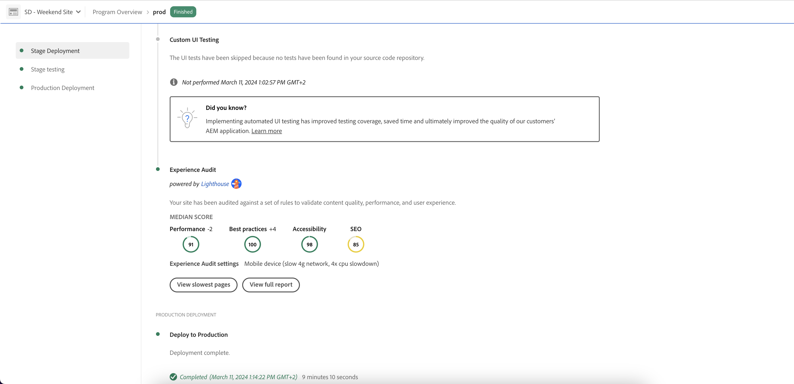

# Kontrollpanel för Experience Audit {#experience-audit-dashboard}

<!-- Engineer architect over this feature was Bogdan Anton; scrum master Alexandru Nica -->

Upptäck hur Experience Audit validerar er distributionsprocess och ser till att ändringarna uppfyller grundläggande standarder för prestanda, tillgänglighet, bästa praxis och SEO (sökmotoroptimering). Den ger ett tydligt och informativt gränssnitt för att spåra mätvärdena.

## Ökning {#overview}

Experience Audit validerar distributionsprocessen och säkerställer att ändringarna distribueras:

1. Uppfyll grundläggande standarder för prestanda, tillgänglighet, bästa praxis och SEO.
1. Inför inte regressioner.

Med Experience Audit i Cloud Manager säkerställs att användarens upplevelse på webbplatsen är av högsta standard.

Granskningsresultaten är informativa och gör det möjligt för distributionshanteraren att se poängen och ändringen mellan aktuella och tidigare poäng. Den här insikten är värdefull för att avgöra om det finns en regression som introducerades i den aktuella distributionen.

Experience Audit drivs av [Google Lightroom](https://developer.chrome.com/docs/lighthouse/overview/), ett verktyg med öppen källkod från Google, och är aktiverat i alla Cloud Manager produktionspipelines.

## Tillgänglighet {#availability}

Experience Audit finns för Cloud Manager:

* (Standard) Sites production pipelines.
* (Valfritt) Utveckling av rörledningar i full stapel.
* (Valfritt) Utveckling av rörledningar för framände.

Mer information om hur du konfigurerar granskningen för de valfria miljöerna finns i avsnittet [Konfiguration](#configuration).

Granskningar körs som en del av pipeline. Granskningar kan också [köras på begäran](#on-demand) utanför pipelines.

## Konfiguration {#configuration}

Experience Audit är tillgängligt som standard för produktionspipelines. Den kan även aktiveras för utveckling av rörledningar i full hög och frontendspikar. I samtliga fall måste du definiera vilka innehållssökvägar som utvärderas under pipeline-körningen.

1. Beroende på vilken typ av pipeline du vill konfigurera gör du något av följande:

   * [Lägg till en produktionspipeline](/help/implementing/cloud-manager/configuring-pipelines/configuring-production-pipelines.md) för att definiera sökvägarna som du vill att granskningen ska utvärdera.
   * [Lägg till en icke-produktionspipeline](/help/implementing/cloud-manager/configuring-pipelines/configuring-non-production-pipelines.md) om du vill aktivera granskningen för en frontendpipeline eller en fullständig utvecklingspipeline.
   * [Redigera en befintlig pipeline](/help/implementing/cloud-manager/configuring-pipelines/managing-pipelines.md) och uppdatera befintliga alternativ.

1. Om du vill använda Experience Audit när du lägger till eller redigerar en icke-produktionspipeline markerar du kryssrutan **Experience Audit** . Det här alternativet finns på fliken **Source-kod**.

   

   * Krävs endast för rörledningar som inte är avsedda för produktion.
   * Fliken **Experience Audit** visas när kryssrutan är markerad.

1. För pipelines för både produktion och icke-produktion definierar du sökvägarna som ska inkluderas i Experience Audit på fliken **Experience Audit** .

   * Sidsökvägarna måste börja med `/` och är relativa till din plats.
   * Om din webbplats till exempel är `wknd.site` och vill inkludera `https://wknd.site/us/en/about-us.html` i Experience Audit anger du sökvägen `/us/en/about-us.html`.

   

1. Klicka på **Lägg till sida** så fylls sökvägen automatiskt i med adressen till din miljö och läggs till i sökvägstabellen.

   

1. Fortsätt att lägga till banor efter behov genom att upprepa de två föregående stegen.

   * Du kan lägga till högst 25 banor.
   * Om du inte definierar några sökvägar inkluderas webbplatsens hemsida som standard i Experience Audit.

1. Klicka på **Spara**.

## Resultat av granskning {#results}

Resultaten av Experience Audit presenteras i **fasen av testningen** i produktionsflödet via [sidan för körning av produktionspipeline](/help/implementing/cloud-manager/deploy-code.md).

Experience Audit tillhandahåller medianpoängen för Google Lighthuse för de [konfigurerade sidorna](#configuration) och skillnaden i poäng med den tidigare sökningen.

I den här sammanfattningsvyn i **scentestningsfasen** i pipeline finns två alternativ:

* **[Visa de långsammaste sidorna](#view-slowest-pages)**
* **[Visa den fullständiga rapporten](#view-full-report)**

Du får tillgång till det fullständiga granskningsresultatet genom att klicka på fliken **Rapporter** på Cloud Manager kontrollpanel. Förutom sammanfattningen som visas i pipeline-körningsinformationen kan du visa [den fullständiga rapporten](#view-full-report) direkt.

>[!TIP]
>
>I följande avsnitt beskrivs hur du visar resultaten av Experience Audit.
>
>* Mer information om hur granskningen fungerar finns i [Information om Experience Audit Evaluation](#details).
>* Mer information om hur du kör en Experience Audit on demand finns i [On-Demand Audit Reports](#on-demand).
>* Om du får problem med granskningen kan du läsa [Experience Audit Encounters Issues](#issues) (Problem med granskningsupptäckter).

### Visa de långsammaste sidorna {#view-slowest-pages}

Klicka på **Visa långsammaste sidor** för att öppna dialogrutan **Långsammaste 5 sidor**. De fem sidor med lägst prestanda som du [har konfigurerat för granskning](#configuration) visas.

Cloud Manager delar upp poängen med **Prestanda**, **Tillgänglighet**, **God praxis** och **SEO**, vilket visar avvikelsen för varje mätresultat från den tidigare granskningen.

Som standard öppnas dialogrutan med bakgrundsmusik för mobila enheter. Du kan se bakgrundsmusik med hjälp av växlingsknappen **Enheter** i dialogrutans övre del.

Dialogrutan ger dig en snabb översikt. Klicka på **Visa fullständig rapport** om du vill ha fullständig information.

### Visa hela rapporten {#view-full-report}

Du kan visa den fullständiga Experience Audit-rapporten genom att göra följande:

* Klicka på **`View full report`** i dialogrutan **[Långaste 5 sidor](#view-slowest-pages)**.
* Klicka på **`View full report`** när du visar [körningen av en pipeline](#results).
* Klicka på fliken **Rapporter** i Cloud Manager.

Fliken **Rapporter** i Cloud Manager öppnas och **Experience Audit** visas.

Rapporten är uppdelad i två områden:

* **[Sidpoäng - trend](#trend)**
* **[Upplev granskningsresultat](#results)**

#### Sidpoäng - trend {#trend}

Som standard är den valda vyn för **Sidpoäng — trend** **medianpoäng** för **förra året**.

Du kan välja att visa trender för specifika Lightroom-kategorier genom att klicka på kategorinamnet i teckenförklaringen.

Använd listrutan **Markera** längst upp i diagrammet för att markera sidspecifik information, och listrutorna **Visa** och **Utlösare** längst ned för att välja olika tidsramar och utlösartyp.

I listrutan **Visa** kan du välja en förinställd tidsram eller ett anpassat intervall för en mer specifik vy.

När du flyttar musen över diagrammet visas ett verktygstips värdena för kategorierna Google Lightroom vid specifika tidpunkter.

Om du klickar på diagrammet vid en tidpunkt öppnas ett popup-fönster med detaljer om den skanningen. Klicka på **Öppna Experience Audit-genomsökningen** för att läsa in dessa genomsökningsresultat i avsnittet **[Experience Audit-resultat](#scan-results)**.

#### Resultat av granskning av Experience Audit {#scan-results}

Avsnittet **Experience Audit results** innehåller information om resultat för alla inlästa sidor. Använd knapparna **Föregående** och **Nästa** för att bläddra igenom resultaten och välj hur många som ska visas som sidnumrering.

Klicka på länken för en viss sida för att uppdatera filtret **Välj** för [**Sidpoäng - trend** avsnitt](#trend) och visa fliken **Raw-rapporter** som ger dig poäng för varje granskning av sidan. Klicka på rapportdatumet i kolumnen **Lightroom Report** för att hämta en JSON-fil med rådata.

En ny flik öppnas i webbläsaren som dirigerar dig till `https://googlechrome.github.io/lighthouse/viewer/`. Den läser automatiskt in en signerad URL-adress som innehåller JSON-rapporten för Lightroom Raw för den valda sidan, vilket möjliggör detaljerad granskning.

## Granskningsrapporter för behovsstyrd skanning {#on-demand}

Experience Audit-rapporter kan även genereras på begäran, utöver att de körs under pipeline-körning. Det här alternativet är en bra lösning för att skanna sidor snabbt utan att behöva köra en pipeline.

Om du vill köra en genomsökning på begäran går du till fliken **Rapporter** för att visa den fullständiga granskningsrapporten och klickar sedan på knappen **Kör genomsökning** .

Knappen **Kör skanning** blir inte tillgänglig och har en klockikon när en skanning på begäran redan körs.

On-demand-skanningar utlöser en Experience Audit för de senaste 25 [konfigurerade sidorna](#configuration) och avslutas normalt på några minuter.

När resultatet är klart uppdateras poängdiagrammet automatiskt och du kan kontrollera resultatet exakt som vid en genomsökning av pipeline-körningar.

Du kan filtrera poängdiagrammet baserat på utlösartypen med hjälp av väljaren **Trigger**.

>[!NOTE]
>
>En genomsökning på begäran kan bara startas om miljön inte tas bort och det inte finns några andra väntande genomsökningar i samma miljö.

## Problem med Experience Audit {#issues}

Om [sidorna som du konfigurerade](#configuration) att granskas inte var tillgängliga eller om det fanns andra fel i granskningen, speglar Experience Audit detta faktum.

Pipelinen visar ett utökningsbart felavsnitt som visar de relativa URL-sökvägar som den inte har åtkomst till.

Om du visar den fullständiga rapporten visas information i avsnittet **[Experience Audit results](#results)** som också kan utökas.

En del orsaker till att sidorna kanske inte är tillgängliga är:

* Konfigurationsblocken ger åtkomst.
* Sidan finns inte.
* Sidan omdirigeras som kräver annan autentisering än grundläggande.
* Ett internt fel har inträffat.

>[!TIP]
>
>[Om du får åtkomst till rå-rapporter](#scan-results) för en sida kan du få information om varför det inte gick att granska sidan.

## Utvärderingsinformation för Experience Audit {#details}

Följande information innehåller ytterligare information om hur Experience Audit utvärderar er webbplats. De är inte nödvändiga för allmän användning av funktionen och anges här för fullständighetens skull.

* Granskningen skannar ursprungsdomänen (`.com`) från de [konfigurerade sökvägarna på sidan Experience Audit](#configuration) för utgivaren för att simulera verkliga användarupplevelser, vilket hjälper dig att fatta bättre beslut om att hantera och optimera dina webbplatser.
* Mellanlagringsmiljön skannas in i rörledningar med full stapel i produktionen. För att säkerställa att granskningen innehåller relevanta detaljer under granskningen bör mellanlagringsmiljöns innehåll vara så nära produktionsmiljön som möjligt.
* Sidorna som visas i listrutan **Välj** i [**Sidpoäng - trend** avsnitt](#trend) är alla kända sidor som Experience Audit har skannat in tidigare.
