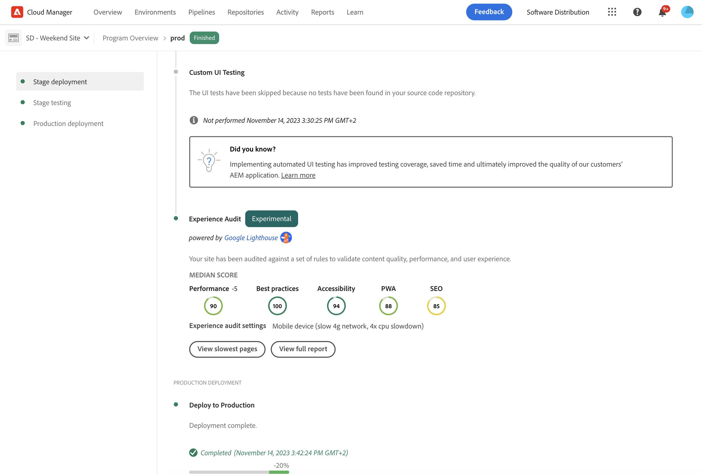
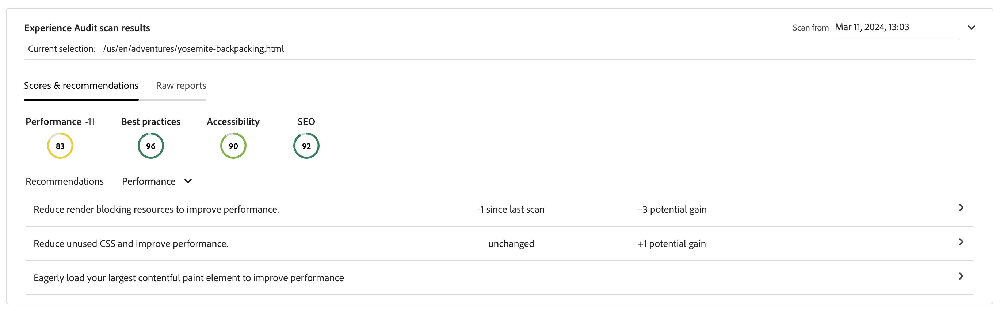
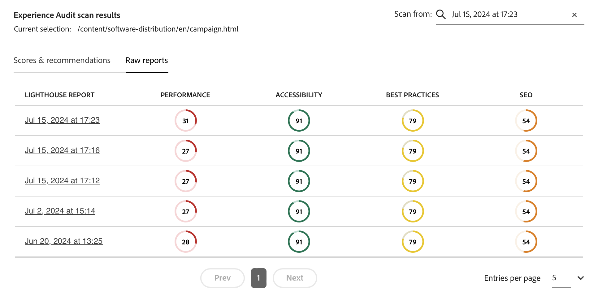

# Kontrollpanelen för Experience Audit {#experience-audit-dashboard}

Läs om hur Experience Audit validerar er distributionsprocess och ser till att de ändringar som driftsätts uppfyller grundläggande standarder för prestanda, tillgänglighet, bästa praxis och SEO via ett tydligt och informativt gränssnitt.

>[!NOTE]
>
>Den här funktionen är bara tillgänglig för [det tidiga adopteringsprogrammet.](/help/implementing/cloud-manager/release-notes/current.md#early-adoption)
>
>Mer information om den befintliga funktionen Experience Audit för AEM as a Cloud Service finns i dokumentet [Testning av Experience Audit](/help/implementing/cloud-manager/experience-audit-testing.md)

## Ökning {#overview}

Experience Audit validerar distributionsprocessen och säkerställer att ändringarna som distribueras:

1. Uppfyll grundläggande standarder för prestanda, tillgänglighet, bästa praxis, SEO (Search Engine Optimization) och PWA (Progressive Web App).

1. Inför inte regressioner.

Experience Audit i Cloud Manager säkerställer att användarens upplevelse på webbplatsen är av högsta standard.

Granskningsresultaten är informativa och gör det möjligt för distributionshanteraren att se poängen och ändringen mellan aktuella och tidigare poäng. Den här insikten är värdefull för att avgöra om det finns en regression som introducerades i den aktuella distributionen.

Experience Audit drivs av [Google Lighthuse](https://developer.chrome.com/docs/lighthouse/overview/), ett verktyg med öppen källkod från Google, som är aktiverat i alla produktionsflöden för Cloud Manager.

## Tillgänglighet {#availability}

Experience Audit är tillgänglig för Cloud Manager:

* Platser som producerar rörledningar, som standard
* Utveckla rörledningar i full hög, om du vill
* Frontrörledningar (valfritt)

Se [Konfigurationsavsnitt](#configuration) för mer information om hur du konfigurerar granskningen för de valfria miljöerna.

Granskningar körs som en del av pipeline. Granskningar kan också [kör on demand](#on-demand) utanför rörledningar.

## Konfiguration {#configuration}

Experience Audit är tillgängligt som standard för produktionspipelines. Den kan även aktiveras för utveckling av rörledningar i full stack och front-end. I samtliga fall måste du definiera vilka innehållssökvägar som utvärderas under pipeline-körningen.

1. Beroende på vilken typ av pipeline du vill konfigurera kan du följa anvisningarna för att:

   * Lägg till en ny [Produktionspipeline.](/help/implementing/cloud-manager/configuring-pipelines/configuring-production-pipelines.md) om du vill definiera sökvägarna som ska utvärderas av granskningen.
   * Lägg till en ny [icke-produktionsrörledning,](/help/implementing/cloud-manager/configuring-pipelines/configuring-non-production-pipelines.md) om du vill aktivera granskningen i en pipeline i början eller i en hel utvecklingsfas.
   * Eller så kan du [redigera en befintlig pipeline,](/help/implementing/cloud-manager/configuring-pipelines/managing-pipelines.md) och uppdatera de befintliga alternativen.

1. Om du lägger till eller redigerar ett icke-produktionsflöde som du vill använda Experience Audit för, måste du välja **Experience Audit** kryssrutan på **Källkod** -fliken.

   

   * Detta är endast nödvändigt för rörledningar som inte är avsedda för produktion.
   * The **Experience Audit** visas när kryssrutan är markerad.

1. För rörledningar för både produktion och icke-produktion definierar ni de banor som ska inkluderas i Experience Audit på **Experience Audit** -fliken.

   * Sidsökvägar måste börja med `/` och är relativa till din plats.
   * Om din webbplats till exempel är `wknd.site` och vill inkludera `https://wknd.site/us/en/about-us.html` Ange sökvägen i Experience Audit `/us/en/about-us.html`.

   

1. Tryck eller klicka **Lägg till sida** och sökvägen fylls i automatiskt med adressen till din miljö och läggs till i sökvägstabellen.

   

1. Fortsätt att lägga till banor efter behov genom att upprepa de två föregående stegen.

   * Du kan lägga till högst 25 banor.
   * Om du inte definierar några sökvägar inkluderas webbplatsens hemsida som standard i Experience Audit.

1. Klicka **Spara** för att spara på rörledningen.

## Resultat av granskning {#results}

Resultaten av Experience Audit presenteras i **Stage testing** produktionsfasen via [körningssida för produktionsflöde.](/help/implementing/cloud-manager/deploy-code.md)

Experience Audit ger medianpoängen i Google Lighthuse för [konfigurerade sidor](#configuration) och skillnaden i poäng till föregående sökning.

Från den här sammanfattningsvyn i **Scentestning** rörledningsfasen har du två alternativ:

* **[Visa långsammaste sidor](#view-slowest-pages)**
* **[Visa fullständig rapport](#view-full-report)**

Förutom sammanfattningen som visas i detaljerna för en pipeline-körning kan du även få direkt åtkomst till det fullständiga resultatet av granskningen genom att använda **Rapporter** -fliken på kontrollpanelen för Cloud Manager som du kommer åt [den fullständiga rapporten](#view-full-report) direkt.

>[!TIP]
>
>I följande avsnitt beskrivs hur du visar resultaten av Experience Audit.
>
>* Om du vill ha mer information om hur granskningen fungerar, se avsnittet [Utvärderingsinformation för Experience Audit.](#details)
>* Om du vill veta hur du kör en upplevelsegranskning på begäran kan du läsa avsnittet [On-Demand Audit Reports.](#on-demand)
>* Om du får problem med granskningen kan du läsa avsnittet [Experience Audit Encounters Issues.](#issues)
>* Allmänna tips finns i avsnittet [Allmänna tips för prestanda.](#performance-tips)

### Visa långsammaste sidor {#view-slowest-pages}

Tryck eller klicka **Visa långsammaste sidor** öppnar **Långsammaste 5 sidorna** dialogruta, visa de fem sidor som har lägst prestanda som du [konfigurerad för granskning.](#configuration)

Poängen delas upp efter **Prestanda**, **Tillgänglighet**, **Bästa praxis** och **SEO** tillsammans med avvikelsen för varje mätvärde från den senaste granskningen.

Som standard öppnas dialogrutan med bakgrundsmusik för mobila enheter. Du kan ändra detta till skrivbordsresultat med **Enheter** i dialogrutans övre del.

Dialogrutan är avsedd för en snabb översikt. Mer information får du om du trycker eller klickar **Visa fullständig rapport**.

### Visa fullständig rapport {#view-full-report}

Du kan visa den fullständiga Experience Audit-rapporten genom att:

* Tryck eller klicka **Visa fullständig rapport** i **[Långsammaste 5 sidorna](#view-slowest-pages)** -dialogrutan.
* Tryck eller klicka **Visa fullständig rapport** när du visar [genomförande av en rörledning.](#results)
* Tryck eller klicka på **Rapporter** i Cloud Manager.

The **Rapporter** -fliken i Cloud Manager är öppen och visar **Upplevelsegranskning**.

Rapporten är uppdelad i två områden:

* **[Sidpoäng - trend](#trend)**
* **[Resultat av granskningssökning](#results)**

#### Sidpoäng - trend {#trend}

Som standard är den markerade vyn **Sidpoäng - trend** är **medianpoäng** för **Senaste 6 månaderna**.

Använd **Välj** och **Visa** listrutor högst upp och längst ned i diagramknappen om du vill välja sidspecifik information och olika tidsramar. Tryck på eller klicka på **uppdateringstrend** överst i diagrammet för att tillämpa markeringarna och uppdatera diagrammet.

När du flyttar musen över diagrammet visas ett verktygstips värdena för kategorierna Google Lightroom vid specifika tidpunkter.

Om du trycker eller klickar på diagrammet vid en tidpunkt öppnas en pekare med detaljer om den skanningen. Tryck eller klicka på **öppna granskning av upplevelsegranskning** för att läsa in sökresultaten i **[Resultat av granskningssökning](#scan-results)** -avsnitt.

#### Resultat av Experience Audit Scan {#scan-results}

The **Resultat av granskningssökning** innehåller rekommendationer om hur du kan förbättra poängen och detaljer för alla sidor som genomsöks. Den är uppdelad i två delar:

* **[Recommendations](#recommendations)**
* **[Skannade sidor](#scanned-pages)**

##### Recommendations {#recommendations}

The **Recommendations** -avsnittet visar en sammanställd uppsättning insikter. Som standard rekommenderar vi **prestanda** visas. Använd listrutan bredvid **Recommendations** om du vill byta till en annan kategori.

Tryck eller klicka på avtryckaren om du vill visa information om den.

När det är tillgängligt innehåller den utökade rekommendationsinformationen också procentandelen av rekommendationseffekten, vilket hjälper dig att fokusera på de mest effektiva ändringarna.

Tryck eller klicka på **visa sidor** i informationsvyn för att se de sidor som rekommendationen gäller för.

##### Inlästa sidor {#scanned-pages}

The **Skannade sidor** finns information om poängen på alla inlästa sidor. Du kan använda **Föregående** och **Nästa** för att bläddra igenom resultaten och välja hur många som ska visas.

Om du trycker eller klickar på länken för en viss sida uppdateras **Välj** filter för [**Sidpoäng - trend** section](#trend) och visar **Resultat och rekommendationer** för den valda sidan.

The **Rårapporter** -fliken ger dig poäng för varje granskning av sidan. Tryck eller klicka på **Ladda ned** om du vill hämta en JSON-fil med rådata.

Då öppnas en ny flik i webbläsaren som pekar på `https://googlechrome.github.io/lighthouse/viewer/` med en signerad URL-adress till JSON-rapporten (Lightroom Raw JavaScript Object Notation) för den valda sidan, som öppnas automatiskt för detaljerad granskning

## Granskningsrapporter på begäran {#on-demand}

Förutom att de körs under pipeline-körning kan Experience Audit-rapporter även genereras på begäran. Det här är en bra lösning för att snabbt skanna sidor utan att behöva köra en pipeline.

Navigera till  **Rapporter** för att se hela granskningsrapporten och sedan trycka eller klicka på **Kör genomsökning** -knappen.

On-demand-skanningar utlöser en Experience Audit för de senaste 25 [konfigurerade sidor](#configuration) och avslutas normalt på några minuter.

När poängen är klara uppdateras poängdiagrammet automatiskt och du kan kontrollera resultaten exakt som vid en genomsökning av pipeline-körningar.

Du kan filtrera poängdiagrammet baserat på utlösartypen med hjälp av kommandot **Utlösare** väljare.

>[!NOTE]
>
>En genomsökning på begäran kan bara startas om miljön inte tas bort och det inte finns några andra väntande genomsökningar i samma miljö.

## Problem med Experience Audit Encounters {#issues}

If [sidor som du har konfigurerat](#configuration) för att bli föremål för revision var inte tillgängligt återspeglar Experience Audit detta.

Pipelinen visar ett utökningsbart felavsnitt som visar de relativa URL-sökvägar som den inte har åtkomst till.

Om du visar hela rapporten visas information i **[Resultat av granskningssökning](#results)** -avsnitt.

En del orsaker till att sidorna kanske inte är tillgängliga är:

* Konfigurationsblocken ger åtkomst.
* Sidan finns inte.
* Sidan omdirigeras som kräver annan autentisering än grundläggande.
* Ett internt fel har inträffat.
* osv.

>[!TIP]
>
>[Åtkomst till rårapporter](#scanned-pages) för en sida kan innehålla information om varför sidan inte kunde granskas.

## Allmänna tips för prestanda {#performance-tips}

Två av de vanligaste effektproblemen som är enkla att åtgärda är CLS (Cumulative Layout Shifts) och LCP (Largest Contentful Paint).

Dessa kan förbättras genom att

* Det går inte att läsa in bilderna ovanför vecket (innehållet som visas i webbläsaren utan att behöva rulla nedåt).
* Att prioritera hur resurser läses in korrekt (t.ex. genom att läsa in bilderna asynkront under det veckade intervallet efter att dokumentet har lästs in).
* Förhämtning av JavaScript- och CSS-filer som används för att återge innehåll ovanför förskjutningen (om de behövs).
* Reservera det lodräta utrymmet genom att tilldela en proportion till behållare som antingen läses in långsamt eller återges senare.
* Konverterar bilder till WebP-format för att minska deras storlek.
* Använda `<picture>` och bild `srcset` med olika bildstorlekar för olika visningsrutor (och se till att storleksändringen fungerar).

## Utvärderingsinformation för Experience Audit {#details}

Följande information innehåller ytterligare information om hur Experience Audit utvärderar er webbplats. De är inte nödvändiga för allmän användning av funktionen och anges här för fullständighetens skull.

* Även om [konfigurerade sökvägar för Experience Audit-sidor](#configuration) visa `.com` utgivarens domän, revisionen söker igenom ursprunget (`.net`) domän, för att säkerställa att problem som uppstår under utvecklingen upptäcks.
   * The `.com` domänen använder ett CDN och kan ge bättre resultat eller innehålla cachelagrade resultat.
* Mellanlagringsmiljön skannas in i rörledningar med full stapel i produktionen.
   * För att säkerställa att granskningen innehåller relevanta detaljer under granskningen bör mellanlagringsmiljöns innehåll vara så nära produktionsmiljön som möjligt.
* Sidorna som visas i **Välj** listrutan i [**Sidpoäng - trend** section](#trend) är alla kända sidor som tidigare har skannats in av Experience Audit.
* [En rekommendation](#recommendations) kan ha en potentiell ökning och en skillnad från den tidigare sökningen.
   * Experience Audit uppskattar den potentiella vinsten genom att bearbeta raw-rapporten för varje sida och korrelera de byte eller millisekunder som slöseri med en insikt som har en viktad effekt på resultatet.
   * Granskningen innehåller denna information (samt berörda sidor) för att hjälpa till att avgöra vilken rekommendation som ska följas.
   * Mer information finns i [Allmänna tips för prestanda](#performance-tips)
* Med tanke på att en frontend-pipeline kan distribueras till en befintlig miljö (eller det kan finnas flera frontend-pipelines som är avsedda för samma miljö) och att skanningsresultaten sammanställs på en miljönivå, visas poängen, trenderna och rekommendationerna i samma valda miljö, oavsett vilken pipeline-körning som utlöste skanningen.
