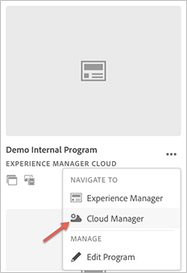
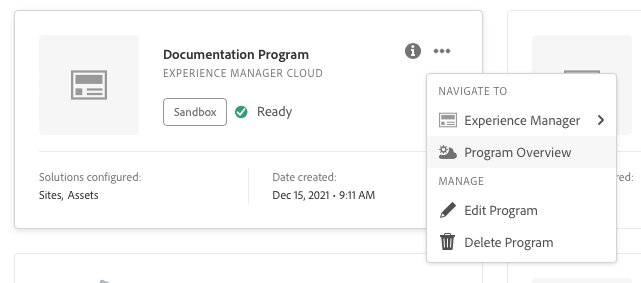

# Skapa produktionsprogram {#create-production-program}

Ett produktionsprogram är avsett för en användare som är bekant med AEM och Cloud Manager och som är redo att börja skriva, bygga och testa kod i syfte att distribuera den för livstrafik.

Läs mer om programtyper i dokumentet [Program- och programtyper.](program-types.md)

## Skapa ett produktionsprogram {#create}

Följ de här stegen för att skapa ett produktionsprogram. Observera att beroende på organisationens rättigheter kan du se [ytterligare alternativ](#options) när du lägger till ditt program.

1. Logga in i Cloud Manager på [my.cloudmanager.adobe.com](https://my.cloudmanager.adobe.com/) och välja lämplig organisation.

1. På **[Mina program](/help/implementing/cloud-manager/getting-access-to-aem-in-cloud/editing-programs.md#my-programs)** skärm, tryck eller klicka **Lägg till program** i skärmens övre högra hörn.

   

1. Välj **Ställ in för produktion** i guiden Skapa program för att skapa ett produktionsprogram och ange ett programnamn.

   

1. Du kan också lägga till en bild i programmet genom att dra och släppa en bildfil i **Lägg till en programavbildning** markera eller klicka på en bild i en filläsare. Välj **Fortsätt**.

1. På **Lösningar och tillägg** väljer du de lösningar som ska ingå i programmet.

   * Om du är osäker på om du behöver ett eller flera program för de olika lösningar du har tillgängliga väljer du det som intresserar dig mest. Du kan aktivera ytterligare lösningar genom att [redigera programmet](/help/implementing/cloud-manager/getting-access-to-aem-in-cloud/editing-programs.md) senare. Se [Introduktion till produktionsprogramdokument](/help/implementing/cloud-manager/getting-access-to-aem-in-cloud/introduction-production-programs.md) om du vill ha fler rekommendationer för programkonfiguration.
   * Minst en lösning krävs för att skapa ett program.
   * Om du valde **[Aktivera förbättrat skydd](#security)** kan du bara välja så många lösningar som HIPAA-berättiganden är tillgängliga för.

   

1. Klicka på nedtryckningen före lösningsnamnet för att visa valfria tillägg, som att välja **Handel** tilläggsalternativ under **Webbplatser**.

   

1. Med lösningar och tillägg markerade klickar du på **Fortsätt**.

1. På **GoLive-datum** Ange det datum då du planerar att publicera ditt produktionsprogram.

   

   * Det här datumet kan redigeras när som helst.
   * Detta datum är endast avsett som information och aktiverar Go Live-widgeten på [**Programöversikt** page](/help/implementing/cloud-manager/getting-access-to-aem-in-cloud/editing-programs.md#program-overview) att tillhandahålla länkar till AEM as a Cloud Service best practice-dokumentation i rätt tid för att passa in i den resa som leder till en lyckad och smidig Go Live-upplevelse.

1. Klicka **Skapa**.

Ditt program skapas av Cloud Manager och visas och kan väljas på landningssidan.

## Fler alternativ för produktionsprogram {#options}

Beroende på vilka berättiganden som är tillgängliga för din organisation kan du ha ytterligare alternativ tillgängliga när du skapar ett produktionsprogram.

### Dokumentskydd {#security}

Om du har de rättigheter du behöver **Säkerhet** som den första fliken i **Ställ in för produktion** -dialogrutan.

The **Säkerhet** -fliken innehåller alternativ för att aktivera **HIPAA** och/eller **WAF-DDOS-skydd** för produktionsprogrammet.

Adobe HIPAA-kompatibel och Web Application Firewall (WAF) underlättar molnbaserad säkerhet som en del av ett flerskiktat tillvägagångssätt för att skydda mot sårbarheter.

* **HIPAA** - Det här alternativet möjliggör implementering av Adobe HIPPA-klara lösningar.
   * [Läs mer](https://www.adobe.com/go/hipaa-ready) om implementering av Adobe HIPAA-klar lösning.
   * HIPAA kan inte aktiveras eller inaktiveras efter att programmet har skapats.
* **WAF-DDOS-skydd** - Med det här alternativet kan webbprogrammets brandvägg skyddas via regler.
   * När det är aktiverat kan WAF-DDOS-skyddet sedan konfigureras genom att konfigurera en [icke-produktionsrörledning.](/help/implementing/cloud-manager/configuring-pipelines/configuring-non-production-pipelines.md)
   * Se dokumentet [Trafikfilterregler inklusive WAF-regler](/help/security/traffic-filter-rules-including-waf.md) om du vill lära dig hur du hanterar trafikfilterregler i din databas så att de distribueras på rätt sätt.

### SLA {#sla}

Om du har de rättigheter du behöver **SLA** som den andra eller tredje fliken i **Ställ in för produktion** -dialogrutan.

AEM Sites erbjuder 99,9 % standardavtal för servicenivå (SLA). The **99,99 % serviceavtal** ger en driftsäkerhet på minst 99,99 % för produktionsmiljöerna.

99,99 % SLA ger fördelar, inklusive högre tillgänglighet och lägre latens, och kräver en [ytterligare publiceringsregion](/help/implementing/cloud-manager/manage-environments.md#multiple-regions) som ska tillämpas på produktionsmiljön i programmet.

När [krav](#sla-requirements) för att aktivera 99,99 % SLA måste du köra en [fullständigt stackflöde](/help/implementing/cloud-manager/configuring-pipelines/configuring-production-pipelines.md) för att aktivera den.

#### Krav för 99,99 % SLA {#sla-requirements}

Utöver de obligatoriska rättigheterna har 99,99 % SLA ytterligare krav för användning.

* Både 99,99 % SLA och ytterligare rättigheter för publiceringsregioner måste vara tillgängliga för organisationen när 99,99 % SLA tillämpas på programmet.
* För att tillämpa 99,99 % SLA på programmet kontrollerar Cloud Manager att en oförbrukad [ytterligare publiceringsregion](/help/implementing/cloud-manager/manage-environments.md#multiple-regions) berättigande finns också tillgängligt och kan tillämpas på programmet.
* När du redigerar ett program och det redan innehåller en produktionsmiljö med minst en extra publiceringsregion, kontrollerar Cloud Manager bara om det finns ett 99,99 % SLA-berättigande.
* För att det 99,99 %-avtal och den rapportering som ska aktiveras ska [produktion/scenmiljö](/help/implementing/cloud-manager/manage-environments.md#adding-environments) måste ha skapats och minst en extra publiceringsregion måste ha tillämpats på produktions-/scenmiljön.
   * Om du använder [avancerade nätverk,](/help/security/configuring-advanced-networking.md) kontrollera att [Lägga till flera publiceringsregioner i en ny miljö](/help/implementing/cloud-manager/manage-environments.md#adding-regions) Dokument för rekommendationer så att anslutningen upprätthålls i händelse av ett regionalt fel.
* Minst en extra publiceringsregion måste finnas kvar i ditt 99,99 % SLA-program. Användare får inte ta bort den sista ytterligare publiceringsregionen från ditt 99,99 % SLA-program.
* 99,99 % SLA stöds för produktionsprogram där Sites-lösningen är aktiverad.
* Du måste köra en [fullständigt stackflöde](/help/implementing/cloud-manager/configuring-pipelines/configuring-production-pipelines.md) för att aktivera (eller, när du redigerar ett program, avaktivera) 99,99 % SLA.

## Använd ditt program {#accessing}

1. När du ser ditt programkort på landningssidan väljer du ellipsknappen för att visa de menyalternativ som är tillgängliga för dig.

   

1. Välj **Programöversikt** för att gå till Cloud Managers **Ökning** sida.

1. Huvudkortet på översiktssidan hjälper dig att skapa en miljö, en produktionsprocess och slutligen en produktionsprocess.

   

Om du behöver växla till ett annat program eller gå tillbaka till översiktssidan för att skapa ett annat program klickar du på programnamnet längst upp till vänster på skärmen för att visa **Navigera till** alternativ.

>[!NOTE]
>
>Till skillnad från [sandlådeprogram,](introduction-sandbox-programs.md#auto-creation) ett produktionsprogram kräver att användaren har rätt molnhanterarroll för att skapa projektet och lägga till en miljö via självbetjäningsgränssnittet.
