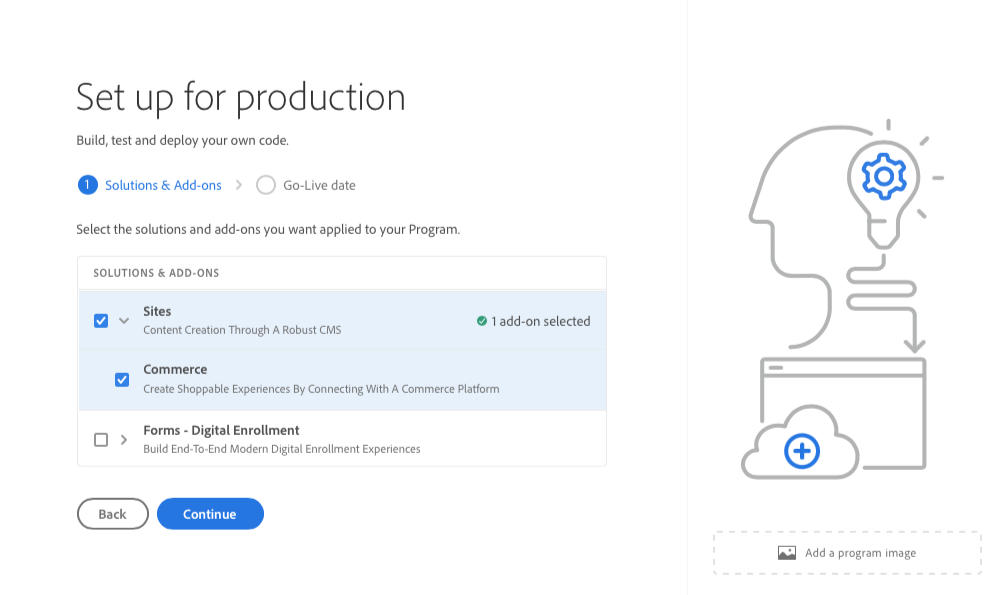

# Skapa produktionsprogram {#create-production-program}

Ett produktionsprogram är avsett för en användare som är bekant med AEM och Cloud Manager och som är redo att börja skriva, bygga och testa kod i syfte att distribuera den för livstrafik.

Läs mer om programtyper i dokumentet [Program- och programtyper.](program-types.md)

## Video Tutorials {#video-tutorials}

Du kan titta på dessa två självstudiekurser för att lära dig hur du skapar ett program i Cloud Manager eller [Följ våra dokumenterade anvisningar.](#create)

>[!VIDEO](https://video.tv.adobe.com/v/334953)

>[!VIDEO](https://video.tv.adobe.com/v/334954)

## Skapa ett produktionsprogram {#create}

Följ de här stegen för att skapa ett produktionsprogram.

1. Logga in i Cloud Manager på [my.cloudmanager.adobe.com](https://my.cloudmanager.adobe.com/) och välja lämplig organisation.

1. Klicka på **Lägg till program** från skärmens övre högra hörn.

   

1. Välj **Ställ in för produktion** i guiden Skapa program för att skapa ett produktionsprogram.

   1. Du kan godkänna standardprogramnamnet eller redigera det.
   1. Du kan också dra och släppa en miniatyrbild för att identifiera programmet.
   1. Tryck eller klicka **Fortsätt**.

   

1. Om du har utökade säkerhetsrättigheter **Förbättrat skydd** kan du välja att **Aktivera förbättrat skydd** för produktionsprogrammet. Om det behövs markerar du alternativet för att aktivera förbättrat skydd och trycker eller klickar på **Fortsätt**.

   * Förbättrat skydd kan inte aktiveras eller inaktiveras efter att programmet har skapats.
   * [Läs mer](https://www.adobe.com/go/hipaa-ready) om implementering av Adobe HIPAA-klar lösning.

   

1. På **Lösningar och tillägg** väljer du de lösningar som ska ingå i programmet.

   * Om du valde **Aktivera förbättrat skydd** tidigare får du bara välja så många lösningar som det finns tillgängliga HIPAA-berättiganden för.

   

1. Klicka på avrivningen före lösningsnamnen för att visa valfria tillägg, som att välja **Handel** tilläggsalternativ under **Webbplatser**.

   

1. Med lösningar och tillägg markerade klickar du på **Fortsätt**.

1. På **GoLive-datum** Ange det datum då du planerar att publicera ditt produktionsprogram.

   

   * Det här datumet kan redigeras när som helst.
   * Detta datum är endast avsett som information och aktiverar Go Live-widgeten på programöversiktssidan för att tillhandahålla länkar till AEM as a Cloud Service best practice-dokumentation i rätt tid för att anpassa sig till den resa som leder till en lyckad och smidig Go Live-upplevelse.

1. Klicka **Skapa**.

Ditt program skapas av Cloud Manager och visas och kan väljas på landningssidan.

## Använd ditt program {#acessing}

1. När du ser ditt programkort på landningssidan väljer du ellipsknappen för att visa de menyalternativ som är tillgängliga för dig.

   

1. Välj **Programöversikt** för att gå till Cloud Managers **Översikt** sida.

1. Huvudkortet på översiktssidan hjälper dig att skapa en miljö, en produktionsprocess och slutligen en produktionsprocess.

   

Om du behöver växla till ett annat program eller gå tillbaka till översiktssidan för att skapa ett annat program klickar du på programnamnet längst upp till vänster på skärmen för att visa **Navigera till** alternativ.

>[!NOTE]
>
>Till skillnad från [sandlådeprogram,](introduction-sandbox-programs.md#auto-creation) ett produktionsprogram kräver att användaren har rätt molnhanterarroll för att skapa projektet och lägga till en miljö via självbetjäningsgränssnittet.
