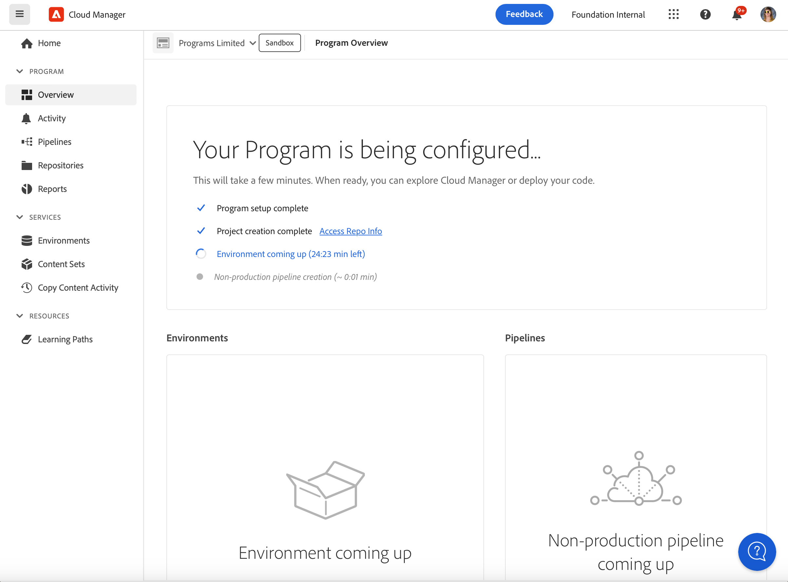

# Skapa sandlådeprogram {#create-sandbox-program}

Ett sandlådeprogram skapas vanligtvis för att användas för utbildning, löpande demos, aktivering, POC eller dokumentation, och är inte avsett för livstrafik. Se [Introduktion till sandlådeprogram](/help/implementing/cloud-manager/getting-access-to-aem-in-cloud/introduction-sandbox-programs.md).

Läs mer om programtyper i dokumentet [Om program- och programtyper](program-types.md).

## Skapa ett sandlådeprogram {#create}

1. Logga in på Cloud Manager på [my.cloudmanager.adobe.com](https://my.cloudmanager.adobe.com/) och välj lämplig organisation.

1. På konsolen **[Mina program](/help/implementing/cloud-manager/navigation.md#my-programs)** klickar du på **Lägg till program** i det övre högra hörnet.

   

1. I *Programguiden* skriver du det namn du vill använda för programmet i textfältet **Programnamn**.

1. Under **Programmål** väljer du  **Konfigurera en sandlåda**.

   

1. (Valfritt) Gör något av följande i det nedre högra hörnet i dialogrutan för guiden:

   * Dra och släpp en bildfil till  **Lägg till ett programbildsmål** .
   * Klicka på  **Lägg till en programbild** och välj sedan en bild i en filläsare.
   * Klicka på ikonen  för att ta bort en bild som du har lagt till.

1. Klicka på **Fortsätt**.

1. I listrutan **Lösningar och tillägg** väljer du en eller flera lösningar som ska ingå i programmet.

   * Klicka på nedtryckningen till vänster om namnet på en lösning för att visa alla tillgängliga valfria tillägg som du vill inkludera i en vald lösning.
   * Lösningarna **Webbplatser**, **Assets** och **Edge Delivery Services** är alltid markerade som standard när du skapar ett sandlådeprogram. Du kan inte avmarkera dem.

   

1. Klicka på **Skapa**. Cloud Manager skapar ditt sandlådeprogram och visar det på landningssidan för markering.

## Sandlådeåtkomst {#access}

När ett nytt sandlådeprogram har skapats kan du visa detaljerna för sandlådekonfigurationen och få åtkomst till miljön genom att visa programöversiktssidan.

1. På Cloud Manager landningssida i sandlådeprogrammet klickar du på  i det sandlådeprogram du har skapat.

   

1. När projektskapandet är klart kan du klicka på länken **Åtkomst till upprepningsinformation** för att kunna använda Git-svaret.

   

   >[!TIP]
   >
   >Mer information om hur du får åtkomst till och hanterar Git-databasen finns i [Åtkomst till Git](/help/implementing/cloud-manager/managing-code/accessing-repos.md).

1. När utvecklingsmiljön har skapats kan du klicka på **Åtkomst till AEM** och logga in på AEM.

   

1. När den icke-produktionsprocess som distribueras till utvecklingsfasen är klar vägleder guiden i call-to-action dig att antingen komma åt AEM utvecklingsmiljö eller att distribuera kod till utvecklingsmiljön.

   

>[!TIP]
>
>Se [Navigera i användargränssnittet för Cloud Manager](/help/implementing/cloud-manager/navigation.md) om du vill ha mer information om hur du navigerar i Cloud Manager och förstå konsolen **Mina program**.
