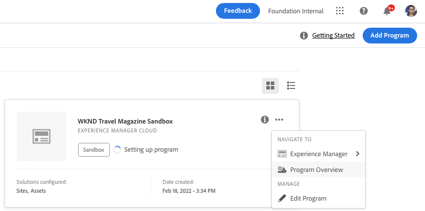

# Skapa sandlådeprogram {#create-sandbox-program}

Ett sandlådeprogram skapas vanligtvis för att användas för utbildning, löpande demonstrationer, aktivering, POC:er eller dokumentation och är inte avsett för livstrafik.

Läs mer om programtyper i dokumentet [Program- och programtyper.](program-types.md)

## Skapa ett sandlådeprogram {#create}

Följ de här stegen för att skapa ett sandlådeprogram.

1. Logga in i Cloud Manager på [my.cloudmanager.adobe.com](https://my.cloudmanager.adobe.com/) och välja lämplig organisation.

1. Klicka på **Lägg till program** i skärmens övre högra hörn.

   

1. Välj **Konfigurera en sandlåda**, ange ett programnamn och klicka sedan på **Skapa**.

   

Du ser ett nytt sandlådeprogramkort på landningssidan med en statusindikator allt eftersom installationsprocessen fortskrider.

## Använd din sandlåda {#access}

Du kan visa information om sandlådekonfigurationen och få tillgång till miljön (när den är tillgänglig) genom att visa programöversiktssidan.

1. På landningssidan för Cloud Manager klickar du på ellipsknappen i det nya programmet.

   

1. När projektet är klart kan du öppna **Åtkomst till svarsinformation** för att kunna använda ditt Git-svar.

   

   >[!TIP]
   >
   >Mer information om hur du får åtkomst till och hanterar Git-databasen finns i dokumentet [Åtkomst till Git.](/help/implementing/cloud-manager/managing-code/accessing-repos.md)

1. När utvecklingsmiljön har skapats kan du använda **AEM** för att logga in AEM.

   

1. När icke-produktionsflödet som distribueras till utvecklingsfasen är klart vägleder guiden dig att antingen få åtkomst till AEM utvecklingsmiljö eller att distribuera kod till utvecklingsmiljön.

   

Om du behöver växla till ett annat program eller gå tillbaka till översiktssidan för att skapa ett annat program klickar du på programnamnet längst upp till vänster på skärmen för att visa **Navigera till** alternativ.

