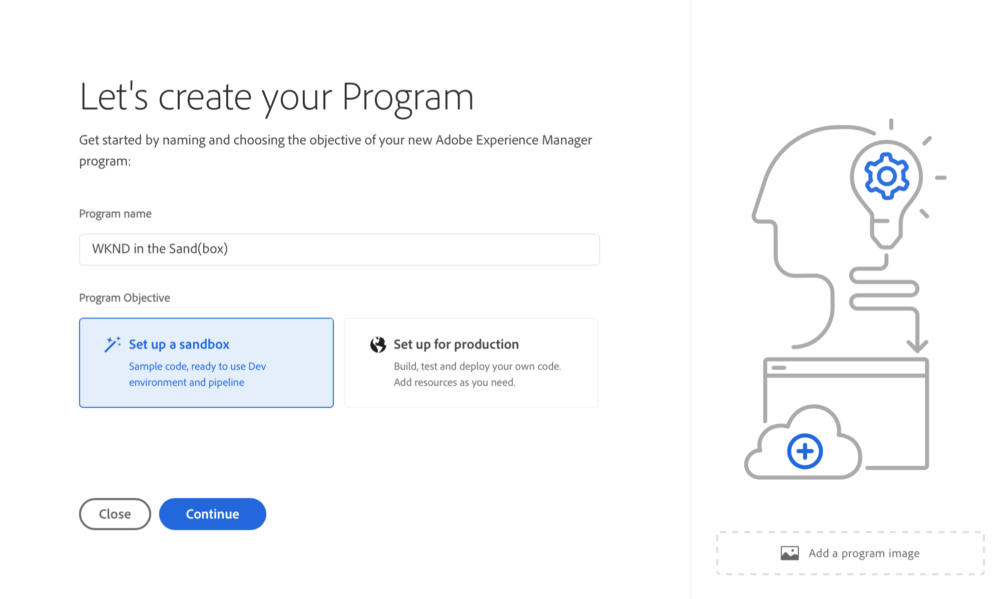

# Skapa sandlådeprogram {#create-sandbox-program}

Ett sandlådeprogram skapas vanligtvis för att användas för utbildning, löpande demonstrationer, aktivering, POC:er eller dokumentation och är inte avsett för livstrafik.

Läs mer om programtyper i dokumentet [Program- och programtyper.](program-types.md)

## Skapa ett sandlådeprogram {#create}

1. Logga in på Cloud Manager på [my.cloudmanager.adobe.com](https://my.cloudmanager.adobe.com/) och välja lämplig organisation.

1. På **[Mina program](/help/implementing/cloud-manager/navigation.md#my-programs)** konsol, tryck eller klicka **Lägg till program** i skärmens övre högra hörn.

   

1. Välj **Konfigurera en sandlåda** och ange ett programnamn.

   

1. Du kan också lägga till en bild i programmet genom att dra och släppa en bildfil i **Lägg till en programavbildning** markera eller klicka på en bild i en filläsare. Välj **Fortsätt**.

   * Bilden fungerar bara som plattan i programöversiktsfönstret och hjälper till att identifiera programmet.

1. I **Konfigurera din sandlåda** väljer du vilka lösningar du vill aktivera i ditt sandlådeprogram genom att markera alternativen i **Lösningar och tillägg** tabell.

   * Använd ändringarna bredvid lösningsnamnen så att du kan se ytterligare valfria tillägg för lösningarna.

   * The **Webbplatser** och **Resurser** lösningar ingår alltid i sandlådeprogram och kan inte avmarkeras.

   

1. När du har valt lösningar och tillägg för ditt sandlådeprogram klickar du på **Skapa**.

Du ser ett nytt sandlådeprogramkort på landningssidan med en statusindikator allt eftersom installationsprocessen fortskrider.

## Sandlådeåtkomst {#access}

Du kan visa detaljerna i sandlådekonfigurationen och få tillgång till miljön (när den är tillgänglig) genom att visa programöversiktssidan.

1. På landningssidan för Cloud Manager klickar du på ellipsknappen på det skapade programmet.

   

1. När du har skapat projektet kan du komma åt **Åtkomst till svarsinformation** för att kunna använda ditt Git-svar.

   

   >[!TIP]
   >
   >Mer information om hur du får åtkomst till och hanterar Git-databasen finns i [Åtkomst till Git](/help/implementing/cloud-manager/managing-code/accessing-repos.md).

1. När utvecklingsmiljön har skapats kan du använda **AEM** för att logga in AEM.

   

1. När den icke-produktionsprocess som distribueras till utvecklingsfasen är klar vägleder guiden i anropet dig till att antingen få åtkomst till AEM utvecklingsmiljö eller att distribuera kod till utvecklingsmiljön.

   

>[!TIP]
>
>Se dokumentet [Navigera i användargränssnittet för Cloud Manager](/help/implementing/cloud-manager/navigation.md) om du vill ha mer information om hur du navigerar i Cloud Manager och förstå **Mina program** konsol.
