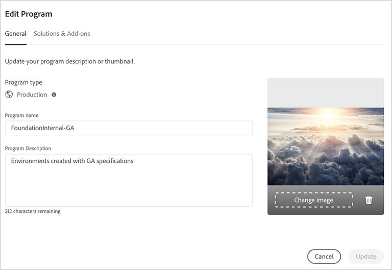
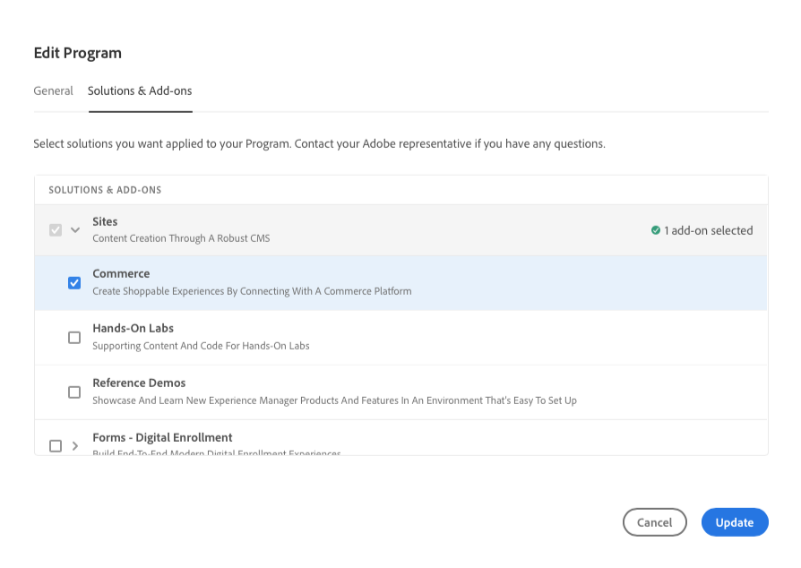

# Redigeringsprogram {#editing-programs}

Användare med nödvändig behörighet kan redigera [produktionsprogram som har skapats i din organisation](creating-production-programs.md) och [sandlådeprogram som har skapats i din organisation.](creating-sandbox-programs.md) Genom att redigera ett program kan du

* Lägg till Sites-lösning i ett befintligt program med Assets och vice versa.
* Ta bort platser eller resurser från ett befintligt program med både platser och resurser.
* Lägg till ett andra, oanvänt lösningsberättigande till antingen ett befintligt program eller som ett nytt program.
* Ta bort sandlådeprogram.

## Behörigheter {#permissions}

Du måste vara medlem i **Företagsägare** roll för att redigera program eller ta bort sandlådeprogram.

## Redigera ett program {#editing}

Följ de här stegen för att redigera ett program.

1. Logga in i Cloud Manager på [my.cloudmanager.adobe.com](https://my.cloudmanager.adobe.com/) och välja lämplig organisation.

1. Klicka på det program du vill redigera för att visa information om det.

1. Klicka på programnamnet längst upp till vänster på sidan och välj **Redigera program**.

   

1. The **Redigera program** sidan öppnas. På **Allmänt** redigerar du programnamnet och beskrivningen.

   * Minst en lösning måste väljas för ett program.

   

1. På **Lösningar och tillägg** ändrar du lösningarna för programmet.

   

1. Klicka på avrivningen före lösningsnamnen för att visa valfria tillägg, som att välja **Handel** tilläggsalternativ under **Webbplatser**.

   

1. På **Go live settings** ändrar du det planerade publiceringsdatumet för programmet.

   

   * Detta datum är endast avsett som information och aktiverar Go Live-widgeten på programöversiktssidan för att tillhandahålla länkar till AEM as a Cloud Service best practice-dokumentation i rätt tid för att anpassa sig till den resa som leder till en lyckad och smidig Go Live-upplevelse.
   * Den här fliken är inte tillgänglig för sandlådeprogram.

1. Klicka på **Uppdatera** för att spara ändringarna i programmet.

Varje gång ett program redigeras, som att lägga till eller ta bort en lösning eller ett tillägg, börjar ändringarna gälla efter nästa distribution.

Om ditt produktionsprogram hade förbättrat säkerheten aktiverat, ytterligare **Förbättrat skydd** finns på **Redigera program** för att bekräfta att funktionen är aktiv för programmet.

Den här inställningen kan inte ändras när programmet har skapats. Mer information om förbättrat säkerhetsalternativ finns i [Skapa produktionsprogram](creating-production-programs.md) -dokument.

## Tar bort sandlådeprogram {#delete-sandbox-program}

Om du tar bort ett sandlådeprogram tas alla miljöer och rörledningar som är kopplade till det bort.

>[!TIP]
>
>Användare med **Företagsägare** eller **Distributionshanteraren** roller kan också ta bort sin produktions- och scenmiljö i stället för hela sandlådeprogrammet.

Följ de här stegen för att ta bort ett sandlådeprogram.

1. Logga in i Cloud Manager på [my.cloudmanager.adobe.com](https://my.cloudmanager.adobe.com/) och välja lämplig organisation.

1. Klicka på det program du vill redigera för att visa information om det.

1. Klicka på programnamnet längst upp till vänster på sidan och välj **Ta bort program**.

   

Du kan också klicka på ellipsknappen på programmets kort på översiktssidan för Cloud Manager och välja **Ta bort program**.

>[!NOTE]
>
>Endast sandlådeprogram kan tas bort. Det går inte att ta bort produktionsprogram.
