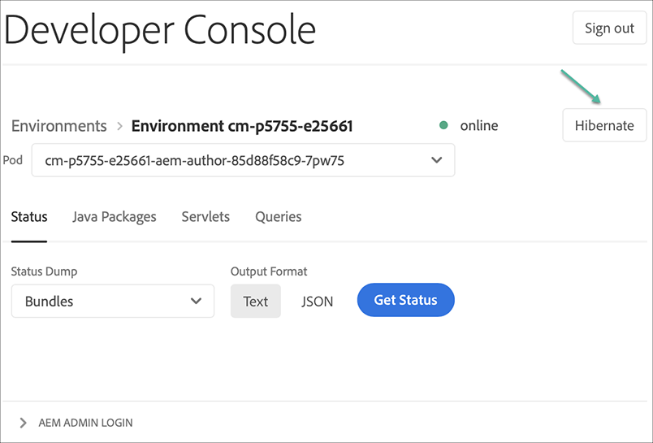
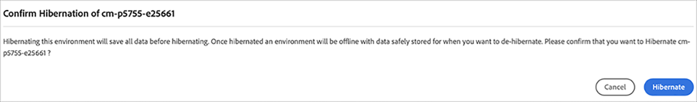
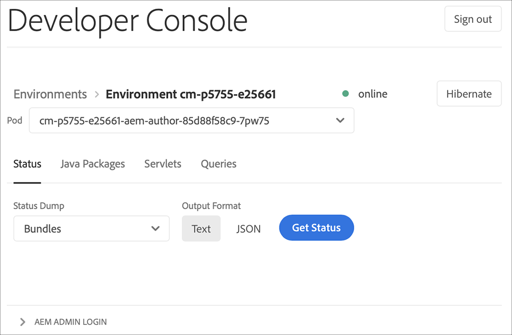

# Viloläge och avvänjning av sandlådemiljöer {#hibernating-introduction}

Miljöer i ett sandlådeprogram försätts i viloläge om ingen aktivitet identifieras under åtta timmar. Viloläge är unikt för sandlådeprogrammiljöer. Produktionsprogrammens miljöer går inte i viloläge.

## Viloläge {#hibernation-introduction}

Viloläge kan antingen inträffa automatiskt eller manuellt.

* **Automatisk** - Sandlådemiljöer försätts automatiskt i viloläge efter åtta timmars inaktivitet. Inaktivitet definieras som varken författartjänsten, förhandsgransknings- eller publiceringstjänstens mottagningsbegäranden.
* **Manuell** - Som användare kan du manuellt förvara en sandlådeprogrammiljö i viloläge. Du behöver inte göra det eftersom viloläge inträffar automatiskt enligt beskrivningen ovan.

Det kan ta upp till några minuter för sandlådeprogrammiljöer att övergå i viloläge. Data bevaras under viloläge.

### Använda manuell viloläge {#using-manual-hibernation}

Du kan manuellt förvara sandlådeprogrammet från Developer Console. Alla användare av Cloud Manager har tillgång till Developer Console för ett sandlådeprogram.

Följ de här stegen för att manuellt placera sandlådeprogrammiljöer i viloläge.

1. Logga in i Cloud Manager på [my.cloudmanager.adobe.com](https://my.cloudmanager.adobe.com/) och välja lämplig organisation.

1. Klicka på det program du vill spara i viloläge för att visa information om det.

1. På **Miljö** klickar du på ellipsknappen och väljer **Developer Console**.

   * Se [Åtkomst till Developer Console](/help/implementing/cloud-manager/manage-environments.md#accessing-developer-console) för mer information om Developer Console.

   

1. Klicka på på Developer Console **Viloläge**.

   

1. Klicka **Viloläge** för att bekräfta steget.

   

När viloläget är slutfört visas ett meddelande om viloläget för miljön i **Developer Console** skärm.

På Developer Console kan du även klicka på **Miljö** i textmarkeringarna ovanför **Pod** nedrullningsbar lista med miljöer som ska placeras i viloläge.

## Avviloläge {#de-hibernation-introduction}

Du kan manuellt förvara ditt sandlådeprogram från utvecklarkonsolen.

>[!IMPORTANT]
>
>En användare med **Utvecklare** kan avplacera en sandlådeprogrammiljö.

1. Logga in i Cloud Manager på [my.cloudmanager.adobe.com](https://my.cloudmanager.adobe.com/) och välja lämplig organisation.

1. Klicka på det program du vill spara i viloläge för att visa information om det.

1. På **Miljö** klickar du på ellipsknappen och väljer **Developer Console**.

   * Se [Åtkomst till Developer Console](/help/implementing/cloud-manager/manage-environments.md#accessing-developer-console) för mer information om Developer Console.

1. Klicka **Avviloläge**.

   

1. Klicka **Ej viloläge** för att bekräfta steget.

   

1. Du får ett meddelande om att avvänjningsprocessen har startats och att den uppdateras med förloppet.

   

1. När processen har slutförts är sandlådeprogrammiljön aktiv igen.

   

På Developer Console kan du även klicka på **Miljö** i textmarkeringarna ovanför **Pod** nedrullningsbar lista för en lista över miljöer som ska tas bort från viloläget.

### Behörigheter att ta bort viloläge {#permissions-de-hibernate}

Alla användare med en produktprofil som ger dem tillgång till AEM as a Cloud Service bör ha tillgång till **Developer Console**, så att de kan avhålla miljön.

## Åtkomst till en miljö i viloläge {#accessing-hibernated-environment}

När användaren gör några webbläsarförfrågningar mot författaren, förhandsgranskningen eller publiceringstjänsten i en miljö i viloläge, kommer användaren att få en landningssida som beskriver miljöns viloläge tillsammans med en länk till Developer Console där tjänsten kan avplaceras.

## Distributioner och AEM uppdateringar {#deployments-updates}

I miljöer med viloläge går det fortfarande att driftsätta och uppgradera manuellt AEM.

* En användare kan använda en pipeline för att distribuera anpassad kod till miljöer med viloläge. Miljön förblir i viloläge och den nya koden visas i miljön när den har tagits bort från viloläget.

* AEM uppgraderingar kan användas i miljöer med viloläge och kan aktiveras manuellt från Cloud Manager. Miljön förblir i viloläge och den nya versionen visas i miljön när den har tagits bort från viloläget.

## Viloläge och borttagning {#hibernation-deletion}

* Miljöer i ett sandlådeprogram försätts automatiskt i viloläge efter åtta timmars inaktivitet.
   * Inaktivitet definieras som varken författartjänsten, förhandsgransknings- eller publiceringstjänstens mottagningsbegäranden.
   * När de väl har tagits i viloläge kan de [avviloläge manuellt.](#de-hibernation-introduction)
* Sandlådeprogram tas bort efter sex månader när de är i viloläge, och därefter kan de återskapas.

>[!NOTE]
>
>Endast sandlådemiljöer tas bort automatiskt efter sex månaders kontinuerlig viloläge. Sandlådeprogrammet med dess databas och kod behålls.
