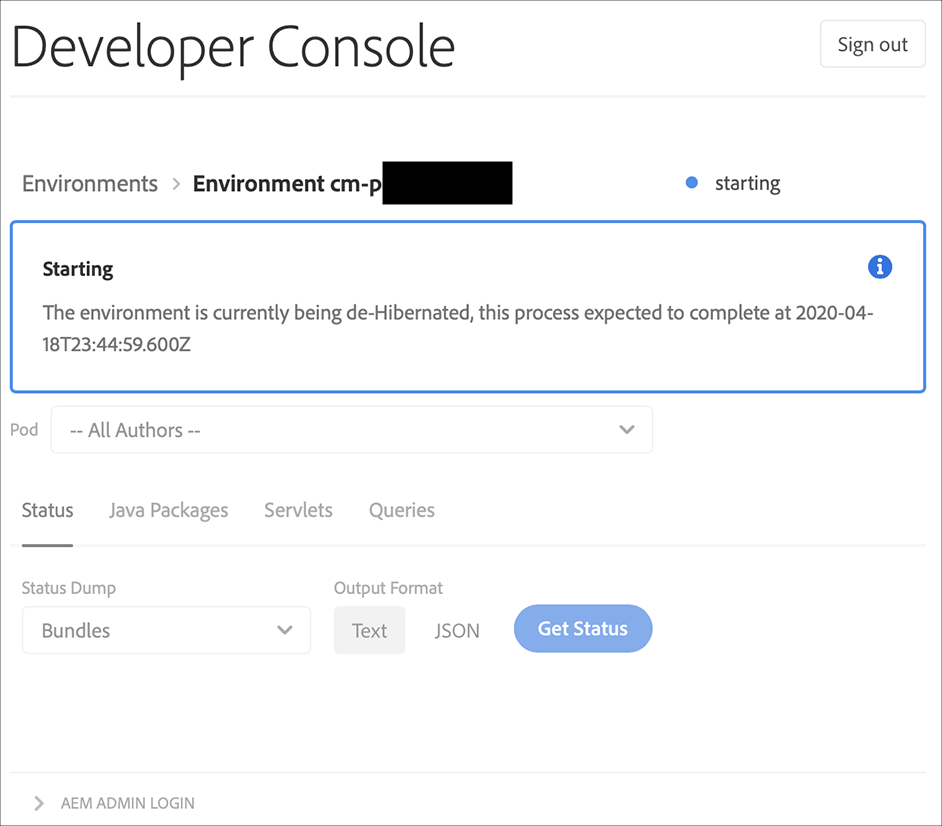

# Sandlådemiljöer i viloläge och viloläge {#hibernating-introduction}

Miljöer i ett sandlådeprogram försätts i viloläge om ingen aktivitet identifieras på åtta timmar. Viloläge är unikt för sandlådeprogrammiljöer. Produktionsprogrammiljöer kan inte döljas.

## Viloläge {#hibernation-introduction}

Viloläge kan antingen inträffa automatiskt eller manuellt.

* **Automatisk** - Sandlådeprogrammiljöer försätts automatiskt i viloläge efter åtta timmars inaktivitet. Inaktivitet definieras som frånvaro av förfrågningar till författaren, förhandsgransknings- och publiceringstjänsterna.
* **Manuell** - Som användare kan du manuellt placera en sandlådeprogrammiljö i viloläge. Du behöver inte göra det eftersom viloläge inträffar automatiskt enligt beskrivningen ovan.

Det kan ta upp till några minuter för sandlådeprogrammiljöer att övergå i viloläge. Data bevaras under viloläge.

### Dölja en sandlådeprogrammiljö manuellt {#using-manual-hibernation}

Du kan manuellt förvara ditt sandlådeprogram från Developer Console. Alla användare av Cloud Manager har tillgång till Developer Console för ett sandlådeprogram.

**Så här förlägger du en sandlådeprogrammiljö manuellt:**

1. Logga in på Cloud Manager på [my.cloudmanager.adobe.com](https://my.cloudmanager.adobe.com/) och välj lämplig organisation.

1. På konsolen **[Mina program](/help/implementing/cloud-manager/navigation.md#my-programs)** klickar du på ett *sandlådeprogram* som du vill ska gå i viloläge för att visa information om det.

1. Klicka på ikonen **Mer** på  och klicka på **Developer Console**.

   * Mer information om Developer Console finns i [Åtkomst till Developer Console](/help/implementing/cloud-manager/manage-environments.md#accessing-developer-console).

   

1. På sidan **Developer Console** klickar du på **Viloläge**.

<!-- UPDATE THESE SCREENSHOTS WHEN NEW AEM DEVELOPER CONSOLE UI IS RELEASED. AS OF OCTOBER 14, 2024, NEW UI IS STILL IN PRIVATE BETA -->

1. Bekräfta steget genom att klicka på **Viloläge**.

   

När viloläget är slutfört visas ett meddelande om viloläget för din miljö på skärmen **Developer Console**.

I Developer Console klickar du på länken **Miljöer** i kolumnerna ovanför listrutan **Pod** för att visa miljöer som är tillgängliga för viloläge.

## Avplacera ett sandlådeprogram från Developer Console manuellt {#de-hibernation-introduction}

Du kan manuellt förvara ditt sandlådeprogram från Developer Console.

>[!IMPORTANT]
>
>En användare med en **utvecklarroll** kan avplacera en sandlådeprogrammiljö.

**Om du vill avaktivera ett sandlådeprogram från Developer Console manuellt:**

1. Logga in på Cloud Manager på [my.cloudmanager.adobe.com](https://my.cloudmanager.adobe.com/) och välj lämplig organisation.

1. På konsolen **[Mina program](/help/implementing/cloud-manager/navigation.md#my-programs)** klickar du på det program du vill avvisa för att visa information om det.

1. Klicka på ikonen **Mer** på  och klicka på **Developer Console**.

   * Mer information om Developer Console finns i [Åtkomst till Developer Console](/help/implementing/cloud-manager/manage-environments.md#accessing-developer-console).

1. Klicka på **Ta bort viloläge**.

   

1. Bekräfta steget genom att klicka på **Ta bort viloläge**.

   

1. Du får ett meddelande om att avvänjningsprocessen har startats och att den uppdateras med förloppet.

   

1. När processen har slutförts är sandlådeprogrammiljön aktiv igen.

   

I Developer Console klickar du på länken **Miljöer** i kolumnerna ovanför listrutan **Pod** för att komma åt miljöer som är tillgängliga för borttagning.

### Behörigheter att avviloläge {#permissions-de-hibernate}

Alla användare med en produktprofil som ger dem åtkomst till AEM as a Cloud Service bör ha tillgång till **Developer Console**, vilket gör att de kan avplacera miljön i viloläge.

## Åtkomst till en miljö i viloläge {#accessing-hibernated-environment}

När en användare gör en webbläsarbegäran till författaren, förhandsgranskningen eller publiceringstjänsten i en miljö i viloläge, kommer de att stöta på en landningssida. På den här sidan förklaras miljöns viloläge och en länk till Developer Console för att ta bort viloläget.

## Distributioner och AEM-uppdateringar {#deployments-updates}

I miljöer med viloläge går det fortfarande att driftsätta och uppgradera AEM manuellt.

* En användare kan använda en pipeline för att distribuera anpassad kod till miljöer med viloläge. Miljön är fortfarande i viloläge och den nya koden visas i miljön när den har tagits bort från viloläget.

* AEM-uppgraderingar kan användas i miljöer med viloläge och kan aktiveras manuellt från Cloud Manager. Miljön är fortfarande i viloläge och den nya versionen visas i miljön när den har tagits bort från viloläget.

## Viloläge och borttagning {#hibernation-deletion}

* Miljöer i ett sandlådeprogram försätts automatiskt i viloläge efter åtta timmars inaktivitet.
   * Inaktivitet definieras som frånvaro av förfrågningar till författaren, förhandsgransknings- och publiceringstjänsterna.
   * När de har sparats i viloläge kan de [tas bort från viloläget manuellt](#de-hibernation-introduction).
* Sandlådeprogram tas bort efter sex månader då de har varit i viloläge, och därefter kan de återskapas.

>[!NOTE]
>
>Endast sandlådemiljöer tas bort automatiskt efter sex månaders kontinuerlig viloläge. Sandlådeprogrammet med dess databas och kod behålls.
