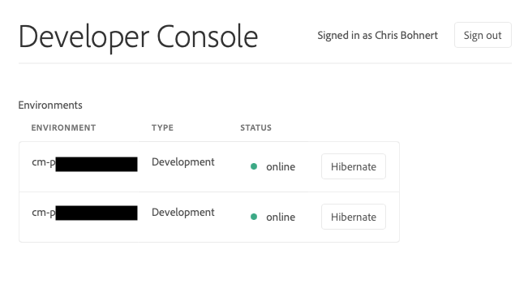

# Viloläge och avvänjning av sandlådemiljöer {#hibernating-introduction}

Miljöer i ett sandlådeprogram försätts i viloläge om ingen aktivitet identifieras under åtta timmar. Viloläge är unikt för sandlådeprogrammiljöer. Produktionsprogrammens miljöer går inte i viloläge.

## Viloläge {#hibernation-introduction}

Viloläge kan antingen inträffa automatiskt eller manuellt.

* **Automatisk** - Sandlådeprogrammiljöer försätts automatiskt i viloläge efter åtta timmars inaktivitet. Inaktivitet definieras som varken författartjänsten, förhandsgransknings- eller publiceringstjänstens mottagningsbegäranden.
* **Manuell** - Som användare kan du manuellt placera en sandlådeprogrammiljö i viloläge. Du behöver inte göra det eftersom viloläge inträffar automatiskt enligt beskrivningen ovan.

Det kan ta upp till några minuter för sandlådeprogrammiljöer att övergå i viloläge. Data bevaras under viloläge.

### Använda manuell viloläge {#using-manual-hibernation}

Du kan manuellt förvara ditt sandlådeprogram från Developer Console. Alla användare av Cloud Manager har tillgång till Developer Console för ett sandlådeprogram.

Följ de här stegen för att manuellt placera sandlådeprogrammiljöer i viloläge.

1. Logga in på Cloud Manager på [my.cloudmanager.adobe.com](https://my.cloudmanager.adobe.com/) och välj lämplig organisation.

1. På konsolen **[Mina program](/help/implementing/cloud-manager/navigation.md#my-programs)** trycker eller klickar du på det program du vill ska placeras i viloläge för att visa information om det.

1. Klicka på ellipsknappen på **miljökortet** och välj **Developer Console**.

   * Mer information om Developer Console finns i [Åtkomst till Developer Console](/help/implementing/cloud-manager/manage-environments.md#accessing-developer-console).

   

1. Klicka på **Viloläge** i Developer Console.

   

1. Bekräfta steget genom att klicka på **Viloläge**.

   

När viloläget är slutfört visas ett meddelande om viloläget för din miljö på skärmen **Developer Console**.

I Developer Console kan du även klicka på länken **Miljöer** i de synliga kolumnerna ovanför listrutan **Pod** för att se en lista över miljöer som ska placeras i viloläge.

## Avviloläge {#de-hibernation-introduction}

Du kan förvara ditt sandlådeprogram manuellt från Developer Console.

>[!IMPORTANT]
>
>En användare med en **utvecklarroll** kan avplacera en sandlådeprogrammiljö.

1. Logga in på Cloud Manager på [my.cloudmanager.adobe.com](https://my.cloudmanager.adobe.com/) och välj lämplig organisation.

1. På konsolen **[Mina program](/help/implementing/cloud-manager/navigation.md#my-programs)** trycker eller klickar du på det program som du vill avaktivera för att visa information om det.

1. Klicka på ellipsknappen på **miljökortet** och välj **Developer Console**.

   * Mer information om Developer Console finns i [Åtkomst till Developer Console](/help/implementing/cloud-manager/manage-environments.md#accessing-developer-console).

1. Klicka på **Ta bort viloläge**.

   

1. Bekräfta steget genom att klicka på **Ta bort viloläge**.

   

1. Du får ett meddelande om att avvänjningsprocessen har startats och att den uppdateras med förloppet.

   

1. När processen har slutförts är sandlådeprogrammiljön aktiv igen.

   

I Developer Console kan du även klicka på länken **Miljöer** i de synliga kolumnerna ovanför listrutan **Pod** för att visa en lista över miljöer som ska avplaceras i viloläge.

### Behörigheter att ta bort viloläge {#permissions-de-hibernate}

Alla användare med en produktprofil som ger dem åtkomst till AEM as a Cloud Service bör ha tillgång till **Developer Console**, vilket gör att de kan avplacera miljön i viloläge.

## Åtkomst till en miljö i viloläge {#accessing-hibernated-environment}

När användaren gör någon webbläsarbegäran mot författaren, förhandsgranskningen eller publiceringstjänsten i en miljö i viloläge, kommer användaren att få en landningssida som beskriver miljöns viloläge tillsammans med en länk till Developer Console där tjänsten kan avplaceras.

## Distributioner och AEM uppdateringar {#deployments-updates}

I miljöer med viloläge går det fortfarande att driftsätta och uppgradera manuellt AEM.

* En användare kan använda en pipeline för att distribuera anpassad kod till miljöer med viloläge. Miljön förblir i viloläge och den nya koden visas i miljön när den har tagits bort från viloläget.

* AEM uppgraderingar kan användas i miljöer med viloläge och kan aktiveras manuellt från Cloud Manager. Miljön förblir i viloläge och den nya versionen visas i miljön när den har tagits bort från viloläget.

## Viloläge och borttagning {#hibernation-deletion}

* Miljöer i ett sandlådeprogram försätts automatiskt i viloläge efter åtta timmars inaktivitet.
   * Inaktivitet definieras som varken författartjänsten, förhandsgransknings- eller publiceringstjänstens mottagningsbegäranden.
   * När de har sparats i viloläge kan de [tas bort från viloläget manuellt].(#de-hibernation-introduction)
* Sandlådeprogram tas bort efter sex månader när de är i viloläge, och därefter kan de återskapas.

>[!NOTE]
>
>Endast sandlådemiljöer tas bort automatiskt efter sex månaders kontinuerlig viloläge. Sandlådeprogrammet med dess databas och kod behålls.
