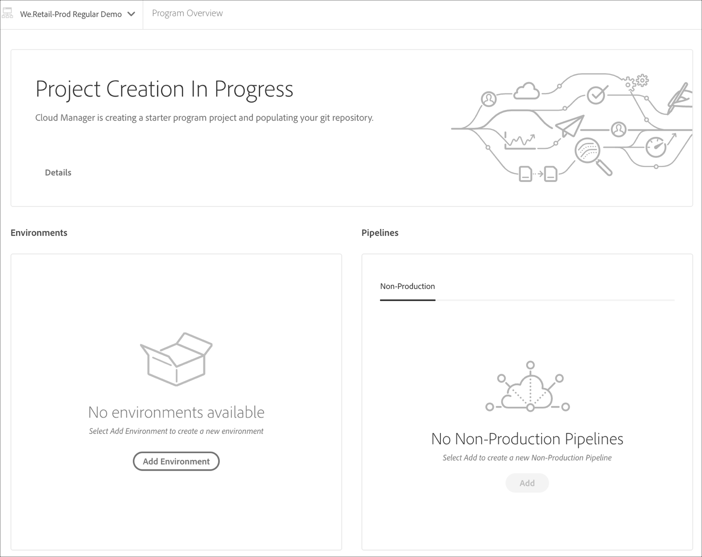

# Guiden Skapa projekt {#project-creation-wizard}

När du har skapat ditt produktionsprogram erbjuder Cloud Manager en guide för att skapa ett AEM projekt baserat på [AEM Project Archetype](https://experienceleague.adobe.com/docs/experience-manager-core-components/using/developing/archetype/overview.html) för att snabbt komma igång.

Följ de här stegen för att skapa ett AEM programprojekt i Cloud Manager med hjälp av guiden.

1. Skapa ett produktionsprogram genom att följa stegen i dokumentet [Skapa produktionsprogram](creating-production-programs.md)

1. När programkonfigurationen är klar går du till skärmen **Översikt** för ditt program och tittar på anropskortet **Skapa gren och projekt** längst upp.

   

1. Klicka på **Skapa** för att starta guiden och bekräfta projektets **namn** och **namn på ny gren** i fönstret **Skapa en gren och ett projekt**.

   

1. Du kan också klicka på avgränsaren för att visa ytterligare parametrar för projektet. Standardvärdena anges av AEM Project Archettype och behöver vanligtvis inte ändras.

   

1. Klicka på **Skapa** för att börja skapa projektet.

Ett **pågående projekt**-kort ersätter nu anropskortet **Skapa gren och projekt** som överst på skärmen **Programöversikt**.

När programmet har skapats ersätter ett **Lägg till miljö** kortet **Projekt under arbete** högst upp på skärmen **Programöversikt**.

Nu har du ett AEM baserat på den AEM typen av arkiv som lagts till i Git-databasen och som kan användas som grund för utveckling för ditt eget projekt. Därefter kan du skapa miljöer där du kan distribuera projektkoden.

Mer information om hur du lägger till eller hanterar miljöer finns i [Hantera dina miljöer](/help/implementing/cloud-manager/manage-environments.md).

>[!NOTE]
>
>Guiden är bara tillgänglig för produktionsprogram. Eftersom [sandlådeprogram](introduction-sandbox-programs.md#auto-creation) innehåller automatisk projektgenerering behövs inte guiden.