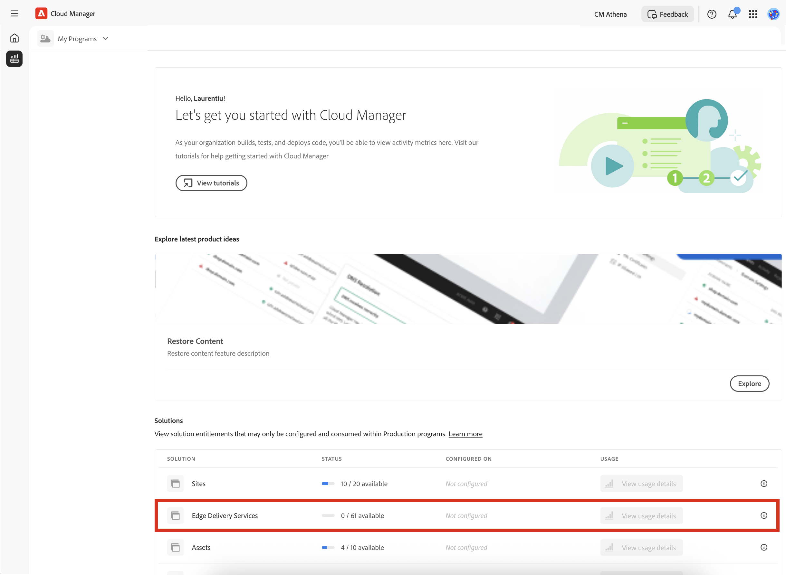

# Licenspanelen {#license-dashboard}

Med Cloud Manager får du en kontrollpanel där du enkelt kan se vilka AEMaaCS-produkträttigheter som är tillgängliga för din organisation eller klientorganisation.

## Översikt {#overview}

Licensinstrumentpanelen för Cloud Manager ger enkel åtkomst till följande information:

1. Rätt till lösningar för alla program, inklusive vad som används och vad som är tillgängligt
1. Förbrukningsstatistik för innehållsbegäran trendade per månad för webbplatslösningen

## Använda License Dashboard {#using-dashboard}

Följ de här stegen för att få åtkomst till din kontrollpanel för licenser.

>[!NOTE]
>
>En användare i **Företagsägare** rollerna måste vara inloggade för att du ska kunna se License Dashboard.

1. Logga in i Cloud Manager på [my.cloudmanager.adobe.com](https://my.cloudmanager.adobe.com/) och välja lämplig organisation.

1. På produktöversikten växlar du till **Licens** -fliken.

Kontrollpanelen är uppdelad i tre avsnitt som visar dig:

* **Lösningar** - Här sammanfattas vilka lösningar du har licensierat, t.ex. Sites eller Assets.
* **Tillägg** - I det här avsnittet sammanfattas vilka tillägg till licensierade lösningar som du har tillgång till.
* **Sandbox &amp; Development Environment** - I det här avsnittet sammanfattas vilka miljöer du har.

I varje avsnitt sammanfattas vad som är tillgängligt och hur det används, om något alls. För närvarande visas bara platslösningar även om det finns andra lösningar i klientorganisationen.

* The **Status** kolumn visar antalet ej använda berättiganden jämfört med totalt antal tillgängliga för klienten.
* The **Konfigurerad den** -kolumnen anger de program som lösningsberättigandet har tillämpats på.
   * Ett berättigande anses bara användas när en produktionsmiljö har skapats eller om det redan finns en, om en uppdateringspipeline har körts på den.
* The **Användning** kolumn visas de innehållsbegäranden som har förbrukats under de senaste 12 månaderna som ett diagram när du klickar på det.

>[!TIP]
>
>Se [Admin Console - översikt](https://helpx.adobe.com/enterprise/using/admin-console.html) om du vill veta hur du hanterar dina Adobe-rättigheter i hela organisationen från Admin Console.

## Vanliga frågor {#faq}

### Vad är en innehållsförfrågan? {#what-is-a-content-request}

En innehållsbegäran är en begäran som kommer in i AEM Sites eller något annat kundtillhandahållet cachelagringssystem, t.ex. ett leveransnätverk, för att leverera innehåll eller data i antingen HTML-format som en sidvy eller i JSON-format som ett API-anrop.

En innehållsbegäran räknas för varje sidvy eller för var femte API-anrop, mätt i ingressen till det första cachelagringssystemet som tar emot en innehållsbegäran. Innehållsbegäranden räknas endast mot produktionsmiljöer.

Innehållsförfrågningar utesluter förfrågningar eller aktiviteter som initierats av eller på uppdrag av Adobe enbart i syfte att tillhandahålla produkter och tjänster. Användaragenttrafik som identifieras av Adobe från botar, crawler och spindlar som hör till vanliga sökmotorer och tjänster inom sociala medier är också utesluten.

### Hur mäter Adobe Experience Manager förfrågningar om innehåll? {#how-are-content-requests-measured}

Innehållsförfrågningar spåras på AEM as a Cloud Service edge-servrar. Ursprungstrafiken räknas inte med i innehållsförfrågningar. Det CDN som är inbyggt i AEM as a Cloud Service spårar giltiga begäranden om HTML och JSON.

AEM har också regler för att utesluta välkända organ, inklusive välkända tjänster som regelbundet besöker webbplatsen för att uppdatera deras sökindex eller tjänst.

### Varför visar min analysrapport andra resultat än AEM innehållsförfrågningar? {#why-are-reports-different}

Innehållsförfrågningar kommer att innehålla avvikelser med en organisations analysrapporteringsverktyg som sammanfattas i den här tabellen.

| Orsak till avvikelse | Förklaring |
|---|---|
| Taggar | Alla sidor som spåras som AEM innehållsförfrågningar kan taggas med Analytics-spårning eller inte. Alla API-anrop som spåras som AEM kommer inte att taggas av en organisations analysverktyg. Sidor eller API-anrop kan taggas för att spåra åtgärder eller bara unika sidvyer i stället för alla vyer. |
| Tag Management Rules | Regelinställningar för tagghantering kan resultera i olika konfigurationer för datainsamling på en sida, vilket resulterar i en kombination av avvikelser med spårning av innehållsbegäran. |
| Bots | Okända botar som inte har föridentifierats och tagits bort av AEM kan orsaka spårningsavvikelser. |
| Rapportsviter | Sidor som ingår i samma AEM och domän kan skicka data till olika rapportsviter i Analytics. |
| Övervaknings- och säkerhetsverktyg från tredje part | Övervaknings- och säkerhetssökningsverktygen kan generera innehållsförfrågningar för AEM som inte spåras i analysrapporter. |
| Förhämtningsbegäranden | Om du använder en förhämtningstjänst för att förhandsladda sidor för att öka hastigheten kan det medföra att trafiken för innehållsförfrågningar ökar avsevärt. |
| DOS | Adobe gör sitt yttersta för att automatiskt upptäcka och filtrera bort trafik från DDOS-attacker, men det finns ingen garanti för att alla möjliga DDOS-attacker identifieras |
| Trafikblockerare | Om du använder en spårningsblockerare i en webbläsare kan det hända att vissa begäranden inte spåras. |
| Brandväggar | Brandväggar kan blockera Analytics-spårning. Detta är vanligare med brandväggar. |

### Vad gör jag om jag vill veta mer om min innehållsförfrågningsvolym? {#current-request-volumes}

Om du vill ha ytterligare insikter om hur många innehållsförfrågningar som visas på License Dashboard kan ditt Adobe-team tillhandahålla en rapport som visar de viktigaste volymdrivrutinerna för innehållsförfrågningar. Kontakta ditt Adobe-team eller Adobe kundtjänst om du vill ha en rapport över de viktigaste användningsområdena.

### Vad händer om jag använder mitt eget CDN? {#using-own-cdn}

Licensinstrumentpanelen visar endast data som spåras av Cloud Servicens CDN.  Om du väljer att ta med ditt eget CDN (BYOCDN) kommer du att rapportera din innehållsbegärandevolym till Adobe på årsbasis, vilket framgår av ditt avtal.
