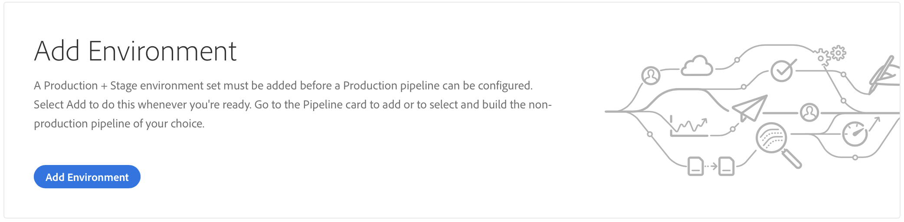
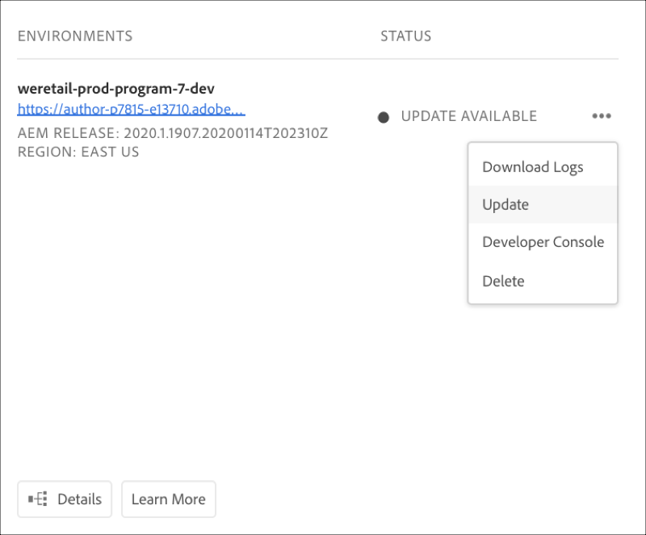

# Hantera miljöer {#manage-environments}

I följande avsnitt beskrivs de typer av miljö som en användare kan skapa och hur användaren kan skapa en miljö.

## Miljötyper {#environment-types}

En användare med nödvändig behörighet kan skapa följande miljötyper (inom gränserna för vad som är tillgängligt för den specifika klientorganisationen).

* **Produktions- och scenmiljö**:
Produktionen och scenen finns som duo och används för testning och produktion.

* **Utveckling**: En utvecklingsmiljö kan skapas för utvecklings- och testningsändamål och kommer endast att kopplas till icke-produktionsrörledningar.

   >[!NOTE]
   >En utvecklingsmiljö som skapas automatiskt i ett sandlådeprogram kommer att konfigureras att innehålla lösningar för platser och resurser.

   I följande tabell sammanfattas miljötyper och deras attribut:

   | Namn | Författarnivå | Publiceringsnivå | Användare kan skapa | Användaren kan ta bort | Rörledning som kan kopplas till miljön |
   |--- |--- |--- |--- |---|---|
   | Produktion | Ja | Ja om webbplatser ingår | Ja | Nej | Produktionspipeline |
   | Scen | Ja | Ja om webbplatser ingår | Ja | Nej | Produktionspipeline |
   | Utveckling | Ja | Ja om webbplatser ingår | Ja | Ja | Icke-produktionsflöde |

   >[!NOTE]
   >
Produktionen och scenen finns som duo och används för testning och produktion.  Användaren kan inte skapa enbart scenen eller enbart produktionsmiljön.

## Lägga till en miljö {#adding-environments}

1. Användaren klickar på knappen **Lägg till miljö** för att lägga till en miljö.

   

1. Dialogrutan **Lägg till miljö** visas.Användaren måste skicka in information som **miljötyp** och **miljönamn** samt **miljöbeskrivning** (beroende på vad användaren har för avsikt att skapa miljön inom gränserna för vad som är tillgängligt för den specifika klientorganisationen).

   

   >[!NOTE]
   >När du skapar en miljö skapas en eller flera *integreringar* i Adobe I/O. De är synliga för kunder som har tillgång till Adobe I/O-konsolen och får inte tas bort. Detta tas inte med i beskrivningen i Adobe I/O-konsolen.

   

1. Klicka på **Spara** för att lägga till en miljö med de ifyllda villkoren.  Nu visas *översiktsskärmen* på kortet där du kan ställa in din pipeline.

   >[!NOTE]
   >Om du ännu inte har konfigurerat produktionsflödet för icke-produktion visas kortet *Översikt* där du kan skapa produktionsflödet.

## Uppdaterar miljö {#updating-dev-environment}

Uppdateringar av scen- och produktionsmiljöer hanteras automatiskt av Adobe.

Uppdateringar av utvecklingsmiljöer hanteras av användarna av programmet. När en miljö inte kör den senaste allmänt tillgängliga AEM-versionen visas **UPDATE AVAILABLE (TILLGÄNGLIG**) på miljökortet på hemskärmen.

)

När den här statusen visas är alternativet **Uppdatera** tillgängligt i listrutan, både på miljökortet och på menyn **Hantera** om du klickar på **Detaljer** på **MILJÖkortet** .

Om du väljer detta i listrutan kan en Distributionshanterare uppdatera pipelinen som är associerad med den här miljön till den senaste versionen och sedan köra pipelinen.

Om pipeline redan har uppdaterats uppmanas användaren att köra pipelinen.
