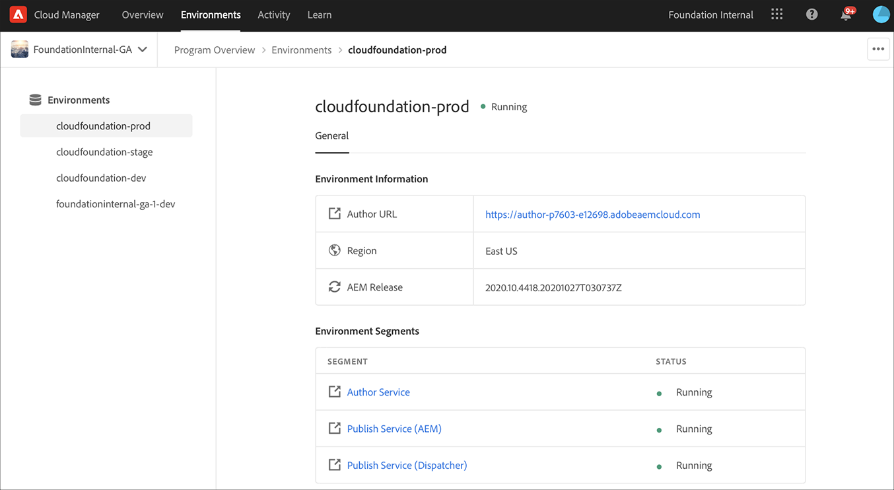

# Hantera miljöer {#manage-environments}

I följande avsnitt beskrivs de typer av miljö som en användare kan skapa och hur användaren kan skapa en miljö.

## Miljötyper {#environment-types}

En användare med nödvändig behörighet kan skapa följande miljötyper (inom gränserna för vad som är tillgängligt för den specifika klientorganisationen).

* **Produktions- och scenmiljö**: Produktionen och scenen finns som duo och används för testning och produktion.

* **Utveckling**: En utvecklingsmiljö kan skapas för utvecklings- och testningsändamål och kommer endast att kopplas till icke-produktionsrörledningar.

   >[!NOTE]
   >En utvecklingsmiljö som skapas automatiskt i ett sandlådeprogram kommer att konfigureras att innehålla lösningar för platser och resurser.

   I följande tabell sammanfattas miljötyper och deras attribut:

   | Namn | Författarnivå | Publiceringsnivå | Användare kan skapa | Användaren kan ta bort | Rörledning som kan kopplas till miljön |
   |--- |--- |--- |--- |---|---|
   | Produktion | Ja | Ja om webbplatser ingår | Ja | Nej | Produktionspipeline |
   | Scen | Ja | Ja om webbplatser ingår | Ja | Nej | Produktionspipeline |
   | Utveckling | Ja | Ja om webbplatser ingår | Ja | Ja | Icke-produktionsflöde |

   >[!NOTE]
   >Produktionen och scenen finns som duo och används för testning och produktion.  Användaren kan inte skapa enbart scenen eller enbart produktionsmiljön.

## Lägger till miljö {#adding-environments}

1. Klicka på **Lägg till miljö** för att lägga till en miljö. Den här knappen kommer att vara tillgänglig från skärmen **Environment**.
   

   Alternativet **Lägg till miljö** finns också på **miljökortet** när det inte finns några miljöer i programmet.

   

   >[!NOTE]
   >Alternativet **Lägg till miljö** inaktiveras beroende på brist på behörigheter eller vad som kan komma att skrivas under.

1. Dialogrutan **Lägg till miljö** visas. Användaren måste skicka in information som **miljötyp**, **miljönamn** och **miljöbeskrivning** (beroende på vad användaren har för mål med att skapa miljön inom gränserna för vad som är tillgängligt för den specifika klientorganisationen).

   

   >[!NOTE]
   >När du skapar en miljö skapas en eller flera *integreringar* i Adobe I/O. De är synliga för kundanvändare som har åtkomst till Adobe I/O Console och får inte tas bort. Detta tas inte med i beskrivningen i Adobe I/O Console.

   

1. Klicka på **Spara** om du vill lägga till en miljö med de ifyllda villkoren.  Nu visar skärmen *Översikt* kortet från vilket du kan konfigurera din pipeline.

   >[!NOTE]
   >Om du ännu inte har konfigurerat produktionsflödet för icke-produktion visas kortet där du kan skapa produktionsflödet på skärmen *Översikt*.

## Visningsmiljö {#viewing-environment}

Kortet **Environment** på sidan Översikt visar upp till tre miljöer.

1. Välj knappen **Visa alla** för att navigera till sammanfattningssidan för **Miljö** för att visa en tabell med en fullständig lista över miljöer.

   

1. Sidan **Miljöer** visar en lista över alla befintliga miljöer.

   

1. Välj någon av miljöerna i listan för att visa miljöinformationen.

   

## Uppdaterar miljön {#updating-dev-environment}

Uppdateringar av scen- och produktionsmiljöer hanteras automatiskt av Adobe.

Uppdateringar av utvecklingsmiljöer hanteras av användarna av programmet. När en miljö inte kör den senaste allmänt tillgängliga AEM visar statusen på miljökortet på hemskärmen **UPDATE AVAILABLE**.

Alternativet **Uppdatera** är tillgängligt på kortet **Environment**.
Det här alternativet är också tillgängligt om du klickar på **Information** från **miljökortet**. Sidan **Environment** öppnas och när du har valt utvecklingsmiljön klickar du på **..** och välj **Uppdatera** enligt bilden nedan:

Om du väljer det här alternativet kan en Distributionshanterare uppdatera den pipeline som är associerad med den här miljön till den senaste versionen och sedan köra pipelinen.

Om pipeline redan har uppdaterats uppmanas användaren att köra pipelinen.

## Tar bort miljö {#deleting-environment}

Användare med nödvändig behörighet kan ta bort en utvecklingsmiljö.

Alternativet **Ta bort** finns i listrutan på kortet **Environment**. Klicka på **..** för en utvecklingsmiljö som du vill ta bort.

Alternativet Ta bort är också tillgängligt om du klickar på **Information** från **miljökortet**. Sidan **Environment** öppnas och när du har valt utvecklingsmiljön klickar du på **..** och välj **Ta bort** enligt bilden nedan:

>[!NOTE]
>
>Den här funktionen är inte tillgänglig för produktions-/scenmiljö som angetts i ett produktionsprogram som konfigurerats för produktionsändamål. Funktionen är dock tillgänglig för produktions-/scenmiljöer i ett sandlådeprogram.

## Hantera åtkomst {#managing-access}

Välj **Hantera åtkomst** i listrutan på kortet **Miljö**. Du kan navigera till författarinstansen direkt och hantera åtkomsten för din miljö.

Mer information finns i [Hantera åtkomst till författarinstansen](/help/onboarding/getting-access-to-aem-in-cloud/navigation.md#manage-access-aem).

## Åtkomst till Developer Console {#accessing-developer-console}

Välj **Developer Console** i listrutan på kortet **Environment**. Då öppnas en ny flik i webbläsaren med inloggningssidan till **Developer Console**.

Endast en användare i utvecklarrollen har åtkomst till **utvecklarkonsolen**. Undantaget är för sandlådeprogram, där alla användare med åtkomst till Cloud Manager Sandbox Program har åtkomst till **Developer Console**.

Mer information finns i [Viloläge och Viloläge i sandlådemiljöer](https://docs.adobe.com/content/help/en/experience-manager-cloud-service/onboarding/getting-access/cloud-service-programs/sandbox-programs.html#hibernating-introduction).

Det här alternativet är också tillgängligt om du klickar på **Information** från **miljökortet**. Sidan **Environment** öppnas och när du har valt en miljö klickar du på **..** och välj **Developer Console**.

## Logga in lokalt {#login-locally}

Välj **Lokal inloggning** i listrutan på **miljökortet** om du vill logga in lokalt på Adobe Experience Manager.

Dessutom kan du logga in lokalt från sammanfattningssidan **Miljöer**.

## Hantera anpassade domännamn {#manage-cdn}

Gå till informationssidan för **Miljöer** från sidan Miljösammanfattning.

Följande åtgärder kan utföras på publiceringstjänsten för din miljö enligt beskrivningen nedan:

1. [Lägga till ett anpassat domännamn](/help/implementing/cloud-manager/custom-domain-names/add-custom-domain-name.md)

1. [Visa och uppdatera ett anpassat domännamn](/help/implementing/cloud-manager/custom-domain-names/view-update-replace-custom-domain-name.md)

1. [Ta bort ett anpassat domännamn](/help/implementing/cloud-manager/custom-domain-names/delete-custom-domain-name.md)

1. [Kontrollerar status för anpassat ](/help/implementing/cloud-manager/custom-domain-names/check-domain-name-status.md#pre-existing-cdn) domännamn eller ett  [SSL-certifikat](/help/implementing/cloud-manager/managing-ssl-certifications/check-status-ssl-certificate.md#pre-existing-cdn).

1. [Kontrollerar status för ett IP-Tillåtelselista](/help/implementing/cloud-manager/ip-allow-lists/check-ip-allow-list-status.md#pre-existing-cdn)

## Hantera IP-Tillåtelselista {#manage-ip-allow-lists}

Gå till sidan Miljöinformation från sidan Miljösammanfattning. Du kan utföra följande åtgärder på tjänsterna Publicera och/eller Författare för din miljö här.

### Använda en IP-Tillåtelselista {#apply-ip-allow-list}

Att använda en IP-Tillåtelselista är den process genom vilken alla IP-intervall som ingår i definitionen av Tillåt-lista kopplas till en författare eller publiceringstjänst i en miljö. En användare i rollen Business Owner eller Deployment Manager måste vara inloggad för att det ska gå att använda IP Tillåtelselista.

>[!NOTE]
>IP-Tillåtelselista måste finnas i Cloud Manager för att det ska kunna användas på en miljötjänst. Om du vill veta mer om IP Tillåtelselista i Cloud Manager går du till [Introduktion till IP Tillåtelselista i Cloud Manager](/help/implementing/cloud-manager/ip-allow-lists/introduction.md).

Följ stegen nedan för att använda ett IP-Tillåtelselista:

1. Navigera till den specifika miljön från informationssidan **Environment** och navigera till tabellen **IP Tillåtelselista**.
1. Använd inmatningsfälten högst upp i IP Tillåtelselista-tabellen för att välja IP Tillåtelselista och författaren eller publiceringstjänsten som du vill använda den på.
1. Klicka på **Använd** och bekräfta ditt bidrag.

### Tar bort en IP-Tillåtelselista {#unapply-ip-allow-list}

Om du inte använder en IP-Tillåtelselista är det den process där alla IP-intervall som ingår i definitionen av Tillåtelselista inte är kopplade till en författare eller utgivartjänst i en miljö. En användare i rollen Business Owner eller Deployment Manager måste vara inloggad för att du ska kunna Ångra en IP-Tillåtelselista.

Följ stegen nedan för att ta bort en IP-Tillåtelselista:

1. Gå till den specifika **miljöinformationssidan**-informationssidan från skärmen Miljö och navigera till tabellen **IP Tillåtelselista**.
1. Identifiera raden där den IP Tillåtelselista-regel som du vill ta bort är listad.
1. Välj **..**-menyn längst till höger på raden.
1. Välj alternativet **Ta bort tillämpning** och bekräfta överföringen.

