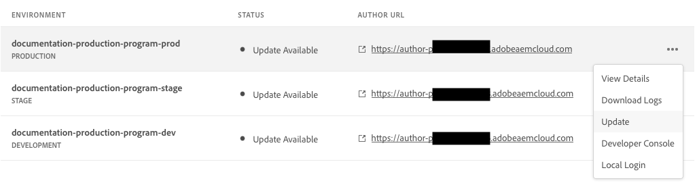

# Hantera miljöer {#managing-environments}

Lär dig mer om vilka typer av miljöer du kan skapa och hur du skapar dem för ditt Cloud Manager-projekt.

## Miljötyper {#environment-types}

En användare med nödvändig behörighet kan skapa följande miljötyper (inom gränserna för vad som är tillgängligt för den specifika klientorganisationen).

* **Production + Stage** - Produktions- och testmiljöer finns som par och används för produktions- respektive testningsändamål.

* **Utveckling** - En utvecklingsmiljö kan skapas för såväl utvecklings- som testningsändamål och kan endast kopplas till rörledningar som inte är avsedda för produktion.

* **Snabb utveckling** - Med en snabb utvecklingsmiljö (RDE) kan utvecklare snabbt driftsätta och granska ändringar, vilket minimerar den tid som krävs för att testa funktioner som är beprövade i en lokal utvecklingsmiljö. Se [dokumentation för snabb utvecklingsmiljö](/help/implementing/developing/introduction/rapid-development-environments.md) om du vill ha mer information om hur du använder en RDE.

De enskilda miljöernas kapacitet beror på vilka lösningar som finns i [program](/help/implementing/cloud-manager/getting-access-to-aem-in-cloud/program-types.md) av miljön.

* [Sites](/help/sites-cloud/home.md)
* [Assets](/help/assets/home.md)
* [Forms](/help/forms/home.md)
* [Skärmar](/help/screens-cloud/home.md)

>[!NOTE]
>
>Produktions- och mellanlagringsmiljöer skapas endast som par. Du kan inte bara skapa en staging eller bara en produktionsmiljö.

## Lägga till en miljö {#adding-environments}

1. Logga in i Cloud Manager på [my.cloudmanager.adobe.com](https://my.cloudmanager.adobe.com/) och välja lämplig organisation.

1. Klicka på det program som du vill lägga till en miljö för.

1. Från **Programöversikt** sida, klicka på **Lägg till miljö** på **Miljö** för att lägga till en miljö.

   

   * The **Lägg till miljö** finns även på **Miljö** -fliken.

      

   * The **Lägg till miljö** kan vara inaktiverat på grund av bristande behörighet eller beroende på vilka licensierade resurser som används.

1. I **Lägg till miljö** som visas:

   * Välj en [**miljötyp**.](#environment-types)
      * Antalet tillgängliga/använda miljöer visas inom parentes bakom miljötypsnamnet.
   * Tillhandahålla en miljö **Namn**.
   * Tillhandahålla en miljö **Beskrivning**.
   * Välj en **Primär region** i listrutan.
      * Observera att detta inte kan ändras när det har skapats.
   * Om du lägger till en **Production + Stage** måste du ange ett miljönamn och en beskrivning för både din produktions- och staging-miljö.
      

1. Klicka **Spara** för att lägga till den angivna miljön.

The **Översikt** visas nu din nya miljö i **Miljö** kort. Nu kan du ställa in rörledningar för din nya miljö.

## Miljöinformation {#viewing-environment}

Du kan använda **Miljö** på översiktssidan för att få tillgång till miljöinformation på två sätt.

1. Från **Översikt** klickar du på **Miljö** överst på skärmen.

   

   * Du kan även klicka på **Visa alla** på **Miljö** för att gå direkt till **Miljö** -fliken.

      

1. The **Miljö** öppnar och visar alla miljöer för programmet.

   

1. Klicka på en miljö i listan för att visa informationen om den.

   

Du kan också klicka på ellipsknappen för den miljö du vill använda och sedan välja **Visa detaljer**.

>[!NOTE]
>
>The **Miljö** endast tre miljöer. Klicka på **Visa alla** så som beskrivits ovan för att se alla programmiljöer.

### Åtkomst till förhandsgranskningstjänsten {#access-preview-service}

I Cloud Manager finns en förhandsgranskningstjänst (som levereras som en extra publiceringstjänst) för varje AEM as a Cloud Service miljö.

Med tjänsten kan du förhandsgranska en webbplats slutliga upplevelse innan den når den faktiska publiceringsmiljön och är tillgänglig för allmänheten.

När förhandsvisningstjänsten skapas används en IP-tillåtelselista som standard, märkt `Preview Default [<envId>]`, som blockerar all trafik till förhandsvisningstjänsten. Du måste aktivt ta bort standardvärdet för IP tillåtelselista från förhandsgranskningstjänsten för att kunna aktivera åtkomst.

En användare med nödvändig behörighet måste utföra följande steg innan han eller hon kan dela URL:en för förhandsvisningstjänsten för att se till att den är tillgänglig.

1. Skapa en lämplig IP-tillåtelselista, använd den för förhandsgranskningstjänsten och ta omedelbart bort tillämpningen av `Preview Default [<envId>]` tillåtelselista.

   * Se dokumentet [Använda och inte använda IP-Tillåtelselista](/help/implementing/cloud-manager/ip-allow-lists/apply-allow-list.md) för mer information.

1. Använda uppdateringen **IP Tillåtelselista** arbetsflöde för att ta bort standard-IP och lägga till IP-adresser efter behov. Se [Hantera IP-Tillåtelselista](/help/implementing/cloud-manager/ip-allow-lists/managing-ip-allow-lists.md) om du vill veta mer.

När åtkomsten till förhandsgranskningstjänsten har låsts upp visas inte längre låsikonen framför namnet på förhandsgranskningstjänsten.

När det är aktiverat kan du publicera innehåll till förhandsgranskningstjänsten med hjälp av gränssnittet Hantera publikation i AEM. Se dokumentet [Förhandsgranska innehåll](/help/sites-cloud/authoring/fundamentals/previewing-content.md) för mer information.

>[!NOTE]
>
>Miljön måste vara i AEM version `2021.05.5368.20210529T101701Z` eller nyare för att använda förhandsgranskningstjänsten. Kontrollera att en uppdateringspipeline har körts korrekt i din miljö för att göra detta.

## Uppdaterar miljöer {#updating-dev-environment}

Som molnbaserad tjänst hanteras uppdateringar av dina staging- och produktionsmiljöer i produktionsprogrammen automatiskt av Adobe.

Uppdateringar av utvecklingsmiljöer och miljöer i sandlådeprogram hanteras dock i programmen. När en sådan miljö inte kör den senaste allmänt tillgängliga AEM-versionen, anges statusen på **Miljö** på **Översikt** visas **Uppdatering tillgänglig**.

### Uppdateringar och pipeline {#updates-pipelines}

Rörledningar är det enda sättet att [distribuera kod till miljöer med AEM as a Cloud Service.](deploy-code.md) Därför är varje pipeline kopplad till en viss AEM.

Om Cloud Manager upptäcker att det finns en nyare version av AEM än den som senast distribuerades med pipeline, visas **Uppdatering tillgänglig** status för miljön.

Uppdateringsprocessen är därför en tvåstegsprocess:

1. Uppdaterar pipeline med den senaste AEM versionen
1. Köra pipeline för att distribuera den nya versionen av AEM till en miljö

### Uppdatera dina miljöer {#updating-your-environments}

The **Uppdatera** är tillgängligt från **Miljö** för utvecklingsmiljöer och miljöer i sandlådeprogram genom att klicka på knappen Ellips i miljön.

Det här alternativet är också tillgängligt genom att klicka på **Miljö** -fliken i programmet och sedan markera miljöns ellipsknapp.

En användare med **Distributionshanteraren** kan använda det här alternativet för att uppdatera pipeline som är associerad med den här miljön till den senaste AEM versionen.

När pipeline-versionen har uppdaterats till den senaste allmänt tillgängliga AEM-versionen uppmanas användaren att köra den associerade pipelinen för att distribuera den senaste versionen till miljön.

The **Uppdatera** Alternativets beteende varierar beroende på programmets konfiguration och aktuella tillstånd.

* Om pipeline redan har uppdaterats **Uppdatera** uppmanar användaren att köra pipelinen.
* Om pipelinen redan uppdateras visas **Uppdatera** informerar användaren om att en uppdatering redan körs.
* Om en lämplig pipeline inte finns, **Uppdatera** uppmanar användaren att skapa en.

## Tar bort utvecklingsmiljöer {#deleting-environment}

Användare med nödvändig behörighet kan ta bort en utvecklingsmiljö.

Från **Översikt** programskärmen på **Miljö** klickar du på ellipsknappen i den utvecklingsmiljö du vill ta bort.

Alternativet Ta bort är också tillgängligt från **Miljö** -fliken i **Översikt** programfönstret. Klicka på ellipsknappen i miljön och välj **Ta bort**.

>[!NOTE]
>
>* Produktions- och mellanlagringsmiljöer som skapats i ett produktionsprogram kan inte tas bort.
>* Produktions- och mellanlagringsmiljöer i ett sandlådeprogram kan tas bort.

## Hantera åtkomst {#managing-access}

Välj **Hantera åtkomst** på menyn ellips i miljön på **Miljö** kort. Du kan navigera till författarinstansen direkt och hantera åtkomsten för din miljö.

## Åtkomst till Developer Console {#accessing-developer-console}

Välj **Developer Console** på menyn ellips i miljön på **Miljö** kort. Då öppnas en ny flik i webbläsaren med inloggningssidan till **Developer Console**.

Endast en användare med **Utvecklare** rollen har åtkomst till **Developer Console**. För sandlådeprogram har dock alla användare med åtkomst till sandlådeprogrammet åtkomst till **Developer Console**.

Se dokumentet [Viloläge och avvänjningsmiljöer för sandlådor](https://experienceleague.adobe.com/docs/experience-manager-cloud-service/onboarding/getting-access/cloud-service-programs/sandbox-programs.html#hibernating-introduction) för mer information.

Det här alternativet är också tillgängligt från **Miljö** -fliken i **Översikt** när du klickar på ellipsmenyn i en enskild miljö.

## Logga in lokalt {#login-locally}

Välj **Lokal inloggning** från ellipsmenyn i miljön i **Miljö** för att logga in lokalt på Adobe Experience Manager.

Dessutom kan du logga in lokalt från **Miljö** -fliken i **Översikt** sida.

## Hantera anpassade domännamn {#manage-cdn}

Anpassade domännamn stöds i Cloud Manager för Sites-program för både publicerings- och förhandsgranskningstjänster. Varje Cloud Manager-miljö har plats för upp till 250 anpassade domäner.

Om du vill konfigurera egna domännamn går du till **Miljö** och klicka på en miljö för att visa information om miljön.

Följande åtgärder kan utföras på publiceringstjänsten för din miljö.

* [Lägga till ett anpassat domännamn](/help/implementing/cloud-manager/custom-domain-names/add-custom-domain-name.md)

* [Hantera anpassade domännamn](/help/implementing/cloud-manager/custom-domain-names/managing-custom-domain-names.md)

* [Kontrollerar status för anpassat domännamn](/help/implementing/cloud-manager/custom-domain-names/check-domain-name-status.md#pre-existing-cdn) eller en [SSL-certifikat](/help/implementing/cloud-manager/managing-ssl-certifications/managing-certificates.md#pre-existing-cdn).

* [Hantera IP-Tillåtelselista](/help/implementing/cloud-manager/ip-allow-lists/managing-ip-allow-lists.md#pre-existing-cdn)

## Hantera IP-Tillåtelselista {#manage-ip-allow-lists}

IP tillåtelselista stöds i Cloud Manager för författare, publicering och förhandsgranskningstjänster för Sites-program.

Om du vill hantera IP tillåtelselista går du till **Miljö** -fliken i **Översikt** sidan med ditt program. Klicka på en enskild miljö för att hantera informationen om den.

### Använda ett IP-Tillåtelselista {#apply-ip-allow-list}

När du använder ett IP-tillåtelselista kopplas alla IP-intervall som ingår i definitionen av tillåtelselista till en författare eller publiceringstjänst i en miljö. En användare i **Företagsägare** eller **Distributionshanteraren** roll måste vara inloggad för att kunna använda IP-tillåtelselista.

IP-tillåtelselista måste finnas i Cloud Manager för att det ska kunna användas i en miljö. Mer information om IP tillåtelselista i Cloud Manager finns i dokumentet[Introduktion till IP-Tillåtelselista i Cloud Manager.](/help/implementing/cloud-manager/ip-allow-lists/introduction.md)

Följ de här stegen för att använda en IP-tillåtelselista.

1. Navigera till den specifika miljön från **Miljö** fliken för programmet **Översikt** och navigera till **IP-Tillåtelselista** tabell.
1. Använd inmatningsfälten högst upp i IP tillåtelselista-tabellen för att välja IP tillåtelselista och författaren eller publiceringstjänsten som du vill använda den på.
1. Klicka på **Använd** och bekräfta ditt bidrag.

### Avinstallera en IP-Tillåtelselista {#unapply-ip-allow-list}

Om du avkopplar ett IP-tillåtelselista kopplas alla IP-intervall som ingår i definitionen av tillåtelselista bort från en författare eller en utgivartjänst i en miljö. En användare i **Företagsägare** eller **Distributionshanteraren** rollerna måste vara inloggade för att du ska kunna ta bort en IP-tillåtelselista.

Följ de här stegen för att ta bort en IP-tillåtelselista.

1. Navigera till den specifika miljön från **Miljö** fliken för programmet **Översikt** och navigera till **IP-Tillåtelselista** tabell.
1. Identifiera raden där den IP tillåtelselista-regel som du vill ta bort gäller listas.
1. Markera ellipsknappen i slutet av raden.
1. Välj **Oanvänd** och bekräfta ditt bidrag.
