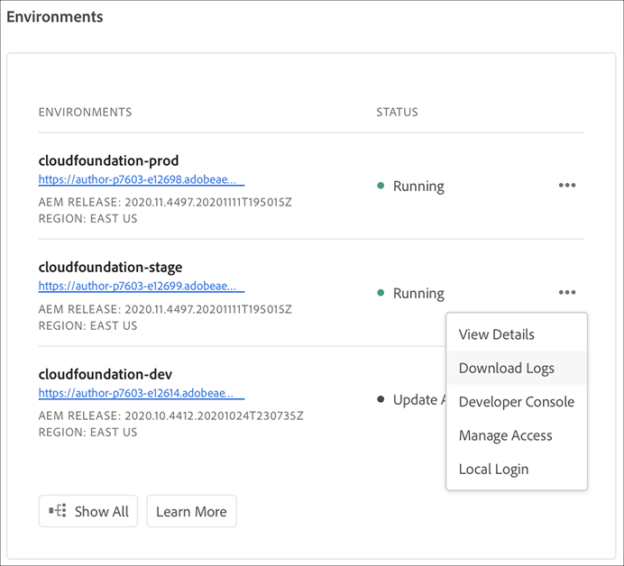

# Komma åt och hantera loggar {#manage-logs}

Användare kan komma åt en lista över tillgängliga loggfiler för den valda miljön med **miljökort**-kortet från sidan **Översikt** eller sidan Miljöinformation.

## Laddar ned loggar {#download-logs}

Följ stegen nedan för att hämta loggar.

1. Gå till **Miljökortet** från sidan **Översikt**.

1. Välj **Hämta loggar** från **..**-menyn.

   

   *Eller*,

   Från sidan Miljöinformation:

   

   >[!NOTE]
   >Oavsett var den öppnas visas samma dialogruta så att du kan hämta en enskild loggfil.

1. I listrutan **Service** väljer du alternativ som **Förhandsgranska** eller **Förhandsgranska dispatcher**, följt av att klicka på nedladdningsikonen.

   


## Loggar via API {#logs-through-api}

Förutom att hämta loggar via användargränssnittet är loggar tillgängliga via API:t och kommandoradsgränssnittet.

Om du till exempel vill hämta loggfilerna för en viss miljö, skulle kommandot vara något alldeles för stort som raderna i

```java
$ aio cloudmanager:download-logs --programId 5 1884 author aemerror
```

Med följande kommando kan du anpassa loggar:

```java
$ aio cloudmanager:tail-log --programId 5 1884 author aemerror
```

För att få tillgång till miljö-ID (1884 i det här fallet) och tillgängliga service- eller loggnamnsalternativ kan du använda:

```java
$ aio cloudmanager:list-environments
Environment Id Name                     Type  Description                          
1884           FoundationInternal_dev   dev   Foundation Internal Dev environment  
1884           FoundationInternal_stage stage Foundation Internal STAGE environment
1884           FoundationInternal_prod  prod  Foundation Internal Prod environment
 
 
$ aio cloudmanager:list-available-log-options 1884
Environment Id Service    Name         
1884           author     aemerror     
1884           author     aemrequest   
1884           author     aemaccess    
1884           publish    aemerror     
1884           publish    aemrequest   
1884           publish    aemaccess    
1884           dispatcher httpderror   
1884           dispatcher aemdispatcher
1884           dispatcher httpdaccess
```

>[!NOTE]
>Det går att hämta **loggfiler** både via användargränssnittet och API:t, men **loggspårning** är bara API/CLI.

### Ytterligare resurser {#resources}

Mer information om API:t för Cloud Manager och CLI för Adobe I/O finns i följande resurser:

* [API-dokumentation för Cloud Manager](https://www.adobe.io/apis/experiencecloud/cloud-manager/docs.html)
* [Adobe I/O CLI](https://github.com/adobe/aio-cli-plugin-cloudmanager)
