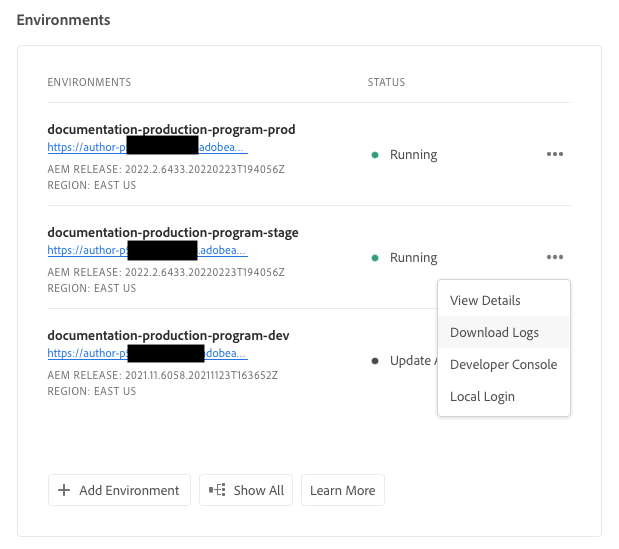

# Komma åt och hantera loggar {#manage-logs}

Lär dig hur du får åtkomst till och hanterar loggar som hjälp i utvecklingsprocessen på AEM as a Cloud Service.

Du kan komma åt en lista över tillgängliga loggfiler för den valda miljön med **Miljö** från **Ökning** sida eller miljöinformationssida.

## Laddar ned loggar {#download-logs}

Så här hämtar du loggar:

1. Logga in i Cloud Manager på [my.cloudmanager.adobe.com](https://my.cloudmanager.adobe.com/) och välja lämplig organisation och lämpligt program.

1. Navigera till **Miljö** från **Ökning** sida.

1. Välj **Hämta loggar** på ellipsmenyn.

   

1. I **Hämta loggar** väljer du lämplig **Tjänst** i listrutan

   

   Om [Ytterligare publiceringsregioner](/help/operations/additional-publish-regions.md) är aktiverade för din miljö kan du välja varje region och hämta dess loggar separat, vilket visas nedan:

   

1. När du har valt tjänsten klickar du på nedladdningsikonen bredvid den logg du vill hämta.

Du kan även komma åt dina loggar från **Miljö** sida.


## Loggar via API {#logs-through-api}

Förutom att hämta loggar via användargränssnittet är loggar tillgängliga via API:t och kommandoradsgränssnittet.

Om du vill hämta loggfilerna för en viss miljö ser kommandot ut ungefär så här.

```shell
$ aio cloudmanager:download-logs --programId 5 1884 author aemerror
```

Du kan också avsluta loggar via kommandoradsgränssnittet.

```shell
$ aio cloudmanager:tail-log --programId 5 1884 author aemerror
```

Om du vill hämta miljö-ID (1884 i det här exemplet) och tillgängliga service- eller loggnamnsalternativ kan du använda följande kommandon.

```shell
$ aio cloudmanager:list-environments
Environment Id Name                     Type  Description                          
1884           FoundationInternal_dev   dev   Foundation Internal Dev environment  
1884           FoundationInternal_stage stage Foundation Internal STAGE environment
1884           FoundationInternal_prod  prod  Foundation Internal Prod environment
 
 
$ aio cloudmanager:list-available-log-options 1884
Environment Id Service    Name         
1884           author     aemerror     
1884           author     aemrequest   
1884           author     aemaccess    
1884           publish    aemerror     
1884           publish    aemrequest   
1884           publish    aemaccess    
1884           dispatcher httpderror   
1884           dispatcher aemdispatcher
1884           dispatcher httpdaccess
```

### Ytterligare resurser {#resources}

Se följande ytterligare resurser för att lära dig mer om Cloud Manager API och Adobe I/O CLI:

* [API-dokumentation för Cloud Manager](https://developer.adobe.com/experience-cloud/cloud-manager/)
* [ADOBE I/O CLI](https://github.com/adobe/aio-cli-plugin-cloudmanager)

Mer information om loggfiler på AEM as a Cloud Service finns i följande resurser:

* [Loggfiler AEM Cloud 5](https://experienceleague.adobe.com/docs/experience-manager-learn/cloud-service/expert-resources/cloud-5/cloud5-aem-log-files.html)
* [Felsöka AEM as a Cloud Service med loggar](https://experienceleague.adobe.com/docs/experience-manager-learn/cloud-service/debugging/debugging-aem-as-a-cloud-service/logs.html)
