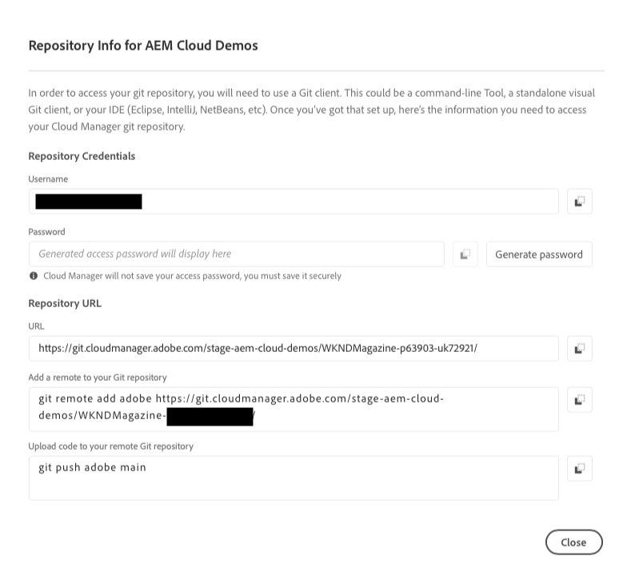
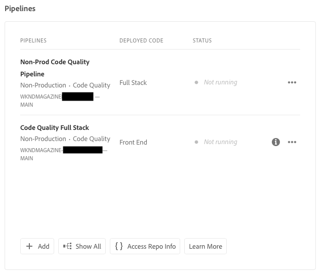

# Information om databasåtkomst {#accessing-repos}

Lär dig hur du får åtkomst till och hanterar dina Adobe-hanterade Git-databaser med hjälp av Git-kontohantering via självbetjäning från Cloud Manager.

## Få åtkomst till databasinformation från sidan Översikt {#overview-page}

Med Cloud Manager är det enkelt att hämta databasåtkomstinformation för databaser som hanteras med Adobe med hjälp av **Åtkomst till repo** från **pipelines**-kortet.

I dialogrutan **Databasinformation** kan du visa följande åtkomstinformation för databaser som hanteras med Adobe:

* Git-användarnamn.
* Git-lösenordet.
* URL:en till Cloud Manager Git-databasen.
* Färdiga Git-kommandon för att snabbt lägga till en fjärranslutning i Git-repo och push-kod.

Åtkomstinformation om [privata databaser](private-repositories.md) är inte tillgänglig i Cloud Manager.

Funktionen **Åtkomst till replikinformation** är synlig för användare med rollerna **Utvecklare** eller **Distributionshanteraren**.

**Så här kommer du åt databasinformation från översiktssidan:**

1. Logga in på Cloud Manager på [my.cloudmanager.adobe.com](https://my.cloudmanager.adobe.com/) och välj rätt organisation och program.

1. På sidan **Programöversikt** klickar du på **Åtkomst till replikinformation** under kortet **Pipelines**.

   

1. Ett nytt lösenord måste skapas för att du ska kunna få åtkomst till lösenordet. Välj **Generera lösenord** i dialogrutan **Databasinformation**.

1. Välj **Generera lösenord** i bekräftelsedialogrutan.

   

1. Klicka på ikonen  till höger om fältet **Lösenord** för att kopiera lösenordet till Urklipp.

   * När du genererar ett lösenord blir det tidigare lösenordet ogiltigt.
   * Cloud Manager sparar inte lösenordet. Det är ditt ansvar att spara lösenordet på ett säkert sätt.
   * Eftersom Cloud Manager inte sparar lösenordet måste du återskapa ett nytt om du förlorar det.

   

Med hjälp av dessa uppgifter kan du klona en lokal kopia av databasen, göra ändringar i den lokala databasen och när du är klar spara kodändringar i fjärrkoddatabasen i Cloud Manager.

## Få åtkomst till databasinformation från sidan Databaser {#repositories-window}

Funktionen **Åtkomstrepo** är också tillgänglig från sidan [**Databaser**](managing-repositories.md). Samma information om åtkomst till databaser som hanteras av Adobe visas.

## Återkalla ett lösenord {#revoke-password}

Du kan återkalla ett lösenord när som helst.

Om du vill göra det [skapar du en supportbiljett för den här begäran](https://experienceleague.adobe.com/?support-solution=Experience+Manager&amp;support-tab=home#support). Biljetten behandlas med hög prioritet och återkallas vanligen inom en dag.
