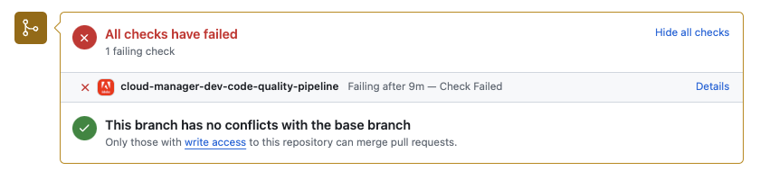

# GitHub-kontrollanteckningar {#github-annotations}

Lär dig hur GitHub kontrollerar annonser för dina privata databaser för att ge dig användbar feedback.

## Ökning {#overview}

Om du använder [privata databaser](private-repositories.md) för ditt Cloud Manager-program körs kontroller i GitHub automatiskt för varje pull-begäran. Dessa kommentarer innehåller användbar information som hjälper dig att förstå eventuella problem med koden så snart som möjligt.

[Problem med kodkvalitet](/help/implementing/cloud-manager/code-quality-testing.md) som upptäckts av [SonarQube](/help/implementing/cloud-manager/custom-code-quality-rules.md) visas tydligt.

Den exakta kodraden med problemet anges och du kan klicka på den för att visa relevant kod. De här anteckningarna tillhandahålls för alla kodproblem, inte bara de som har ändrats i pull-begäran.

Alla kommenterade rader samlas på fliken **Filer ändrade** i GitHub-pull-begäran. Anteckningar för filer som inte har ändrats i pull-begäran visas i sina egna avsnitt.

## Kodkvalitetsförlopp {#code-quality-pipelines}

Resultat av [kodkvalitet](/help/implementing/cloud-manager/code-quality-testing.md) visas också i pipeline som automatiskt aktiveras av Cloud Manager längst ned på fliken **Checks**. Den är också tillgänglig från **Information** vid kontrollen av pull-begäran.

Du kan även visualisera problemen i form av en CSV-fil. Detta kan hämtas genom att [visa information om pipelinekörningen i Cloud Manager](/help/implementing/cloud-manager/configuring-pipelines/managing-pipelines.md#view-details).
